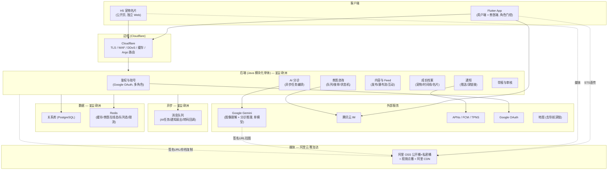

# petGo V1.0 技术框架建议

> 本文是**方向对齐稿**，不是最终架构文档。目的：在投入完整架构设计前，锁定技术栈、系统分层和几个高风险技术点的方案，避免后续返工。带 ⚠️ 的为需你拍板的决策项。

---

## 0. 已锁定选型（用户确认）

| 层 | 选型 | 备注 |
|----|------|------|
| 移动端 | **Flutter** | iOS + Android 单一代码库；PRD 为 portrait-only |
| 后端 | **Java** | 默认 Spring Boot 生态 |
| AI 大模型 | **Google Gemini**（替代 DeepSeek） | 原生多模态，**单模型**同时做图像理解 + 分诊推理；初期不做多模型 |
| 实时通信 | **腾讯云 IM (TIM)** | 承载兽医↔用户图文咨询 |

**多云拓扑（用户决策）：**
- **后端 + DB：德国**（现有服务器，IP 45.90.122.44），前置 **Cloudflare**（TLS 终止 / DDoS / WAF / 缓存 / Argo 智能路由，并隐藏源站 IP）。
- **应用媒体（①公开 + ②私密）：阿里云 OSS + 阿里 CDN（雅加达 Region）**，客户端 STS 签名直传。
- **实时通信：腾讯云 IM**（客户端直连腾讯边缘）。
- **AI：Google Gemini（Vertex）**。

即 Cloudflare（边缘） + 德国源站（后端/DB） + 阿里（媒体/CDN，雅加达） + 腾讯（IM） + Google（AI）。

**⚠️ 拓扑权衡（后端在欧洲、用户在印尼）：**
- **动态 API 延迟**：雅加达↔欧洲往返 ~320-360ms。CF 在雅加达 POP 做 TLS/缓存/路由优化，但**不可缓存的动态 API 仍回欧洲源站**，往返消不掉，多请求页面会累积。
- **缓冲**：最重的字节（图/视频）在阿里雅加达 OSS+CDN，是本地的，不走欧洲；实时聊天走腾讯 IM 直连边缘，不经欧洲后端——故问诊对话实时感不受影响，受影响的是 REST API（登录/发帖/拉 Feed/提交分诊/档案）。
- **PDP 跨境**：核心 PII/健康/位置数据落欧洲 DB = 数据出境，触发 UU PDP 跨境传输要求（合规细节线下，但此架构选择本身需登记）。
- **CDN 分工**：Cloudflare 前置 API/应用 + H5 名片页；阿里 CDN 前置媒体。二者职责不重叠。

---

## 1. 整体架构分层



**关键原则：**
- **模块化单体而非微服务**：V1 团队/规模下，先用清晰模块边界的单体（Spring Boot 多 module），避免过早微服务化带来的分布式复杂度。模块边界即未来拆分线。
- **实时连接不落在自建后端**：TIM SDK 在 Flutter 侧直连腾讯云，后端只通过 TIM 的 REST/回调编排业务（发系统消息、禁用账号、建会话）。PRD 要求的「切 Tab 后台保持连接、消息连续」由 TIM 天然保证。
- **重活异步化**：AI 分诊、视频转码、通知扇出走消息队列，避免阻塞请求线程。

---

## 2. 技术栈清单

| 关注点 | 选型建议 | 理由 / 备注 |
|--------|----------|-------------|
| 移动框架 | Flutter（锁定） | — |
| 状态管理 | Riverpod 或 Bloc | 团队熟悉度优先；二选一即可 |
| 边缘接入 | **Cloudflare**（锁定） | TLS/WAF/DDoS/缓存/Argo 路由，前置欧洲源站 |
| 后端部署 | **欧洲 Region**（锁定） | ⚠️ 距印尼用户 ~320-360ms 往返，见 §0 权衡 |
| 后端框架 | Spring Boot 3.x (Java 21) | 模块化单体 |
| 关系库 | ⚠️ **PostgreSQL**（建议）vs MySQL | Postgres 的 JSONB 适合存分诊结构化结果/档案弹性字段；若团队更熟 MySQL 也可 |
| 缓存/在线态 | Redis | 兽医在线状态、问诊队列、未读角标、限流 |
| 消息队列 | ⚠️ RocketMQ / Kafka vs 暂用 Redis Stream | V1 量级可先用轻方案，但 AI 任务与通知扇出建议正式 MQ |
| 对象存储 | **阿里云 OSS（雅加达 Region）** | **①公开桶 + ②私密桶都在 OSS**（已定）；客户端 STS 直传 |
| 视频处理 | 阿里云视频点播 / 媒体处理 | Feed 视频转码 |
| 媒体 CDN | 阿里云 CDN | Feed 图片 + H5 名片媒体（与 Cloudflare 分工：CF 管 API/H5 页，阿里 CDN 管媒体）|
| AI 分诊模型 | **Google Gemini（2.x，建议 Flash）** | **单模型一步式**：图像理解 + 分诊推理 + 结构化 JSON。初期不做多模型，DeepSeek 暂不引入。⚠️ Gemini Region 选型需权衡 OSS(雅加达)/后端(欧洲)，让 Gemini 用签名 URL 直拉 OSS 图避免三角绕行 |
| 实时 IM | 腾讯云 IM（锁定） | — |
| 推送 | TPNS（统一）或 APNs + FCM 直连 | 印尼 Android 走 FCM 可用 |
| H5 名片 | ⚠️ SSR (Next/Nuxt) vs Java 服务端模板 | 需服务端渲染 OG 预览 + 可控 noindex |
| 鉴权 | Google OAuth → 后端签发 JWT | 多角色 claim（user / vet） |
| 地图导航 | 系统地图深链（Google/Apple Maps） | 红色预警「去导航」 |

---

## 3. 后端模块边界

| 模块 | 职责 | 对应 PRD |
|------|------|----------|
| `auth` | Google 登录、JWT、多状态引导、角色 | FR-0A~0H, FR-19 |
| `triage` | AI 分诊任务、媒体处理、结构化结果、安全规则层 | FR-1~FR-5 |
| `consult` | 兽医咨询队列、接单、超时、30 分钟评分确认门、封禁中断（编排 TIM） | FR-4B, FR-30~FR-33 |
| `content` | 发布、Feed 瀑布流、内容类型过滤、详情、点赞评论、删除（V1 不做收藏/@提及）| FR-12, FR-17, FR-23, FR-24, FR-28, FR-36 |
| `profile` | 宠物档案、成长时间线、H5 名片生成与短链 | FR-11, FR-14~16, FR-37~39 |
| `notify` | 推送、通知中心、深链接路由 | FR-22*, FR-38 |
| `moderation` | 举报、人工队列、（线下定）审核策略 | FR-25 |
| `vet` | 兽医工作台、接单视图、评分 | FR-31~33 |

---

## 4. 六大技术难点落地方案

### 4.1 实时兽医图文咨询 ✅ 风险低（TIM 兜住）
- **传输/持久化/离线**：交给腾讯云 IM。Flutter 集成 TIM SDK，会话连接由 SDK 维护——PRD 的「切 Tab 不断连、消息连续」自动满足。
- **后端只编排业务**：队列、接单、`无人接单超时`、`30 分钟评分确认门`、`兽医封禁中断会话` 都是 Java 侧状态机，通过 TIM REST API 建会话 / 发系统消息 / 封禁。
- **兽医在线态**：Redis 维护（在线/离线/忙），驱动 PRD 的「概率性在线」展示与派单。

### 4.2 AI 分诊管线 🟢 风险低（Gemini 单模型）
**决策（2026-06-01）：用 Google Gemini 单模型，初期不做多模型；V1 分诊输入仅图片，不收视频**（视频移至 V2）。Gemini 原生多模态，一个模型同时完成「看图 + 分诊推理 + 结构化输出」，DeepSeek 与独立视觉模型均不再需要，管线只剩一次模型调用。

管线（异步，配合 UX 已有的「分析中」状态）：
```
Flutter 上传图片 → COS
  → 后端创建分诊任务(MQ)
  → Gemini(图片 + 用户症状文字) → 结构化 JSON: 绿/黄/红 + 观察/用药建议
  → 安全规则层: 高危症状关键词命中 → 强制升红 (绕过模型)
  → 返回结果页
```
- **结构化输出**：用 Gemini 的 JSON/结构化输出约束分级与字段，便于前端直接渲染绿/黄/红结果卡。
- **安全规则层是架构必需件**，不是模型的事：PRD 对抗性评审的 critical（AI 假阴性漏判红色）要靠确定性的「高危症状→强制红色」规则兜底，必须独立于 Gemini 实现。
- **≤15 秒约束**：单模型单次调用，余量充足；仍建议结果异步化（提交后轮询/推送），UX 的「分析中」状态正好承接。
- **⚠️ 产品影响（仅图片）**：PRD（UJ-1「上传呕吐视频」、FR-1）与 UX_EXPERIENCE（Upload 页 photo/**video** picker、KF-1 step 4）写了「图+视频」，需把视频输入挪到 V2。注意：仅指**分诊输入**；内容 Feed 视频帖（≤60s/100MB）不受影响，VOD 仍保留给 Feed。
- **备注**：当初砍视频是因 DeepSeek 视频能力弱；Gemini 原生支持视频，技术上视频可回 V1——但出于成本/范围，维持「V1 仅图片」决定，视频留作 V2 低成本升级项。
- **跨厂商提示**：Gemini 属 Google 生态，与腾讯云栈分属两家，需单独的 Google Cloud / Vertex 账号与账单；建议走 Vertex AI 新加坡 Region 降低印尼调用延迟。

### 4.3 公开 H5 宠物名片 ⚠️ 中风险
- **独立 Web 应用**（非 Flutter）。需**服务端渲染 OG meta**，否则 WhatsApp/IG 分享无预览。
- **短链 + 不可枚举 token**（对应 PRD 安全发现）：`/c/{随机token}`，默认 `noindex`，名片不暴露可定位信息，提供「关闭分享/失效旧链接」开关。
- 渲染方案待定：SSR 框架（Next/Nuxt）灵活；或 Java 服务端模板（Thymeleaf）省一套技术栈。

### 4.4 双账号 + 兽医工作台 ✅ 风险低
- **单一身份服务**，角色 claim 区分 user/vet。
- 兽医工作台按 PRD 是「App 内独立 Tab」→ **同一个 Flutter App 内角色门控**，不单独做端。

### 4.5 媒体存储与处理 ✅ 风险低
**核心原则：IM 媒体与内容媒体分属两套存储，不混用。** 这既是腾讯云 IM 的技术现实（IM 发图/视频/文件消息默认上传到 TIM 自己的托管 COS，留存与 URL 由 IM 服务管，你不完全掌控），也是隐私/合规边界——私密问诊图绝不能进公开 CDN。**应用自有媒体走阿里云 OSS（雅加达 Region），IM 媒体留在腾讯 IM 托管。**

**三层存储模型：**

| 层 | 内容 | 性质 | 存储 / 访问 |
|----|------|------|-------------|
| ① 阿里 OSS · 公开桶 | Feed 动态、成长档案展示、H5 名片 | 公开、读扩散大 | 阿里 OSS + 阿里 CDN；H5 `noindex` |
| ② 阿里 OSS · 私密桶 | **AI 分诊上传图**、存入健康历史的图 | 私密、医疗敏感 | 同 OSS 另开私密桶（已定）；仅签名 URL，严留存，注销可删 |
| ③ IM 托管存储 (TIM) | 兽医问诊聊天里的图/视频 | 私密、1 对 1 | 腾讯 IM 管，会话双方可见 |

**要点：**
- **上传流程（阿里 OSS）**：Flutter 端先校验+压缩（图 ≤10MB、视频 ≤60s/100MB）→ 后端发 STS 临时凭证 → 客户端**直传 OSS**（不经后端、无跨云流量）→ 视频走阿里视频点播转码 → 公开内容经阿里 CDN 分发。
- **AI 分诊图走 ②私密桶**，不是 IM——要给 Gemini 读、且可能存档，与聊天媒体是两回事。
- **⚠️ 桥接规则（关键）**：问诊结束「存入成长档案/健康历史」时，**不要让档案引用 IM 的 URL**（IM 媒体有自身留存期、URL 不可控，档案是长期资产，过期即裂）。正确做法：**存档当刻把所需图片从 IM 复制一份到 ②私密桶（阿里 OSS）**，档案只引用应用自有 URL。
- ③ 与 ①② 分属腾讯/阿里两朵云，边界天然清晰；跨云只发生在「存档复制」这一步（IM → OSS），量小可控。

### 4.6 推送 + 深链接 ✅ 风险低
- TPNS 统一封装 APNs/FCM；深链接路由表已在 PRD FR-38。
- 注意印尼 Android 走 FCM（非中国大陆环境，可用）。

---

## 5. ⚠️ 待你拍板的关键决策

已定：

- ✅ **AI 模型：Google Gemini 单模型**（2.x，建议 Flash），初期不做多模型，DeepSeek 暂不引入。走 Vertex AI 新加坡 Region。
- ✅ **AI 分诊输入：V1 仅图片，不收视频**（视频移至 V2）。需相应更新 PRD/UX。
- ✅ **应用媒体（①公开 + ②私密）：均阿里云 OSS + 阿里 CDN（雅加达 Region）**。IM 媒体仍腾讯 IM 托管。
- ✅ **后端 + DB：德国现有服务器（45.90.122.44），前置 Cloudflare**。已接受「距印尼用户 ~320-360ms 动态 API 延迟」权衡（见 §0）。
- 多云定型：Cloudflare(边缘) + 德国(后端/DB) + 阿里雅加达(媒体/CDN) + 腾讯(IM) + Google(AI)。

待你拍板（均已给默认建议，如无异议即按默认采纳）：

1. **数据库**：默认 **PostgreSQL**（JSONB 适合分诊结果/档案弹性字段）；团队更熟 MySQL 亦可。
2. **消息队列**：默认 V1 用 **RocketMQ**；量级小也可先 Redis Stream 过渡。
3. **H5 名片渲染**：默认 **独立 SSR（Next/Nuxt）**，部署于欧洲源站、CF 边缘缓存；想少一套栈可用 Java Thymeleaf。
4. **推送**：默认 **TPNS 统一封装**（APNs + FCM）。
5. **Gemini Region**：默认 **新加坡（asia-southeast1）**，离 OSP(雅加达)媒体近；让 Gemini 用签名 URL 直拉 OSS 图，避免「雅加达→欧洲→新加坡」三角。
6. **部署：德国现有服务器（已定）**。延迟权衡已接受。若后续印尼用户体量上来、动态 API 延迟成为体验瓶颈，再评估加一个亚太就近节点/只读副本。

> 另注：UX 与 PRD 的**导航模型冲突（4-tab vs 5-tab）属客户端 UI 架构**，不挡本框架的后端/系统决策，但 Flutter 客户端架构开工前需先定。

---

## 6. 已识别风险汇总

| 风险 | 等级 | 说明 |
|------|------|------|
| AI 视觉能力 | 🟢 低 | 已改 Gemini 单模型，原生多模态，缺口消除 |
| 仅图片决策需回改 PRD/UX | 🟠 中 | UJ-1/FR-1/UX Upload 页/KF-1 的「视频」需挪 V2 |
| Gemini 属 Google 生态，与腾讯云分家 | 🟢 低 | 需单独 GCP/Vertex 账号账单；走新加坡 Region |
| AI 分诊延迟 | 🟢 低 | 单模型单次调用，结果异步化即可 |
| AI 假阴性安全兜底 | 🔴 高（线下+架构） | 需确定性规则层，不能只靠模型 |
| **后端在德国、用户在印尼的动态 API 延迟** | 🟠 中 | 雅加达↔德国往返 ~320-360ms；CF 缓解 TLS/缓存/路由但动态请求仍回源。靠「媒体本地(阿里雅加达)+IM 直连+API 尽量可缓存」消化 |
| H5 公开页 PII / 可枚举链接 | 🟠 中 | token 不可枚举 + noindex |
| 多云运维面（CF+德国+阿里+腾讯+Google） | 🟠 中 | 五方账号/账单/监控/安全策略；边界清晰则可控，跨云仅「IM→OSS 存档复制」「Gemini 拉 OSS 图」少数几处 |
| PDP 跨境（数据出境到德国） | 🟠 中（线下为主） | 核心 PII/健康/位置 DB 在德国 = 印尼数据出境，触发 UU PDP 跨境要求；好在德国属 GDPR 辖区（保障水平高），但仍需同意/告知/SCC 类安排 |

---

## 7. 下一步

方向对齐（你确认 §5 的决策）后，进入 `bmad-create-architecture` 完整流程，产出正式架构文档：详细数据模型、API 契约、各模块时序、分诊管线与安全规则层的详细设计、部署拓扑与 CI/CD。
