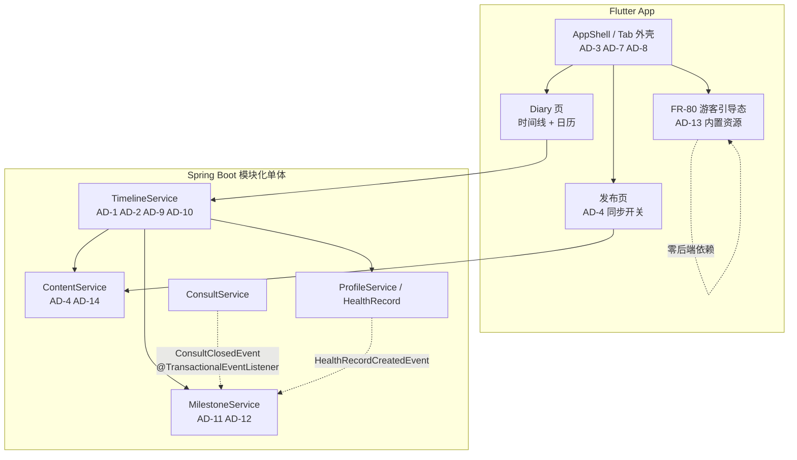

# TailTopia V1.1.2 架构决策文档 —— Delta

> **形态说明**：V1.0 架构（`architecture.md`）与 V1.1 delta（`architecture-v1.1-delta.md`）均已上线冻结。本文件是 brownfield **增量 delta**，只写 V1.1.2 的**新增 / 取代 / 补齐**；未提及处一律**继承基线**。冲突序：**本 delta > V1.1 delta > V1.0 基线 > 原型**。正确性以 `v1.1.2/PRD-v1.1.2.md` 为准，视觉以 `v1.1.2/ui-v1.1.2.html`（**18 屏 / 3 泳道**：T1–T3 / A1–A9·A2b / P1–P4·P1b）为准。
>
> **底线继承（不重述、全部延续）**：Spring Boot 4 / Java 21 / PostgreSQL + Redis + Flyway；模块化单体；异步只用 `@Async` + DB 状态机、`@Scheduled` 定时；**禁 MQ / 禁调度中间件 / 禁通用缓存层**；DB snake_case ↔ Java/Dart camelCase ↔ JSON camelCase；RFC 9457 ProblemDetail；对外标识不可枚举 token；env 注入凭证不入库；日志禁 PII / 健康 / 令牌 / 签名 URL；`ddl-auto=validate`，schema 归 Flyway。
>
> **运维 envelope 零增量**：本版本不引入任何新中间件、不新增外部依赖、不改变部署形态（德国单机）。无基础设施决策。

---

## §0 决策日志

| # | 决策 | 结论 | 来源 |
|---|------|------|------|
| **AD-1** | 时间线多源合并翻页 | **彻底修根因**：排序键与游标键统一为「事件日期 + 同日排序键」复合锚点；同日条目不跨页拆分；归并后再截断 | 用户 2026-07-31 拍板 |
| **AD-2** | 时间线五类样式的分类判定位置 | **后端判定，下发 `itemType`**；**查询时实时计算，严禁落库** | 用户 2026-07-31 拍板 |
| **AD-3** | 底部 Tab 底层索引是否随视觉顺序重排 | **重排，一次性理顺**（架构原倾向不重排，用户拍板）；附 5 处索引寻址调用点的硬性核对清单 | 用户 2026-07-31 拍板 |
| **AD-4** | 「公开 / 私密」字段建模 | **通用 `visibility` 列**（PUBLIC/PRIVATE，DEFAULT PUBLIC），三类内容统一携带，非 Diary 专属布尔 | 用户 2026-07-31 拍板 |
| **AD-5** | 12 项埋点的拆分方式 | **集中为一条收尾 story**，在功能逻辑理清后统一实现 | 用户 2026-07-31 拍板 |
| **AD-6** | 是否为取改版前基线单独发小版本 | **不取基线**，埋点与改版同版本发布 —— 连带三项对比指标不可执行，见 §5 | 用户 2026-07-31 拍板 |
| **AD-7** | Diary 解除登录门控的实现口径 | **默认受控 + 精确例外**（安全默认不可反转）；两处门控同改 | 架构裁定 |
| **AD-8** | 落地 Tab 的判定位置与持久化 | **前端在 Splash 完成回调实时计算**，不持久化「上次落在哪」 | 架构裁定 |
| **AD-9** | 日历后端需补的数据维度 | **仅补一处**：当天结构化健康记录条数；其余维度已存在，纯文字日记缺陷为纯前端修 | 架构裁定（据代码核实） |
| **AD-10** | 当天详情页的数据源 | **须先补第三个源**（结构化健康记录），再改大类排序 | 架构裁定（据代码核实） |
| **AD-11** | FR-86 里程碑达成路径 | 类型映射增 `NEUTER→M9`；M5 订阅既有 `ConsultClosedEvent`；⚠️ **健康类四条取消打卡、仅自动达成**（反转 PRD 2026-07-30） | 代码核实 + 用户 2026-07-31 拍板 |
| **AD-12** | 同时解锁多个里程碑的庆祝合并 | **纯前端复用现有单条组件**展示最高级别，零新增视觉设计 | PRD 2026-07-30 已定，本 delta 确认 |
| **AD-13** | FR-80 示例时间线（Milo 9 条）的数据来源 | **文案与图片全部内置 App**，游客首屏零网络依赖 | 用户 2026-07-31 拍板 |
| **AD-14** | Diary ↔ Moment 的关联建模 | **不建关联表**，由 AD-4 的 `visibility` 单字段表达；包含关系与删除联动继承 V1.0 FR-12 / FR-36 | 架构裁定 |
| **AD-15** | Diary 页根节点的状态分支归属 | **收敛为单一判定入口**，四状态互斥分发；FR-0H 提示条整条废止 | 对抗性复核补入 |
| **AD-16** | 时间线与日历分类优先级不一致 | **刻意不对称，不得「对齐」** —— 逐条分类 vs 整天取一个代表标记 | 对抗性复核补入 |

---

## §1 代码现状核实 —— 与 PRD 工程假设的四处偏差

> 本节是本 delta 最具行动价值的部分。PRD 的 `[工程注意]` 与假设索引写于产品侧，本次逐条比对了真实代码，**四处与实际不符**。拆 story 时以本节为准，勿照 PRD 的工程描述估工。

### 1.1 时间线翻页缺陷**已在现网**，不是新增数据源才会出现

`TimelineService.getTimeline` 用 `createdAt` 作游标拉取，却用 `effectiveDate`（快乐时刻取 `eventDate`、健康事件取 `createdAt`）排序。**游标键与排序键不是同一把尺子。**

- **现网可复现**：用户补记一篇旧日期的日记（`eventDate` 旧、`createdAt` 新），该条在排序上落到旧位置、在翻页上被当作新记录 → 翻页时丢失或重复。
- FR-82 把数据源从 2 个增至 4 个只是**放大**该缺陷，不是引入。
- **后果**：AD-1 这条 story 必须配**回归测试**（补记旧日期日记 + 跨页拉取的断言），而非仅新功能测试；且它修的是一个应当登记的现网 bug。

### 1.2 日历后端已完成大半，PRD 高估了工作量

`CalendarMonthResponse.DayCell` 现有五维：`day` / `firstImageUrl` / `hasHappyMoment` / `hasHealthEvent` / `healthRecordType`。结构化健康记录已于 bug `20260722-352` 并入。

- PRD「只有结构化健康记录这一维需要后端新增」**不成立** —— 已经在了。
- 实际缺口只有一处：**当天结构化记录是否多条**（FR-84 优先级 4 需在多条时改用通用医疗箱图标，现在只下发了第一条的类型）。
- **纯文字日记错显 🏥 是纯前端缺陷**：后端 `hasHappyMoment` 早已与「有无图片」解耦，前端渲染只判断 `firstImageUrl` 才落到问诊图标兜底。**修它不需要任何后端改动。**

### 1.3 登录门控有两处，PRD 假设 A-7 只覆盖了一处

| 门控 | 位置 | 机制 | PRD 是否提及 |
|---|---|---|---|
| 深链 / 直接导航 | `app_router.dart` `redirect` | `_controlledLocations` 按 `loc == p \|\| loc.startsWith(p + '/')` **前缀匹配** | ✅ 假设 A-7 描述的就是这处 |
| Tab 点击 | `app_shell.dart` `_onTabSelected` | 按 `index == AppTab.home.index` 判定唯一免门控 Tab，走 `requireLogin()` 单一入口 | ❌ **未提及** |

**只改前缀匹配那处，游客点 Diary 标签仍会被弹登录框。** 两处都得改，改法不同（见 AD-7）。

### 1.4 FR-86 的落点比预期小得多

- `MilestoneAutoCompleteListener.onHealthRecordCreated` 已有类型映射 `switch`：`VACCINE→M3` / `DEWORM→M4` / `MENSTRUATION, NEUTER, CUSTOM→null`。**加 `NEUTER→M9` 是在这张表里多写一行。**
- M5 有现成挂钩点：`ConsultCloseService` 已发布 `ConsultClosedEvent`。
- **OQ-17「M5 只算真人兽医、不含 AI 问诊」自动满足** —— `ConsultClosedEvent` 只在 `consult` 模块发布，AI 分诊（`triage` 模块）根本不经过该链路，无需写任何排除逻辑。

### 1.5 附带发现：OQ-10「语境感知发布」已部分存在

`app_shell.dart` `_onAddPressed`（bug `20260703-244`）：在成长档案 Tab 点 [+] 且用户有宠物档案 → 预选「成长日历」；其余 Tab 不预选。

FR-83「发布页默认选中 Diary」与这段既有逻辑**重叠且口径不同**（FR-83 是全局默认，既有逻辑是按 Tab 语境）。见 AD-4 的 Rule，需在 story 中明确合并口径。

---

## §2 Invariants & Rules

### AD-1 — 时间线统一游标锚点

- **Binds：** FR-82；全部四类时间线数据源（Diary 内容 / 结构化健康记录 / 问诊存档 / 里程碑完成 / 身份证生成）的取数与分页。
- **Prevents：** 排序键与游标键不一致导致的条目跨页丢失或重复（§1.1 现网缺陷，四源后放大）。
- **Rule：**
  1. 游标锚点唯一，取 **「事件日期 + 同日排序键」复合值**；各源用同一锚点各自取数，**不使用各源自己的主键或 `createdAt` 游标**。
  2. **归并后再截断**：先按锚点从各源各取一批 → 归并排序 → 统一截断到页大小 → 以截断处锚点作为下一页游标。**禁止各源先截断再归并。**
  3. **同日条目不可跨页拆分**：页边界必须落在日期分界上。某日条目数超过单页容量时，该日整体作为一页返回（允许超出默认页大小）。
  4. 同日排序键沿用 FR-37 既有「按发布 / 完成时间正序」口径；系统自动型里程碑与身份证解锁无「发布时间」概念，取其系统记录的完成 / 生成时间戳参与同日排序。
  5. **验收硬性要求**：须包含「补记旧日期日记 + 跨页拉取无丢失无重复」的回归断言。

### AD-2 — 五类分类由后端判定，实时计算不落库

- **Binds：** FR-82；时间线条目对外契约；埋点 T-10 的 `item_type` 属性。
- **Prevents：** 分类规则同时存在于 PRD 与前端代码两处而日后走歧；以及分类结果固化后与真实状态脱节。
- **Rule：**
  1. 服务端按 PRD 五步优先级顺序（健康记录/问诊 → 身份证 → 打卡关联里程碑 → 系统自动里程碑 → 普通内容，命中即停）计算，每条条目下发 `itemType` 标识；前端只按标识选样式，**不得自行推断分类**。
  2. **分类必须在查询时实时计算，严禁落库固化。** 反例：用户问诊后跳过存档 → M5 落为类③ banner；日后补存 → 若 banner 已落库则不会消失，同一件事在时间线出现两条。
  3. 判定依据是「这一天有没有对应的健康记录条目」，**不是里程碑声明的触发方式字段** —— 保证展示结果与完成路径无关、恒定一致。
  4. 类④ 健康胶囊条**不加任何里程碑标记**（OQ-14 已定，本版本不做）。
  5. 日历格子的四级优先级判定**维持在前端**（现状，后端注释已明写「交前端」），本版本不收回后端。两套优先级分处两侧属已知不对称，记入 §6 Deferred。

### AD-3 — Tab 底层索引随视觉顺序一并重排

- **Binds：** FR-78；底部 Tab 的枚举顺序、路由分支声明顺序、路径映射数组。
- **Prevents：** 代码索引顺序与视觉顺序长期不一致带来的认知负担与误改。
- **Rule：**
  1. 视觉与底层顺序统一为 **Diary / Health / [+] / Discovery / Me**（第 2 位 2026-07-31 由 Konsultasi 改名 Health，见 OQ-19）；[+] 仍为居中凸起 FAB，不占 shell 分支。
  2. **重排必须同步核对以下 5 处按索引寻址的调用点**（story 的硬性验收项，逐条打勾）：

     | # | 位置 | 现状 | 重排后须确认 |
     |---|---|---|---|
     | 1 | `app_shell.dart` 免门控 Tab 判定 | `index == AppTab.home.index` | 改为语义化白名单（见 AD-7），不再比较裸索引 |
     | 2 | `app_shell.dart` [+] 预选 Diary 判定 | `currentIndex == AppTab.profile.index` | 指向重排后的 Diary 分支；并与 FR-83 全局默认合并口径（§1.5） |
     | 3 | `app_shell.dart` `_tabLocations` 路径映射数组 | `['/home','/profile','/triage','/me']` | 数组顺序与新分支顺序严格对应 |
     | 4 | `BottomTabBar` 渲染 | 按 `currentIndex` 渲染 | 图标 / 文案 / 激活态与新顺序对应 |
     | 5 | `app_router.dart` `StatefulShellRoute` 分支声明顺序 | 4 个分支 | 声明顺序即索引来源，为本项改动的根 |
  3. 登录后回跳与推送深链**一律按路径寻址，不得按索引寻址**（现状已是路径，重排后不得回退为索引）。

### AD-4 — 通用 `visibility` 字段

- **Binds：** FR-83；Feed 取数、话题聚合、「我的发布」、宠物名片 H5、以及 V1.1.4 全部消费公开内容的能力（FR-68 顶置 / FR-75 装饰标签 / 后台 AB-3G 互动积分统计）。
- **Prevents：** 每处消费点各写一遍「Moment/Tips 全要 + Diary 看开关」的分支逻辑；日后扩展可见性需二次改表。
- **Rule：**
  1. `content_posts` 新增 `visibility` 列，枚举 `PUBLIC` / `PRIVATE`（落库 `varchar` + UPPER_SNAKE，遵循命名映射链），**`DEFAULT 'PUBLIC'`**。三类内容统一携带，不做 Diary 专属布尔。
  2. **一切消费公开内容的查询统一按 `visibility = PUBLIC` 过滤**，不得按内容类型分支。
  3. ⚠️ **过滤范围严格限定为「他人可见」的视图。作者自视视图一律不过滤** —— 成长档案时间线（FR-82）、日历与当天详情（FR-84）、「我的发布」列表均属作者自视，**必须完整展示含私密在内的全部内容**。
     - **反例（必须避免）**：某 story 为「统一口径」把 `visibility = PUBLIC` 加进时间线查询 → 用户主动设为私密的日记从自己的成长档案里消失。这恰好摧毁了 FR-83 私密能力的全部意义。
     - **判定口径**：查询由**内容作者本人**发起且展示范围仅其本人 → 不过滤；其余（Feed、话题聚合、他人主页、平台公开位）→ 过滤。
  4. **默认值方向：新行默认 PUBLIC，存量迁移统一回填 PUBLIC。** 私密只在用户在发布页**主动关掉**「同步到 Moment」时产生，属少数分支，不得实现为需额外回填的状态。
  5. **同步状态发布时一次性确定，发布后不可更改。** 内容详情页、「我的发布」、编辑流程中均**不得出现**任何事后切换入口。下游因此**只需在选取 / 统计时点判断一次**，无需处理状态中途翻转的回退逻辑。
  6. **Feed 取消按用户宠物状态过滤**（覆盖 V1.0.0 内容可见范围表，废止「状态 B 用户不显示成长日历」规则）：公开内容对所有用户一视同仁。分类筛选保留，公开 Diary 归入「成长时刻」。
  7. **发布页默认类型**：有宠物档案 → Diary；无宠物档案 → Moment（Diary 项维持灰置与「需先创建宠物档案」提示）。类型选择器顺序改为 Diary / Moment / Tips。此项须与 §1.5 的既有 Tab 语境预选逻辑合并为单一口径。
  8. **`ContentType` 枚举不改名**（继承 V1.1 决策 A-7：DB 保留 `DAILY`，App 侧按 code 本地化显示为 Moment）。「Diary / Moment / Tips」是展示层术语，**不触发任何枚举迁移**。

### AD-5 — 埋点集中为一条收尾 story

- **Binds：** §3 全部埋点项（T-1~T-4、T-6~T-12 共 11 项；T-5 已删）。
- **Prevents：** 埋点散入各功能 story 后，不属于任何单一功能的 Tab 切换埋点（PRD 点名的 P0 缺口）无人认领而漏做。
- **Rule：** 埋点作为**一条独立 story，排在全部功能 story 之后**，在功能逻辑理清后统一实现；口径统一，不拆分。该 story 须同步回写 `3.数据埋点/数据v100-v110.md` 全局清单，避免两处口径分叉。

### AD-6 — 不取改版前基线

- **Binds：** §3.3 核心对比指标；§3.4 处置原则。
- **Prevents：** —（这是一项**接受代价**的决策，非防御性决策。）
- **Rule：** 埋点与改版同版本发布，不为取基线单独发小版本。**连带后果必须回写 PRD**，见 §5。

### AD-7 — 门控解除采用「默认受控 + 精确例外」

- **Binds：** FR-78 门控解除；假设 A-7；两处门控入口。
- **Prevents：** 反向做法（把受控子页逐个列进清单）会使日后新增的成长档案子页，一旦忘记登记即**默认对游客敞开** —— 违反 CLAUDE.md「安全规则层只升不降不可绕过」。
- **Rule：**
  1. **深链门控**：`_controlledLocations` **继续按前缀匹配保持默认拦截**；另设**精确例外集** `{'/profile'}`，仅放行 Diary 主页本身。建档 / 编辑档案 / 当天详情 / 里程碑列表等全部子页面**自动继续受控，无需登记**。
  2. **Tab 点击门控**：从「比较索引」改为**按 Tab 语义的免门控白名单** `{Discovery, Diary}`；Health / [+] / Me 维持受控不变。
  3. **安全默认不可反转**：新增任何 `/profile/*` 子页时，默认状态必须是「受控」。放行需显式加入精确例外集，且例外集只接受**完整路径字面量**，不接受前缀或通配。
  4. 游客访问 Diary 主页时**不得调用需要宠物档案的接口**（现有 `requireProfile` 对无档案用户抛 404），游客态渲染走 AD-13 的内置示例数据。

### AD-8 — 落地 Tab 实时计算，不持久化

- **Binds：** FR-78 落地页矩阵；[+] 登录后回跳；名片深链游客落点。
- **Prevents：** 用户状态切换（B/C → A、A → B/C）后落地页不跟随；以及「记住上次落在哪」与状态判定两套逻辑打架。
- **Rule：**
  1. 落地 Tab 是**按当前用户状态实时计算的结果**，**不存储**「上次落在哪」，每次冷启动按当时状态重新判定。
  2. 判定点在 Splash 完成回调（复用既有分流顺序：pending 深链 > 兽医直达工作台 > 其余），扩展为：游客 / 状态 A 已建档 / 状态 A 未建档 → **Diary**；状态 B / C → **Discovery**；兽医 → 工作台（不变）。
  3. **热启动行为不变**（App 仍在后台，切回停留在离开时的页面），本 AD 只约束冷启动。
  4. **连带变更**：[+] 登录后回跳由「回首页」改为**回 Diary**；游客点开他人分享的名片深链由「重定向首页」改为**落 Diary 游客引导态**。
  5. **切回 Diary 自动刷新**：从其它 Tab 切回 Diary 时刷新时间线与日历数据（现状仅 Discovery 有等价机制）。理由是 FR-82 引入的镜像条目会在用户不在该页时变化。

### AD-9 — 日历后端仅补「当天健康记录条数」一维

- **Binds：** FR-84；`CalendarMonthResponse.DayCell` 契约。
- **Prevents：** 按 PRD 描述重复新建已存在的数据维度，造成契约冗余与前端二义。
- **Rule：**
  1. 后端**只新增一维**：当天结构化健康记录的条数（或「是否多于一条」布尔）。其余五维（`day` / `firstImageUrl` / `hasHappyMoment` / `hasHealthEvent` / `healthRecordType`）**已存在，直接复用，不得重建**。
  2. **纯文字日记错显 🏥 为纯前端修复**：渲染判定从「有无 `firstImageUrl`」改为按 `hasHappyMoment`。**任何情况下都不得回退到问诊图标** —— 包括图片加载失败（应显示占位符或降级为通用 diary 标记）。
  3. 格子按「三大类取其一、只显一个」渲染，不再叠加角标（覆盖 FR-37 原「照片 + 🏥 叠加」）。
  4. 日历格子与健康记录列表页**共用同一套图标，不新设第二套**；任一处调整必须同步另一处。

### AD-10 — 当天详情须先补第三个数据源

- **Binds：** FR-84 当天详情页。
- **Prevents：** 把「补数据源」误估为「改排序」，导致 story 工时严重低估、且结构化健康记录在当天详情里始终缺失。
- **Rule：** `getDayDetail` 现仅含快乐时刻 + 问诊健康事件，**结构化健康记录未纳入**。须先补入该源，再实现「按大类排序 diary > 问诊 > 健康记录，类内按时间」（覆盖 FR-37 原「按发布时间正序」）。

### AD-11 — FR-86 自动达成路径补全

- **Binds：** FR-86；里程碑完成判定。
- **Prevents：** 同一里程碑因用户走了不同完成路径而表现不一致；以及 AI 问诊被误判为「看兽医」。
- **Rule：**
  1. `MilestoneAutoCompleteListener` 的健康记录类型映射**增加 `NEUTER → M9`**；`MENSTRUATION` / `CUSTOM` 维持不映射。
  2. **M5「第一次看兽医」订阅既有 `ConsultClosedEvent`**（首次幂等）。因该事件只在 `consult` 模块（真人兽医）发布、AI 分诊不经过该链路，**OQ-17 自动满足，不得为此另写排除逻辑**。
  3. **M5 与 S4 是两个独立触发事件，不可合并实现**：M5 在会话结束时即触发（用户跳过存档不影响）；S4 只在真正存档时触发（日后补存时补触发）。
  4. ⚠️ **健康类里程碑取消打卡路径，改为唯一自动达成**（**2026-07-31 产品拍板，反转 PRD 2026-07-30「两条并存」的表述**）：
     - **适用范围**：仅 **M3 疫苗 / M4 驱虫 / M5 第一次看兽医 / M9 绝育** 四条。**非健康类里程碑（如「第一次玩水」）的打卡机制完全不变，不得连带删除。**
     - **前端**：里程碑列表页对这四条**隐藏「去打卡 / 去发布」按钮**；徽章弹层改为说明达成方式（「录入健康记录后自动点亮」），不提供打卡入口。**本 AD 不再声称「里程碑列表页零改动」。**
     - **后端护栏（不可省）**：`MilestoneCheckInService` 须对健康类 code 的打卡请求**显式拒绝**并返回业务错误。**仅前端隐藏按钮不合格** —— 接口仍可被直接调用。
     - **候选列表**：打卡内容选择器的候选里程碑集合须排除这四条。
     - **已接受的后果**：不录结构化健康记录、也不看真人兽医的用户，这四条**永远无法解锁**；连带 L4「完成全部健康里程碑」(M3+M4+M5) 也只能靠自动路径达成。产品判断：疫苗打没打是客观事实，不应靠发一条日记自称完成。
     - **文案**：`milestone-checkin-prompt-copy.md` 中健康类四条的打卡引导文案作废；其余条目保留。
  5. **存量数据不回溯**：已通过打卡完成的历史里程碑保持已完成状态，不重新判定、不撤销、**不因本次取消而回退**。

### AD-12 — 多里程碑同时解锁的庆祝合并

- **Binds：** FR-86；里程碑庆祝层（通用规则，不专属 S4/M5）。
- **Prevents：** 一次操作连弹多次庆祝弹层；以及为此新增一套「一次解锁多个」的视觉设计。
- **Rule：** 纯前端。庆祝弹层**只弹一次**，复用现有 `showMilestoneCelebration()` 单条组件**原样展示最高级别**的那一条，**零新增视觉设计**；同批其余里程碑由弹层底部既有「已解锁收藏」圆点带（含 +N 溢出）自然承载，并正常写入里程碑列表页标记为已完成。文案取最高级别里程碑的既有文案，不新写特殊文案。

### AD-13 — FR-80 示例时间线全部内置

- **Binds：** FR-80 游客引导态。
- **Prevents：** 游客态门面（App 的第一屏）在弱网下白屏或长 loading。
- **Rule：**
  1. 9 条示例文案走现有双语文案体系；9 张配图作为 **App 内置资源**打包。游客首屏**零网络依赖**。
  2. 示例内容必须**明确标示为示例**（非真实数据）。
  3. **示例样式即真实时间线的样式契约**：游客看到的五类样式，必须与其注册建档后看到的真实时间线**完全一致**。FR-80 示例表与 AD-2 的分类规则是同一套规则的两种表述，**任一侧调整必须同步另一侧**。
  4. ⚠️ **契约靠共用组件强制，不靠人工比对**：游客示例与真实时间线**必须复用同一套条目渲染组件**，差异仅在数据来源（内置常量 vs 后端下发）。**禁止为游客态另写一套渲染。**
     - **反例（必须避免）**：FR-80 story 与 FR-82 story 各自实现一套五类样式 → 两套样式随时间漂移 → 游客看到的「成长本」和他注册后真正得到的不是一个东西，FR-80 的种草承诺落空。
     - 内置示例数据须以真实条目契约的形状构造（携带同样的 `itemType` 标识），使其能直接喂给同一组件。
  4. OQ-1 素材（印尼语文案 + Milo 9 张图）到位后按此路径替换；在此之前 story 用占位文案与占位图实现，**不阻塞开发**。
  5. 换文案 / 换图需发版，此为已接受代价。

### AD-14 — Diary ↔ Moment 为同一条内容，不建关联表

- **Binds：** FR-83；内容删除联动。
- **Prevents：** 引入副本语义后出现两处内容不一致、删除只删一处、点赞评论归属歧义。
- **Rule：** 开启同步的 Diary 与其在 Feed 中的 Moment 呈现**是同一条内容的两处展示，非副本**。**不新建任何关联表**，由 AD-4 的 `visibility` 单字段表达。删除任一处则两处同步消失（继承 V1.0 FR-12 包含关系语义与 FR-36 删除联动规则）。**Moment / Tips 不可回灌 Diary**（Diary 条目需绑定宠物与成长语境，Moment/Tips 不强制关联宠物）。

### AD-15 — Diary 页根节点的状态分支归属单一入口

- **Binds：** FR-78 / FR-80 / FR-81；Diary 页（`/profile`）的根节点。
- **Prevents：** FR-80（游客态）与 FR-81（未建档引导态）两条 story 各自在同一个页面根上加分支判断，造成状态判定逻辑分散、互相覆盖、或漏掉某个状态组合。
- **Rule：**
  1. Diary 页根节点的状态分支**必须收敛为单一判定入口**，一处按序判定并分发到四个互斥分支：

     | 用户状态 | 渲染 |
     |---|---|
     | 游客（未登录） | FR-80 游客引导态（AD-13 内置示例） |
     | 状态 A · 未建档 | FR-0G 既有建档引导（**不展示 FR-80 预览种草内容**） |
     | 状态 A · 已建档 | 真实成长档案（时间线 / 日历） |
     | 状态 B / C | V1.0.0 既有「有宠专属 + 修改宠物状态入口」页，**零改动、不引导建档** |
  2. 该入口是 FR-80 与 FR-81 两条 story 的**共同前置**，须由先落地的那条建立，后落地的那条只增加自己的分支，**不得另起判定**。
  3. **V1.0.0 FR-0H「首页宠物档案提示条」整条废止**：不再实现，Discovery 顶部不再预留提示条区域，相关埋点一并移除。状态 A 未建档用户的建档引导渠道**收敛为唯一一条** —— 本 AD 的 Diary 分支。

### AD-16 — 时间线与日历的分类优先级刻意不对称，不得「对齐」

- **Binds：** FR-82 / FR-84；两处分类规则。
- **Prevents：** 后续开发者发现两套优先级不一致、误以为是缺陷而擅自「统一」，破坏产品有意的设计。
- **Rule：** 两者优先级**方向相反且都是对的**，因为粒度不同 —— 时间线是**逐条**分类（同一天的日记与疫苗记录各显示为一条），日历是**整天**取一个代表标记（同一天只能显示一个图标）：

  | | 时间线（AD-2） | 日历格子（AD-9） |
  |---|---|---|
  | 粒度 | 每条一个样式 | 每天一个标记 |
  | 健康记录 vs 日记 | **健康记录优先**（判定顺序第 1 条） | **日记优先**（优先级 1，健康记录排第 4） |

  同一天既有带图日记又有疫苗记录时：**日历显示日记首图，时间线显示两条（一条照片卡 + 一条健康胶囊）**。这是预期行为，**不是 bug，不得改为一致**。

### 依赖方向

**规则**：`TimelineService` 经各领域 service 接口取数，**不直接 join `content_posts` / 健康事件表**（继承 V1.0 模块边界）。跨模块的里程碑触发一律走 `@TransactionalEventListener` + `@Async` 订阅既有领域事件，**不新增中间件**。

---

## §3 一致性约定（增量）

| 关注点 | 约定 |
|---|---|
| 术语映射 | 展示层 **Diary / Moment / Tips** ↔ DB `ContentType` 枚举 `GROWTH_MOMENT` / `DAILY` / `TIPS`（**枚举不改名**，继承 V1.1 决策 A-7）。文档与 UI 一律用新术语，代码与 DB 一律用既有枚举 |
| 新增字段命名 | `content_posts.visibility`（`varchar`，UPPER_SNAKE 取值，`DEFAULT 'PUBLIC'`）→ Java/Dart `visibility` ↔ JSON `visibility` |
| 时间线条目契约 | 每条携带 `itemType`（类①~⑤ 的稳定标识，UPPER_SNAKE），前端只消费不推断（AD-2） |
| 游标格式 | 复合锚点「事件日期 + 同日排序键」，对外不可枚举、不暴露内部主键（继承对外标识护栏） |
| 图标 | 日历格子与健康记录列表页共用同一套 Material 矢量图标；**禁用字面 emoji**（无法着色、老安卓渲染为豆腐块）；通用健康图标取 `medical_services_outlined`，通用 diary 标记取 `edit_note_outlined`，月经改 `water_drop` 实心 + 红色 |
| 埋点 | 事件名 snake_case；属性名 snake_case；统一经 PostHog（已接入，`GoRouter` observers 已挂 `PosthogObserver`） |
| 安全默认 | 新增任何路由默认受控；放行需显式加入精确例外集（AD-7） |
| 空态 / 加载 / 重试 | 沿用既有 F13 重试模式与空态组件（UI 稿 A6/A7 屏对应现有实现），本版本不新设一套。**例外**：FR-80 游客态无网络态（AD-13 内置资源，不存在加载失败分支） |

---

## §4 数据库迁移

**基线**：仓库现有 Flyway 迁移最高 **V97**。本版本从 **V98** 起单调顺延（占位号，实际号按 story 执行顺序分配 —— 决策 E2，勿照搬本文示例号）。

| 占位号 | 内容 | 约束 |
|---|---|---|
| `V98__` | `content_posts` 新增 `visibility varchar` + `DEFAULT 'PUBLIC'` + 存量统一回填 `PUBLIC` | **迁移必须在功能开关生效前完成，不接受「先上线再补回填」** |

其余 FR 均无 schema 变更：FR-82/84 复用既有表与既有事件；FR-86 只改监听器映射；FR-78/79/80/81 为前端与路由层。

---

## §5 埋点章节的连带影响（AD-6 后果，须回写 PRD）

不取改版前基线（AD-6）后，PRD §3.3 的五项核心指标中**三项不可执行**：

| 指标 | 状态 | 说明 |
|---|---|---|
| 游客 → 注册总转化率（改版前后对比） | ❌ **不可执行** | Tab 切换埋点现网不存在，改版与埋点同版本发布 → 采到的第一个数据点已是改版后 |
| FR-0B 曝光量变化（改版前后对比） | ❌ **不可执行** | 同上 |
| B/C 用户留存（改版前后对比） | ❌ **不可执行** | 同上 |
| 转化路径构成（`entry_source` 占比） | ✅ 可执行 | 绝对值指标，能回答「FR-80 CTA 与 FR-0B 浮层各自贡献多少」 |
| Diary 主动转私密率 | ✅ 可执行 | 绝对值指标，能回答「私密记录的真实需求强度」 |

**连带失效的表述**（需回写 PRD §3.3 / §3.4）：

- §3.3 称总转化率为「本次改版的**唯一裁决指标**」—— 该指标已不可得，此表述失效。
- §3.4「若上线后总转化率下降，优先调整 FR-80 CTA」—— 触发条件无从判定，该处置原则无法执行。
- §3.5 要求回写全局埋点文档时，须同步标注这三项的不可得状态，避免日后有人照表要数。

---

## §6 FR → 架构映射

| FR | 落点 | 受哪些 AD 约束 | 后端改动 | 前端改动 |
|---|---|---|---|---|
| FR-78 Tab 顺序与落地页矩阵 | `app_shell` / `app_router` | AD-3 AD-7 AD-8 | — | 大（含 5 处索引核对） |
| FR-78A Tab 图标激活态萌化 | 图标体系 | —（纯视觉，视觉稿 T3「方案A」已定） | — | 小 |
| FR-79 软性登录触发点拆分 | Discovery / Diary 游客态 | AD-13 | — | 小 |
| FR-80 游客引导态 | Diary 游客态页 | AD-7 AD-13 | **无** | 大 |
| FR-81 已登录未建档引导态 | Diary 页 | AD-8 | — | 中（含废止 FR-0H 提示条） |
| FR-82 时间线五类整合 | `TimelineService` | AD-1 AD-2 | **大**（本版本最大单块） | 中 |
| FR-83 Diary/Moment 同步开关 | `ContentService` / 发布页 | AD-4 AD-14 | 中（含迁移） | 中 |
| FR-84 日历联动 + 当天详情 | `TimelineService` 日历部分 | AD-9 AD-10 | 小（一维 + 一源） | 中 |
| FR-86 里程碑达成路径 | `MilestoneAutoCompleteListener` / `MilestoneCheckInService` / 里程碑列表页 | AD-11 AD-12 | 小（映射 + 订阅 + **打卡拒绝护栏**） | 中（**列表页隐藏四条打卡入口** + 庆祝合并） |
| §3 埋点 T-1~T-12 | 全局 | AD-5 AD-6 | 小 | 中 |

---

## §7 Deferred（本版本不决定）

| 项 | 为什么可以等 |
|---|---|
| **日历格子优先级判定收回后端**（AD-2 Rule 5） | 时间线五类已收后端、日历四级仍在前端，属已知不对称。FR-84 字面范围不含此项，强行收回会扩大改动面。待日历规则再次变更时一并处理 |
| **`icon-system.md` 激活态规范的回改**（OQ-13 落文档） | 视觉稿 T3 已定方案A（替换 pop-art 投影），实现不受阻；回改 V1.0.0 `icon-system.md` 属文档收口，可随 FR-78A story 一并做 |
| **月经图标的具体红色值**（OQ-11B） | 可用 coral 占位，出色值后替换，不阻塞 |
| **日历引入里程碑 / 身份证标记**（OQ-3） | FR-84 明确本版本不做，留待后续按数据评估 |
| **健康胶囊条上体现里程碑达成**（OQ-14） | 2026-07-29 已决定本版本不做 |
| **单日条目数极多时的整页返回上限**（AD-1 Rule 3） | 真实数据下单日条目数极少超过个位数；设限反而引入截断语义。待观察，若出现超大单日再定 |
| **发布入口语境化改造**（OQ-10） | 本版本明确不改发布入口位置。但 §1.5 发现既有 Tab 语境预选逻辑已存在，AD-4 Rule 6 已要求合并口径，为日后改造留好了单一入口 |
| **`ContentType` 枚举改名为 MOMENT** | 继承 V1.1 决策 A-7：零用户价值的高风险数据迁移，永久不做 |

---

## §8 开工前须闭合的开放问题

| OQ | 事项 | 架构影响 | 阻塞级别 |
|---|---|---|---|
| **OQ-18** | 手动关私密的 Diary 是否仍出现在用户主动分享的名片 H5 | 决定 H5 取数是否需按 `visibility` 过滤（AD-4）。PRD 暂取「仍展示」= 不过滤 | **阻塞 FR-83 一个分支**，须产品定论 |
| ~~OQ-13~~ | FR-78A 萌化装饰替换 vs 叠加 | 无架构影响 | **已不阻塞**：视觉稿 T3「方案A」= 替换，与假设 A-2 一致；需产品确认后回写 PRD 与 `icon-system.md` |
| **OQ-1** | 印尼语文案 + Milo 9 张配图 | 无架构影响（AD-13 已定内置路径） | 阻塞 FR-80 **最终交付**，不阻塞开发启动 |

**假设**（须在埋点 story 实施时验证）：

- `[ASSUMPTION]` Tab 切换当前不产生页面浏览事件，因 `goBranch` 在 `StatefulShellRoute.indexedStack` 内切换分支、不经过 `PosthogObserver` 的路由观察。PRD §3.1 如此描述，代码结构与之相符，但**未实机验证** —— 埋点 story 须先实测确认再动手。
