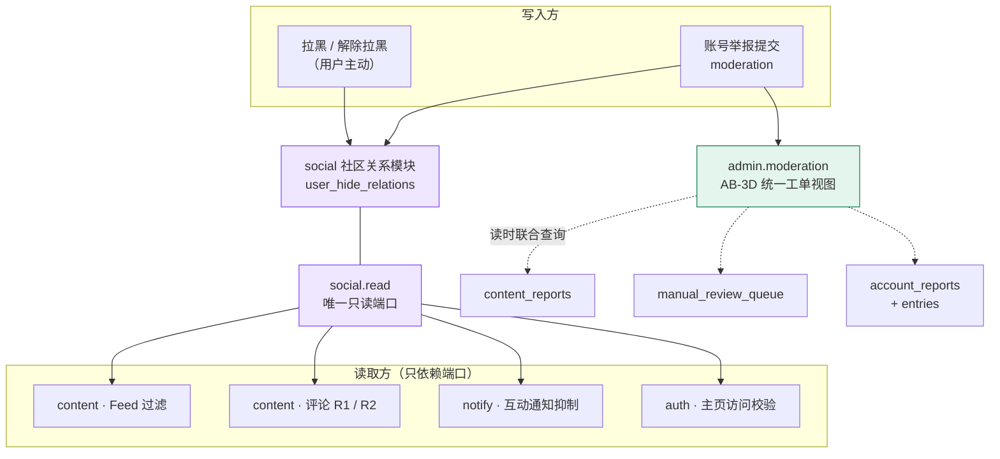
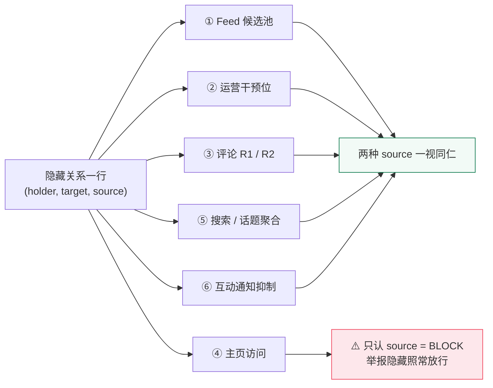

# TailTopia V1.1.4 架构决策文档 —— Delta

> **形态说明**：V1.0 架构（`architecture.md`）、V1.1 delta、V1.1.2 delta 均已上线冻结。本文件是 brownfield **增量 delta**，只写 V1.1.4 的**新增 / 取代 / 补齐**；未提及处一律**继承基线**。冲突序：**本 delta > V1.1.2 delta > V1.1 delta > V1.0 基线**。正确性以 `v1.1.4/PRD-v1.1.4.md` 为准，视觉以 `v1.1.4/ui-v1.1.4.html`（**28 屏 / 4 泳道**：A1·A1b·A2–A5·A6 / B1–B7 / C1–C4 / D1–D7·D7b·D8–D9）为准。
>
> **底线继承（不重述、全部延续）**：Spring Boot 4 / Java 21 / PostgreSQL + Redis + Flyway；模块化单体；异步只用 `@Async` + DB 状态机、`@Scheduled` 定时；**禁 MQ / 禁调度中间件 / 禁通用缓存层**；DB snake_case ↔ Java/Dart camelCase ↔ JSON camelCase；RFC 9457 ProblemDetail；对外标识不可枚举 token；env 注入凭证不入库；日志禁 PII / 健康 / 令牌 / 签名 URL；`ddl-auto=validate`，schema 归 Flyway。
>
> **运维 envelope 零增量**：不引入任何新中间件、不新增外部依赖、不改变部署形态（德国单机）。无缓存、无定时任务、无异步链路。见 AD-18。

---

## §0 决策日志

| # | 决策 | 结论 | 来源 |
|---|------|------|------|
| **AD-1** | 「不给某人看某人」这层关系怎么存 | **一张新表双来源**：主动拉黑与举报隐藏各写一行，`source` 字段区分；唯一键 `(holder, target, source)` | 用户 2026-08-15 拍板 |
| **AD-2** | 账号举报的工单粒度 | **一个被举报账号 = 一条工单**；每次举报作为明细行追加 | 用户 2026-08-15 拍板 |
| **AD-3** | R2 影子评论怎么读 | **不 join 内容表**，由 service 把已知的内容作者 id 作参数传入 | 架构裁定 |
| **AD-4** | 迷你主页接口要不要改成必须登录 | **不改**，保持游客可读 + 加可选 viewer（闭合 OQ-A5 后半） | 架构裁定（据代码实证） |
| **AD-5** | Feed 分页要不要产品层兜底 | **不需要**，过滤本就在 SQL 内、页恒满（闭合 OQ-A6） | 架构裁定（据代码实证） |
| **AD-6** | 互动通知抑制拦在哪一层 | **notify 模块入口**（`ContentNotifyListener` 两处），系统通知天然不受影响。**判据两条（R1 + R2），只做 R1 会漏第三方那一支——PRD 亦未覆盖** | 用户 2026-08-15 拍板 + 评审补 |
| **AD-7** | AB-3D 三类工单怎么拼成一个队列 | **读时联合查询**，不建统一索引表、不双写、存量零回填 | 用户 2026-08-15 拍板 |
| **AD-8** | 隐藏关系与账号举报的模块归属 | **新建社区关系模块**承载隐藏关系（只开一个只读端口）；账号举报归既有审核模块 | 用户 2026-08-15 拍板 |
| **AD-9** | 帖子级举报隐藏要不要并入新表 | **不并，两条过滤并存**——不动已上线行为、不搬存量数据 | 用户 2026-08-15 拍板 |
| **AD-10** | 警告的历史记录落在哪 | **新建账号处置记录表**（警告 + 封号共用），不复用昵称头像违规计数 | 用户 2026-08-15 拍板 |
| **AD-11** | 主页访问被拦时接口怎么回 | **专用 ProblemDetail type**，前端据此区分「已拉黑」与「网络失败」 | 用户 2026-08-15 拍板 |
| **AD-12** | 账号举报的理由选项 | **新建账号维度五类枚举**，禁复用内容维度的 `ReportReason` | 架构裁定 |
| **AD-13** | 评论可见性与评论数口径 | R1 / R2 两条件并列、任一命中即隐藏；回复串随父隐藏；**R2 不计入对外评论数、R1 照常计入** | 架构裁定 |
| **AD-14** | 举报成功「立即隐藏」怎么兑现 | **前端乐观移除该作者在当前列表的全部卡片**，静默无提示 | 架构裁定 |
| **AD-15** | 迷你卡的三处既有行为改动 | 评论区接入弹卡 / 拉取失败改为提示（**改原 catch 分支**）/ 已注销仍不弹卡 | 架构裁定 |
| **AD-16** | 批量处置的事务边界 | **逐条独立事务**，部分失败逐条回报、不整批回滚 | 架构裁定 |
| **AD-17** | 账号举报要不要自动预处置 | **零自动**，一律人工；既有帖子级两条自动通道保持不变且退出排序 | 架构裁定 |
| **AD-18** | 运维形态 | **零增量**，无缓存无异步无新中间件 | 架构裁定 |
| **AD-19** | 埋点 | 拉黑事件须区分**产生来源**与**操作入口**；黑名单页举报点击单独打点 | 架构裁定 |
| **AD-20** | 单向屏蔽的边界 | 被拉黑方那一侧**只动评论**，浏览 / 点赞 / 访问主页 / 统计 / 历史数据一概不动；不可自我操作；不豁免虚拟账号；不作用于问诊 | 评审对账补入 |

---

## §1 代码现状核实 —— 与 PRD 工程假设的四处偏差

> PRD 于 2026-08-15 已做过一轮代码实证订正。本节是**架构阶段的第二轮核实**，四处结论与订正后的 PRD 仍不一致，**以本节为准**。

### 1.1 OQ-A6 的前提不成立 —— Feed 分页不会出现空页

PRD 写「Feed 是游标分页，过滤是『先取 N 条再过滤』还是『过滤后凑够 N 条』结果完全不同——前者会出现某页几乎全空」，并把这条挂到技术方案阶段确认。

**实测：不存在这个风险。** `FeedService.loadFeed` 取 `PAGE_SIZE + 1` 行，而**全部过滤条件（含既有的「排除本人已举报的帖」`NOT EXISTS` 子查询）都写在 `findFeed` 的 SQL `WHERE` 里**，数据库返回的就是已过滤干净的行。这是「过滤后凑够 N 条」。拉黑过滤挂进同一处即可，**页恒满，拉黑高产种子号只会让可见内容变旧，不会让页面变短**。

→ **OQ-A6 关闭，产品层无需任何兜底。** 约束见 AD-5 的 Rule：任何「按查看者隐藏」的过滤一律下沉到 SQL WHERE。

### 1.2 OQ-A5 后半的判断过重 —— 迷你主页接口不需要形态改造

PRD 订正后写「真正缺 viewer 上下文的是迷你主页接口——它游客可读、完全不要求登录……**这才是本 FR 里实打实的接口变更**」。

**实测：不是接口变更。** `/api/v1/users/*/mini-profile` 确为 `permitAll`，但 `oauth2ResourceServer` 在 `permitAll` 端点上**同样会解析并校验 Bearer token**。既有 `ContentFeedController`（同为 `permitAll` 的 Feed 端点）已经在用 `@AuthenticationPrincipal Jwt` 解出**可选** `viewerId` 并交给 `findFeed` 过滤——这个「游客可读 + 登录者可识别」的模式在本仓库是现成的。

→ 迷你主页照抄该模式即可：**端点保持 `permitAll`，游客行为一字不改**。见 AD-4。

### 1.3 OQ-A5 前半的订正是对的 —— R1 确实只是加一个条件

`CommentRepository` 的四个查询方法（`countVisibleForViewer` / `findTopLevel` / `findReplies` / `findRepliesForParents`）**全部已带 `:viewerId` 参数**，是内容审核那版为「作者始终看得到自己被挂起的评论」留下的。R1 就是在既有 `viewerId` 条件旁并列一条 `NOT EXISTS`。

**但 R2 需要的不是 viewer，是内容作者** —— 见 AD-3：不加 join，由 service 传参。

### 1.4 Flyway 基线比 README 记的高一号

README 写「`stag` 已排到 V100，本分支只到 V99」。**实测本分支 `hex/v1.1.4` 上 `V100__add_id_card_student_fields.sql` 就在**。

→ 本版本新增迁移**从 V101 起**。见 §4。

### 1.5 附带发现：命名陷阱在代码里比 PRD 描述的还险

`UserStatus` 只有两个值：`ACTIVE` / `DEACTIVATED`，其中 **`DEACTIVATED` 是「运营停用」即封号**（可重新激活）。而**用户自己注销**走的是另一条完全不同的路（`User.deleted` / `AuthorView.deleted`），迷你卡的 DTO 工厂方法偏偏叫 `MiniProfileResponse.deactivated()` —— 它表达的是**注销**。

**同一个词根，两个相反的语义，而 PRD 对两者的要求也正好相反**（封号照常展示不做标记仍可被拉黑 / 注销匿名态去点击态条目保留）。这是本版本最高风险的做反点，见 §3 安全攸关清单。

---

## §2 Invariants & Rules

### AD-1 — 隐藏关系单表双来源

**Binds**：四处读取点（Feed 过滤 / 评论 R1 / 评论 R2 / 主页访问校验）、两处写入点（举报提交 / 拉黑提交）。
**Prevents**：四处过滤各自查两张表（拉黑表 + 举报工单表）导致热路径双 `EXISTS`；两处过滤对「隐藏」判据取不同口径。

**Rule**：

- 一张 `user_hide_relations` 表，字段 `holder_id`（谁不想看）/ `target_id`（被隐藏的人）/ `source`（`BLOCK` | `REPORT`）/ 时间戳。
- **唯一键 `(holder_id, target_id, source)`** —— 幂等**只在同源之间成立**。已存在 `REPORT` 行时再发起主动拉黑，**必须照常新增 `BLOCK` 行**；否则用户点了「拉黑」、Toast 说「请在黑名单里查看」，去了却找不到人。
- **除主页访问外，其余五处过滤一律不区分 `source`**（Feed / 运营干预位 / 评论 R1·R2 / 搜索话题列表 / 通知抑制）。
- **主页访问只认 `source = BLOCK`**。举报隐藏照常放行——这是 FR-58 闭环的支点，「已举报」状态和重复举报入口全靠它（见 AD-11）。
- **举报写工单与写隐藏行必须同一事务**。
- 解除拉黑 = 删 `BLOCK` 行；`REPORT` 行**永不删除**，无任何解除入口。

> **备选与否决**：不建隐藏表、举报隐藏由工单表现查（与既有内容举报做法一致，零新增写）。否决理由：Feed 与评论区是热路径，四处过滤每处都要查两张表；且黑名单页、迷你卡「已举报」标签也都要读，判据散落。

### AD-2 — 账号举报工单粒度 = 被举报账号

**Binds**：AB-3D 列表形态、优先级公式的计算单位、批量处置的作用对象、处置动作的落点。
**Prevents**：同一坏账号被 12 人举报产生 12 条待处理工单；以及「12 人 / 27 次」这两个指标无处安放。

**Rule**：

- `account_reports` 一行 = 一个被举报账号，`target_user_id` **唯一**。
- 每次举报作为 `account_report_entries` 一行追加，**保留该次的举报类型与「其他」补充说明，不覆盖前次**；后台按时间倒序展示全部。
- PRD「同一举报人对同一账号只占一条工单」由本粒度**天然满足**（不管谁报、报几次，列表里就一行）。
- **工单被处理后若再收到新举报 → 同一条工单翻回待处理**，不新建工单。历史处置留痕在 `account_disposals`（AD-10），不因翻回而丢失。
- 优先级分（`举报人数 + 高频举报人数`）**实时按明细行计算，不落库快照**。
- **工单必须展示被举报账号当前的个性签名原文**（为空显示「未设置」）。举报「仿冒他人」「持续骚扰」时**签名往往就是证据本身**（冒充某人的自我介绍、指名道姓的攻击），运营不该还要再跳一步去别处看。签名取**当前值**（经既有账号查询服务读，不快照、不落工单表）。

### AD-3 — R2 影子评论传参，不 join

**Binds**：评论列表与评论计数四个查询方法的签名与调用方（`CommentQueryService` 的 `topLevel` / `replies` 两条读路径）。
**Prevents**：研发把 R2 误做成 R1 那种「按 viewer 过滤」—— 那样第三方仍然看得到，等于没解决问题；也防止四个查询各自 join 一次内容表、让数据库逐行重算一个 service 层的常量。

**Rule**：R2 条件写成 `NOT EXISTS(隐藏行 WHERE holder = :postAuthorId AND target = 评论作者)`，与 R1 的 `holder = :viewerId` **并列**，两条件独立 `AND`，任一命中即隐藏。

`:postAuthorId` 由 service 传入：`CommentQueryService.requireVisiblePost(postId)` 已 `findById(postId)`，作者是现成的；`replies(parentId)` 分支经 `Comment.postId` 反查一次。

> **为什么不 join**：多一层 join 会让四个查询各自变复杂，而内容作者在 service 层本就是常量——这是「一次查询拿到、当参数传下去」比「让数据库每行重算」更合适的典型场景。

### AD-4 — 迷你主页保持游客可读，加可选 viewer

**Binds**：迷你主页与宠物主页两个端点的鉴权配置与 viewer 解析方式；前端 `showMiniProfile` 的调用契约。
**Prevents**：把端点改成 `authenticated` 后游客点头像直接 401，破坏 FR-26 既有的「点头像即看，无登录要求」。

**Rule**：照抄 `ContentFeedController` 的 `@AuthenticationPrincipal Jwt` → 可选 `viewerId` 模式。登录者带 token 时后端认得出并做主动拉黑校验；游客照常拿到卡片数据。

> **⚠️ 核实订正：本版本要拦的「他人主页」只有迷你主页一个。** PRD §3.2 生效范围第 4 条写「不可再进入该用户的迷你主页预览卡**与宠物主页**」，但后端**不存在他人可访问的宠物主页端点** —— `/api/v1/pet-profiles/**` 全部是 `/me` 口径。唯一对外的是分享 H5 卡片页 `/p/{cardToken}`，而 PRD 已明确「无登录态视图，不做拉黑过滤」。
> 故本版本**只改迷你主页一个端点**；「宠物主页」那半句自然不触发，但归入 S1 通用规则的适用对象 —— 日后真做他人宠物主页，须同样套用本校验。

### AD-5 — 过滤一律下沉 SQL

**Binds**：所有承载「按查看者隐藏」的分页查询（Feed、评论列表、后续任何内容列表）。
**Prevents**：某页取回 20 条、Java 侧过滤掉 17 条只剩 3 条，用户以为到底了；以及 `hasMore` 与实际条数对不上导致游标翻页漏内容。

**Rule**：任何「按查看者隐藏」的过滤**必须写进 SQL `WHERE`**，禁止取回后在 Java 侧 `filter` —— 后者才会产生近乎空白的页，也才会让 `hasMore` 与实际条数对不上。

### AD-6 — 互动通知抑制拦在 notify 入口

**Binds**：三类互动通知（赞我的内容 / 评论我的内容 / 回复我的评论）的产生。
**Prevents**：收到通知点进去什么都没有的穿帮。PRD 列的三种里，**「B 回复我在别人帖子下的评论」最容易漏**——它跨在 R1/R2 边界上（内容作者是第三方、R2 管不着，只有 R1 生效）。

**Rule**：

- 抑制点在 `ContentNotifyListener` 的 `onContentLiked` 与 `onContentCommented` 两处（后者内部两次 `send` 都要判：内容作者一次、被回复的一级评论作者一次）。
- **判据有两条，任一命中即不发**（对应 R1 与 R2 两种隐藏）：
  - **① 接收者隐藏了 actor**（`holder = 接收者`，`target = actor`，不区分 source）—— 对应 R1，这条通知的目标本人看不到那条内容。
  - **② 内容作者隐藏了 actor**（`holder = 该内容的作者`，`target = actor`）—— 对应 R2，该评论**对所有人都不可见**，因此指向**任何人**的通知都不能发。

  > **⚠️ 只做第 ① 条会留一个 PRD 也没覆盖的漏洞：** 设 A 拉黑了 B，B 在 **A 的帖子下**回复了 **C 的一级评论**。R2 会把这条回复对所有人隐藏（含 C）。第 ① 条只挡住发给 A 的通知；**C 没拉黑任何人，照样收到「有人回复了你的评论」，点进去什么都没有**。C 会当 bug 反馈，而且一对比就能推断出「有人被屏蔽了」这套机制存在 —— 正是 PRD 表格 ① 要防的那类穿帮，只是换了个受害者。PRD §3.2 生效范围第 6 条列的三种场景**接收者全是拉黑发起方本人**，第三方这一支是空白。
- **只作用于这三类互动通知**。`ModerationNotifyListener` 等系统通知监听器（封号、审核结果、内容被移除）**一律不接入该判断**。
- 是**「不发」而不是「发了再隐藏」**：不落通知记录，未读角标不 +1。
- **解除拉黑不补发**，抑制期间的通知永久丢弃。
- 拉黑**之前**已产生的历史通知**不回溯清理**（继承「拉黑不回溯清理已产生数据」原则，A-A30）。

### AD-7 — AB-3D 读时联合，不建索引表

**Binds**：AB-3D 的列表 / 筛选 / 排序 / 批量处置读路径。
**Prevents**：索引表与源表状态不同步（工单已处理而索引仍显示待处理）这一类长期一致性风险。

**Rule**：

- 后台列表以**一条跨三张既有表的联合查询**产出，在 DB 内排序分页：`content_reports`（内容举报）+ `manual_review_queue`（账号标识字段异步审核，AB-9A/FR-56）+ `account_reports`（本版本新增）。
- **不新增统一工单索引表、不双写、存量数据零回填**。三类工单的状态仍由各自源表权威持有。
- **后台是运营内部页面，QPS 极低** —— 禁止为其引入缓存或索引表（这条同时是 AD-18 的具体化）。
- **筛选是统一视图成立的前提，不是锦上添花**：按工单类型（三类）+ 按状态（待处理 / 已处理 / 已驳回）+ 按被举报账号检索，三者必须与列表同版本交付。
- **不保留「评论举报」空分类** —— 该能力至今未上线，留一个永远没数据的筛选项只会让运营以为漏了什么。

### AD-8 — 新建社区关系模块；账号举报归审核模块

**Binds**：包结构、跨模块依赖方向。
**Prevents**：把「用户自助图清净」写进名为「审核」的目录；`notify` / `content` 直连他人仓储破坏模块化单体边界。

**Rule**：

- 新建 `com.tailtopia.social`：`domain`（隐藏关系实体 + 来源枚举）/ `repository` / `service`（写：拉黑、解除、举报触发建关系）/ `read`（**唯一对外只读端口**）/ `web`（黑名单页端点）。
- **`content` / `notify` / `auth` 三侧只依赖 `social.read` 的端口接口**，禁止直读其仓储。
- 账号举报工单与明细归既有 `com.tailtopia.moderation`（与内容举报作伴）；账号处置记录归 `moderation`；AB-3D 后台视图归 `admin.moderation`。
- **举报模块调 `social` 的写服务建立 `REPORT` 隐藏行**，不反向依赖。

> **对既有端口先例的一处有意偏离**：既有 `ViolationCountReader` 把端口接口放在**消费方**（`admin`），实现放在提供方（`moderation`）。本版本隐藏关系有**三个消费方**，照搬会产出三份同义接口 —— 故端口接口放在**提供方** `social.read`，消费方只依赖它。

### AD-9 — 两条过滤并存，不合并

**Binds**：`findFeed` 的 WHERE 构成；内容详情对举报人的 404 判定。
**Prevents**：为求概念统一而改动已上线一年多的内容举报行为 + 存量数据迁移，与本版本「尽快上线」直接冲突。

**Rule**：

- `findFeed` **保留既有「排除本人已举报的帖」子查询原样不动**，另加一条账号级隐藏条件。
- 两条件语义不同（一条藏**一条帖**、一条藏**一个人**），并列 `AND`，任一命中即不可见。
- **PRD §3.2 生效范围第 1 条那句「实现上应合并为一次，不要新起一层」本版本不采纳**，理由留痕于此。若日后要合并，属独立的重构议题。

### AD-10 — 新建账号处置记录表

**Binds**：AB-3D 工单里的「历史违规记录（同账号历史处置次数）」字段；警告可重复下发且不合并不去重的要求。
**Prevents**：把两种语义不同的计数挤进同一张表（既有违规计数是为**昵称/头像**违规设计的，且只存次数、不存明细，运营看不到「上次什么时候因什么警告的」）。

**Rule**：

- `account_disposals` 每次处置追加一行：被处置账号 / 处置类型（`WARNING` | `SUSPEND`）/ 处置人 / 关联工单 / 时间。
- **警告与封号一律先写处置记录，再触发用户侧后果**（发通知 / 置 `UserStatus.DEACTIVATED` + 撤 refresh token）。**两者同一事务** —— 既有停用链路自带审计留痕，处置记录与它必须同生共死，否则会出现「用户登不上了但工单页显示从未处置过」。
- **警告不自动升级**：累计到任何次数都不自动触发封号、不自动置顶工单。升级完全由运营看到历史记录后人工判断。
- 为 1.1.8 的「限流曝光」留下天然落点（届时加一个处置类型即可，**本版本不为它预留任何 UI**）。

### AD-11 — 主页访问拦截返回专用错误类型

**Binds**：迷你主页与宠物主页两个端点的对外契约。
**Prevents**：用「200 + 标记字段」的做法在拦截的同时仍把昵称头像给出去（等于拦了一半）；也防止前端把拉黑态误判成网络异常。

**Rule**：

- 命中主动拉黑 → 按既有 RFC 9457 ProblemDetail 返回**可识别的 `type`**（如 `blocked-user`），**不返回该用户的任何展示字段**。
- 前端据 `type` 区分两个 Toast：**已拉黑**（UI 稿 A4「Kamu sudah memblokir pengguna ini」）/ **网络失败**（A5「Gagal terhubung, coba lagi」）。
- **该校验只认 `source = BLOCK`**。研发若把条件写成「存在隐藏关系即拦」，会一并把举报隐藏拦掉，**直接打死 FR-58 的闭环**（A3 屏永远看不到、重复举报无入口）。
- **必须服务端校验** —— 纯前端拦截可被推送深链、通知中心历史记录、外部分享链接绕过。

### AD-12 — 账号举报专用理由枚举

**Binds**：举报抽屉的选项集与落库值；AB-3D 工单里「举报类型 + 举报原因」字段的取值域；印尼语文案清单。
**Prevents**：研发套用现成的 `report_sheet.dart` 与内容维度 `ReportReason`，导致账号举报弹出「虚假信息 / 不当内容」这类对不上的选项（既有五类里只有「骚扰」和「其他」能对上）。

**Rule**：新建账号维度五类枚举（垃圾营销 / 仿冒他人 / 持续骚扰 / 发布违规内容 / 其他），落库 `varchar` + `UPPER_SNAKE`。**「其他」必须带补充说明（上限 200 字），其余四类不提供说明框。**

### AD-13 — 评论可见性与评论数口径

**Binds**：评论列表渲染、评论计数、以及后续任何依赖评论数 / 互动量的功能（如按互动量排序或选品）。
**Prevents**：「显示 5 条评论却只数得出 4 条」的穿帮；内容作者看到「回复了某条看不见的评论」的孤儿回复；以及影子评论被下游当成真实互动信号。

**Rule**：

- R1（`holder = :viewerId`）与 R2（`holder = :postAuthorId`）**并列**，任一命中即隐藏。两条正交、只会隐藏永不强制显示，叠加不可能打架。
- **隐藏方式是直接不展示该条**，不占位、不显示「该内容已隐藏」占位符（A-A5）。
- **回复串随父隐藏**：被隐藏的评论，其整条回复串对该视角一并隐藏，不论回复者是谁。R1 R2 同理。
- **被 R2 影子的评论作者本人仍看得到自己那条，以及他人对他的回复** —— 这是「无感知」的前提，不是遗漏，不得给任何失败提示或视觉差异。
- **评论数**：`countVisibleForViewer` 同步套用 R1 + R2。**R2 影子评论及其回复串不计入对外评论数与互动量**；**R1 隐藏的评论照常计入**（R1 只是「我不看」，那条评论对平台而言真实存在且公开可见）。
- 评论作者本人看到的数字比他人多 1，属影子机制固有特性、可接受（A-A21）。
- **该口径需同步给后续任何依赖评论数 / 互动量的功能**，避免影子评论被当作真实互动信号。

### AD-14 — 举报成功的「立即」兑现在当前屏

**Binds**：举报成功态收尾时前端列表的状态更新（Feed 列表与详情页返回路径两个入口）。
**Prevents**：用户举报完抬头就看见「我举报了，他的内容还在」—— 这正是方案甲要消灭的体验，只是推迟了几秒。

**Rule**：

- 举报成功、用户点「关闭」收起流程时，**当前列表立即移除该作者的全部可见卡片**（不是只移除某一条）。沿用既有帖子级举报成功后乐观移除的做法。
- **两个入口都要覆盖**：从 Feed 进入的 → 移除该作者在当前列表的所有卡片；从内容详情页作者进入的 → **先退回上一级列表**（停在被举报者的帖子详情页上是明显穿帮），再同样移除。
- **移除必须静默** —— 不弹「已不再向你展示 TA 的内容」之类提示，那句话会泄露「举报会隐藏内容」，与 A-A27 的取舍冲突。已知代价：列表会突然变短。

### AD-15 — 迷你卡的三处既有行为改动

**Binds**：`showMiniProfile` 的全部触发点与全部失败分支。
**Prevents**：① 只在评论区骚扰、从不发帖的账号既举报不了也拉黑不了（本版本的影子评论 / R1 / R2 / 通知抑制全为评论区骚扰设计，入口却不在评论区）；② 研发只加新分支而漏改原来的静默 `catch`，用户点了头像仍然什么都不发生；③ 把「已拉黑不弹卡」复用到静默路径上，与网络失败混为一谈。

**Rule**：

1. **评论区（一级评论与二级回复）的头像 / 昵称接入 `showMiniProfile`**，与 Feed / 详情页作者完全一致。**不在评论行内另设「⋯」或滑动手势** —— 复用同一张卡、同一套「⋯」菜单，用户学一次即可。
   > **这是本版本最大的闭环缺口**：影子评论 / R1 / R2 / 通知抑制**全部为「评论区骚扰」设计**，而举报与拉黑的发起入口恰恰在评论区不存在。一个只在评论区骚扰、从不发帖的账号，用户既举报不了也拉黑不了。
2. **拉取失败由静默不弹改为弹 Toast** —— 这是**变更既有行为**（原 `catch (_) { return; }`，注释理由「非关键路径」）。⚠️ **须改原 `catch` 分支，不是只加新分支。**
3. **已注销仍不弹卡**（不变，NFR-8），且**评论区分支须一并复核该判断** —— 这个判断此前只在 Feed 侧考虑过。
4. **已「主动拉黑」的用户 → 不弹卡 + Toast** 必须走**独立分支**，不能复用上面那条静默路径（两者语义完全不同）。

### AD-16 — 批量处置逐条独立事务

**Binds**：AB-3D 批量处置的事务边界与结果回报形态。
**Prevents**：一个事务里 20 条成功 18 条却整批回滚、运营无从判断哪条真失败；以及全选一个长队列再点封号、一次封掉几百个账号。

**Rule**：单次上限 **50 条**；**同类型才可批量**（选中第一条后其余类型置灰不可选）；**每条一个独立事务**，部分失败**逐条回报失败项与原因、不整批回滚、不得静默吞掉**；**批量封号须二次确认且弹窗内逐条列出将被封的账号**（昵称 + 被举报次数），批量警告不需要二次确认。

### AD-17 — 账号举报零自动预处置

**Binds**：三类工单的排序口径；举报提交后平台侧是否自动动手。
**Prevents**：组织化串通举报即可让一个人在平台上无人复核地「消失」——本版本举报只需三次点击、不设频率限制。

**Rule**：

- 账号举报**一律人工**，不设任何「达阈值自动挂起该账号内容」的通道。**这是主动决定，不是遗漏**，后续版本若要补须重新评估恶意串通的攻击面（A-A32）。
- **既有内容举报的两条自动预处置通道保持不变**（违法违规原因单次触发 / 举报人数达阈值），**仅作用于内容举报**，且**不再参与统一队列的排序**。
- **排序统一由 AB-3D 的新公式接管全部三类工单**：`优先级分 = 举报人数 + 高频举报人数`，高频阈值 = 对该对象累计举报 **≥ 5 次**（含 5），**单个举报人贡献封顶 2 分**。分数**实时计算不落库快照**；列表按分数倒序，同分按**最早一次举报时间升序**。
- 界面**必须把分数拆开展示**（人数 + 次数 + 高频人数 + 算出的分），不要只给一个总分。
- **⚠️ 账号标识字段审核工单没有举报人，公式对它恒为 0 分 —— 必须显式定义，否则它会永远沉底。** PRD 说「本公式统一接管全部三类工单」时没注意到第三类根本不是举报产生的。**架构默认：按该类工单既有的 `ReviewPriority` 映射成分数 —— `P0 → 10` / `P1 → 2` / `P2 → 0`**，锚点取自 PRD 自己给的两个例子（「10 个人各报 1 次 = 10 分」「1 个人报 100 次 = 2 分」）：P0 视为等同于十人举报的众怒，P1 等同于一个纠缠举报者，P2 沉底。**该映射待产品确认，见 §7 OQ-CA1**；确认前按此实现，不阻塞。

### AD-18 — 运维 envelope 零增量

**Binds**：部署形态、依赖清单、隐藏关系的读取方式。
**Prevents**：为「避免每次列表查询回表」擅自引入 Redis 或本地缓存，违反架构 Enforcement；也防止有人为通知抑制引入队列。

**Rule**：不新增中间件、不新增外部依赖、不改部署形态。**隐藏关系每次查库、走唯一索引，禁止为其引 Redis 或本地缓存** —— OQ-A5 原文提的「避免每次列表查询回表」不构成引缓存的理由（单表唯一索引 `EXISTS`，代价与既有的举报过滤子查询同量级）。无定时任务、无 `@Async`（拉黑与举报均为同步小写）。

### AD-19 — 埋点

**Binds**：拉黑相关事件的属性集；§4.3 成功度量所依赖的数据来源。
**Prevents**：隐藏关系总量被举报量灌大，看不出主动拉黑的真实使用情况；以及「黑名单页举报入口是否成立」这个判断上线后无数据可验。

**Rule**：拉黑 / 解除拉黑事件须能区分**产生来源**（主动拉黑 / 举报自动产生）与**操作入口**（迷你主页 / 黑名单页 / 举报流程 / 评论区）；**黑名单页的举报点击单独打点**（来源 `blocklist`）；**不对影子评论做单独埋点**。

> 不分来源的话，隐藏关系总量会被举报量灌大，看不出主动拉黑的真实使用情况。黑名单页举报点击这个数字直接验证「拉黑后仍需举报入口」这个判断——长期为 0 就可以撤掉该入口。

### AD-20 — 单向屏蔽的边界：被拉黑方那一侧只动评论，其余一概不动

**Binds**：被拉黑方的全部行为路径（浏览 / 点赞 / 评论 / 访问发起方主页 / 分享页）；统计口径；自我操作的禁止项。
**Prevents**：研发按业界常见的 Block 语义把它做成**双向隔断** —— PRD 为此专门写了一整节「明确不影响的」，因为这是本 FR 最容易被"常识"带偏的地方。

**Rule**：

- **拉黑是单向的，被拉黑方无感知**：收不到通知、看不到任何标记、界面无任何变化。
- 被拉黑方**仍可正常查看**发起方的内容、主页、对外分享 H5 页。
- 被拉黑方**仍可点赞，点赞不做任何限制** —— 照常写入、照常计入点赞数、**不做逐人扣减**。（禁与不禁体验上没有差别，不禁少一处逻辑。）
- 被拉黑方**仍可「评论成功」**，界面表现与正常评论完全一致 —— 唯一的实际限制就是这条评论进入 R2 影子态。**「客观受限」与「主观无感知」是两件事，不得表述成「被拉黑方无任何限制」。**
- 被拉黑方**自己发的帖子**对第三方的可见性完全不变（R2 只作用于「在发起方内容下的评论」）。
- **统计口径**：曝光量、浏览量、点赞数**照常计入，不因拉黑扣减**；只有被 R2 隐藏的评论及其回复串不计入对外评论数与互动量（AD-13）。
- **历史数据不回溯清理**：此前点过的赞、已有的互动记录一律保留不动，拉黑只影响「从此刻起还展不展示给我」。
- **自我操作禁止**：不可举报自己、不可拉黑自己（自己的迷你卡不展示这两个入口）。
- **不豁免运营虚拟账号**（种子内容作者同样可被拉黑），延续 V1.1.0「虚拟账号不享受审核豁免、不做特殊标记」的既有原则。
- **不作用于兽医问诊**：本能力只管社区内容与评论的展示，**不参与问诊的匹配 / 展示逻辑** —— 那是付费服务撮合，混用会让用户以为「拉黑就能排除某个兽医」。
- **拉黑数量不设上限、不设频次限制**；**被拉黑次数不作为任何运营处置或风控依据**，后台**不展示「被拉黑数」**（避免拉黑被恶意用作攻击手段）。
- **未登录游客**不涉及拉黑；对外分享的 H5 访客页无登录态身份，**同样不做拉黑过滤**。

---

### 依赖方向

**方向铁律**：`content` / `notify` / `auth` **只出箭头指向 `social.read`**，不得反向、不得跳过端口直读仓储。`social` 不认识 `moderation`（是 `moderation` 调它）。

### 隐藏关系的六处生效点

**第 ④ 条是全版本唯一需要区分来源的地方。** 把它写成「存在隐藏关系即拦」是本版本最容易犯、后果最重的错。

---

## §3 一致性约定（增量）

### 安全攸关三处 —— 写代码时勿埋违反点

| # | 约定 | 违反的后果 |
|---|---|---|
| **S1** | **隐藏过滤属安全规则层，只升不降不可绕过**。凡新增「展示他人内容」的位置**默认套用**，不做逐场景例外 | 漏一处等于拉黑白拉；PRD 生效范围第 2/5 条正是为此写成通用规则 |
| **S2** | **主页访问校验必须服务端**（推送深链 / 通知中心历史记录 / 外部分享链接都能绕过纯前端拦截） | 拉黑形同虚设 |
| **S3** | **封号 ≠ 注销**。`UserStatus.DEACTIVATED` = 运营停用（封号，可恢复）；注销走 `deleted` 路径。**两者在代码里近乎同名而 PRD 要求正好相反** | 黑名单页把封号用户匿名化（错）或把注销用户展示成正常可点（泄露身份，违 NFR-8） |

### 命名与契约

- **表名**：`user_hide_relations` / `account_reports` / `account_report_entries` / `account_disposals`（复数 snake_case）。
- **枚举落库** `varchar` + `UPPER_SNAKE`：`HideSource{BLOCK, REPORT}`、`AccountReportReason{SPAM, IMPERSONATION, HARASSMENT, VIOLATING_CONTENT, OTHER}`、`DisposalType{WARNING, SUSPEND}`。
- **端点**（`/api/v1`，资源小写复数连字符；当前用户统一 `/me`）：
  | 方法 | 路径 | 说明 |
  |---|---|---|
  | `POST` | `/api/v1/account-reports` | 提交账号举报（类型 + 可选说明） |
  | `GET` | `/api/v1/me/blocks` | 黑名单列表（按拉黑时间倒序，含「已举报」标记） |
  | `POST` | `/api/v1/me/blocks` | 拉黑（幂等，见 AD-1） |
  | `DELETE` | `/api/v1/me/blocks/{userId}` | 解除拉黑（幂等静默成功） |
  | `GET` | `/api/v1/users/{userId}/mini-profile` | **既有端点**，加可选 viewer + 拉黑拦截 |
- **错误**：统一 RFC 9457 ProblemDetail，新增可识别 `type`：`blocked-user`（主页访问被拦）。
- **前端**：`showMiniProfile` 保持唯一入口函数；黑名单页与举报抽屉复用既有 `report_sheet.dart` 的视觉规格（内边距 22/12/22/28、手柄 36×4、原因卡圆角 13 / 边框 1.5px、提交按钮圆角 14），**只换枚举与标题**。

### 幂等口径（一句话记住）

**幂等只在同一来源之间成立。** 重复拉黑不新增记录、不刷新拉黑时间（避免用户反复点击把自己顶到列表最前）；重复解除静默成功；**但已存在举报隐藏时再拉黑，必须照常建立拉黑关系。** 前端做防连点，**服务端不依赖前端保证**。

---

## §4 数据库迁移

**基线：本分支实测最高 `V100`。本版本新增从 `V101` 起。**

> ⚠️ 序号按**实际执行顺序单调分配**（决策 E2）。下表是预期顺序，story 落地时若顺序有变，按实际顺延，勿照搬本表号。

| 预期号 | 内容 | 关键约束 |
|---|---|---|
| `V101` | `user_hide_relations` | 唯一索引 `(holder_id, target_id, source)`；查询索引 `(holder_id, target_id)`；`source` NOT NULL |
| `V102` | `account_reports` + `account_report_entries` | 工单表 `target_user_id` **唯一**；明细表外键指向工单，索引 `(report_id, reporter_id)` 供优先级公式聚合 |
| `V103` | `account_disposals` | 索引 `(target_user_id, created_at DESC)` 供工单页「历史处置次数」与时间倒序展示 |

**零回填、零数据迁移。** 三张全新表，既有 `content_reports` / `manual_review_queue` 一字不动（AD-9 / AD-7）。

---

## §5 FR → 架构映射

| 需求 | 落点 | 依赖的 AD |
|---|---|---|
| **FR-58** 举报入口（迷你卡「⋯」） | 前端 `mini_profile_sheet.dart` + 新菜单 | AD-15 |
| FR-58 举报入口（评论区头像） | 前端评论行接入 `showMiniProfile` | AD-15 |
| FR-58 五类理由 + 「其他」必填 | `moderation` 新枚举 + 复用举报抽屉 | AD-12 |
| FR-58 举报即隐藏 | `moderation` 调 `social` 写 `REPORT` 行（同事务） | AD-1 |
| FR-58 隐藏立即兑现在当前屏 | 前端乐观移除 | AD-14 |
| FR-58 重复举报留存 | 工单 + 明细两张表 | AD-2 |
| FR-58 「已举报」状态持久化 | 由 `REPORT` 行存在与否派生 | AD-1 |
| FR-58 警告 / 封号两档 | `account_disposals` + 既有停用链路 | AD-10 |
| FR-58 零自动预处置 | —— | AD-17 |
| **FR-94** 拉黑 / 解除 | `social` 写服务 + `/api/v1/me/blocks` | AD-1 |
| FR-94 生效范围 ① Feed | `findFeed` 加一条件 | AD-5 / AD-9 |
| FR-94 生效范围 ②⑤ 运营位 / 搜索 | 通用规则，本版本不触发 | AD-1（S1） |
| FR-94 生效范围 ③ 评论 R1 / R2 | `CommentRepository` 四方法 + 传参 | AD-3 / AD-13 |
| FR-94 生效范围 ④ 主页访问 | 迷你主页 + 宠物主页端点 | AD-4 / AD-11 |
| FR-94 生效范围 ⑥ 通知抑制 | `ContentNotifyListener` | AD-6 |
| FR-94 黑名单管理 | `social.web` + 前端设置页 | AD-1 |
| FR-94 两种来源并存的行为 | 唯一键含 `source` | AD-1 |
| **AB-3D** 统一队列 | 读时联合查询 | AD-7 |
| AB-3D 优先级公式 | 明细行实时聚合 | AD-2 / AD-17 |
| AB-3D 批量处置 | 逐条独立事务 | AD-16 |
| AB-3D 筛选与检索 | 同版本必交付 | AD-7 |
| AB-3D 工单展示个性签名 | 经既有账号查询服务读当前值，不快照 | AD-2 |
| FR-94 被拉黑方边界 / 统计口径 / 自我操作禁止 | 全版本通用约束 | AD-20 |
| **FR-51 回告文案改线上** | 改一行字，**须在 story 里显式列出** | 见 §7 |
| **§4.3 上线前量基线** | 非代码交付项，**上线前必做**，否则整节度量作废 | 见 §7 |

---

## §6 Deferred（本版本不决定）

| # | 事项 | 为什么现在不决定 |
|---|---|---|
| D-1 | 帖子级隐藏与账号级隐藏合并成一层 | 要改已上线一年多的行为 + 搬存量数据，与「尽快上线」冲突（AD-9） |
| D-2 | 隐藏关系的缓存策略 | 单表唯一索引 `EXISTS`，与既有举报过滤同量级；等出现实测慢查询再谈（AD-18） |
| D-3 | 限流曝光处置动作 | 依赖推荐算法打分链路，已随 FR-95 移至 1.1.8；`account_disposals` 加一个类型即可接（AD-10） |
| D-4 | 评论举报 | 至今未上线，本版本不补做；统一视图不留空分类（AD-7） |
| D-5 | 对外标识改不可枚举 token | 既有 `/users/{userId}/mini-profile` 已暴露数字 id 并上线，本版本新端点**沿用既有口径保持一致**；改造属独立议题，不在本版本切 |
| D-6 | 顶置坑位接上拉黑过滤 | 属 V1.1.6 FR-68 的实现项，已记入 1.1.6 查漏补做清单 A-1，不阻塞本版本 |
| D-7 | 高频阈值 5 配置化 | 阈值无数据依据（A-A23），但配置化多一处运营可误改的入口；先硬编码，上线后按实际分布改一次发一版 |

---

## §7 开工前须闭合的开放问题

| # | 问题 | 责任人 | 阻塞什么 |
|---|---|---|---|
| **OQ-A4** 🚩 | 封号通知印尼语措辞待**法务**确认。**同批送审还有四处新增文案**：警告通知 · 二次确认「提交后无法撤销」· 解除拉黑第二句 · FR-51 改后的回告文案 | PM + Legal | **封号功能不得在其闭环前上线**。其余功能不受阻 |
| **OQ-CA1** | **账号标识字段审核工单在统一队列里的优先级分怎么定** —— 该类工单没有举报人，PRD 的公式对它恒为 0、会永远沉底。架构已给默认映射（`P0 → 10` / `P1 → 2` / `P2 → 0`，锚点取自 PRD 自己的两个例子），需产品确认是否认可这个相对权重 | 产品 | **不阻塞**，按默认实现即可，确认后改常量 |
| **UI-1** | D6 解除确认屏缺「对方也被举报过」的变体，UI 稿未单独出图 | 实现时按 UI 稿 D7b 框外说明处理，文案已在附录给出 | 不阻塞 |
| **PRD-1** | FR-51 回告文案改线上是一条**独立交付项**，且会**连带改变已上线的内容举报回告** | 须在 story 里显式列出，不得混在别的改动里悄悄改 | 不阻塞 |
| **PRD-2** | **上线前必须先量基线**（上线前连续 4 周的周均工单数 / 工单构成 / 人均举报次数），否则 §4.3 整节度量作废 | 产品 | 上线前，不阻塞开发 |

**已闭合**：OQ-A5（AD-1 / AD-3 / AD-4）、OQ-A6（AD-5，且原前提不成立）、Flyway 基线（§4）。
