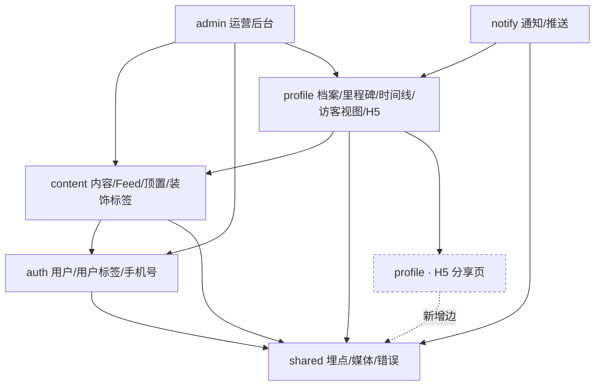

# TailTopia V1.1.6 架构决策文档 —— Delta

> **形态说明**：V1.0 架构、V1.1 delta、V1.1.2 delta 均已上线冻结。本文件是 brownfield **增量 delta**，只写 V1.1.6 的**新增 / 取代 / 补齐**；未提及处一律**继承基线**。冲突序：**本 delta > V1.1.2 delta > V1.1 delta > V1.0 基线 > 原型**。正确性以 `v1.1.6/PRD-v1.1.6.md` 为准，App 视觉以 `v1.1.6/ui-v1.1.6.html`（**28 屏 / 8 泳道**）为准，H5 视觉以 `v1.1.6/ui-h5-card-v1.1.6.html`（**4 屏**）为准，后台以 `v1.1.6/PRD-v1.1.6-admin.md` 为准。
>
> **底线继承（不重述、全部延续）**：Spring Boot 4 / Java 21 / PostgreSQL + Redis + Flyway；模块化单体 + 分层；异步只用 `@Async` + DB 状态机、`@Scheduled` 定时；**禁 MQ / 禁调度中间件 / 禁通用缓存层**；DB snake_case ↔ Java/Dart camelCase ↔ JSON camelCase；RFC 9457 ProblemDetail；对外标识不可枚举 token；env 注入凭证不入库；日志禁 PII / 健康 / 令牌 / 签名 URL；`ddl-auto=validate`，schema 归 Flyway。
>
> **运维 envelope 零增量**：**服务端**不引入任何新中间件、不新增任何外部服务依赖、不改变部署形态（德国单机）。无基础设施决策。
>
> **App 端依赖增量：唯一一处，且属实现选择。** FR-71 的裁剪交互**项目现无可用库**（只有选图能力），需引第三方裁剪库或自研选区交互——见 §6 Deferred。**其余新能力均无新依赖**：分享卡（FR-73）所需的四样底层能力全部已在生产使用——二维码生成库已用于三处支付场景、界面截图导出与水印已用于宠物身份证、系统分享与存相册同样已在用。
>
> **跨模块依赖零新增边**：本版本所有新增能力都落在既有模块内部或既有依赖方向上，唯一新增边是 H5 页 → 共享埋点客户端（见 §2 依赖方向图）。
>
> **⚠️ 版本编号说明（2026-08-11 交叉重编号）**：本版本**原名 1.1.4，现顺延为 1.1.6**。「1.1.4」这个号已被**另一批需求**取走——社区管控 + 身份证分享（FR-58 举报 / **FR-94 用户拉黑** / FR-96 身份证分享奖励 + 后台 AB-3D/3E/3M），该版本**与本版本并行开发、先于本版本发版**。首页推荐算法 FR-95 于 2026-08-12 又拆出单独成版 **1.1.8，排在本版本之后**。
>
> **判断某条能力归哪个版本，用 FR / AB 编号比用版本号可靠**——编号全程没有重新分配。
>
> **跨版本关系（三条，全部是单向、无环）**：
> - **本版本 → V1.1.4**：唯一一处向后依赖 —— 顶置坑位须套用 V1.1.4 FR-94 的拉黑过滤层（AD-8 Rule 6b）。V1.1.4 先发，属合规的向后引用。**✅ 2026-08-16：V1.1.4 拉黑已实现完毕（`hex/v1.1.4`，待合入 `main`），该依赖的前置已就绪、不再是阻塞。**
> - **V1.1.8 → 本版本**：其"要不要为顶置做去重"的判断**唯一依赖本版本的 E-3 埋点**（AD-8 Rule 6c）；装饰标签 ×1.3 加权、顶置坑位、首页点赞、种子内容物种标记四项能力也都在本版本，故 1.1.8 排在本版本之后是必要的。
> - **V1.2.0 → 本版本**：三条向后依赖 —— FR-69 话题页坑位复用本版本坑位机制（AD-8 Rule 6d）、FR-65 年龄换算卡复用本版本卡片生成基建（AD-15 Rule 1c）、FR-72 问诊排队推送触发点接入本版本的多触发点框架（本版本不预留）。

---

## §0 决策日志

| # | 决策 | 结论 | 来源 |
|---|------|------|------|
| **AD-1** | 访客只读的取数落点 | **新建独立「访客视图」只读投影层，两出口共用**；该层结构上不持有健康记录 / 问诊仓库 | 用户 2026-08-11 拍板 |
| **AD-2** | 访客视图的 token 语义与开放度 | **复用现有名片 token，不新发**；**对未登录开放**；失效口径与 H5 一致（防枚举） | 用户 2026-08-11 拍板 |
| **AD-3** | 访客视图内条目的可点性 | **公开内容可点进既有详情页；私密 Diary 不可点 + 提示** | 用户 2026-08-11 拍板 |
| **AD-4** | 访客态在 Diary 页的归属 | **接入 V1.1.2 AD-15 单一判定入口，新增一个状态分支**，复用作者态结构做减法 | 架构裁定（PRD 已明令不另画） |
| **AD-5** | 图片宽高的存储与来源 | **入库**：与图片列并排、同序等长的尺寸列；**客户端上报为主 + 服务端问 OSS 兜底** | 用户 2026-08-11 拍板（D-6） |
| **AD-6** | Feed 图片渲染顺序 | **三段固定顺序**：按实际比例 → clamp 到 0.75~1.34 → 高度护栏；多图按首图锁定后再套护栏 | 用户 2026-08-11 拍板（D-7） |
| **AD-7** | Feed 取数三处扩张的形态 | **一律批量聚合**（沿用既有 `likeCounts()` 模式），**禁逐条查、禁冗余计数列** | 架构裁定（据代码核实） |
| **AD-8** | 顶置与 Feed 分页的关系 | **只首屏让位**：顶置 content_id 仅从第一页排除，后续页仍可出现 | 用户 2026-08-11 拍板 |
| **AD-9** | 三处定时生效 / 失效的实现 | **一律查询时时间窗判定，不落状态列、不建扫描器**；副作用走事件订阅 | 用户 2026-08-11 拍板 |
| **AD-10** | 两类标签的建模 | **两套独立表**，不共用、不用多态外键 | 用户 2026-08-11 拍板 |
| **AD-11** | 标签在 7 处展示位的取数 | **一律批量**，与 AD-7 同属一条规则族；评论列表尤其禁止逐条 | 架构裁定 |
| **AD-12** | 里程碑印尼语标题的存放 | **Java 编译期常量，与现有中文目录并列同文件**；同步责任写死 | 用户 2026-08-11 拍板（D-4） |
| **AD-13** | S/M 里程碑通知 | **新增独立通知类型**：进通知中心不发 push、计入未读角标、多个解锁写 N 条、存量不回填 | PRD 已定，本 delta 补类型边界 |
| **AD-14** | FR-85 触发计数的载体与迁移 | **四键物理隔离走本地偏好**；**存量旧标记不迁移、新模型不读它**；兽医端无标记位。⚠️ **全部触发点只走「跳系统设置」，「原生弹窗归属」整段作废**（首启即申请已于 2026-08-07 上线） | 用户 2026-08-11 拍板 + 代码实读订正 |
| **AD-15** | 分享卡生成端 | **客户端生成**，复用宠物身份证既有做法；服务端出图能力仅供社交预览缩略图，不挪用 | 架构裁定（据代码核实） |
| **AD-16** | H5 埋点接入形态 | **服务端上报**复用既有埋点客户端、不引前端 SDK；点击与结果拆两个事件；**两段 identity 不合并** | PRD 已定，本 delta 补 identity 边界 |
| **AD-17** | 宠物性别与手机号两个新字段 | 性别**补成真字段**（现为前端占位）；手机号**选填、允许清空写 null、禁入日志**，脱敏在展示层 | 用户 2026-08-11 拍板（D-1） |

---

## §1 Design Paradigm

**继承 V1.0 基线，本版本不改变形态**：模块化单体 + 分层（`web → service → repository → domain`），模块边界按业务域（`auth` / `profile` / `content` / `consult` / `notify` / `pay` / `triage` / `support` / `admin` / `shared`）。

本版本新增能力全部落在既有模块内：

| 新增能力 | 落哪个模块 | 是否新增跨模块依赖 |
|---|---|---|
| 访客视图只读投影（FR-92 §②） | `profile` | 否（内部新增一层） |
| H5 三个模板改版（FR-92 §①） | `profile`（Thymeleaf） | **是 → `shared.analytics`（唯一新增边）** |
| 顶置坑位配置与注入（FR-68） | `content` | 否 |
| 内容装饰标签（FR-75） | `content` | 否 |
| 用户标签（FR-74） | `auth` | 否（`content → auth` 已存在） |
| 手机号（FR-70） | `auth` | 否 |
| 宠物性别（D-1） | `profile` | 否 |
| 图片尺寸列（D-6） | `content` | 否 |
| S/M 里程碑通知（FR-76） | `notify` | 否（`notify → profile` 事件订阅已存在） |
| 分享卡生成（FR-73） | App 端（客户端生成） | 后端零新增 |

---

## §2 依赖方向（本版本相关切片）

**规则**：箭头方向即允许的依赖方向，**不得反向**。`shared` 是叶子，任何模块可依赖它、它不依赖任何业务模块。后台（`admin`）单向依赖业务模块，业务模块**永不**依赖 `admin`。

---

## §3 Invariants & Rules

### AD-1 — 访客只读取数走独立投影层，两出口共用

- **Binds:** FR-92 §②、FR-14（扩展）
- **Prevents:** 同一份数据两个出口（H5 无登录网页 / App 内已登录访客）各写一套取数，"健康记录与问诊记录不下发"这条安全规则在两处各实现一次，任一处漏写即为泄露；以及在现有 `/me` 作用域查询上加"访问者"参数、默认值写错即泄露。
- **Rule:**
  1. 新建一个**访客视图只读投影层**，位于 `profile` 模块内。它是**唯一**的访客数据出口：H5 的 Thymeleaf 控制器直接调用它，App 端只在其上套一层薄 HTTP 控制器。
  2. 该层**在结构上不持有健康记录仓库与问诊仓库的任何引用**——沿用 V1.1.2 AD-2「分类器不持有 Repository、结构上就不可能写库」的同一手法，使泄露不可能而非依赖自觉。
  3. **禁止**在现有 `/me` 作用域的查询方法上增加访问者参数来复用。访客路径与作者路径是两条物理独立的取数路径。
  4. 白名单（可下发）：宠物头像 / 名字 / 陪伴天数 / 品种 / 生日 / 性别、里程碑清单与进度（含未完成锁定态）、Diary 时间线（含作者关闭同步的私密条目）、日历视图与某天详情、统计条三列（Diary / 问诊**次数** / 里程碑）。
  5. 黑名单（**永不**下发）：健康记录（疫苗 / 驱虫 / 绝育 / 月经 / 自定义）、问诊记录与结论、宠物身份证。**问诊「次数」与「问诊记录」是两件事**——次数是计数、可下发；记录本身不可。
  6. 时间线的访客投影**不得**包含健康记录类与问诊存档类条目（V1.1.2 五类中的类④整类剔除）。
  7. 访客投影**只含已发布且未删除的内容**。作者态可能看到自己被下架 / 审核中的内容，访客态**不得**照搬——否则被下架的内容会经访客视图继续对外可见。
  8. **统计条三列复用作者态的唯一统计实现，不得自行重算。** 否则同一只宠物在作者页与访客页会显示两套数字。Diary 计数含私密条目（与访客可见的时间线一致）。
  9. **访客视图不套用拉黑过滤**（2026-08-16 产品决定，闭合 OA-6）。已登录用户点开一个自己拉黑过的人的宠物主页链接，**照常看得到**；不做拦截页、不做空态、不返回失效页。
     - **理由一（产品）**：访客视图是用户**主动点开的定向分享**，不是平台向他分发。拉黑表达的是"别在信息流里推给我"，与"我自己点进来看"不是同一件事。
     - **理由二（工程）**：**不过滤是零成本的默认行为**。既有的按查看者隐藏过滤长在 Feed 主查询（`ContentPostRepository.findFeed`）里且由是否登录门控，而本 AD 第 3 条规定访客路径**物理独立、不复用现有查询**，故它**天然不继承**该层——"过滤"反而是要特意加的工作。（2026-08-14 代码实读；2026-08-16 V1.1.4 拉黑落地后复核，其新增的账号维度子查询同样长在 `findFeed` 里、同样受登录门控，结论不变。）
     - ⚠️ **与 V1.1.4「主页访问要过滤」方向相反，这是刻意的，不是遗漏**。V1.1.4 FR-94 的六处生效点里包含"主页访问"（拉黑后进不去对方的**社区个人主页**），而本条说的是**宠物主页分享链接**——两者都是"点开某人的页面"，但前者是**社区内的人际入口**（从帖子、评论、迷你卡进去），后者是**站外分享的内容页**（拿着 token 链接进去）。研发若发现两处口径不一致，**不要"顺手对齐"**。
     - **不下发任何拉黑相关信号**：访客视图的响应体里不得出现"你拉黑过 TA"之类的字段或提示——那等于向查看者暴露自己的拉黑名单在此处生效与否，也给了对方探测的余地。

### AD-2 — 访客视图复用名片 token，对未登录开放，失效口径防枚举

- **Binds:** FR-92 §②§④、FR-14、FR-15
- **Prevents:** 新发一套访客 token 带来的第二套生命周期；以及"同一链接在浏览器无登录看得到、在 App 里却要求登录"的自相矛盾；以及用不同状态码泄露"这个宠物存在但没分享给你"。
- **Rule:**
  1. **复用现有宠物名片 token**，不新发、不引入撤销 / 轮换能力（PRD 未要求；现状即"发出即永久有效"，本版本不改变该风险面）。
  2. 访客视图**对未登录开放**。已登录非作者、未登录访客看到的是同一套只读视图。
  3. **作者本人**通过该链接进入时落自己的档案页、保留全部管理入口（不进访客视图）。
  4. **失效口径**：token 不存在、档案已删除、作者账号已注销 → **返回同一失效响应**，不区分（沿用 H5 既有防枚举做法）。App 端薄接口同口径，**不得**用不同状态码或错误文案区分。
  5. 访客视图**不提供**任何写入能力：无点赞 / 评论 / 举报 / 打卡 / 编辑 / 删除；**无分享入口**（访客不得二次转发）；宠物身份证与健康记录两张入口卡**整块移除**（身份证入口跳的是当前登录用户自己的卡，访客点进去必然错）。
  6. 访客视图必须是**带 token 的独立路由**，**不得复用作者态的档案路由**——后者对未登录用户会落 V1.1.2 的游客示例页（"示例成长本"），与本版本"深链落到被分享的那只宠物"直接冲突。

### AD-3 — 访客视图内条目：公开可点开，私密不可点并给提示

- **Binds:** FR-92 §②、FR-73（边界）、V1.1.2 FR-83
- **Prevents:** 从访客视图跳进全局内容详情页后 token 边界丢失（任何人拿到内容编号即可访问）；以及私密 Diary 的详情页对未登录开放；以及同一列表里两种点击行为让用户以为是 bug。
- **Rule:**
  1. 时间线中**公开**内容（Moment / Tips / 已同步的 Diary）**可点开**，进既有内容详情页——那条内容本就在平台公开分发，零新增暴露面；未登录用户的点赞 / 评论仍走既有登录引导。「公开」的判定是**可见范围为公开 且 状态为已发布**两条同时成立（下架内容已由 AD-1 第 7 条从投影中剔除，不会走到这里）。
  2. **作者关闭了同步的私密 Diary 不可点开**，点击给一句解释性提示。私密内容因此**始终不越出 token 边界**。
  3. 提示文案须出 **id / en 两版**并入 ARB。（产品给的中文"该内容作者未公开发布，暂不可阅读"仅为意图表述，**不可直接落地**。）
  4. **禁止**为访客场景在内容详情页新增"这条是否属于某个已授权宠物"的二次校验层——那等于把 token 边界扩散到全局路由上。公开即公开，私密就地拦。

### AD-4 — 访客态接入 Diary 页单一判定入口

- **Binds:** FR-92 §②、V1.1.2 AD-15
- **Prevents:** 另画一套访客页面导致作者态与访客态视觉 / 结构分叉，后续每次改 Diary 都要改两处。
- **Rule:** 访客态作为 V1.1.2 AD-15「Diary 页根节点单一判定入口」的**新增一个状态分支**，与既有四状态互斥分发。页面**复用作者态结构做减法**（PRD 已明令"不得另画一套"）。Diary 页**没有陪伴天数字段**（那是 H5 独有），访客态不得引入。视图切换按钮文案用印尼语 `Linimasa` / `Kalender`，不是 `Timeline`。

### AD-5 — 图片宽高入库：并排尺寸列，同序等长

- **Binds:** FR-71、AB-3J(2b)
- **Prevents:** 两种写入端（App 上传 / 后台种子发布）各自决定尺寸从哪来；以及尺寸数组与图片数组错位导致图文不符；以及既有五处图片读取点被迫同步改造。
- **Rule:**
  1. **新增一个与图片列并排的尺寸列**（JSONB），**不改动既有图片列的结构**——既有读取点（Feed 首图 / 内容详情 / 时间线 / 宠物名片 / 后台）一处都不动，存量为空、零回填、零迁移。
  2. **形状定死**：与图片数组**同序等长**的对象数组 `[{w,h}, …]`；某张缺失时用 `null` 占位以保持下标对齐。**等长同序是硬约束**。
  3. **来源**：App 发布时由客户端上报（它判容差区间时尺寸已在手）；**缺失或明显不合理时由服务端兜底测量补齐**；后台种子发布无客户端，一律走服务端兜底。**两个写入端都必须产出尺寸。**（兜底的具体测量机制属实现选择，见 §6。）
  4. **写入尺寸的责任在发布服务的单一入口**：App 发布与后台种子发布**两个调用方都必须经过它**，禁止各自写一套。否则两条发布链路会产出格式或缺省行为不同的尺寸数据。
  5. ⚠️ 本条**推翻 FR-71「零数据模型变更」这一选型理由**（PRD 已预留该退路）。**存量内容永远无尺寸**，故 AD-6 的占位兜底不可取消。

### AD-6 — Feed 图片渲染三段固定顺序

- **Binds:** FR-71、FR-93
- **Prevents:** 三条规则（按比例 / clamp / 高度护栏）的施加顺序不同会得出不同高度；以及多图帖在滑动中改变卡片高度把下方列表整体推动。
- **Rule:**
  1. **顺序不可调换**：① 取图片实际比例 → ② clamp 到 `0.75~1.34` **闭区间**（超出者按最近边界值 cover 裁切）→ ③ 施加高度护栏。
  2. **高度护栏**：图片区高度上限 = 可视区高度 − 条目其余部分高度 − 露出余量（起点值 **56pt**，**须实机复核后定死**，至少覆盖一台小屏机）。超出即 cover 居中裁切。
  3. **多图帖**：容器高度按**首图**（用户上传顺序第一张）走完①②③锁定，非首图 cover 填满；**左右滑动时高度不变**。
  4. **存量内容无尺寸** → 加载完成前必须有占位策略，把加载期高度变化压到最小。该项为**必做**，不是可选优化。
  5. 端点归属：**闭区间，含 0.75 与 1.34 两端**（3:4 竖拍恰为 0.75，最常见，不可留给浮点比较自行决定）。
  6. **施加位置定死：服务端只下发原始宽高，clamp 与护栏一律在客户端渲染时施加。** 护栏依赖可视区高度、只能在客户端算；若服务端先 clamp 一遍、客户端再 clamp 一遍，会出现**双重裁切**。服务端**不得**下发已 clamp 的比例或已算好的高度。
  6. ⚠️ 护栏**削弱了 FR-71「容差区间内原样展示、不裁剪」**这条承诺，实为"在装得下的屏幕上不裁"。已知代价：小屏机 3:4 竖图约裁两成；基线仍是改善（现状固定 4:3 对 3:4 恒裁 44%）。

### AD-7 — Feed 取数扩张一律批量聚合

- **Binds:** FR-71、FR-93
- **Prevents:** 三个新字段各写一遍逐条查询，游标翻页越深越慢；以及为图省事加冗余计数列，引入与真值不一致的维护负担。
- **Rule:**
  1. Feed 需新增下发三项：**整组图片 URL**（现仅首图，轮播必需）、**当前用户是否已赞**、**评论数**。
  2. 三项**一律沿用既有批量聚合模式**（一页内容 ID → 一次 `IN` 聚合 → Map）。**禁止**逐条查询。
  3. **禁止**为此新增冗余计数列或触发器维护的计数字段。每页多两次聚合查询已判为可接受代价。
  4. 「我的发布」等复用同一投影的出口一并生效，口径不得分叉。

### AD-8 — 顶置只首屏让位

- **Binds:** FR-68、FR-93、埋点 E-3
- **Prevents:** 同一屏出现两条一模一样的内容；以及为彻底去重而改写 FR-68「内容仍保留在原有位置」正文与算法文档的悬置结论。
- **Rule:**
  1. 生效中的顶置内容（对象 (a)，有内容编号者）**仅从 Feed 第一页排除**；**后续页仍可正常出现**。
  2. 推广卡片（对象 (b)）无内容编号，不涉及排除。
  3. 顶置坑位**走独立取数**、渲染在列表头部；Feed 的游标分页逻辑不因顶置而改变形态。顶置取数失败**不得**连带整个 Feed 失败（降级为坑位不展示）。
  3b. **排除后须补足页大小**（继续向后取一条），不得让第一页因排除而少一条——页大小抖动会影响前端"还有更多"的判断。
  4. 顶置配置**归属 `content` 模块内部**，不新建跨模块依赖；后台管理沿用既有 `admin → content` 方向。
  5. **坑位维度必须是配置项**，不可把 Feed 写死（本版本只有一个坑位，但须支持新增坑位而不重构）。
  6. 顶置角标固定卡片**右上角**，装饰标签固定**左下角**，轮播圆点叠在图片内**底边居中**——三者分处三处，互不重叠。
  7. 埋点 E-3 的语义随之调整为"观测后续页的重复曝光频率与位次"，仍有效、不作废。

### AD-9 — 三处定时生效 / 失效一律查询时判定

- **Binds:** FR-68、FR-74、FR-75
- **Prevents:** 三个功能各选一种实现（有的落状态列、有的查询时算）导致口径分叉；以及扫描器没跑到造成"该下线的没下线"这类状态漂移。
- **Rule:**
  1. 顶置坑位、用户标签、内容装饰标签三处**统一**：「生效中」= 当前时刻落在 `[开始, 结束)` 区间内，**查询时判定**。
  2. **不建定时扫描器、不落状态列**（与 V1.1.2 AD-2「实时计算严禁落库固化」同一思路）。
  3. 副作用需求走**事件订阅**而非扫描器：顶置内容被下架（作者删除 / 审核违规 / 账号封禁）→ 订阅下架事件即时结束该顶置配置。
  4. **时区口径**：运营配置的开始 / 结束时间一律按 **WIB（`Asia/Jakarta`）** 解释，入库转 UTC 绝对时刻，**不按客户端本地时区二次换算**；后台界面须明示「WIB」。三处一致。
  5. 同一坑位的两次顶置配置**时间窗不可重叠**，后台提交时校验拦截。
  6b. **🔴 顶置内容必须套用拉黑过滤**（2026-08-12 补入，落地查漏补做清单 A-1）：若顶置内容的作者已被**当前查看者**拉黑（V1.1.4 FR-94），则对该查看者**视为坑位为空**，按上方回退规则由普通内容填充；**不为该用户单独选替补顶置内容**，其他用户不受影响。
      - **实现上不新写过滤逻辑** —— 顶置内容的作者查询**套 V1.1.4 建好的那一层即可**。
      - ✅ **前置条件已就绪（2026-08-16 复核，阻塞解除）**：V1.1.4 拉黑已实现完毕（分支 `hex/v1.1.4`，Story 1.1~4.1 全部 `review`，L0+L1 全绿、L2 视觉验收已过）。**下方 2026-08-14 记录的「尚无拉黑」已过期**，A-1 从外部阻塞回落为**普通实现项**。
      - **该层的确切现状（2026-08-16 代码实读，取代 08-14 记录）**：`ContentPostRepository.findFeed` 里现有**两条并列**的「按查看者隐藏」相关子查询：
        - 举报维度（既有）：`NOT EXISTS (ContentReport r WHERE r.postId = p.id AND r.reporterId = :viewerId)` —— 藏**一条帖**
        - 账号维度（V1.1.4 新增）：`NOT EXISTS (UserHideRelation h WHERE h.holderId = :viewerId AND h.targetId = p.authorId)` —— 藏**一个人**
        - 两条**刻意不合并**（V1.1.4 AD-9），语义不同；均由 `hasViewer` 布尔标志门控，**游客仍不过滤**（布尔标志而非裸 NULL 判断，规避 PG 42P18）。
      - **对本版本是好消息**：`user_hide_relations` 表**不区分 source**（`BLOCK` 主动拉黑与 `REPORT` 举报隐藏一视同仁，V1.1.4 六处生效点里只有「主页访问」区分）。顶置作者查询套同一层，**举报与拉黑两种隐藏一次覆盖**，无需分别处理。
      - **落地形态**：顶置作者查询加一条 `EXISTS(user_hide_relations WHERE holder_id = :viewerId AND target_id = <顶置作者>)` 判定，命中 `idx_user_hide_relations_holder_target`（holder 前导）。**该过滤属安全规则层、只升不降不可绕过，必须留在 SQL WHERE 内**——挪到 Java 侧 filter 会破坏分页与游标契约（V1.1.4 AD-5 同理）。
      - ⚠️ **这仍是本版本对 V1.1.4 的唯一一处向后依赖**，但已从「等对方开工」变为「等对方发版」：V1.1.4 代码已完成、尚未合入 `main`。**本版本开工不受阻**；若最终 V1.1.4 的发版晚于本版本，A-1 无处可套，届时再在「本版本自建过滤 / 顶置暂不做拉黑过滤并记为已知缺陷」之间重选。
      - **不做的后果很具体**：用户拉黑了某账号，**首页顶置位照样每天给他看这个账号的内容**——顶置位是首屏第一条，比 Feed 里任何位置都刺眼。**研发只读 FR-68 正文不会知道要加这层**（该缺口是 2026-08-11 版本解耦时刻意留下的）。
  6c. **埋点 E-3（顶置重复曝光）必须如期交付，不得推迟到埋点收尾**：它是**下游版本 V1.1.8 判断"要不要为顶置做去重"的唯一数据来源**（其 OQ-B3 明确依赖本版本的 E-3 `serp_position` 分布）。故 E-3 归入本 Epic、随顶置功能一并上线。
  6d. **本条的坑位可扩展要求是 V1.2.0 的前置**：FR-69 话题页顶置坑位直接复用本版本的坑位机制，**若把坑位写死为 Feed，V1.2.0 接话题页要重构**。
  7. **时间窗判定必须是唯一实现**（一个共享判定方法或同一 SQL 片段），由**四处共用**：顶置的 Feed 取数、用户标签取数、装饰标签取数、**以及后台列表展示的「待生效 / 生效中 / 已结束」**。不落状态列意味着后台也要自己算——若各写一遍，左闭右开的边界会在某处被写成全闭，出现「App 已失效但后台仍显示生效中」。

### AD-10 — 两类标签用两套独立表

- **Binds:** FR-74、FR-75
- **Prevents:** 一张表 + 类型字段导致外键指向两张不同的表、PostgreSQL 无法建约束、完整性只能靠代码自律；以及两类完全不同的校验规则挤在同一条代码路径上（"仅公开内容可打标"只对内容标签成立）。
- **Rule:**
  1. **用户标签**：配置表 + 分配表两张，归 `auth` 模块。
  2. **内容装饰标签**：配置表 + 分配表两张，归 `content` 模块。
  3. **不共用配置表、不用多态外键**。每张分配表的外键指向单一实体，建真实外键约束。
  4. 用户标签：同时展示**上限 3 个**，按分配时间倒序取最近 3 个；分配数量不设上限。空间不足时**昵称完整显示优先、标签倒序丢弃、不截断昵称、不做「+N」折叠**。
  5. 内容装饰标签：**可打标范围仅公开内容**（Moment / Tips / 已同步的 Diary），后台对未同步的 Diary 不展示打标入口。
  6. ⚠️ 装饰标签生效中会给推荐排序 **×1.3 加权**（算法文档 §4）——打标是流量动作、不只是发奖动作。该口径以算法文档为准，两处须保持一致；后台界面须向运营提示该副作用。

### AD-11 — 标签在 7 处展示位的取数一律批量

- **Binds:** FR-74、FR-75
- **Prevents:** 七个出口各自实现取标签，其中列表型出口（Feed / 评论）退化成逐条查。
- **Rule:** 用户标签 4 处（Feed 卡 / 详情页作者区 / 评论区 / 迷你主页预览卡）与装饰标签 3 处（Feed 卡 / 详情页 / Diary 时间线）的取数**一律批量**，与 AD-7 同属一条规则族。**评论列表尤其禁止逐条查**（一页评论可达数十条）。tooltip 交互与文案在七处**一致**，不做差异化。

### AD-12 — 里程碑印尼语标题：Java 常量，与中文目录并列

- **Binds:** FR-92 §①、FR-76
- **Prevents:** H5 服务端渲染时把后端的中文里程碑标题直接吐给印尼用户；以及印尼语文案分居两个文件、改名字时只改一边。
- **Rule:**
  1. **后端补一份印尼语里程碑标题**，作为**编译期常量与现有中文目录并列放同一文件**（改名字时两种语言在同一屏内，最不容易漏改）。
  2. **仅供 H5** 使用。App 侧继续用自己那份 en / id 翻译表，**不搬、不改**——App 侧那条既有规则（"显示文案一律在客户端按 locale 出，杜绝后端语言泄漏"）继续成立，本条不构成例外，因为 H5 **没有客户端**。
  3. ⚠️ **同步责任**：同一批里程碑的名字此后存在于两处（后端印尼语常量 / App 端 en+id 表）。**任何一处改动必须同步另一处**，且新增里程碑目录项时两处一并补。此项须写入 story 的验收清单。
  4. 里程碑总数按物种取现成值（**猫 31 / 狗 31 / 通用 16**）。H5 视觉稿中的「7 / 30」与「+23」是**示意数字**，不得当作规格。
  5. H5「最新动态」由已完成清单中完成时间最新的一条推出，**不新增取数**。

### AD-13 — S/M 里程碑通知新增独立类型

- **Binds:** FR-76、V1.0.0 FR-34（覆盖）、FR-42（覆盖）
- **Prevents:** 复用 L 级那一种通知类型导致 S/M 也发系统推送；以及同一操作解锁多个里程碑时只写一条"你完成了一个里程碑"这种分辨不出发生了什么的记录。
- **Rule:**
  1. **新增一种通知类型**用于 S/M 级里程碑达成：**写通知中心、不发系统推送**。L 级维持现状（推送 + 通知中心两者都有）。
  2. **计入铃铛未读角标**（否则用户仍需主动翻通知中心，本 FR 等于失效）。
  3. 点击落点：**成长档案 Tab → 里程碑列表页**，与 L 级一致，不做差异化。
  4. 同一操作同时解锁多个里程碑时：**通知中心写 N 条**，每条**必须写明该条里程碑的具体名称**（取庆祝文案中对应目录码的具体文案）；庆祝弹层仍按 V1.1.2 只弹一次，两者不冲突（庆祝是即时反馈需防连弹，通知中心是留痕台账漏记即查不到）。
  5. **存量已完成的 S/M 里程碑不回填**，仅对上线后新完成者生效。
  6. 本条同时覆盖 V1.0.0 FR-34 的通知类型清单（新增一类）与 FR-42 的通知行为，V1.0.0 文档不回改。

### AD-14 — FR-85 四键物理隔离，存量标记不迁移

- **Binds:** FR-85、FR-70
- **Prevents:** 推送权限与手机号软引导共用同一个"是否已触发"标记（PRD 已明令禁止但未定实现）；以及把存量的旧标记迁移成"三个点都已触发"、使 FR-85 对存量用户完全失效——而"大量关掉通知的存量用户再也不会被提醒"正是本 FR 要解决的问题。
- **Rule:**
  1. 标记位走**本地非敏感偏好存储**（符合既有约定：令牌走安全存储、偏好走 prefs）。**按设备存储、不跟随账号**；换设备 / 重装重置（判断依据"系统通知开关"本身就是设备级状态）。
  2. **四个独立键、物理隔离**：推送权限触发点 1（首次问诊后）、触发点 2（建档后）、触发点 4（打开通知中心）各一个键 + 手机号软引导单独一个键。**禁止任何两者共用。**
  3. **存量迁移：三个触发点一律从「未触发」开始。** 旧的单一标记键**不迁移、不删除、新模型不读它**（仅供既有「我的」页被动引导逻辑继续使用）。
  4. **触发点 5（兽医切换为在线）无标记位**：每次切为在线且系统通知关闭时都判当前权限状态并提示，不限首次；**不做硬拦截**（不因通知关闭禁止兽医上线）。工程须为兽医侧**单独实现该分支**，不复用"各一次"的标记位逻辑。
  5. **前置闸门**：到达任一触发点时若系统通知已开启 → 直接跳过（天然去重）。
  6. **⚠️ 全部触发点一律只走「App 内引导 + 跳系统设置」，不存在「唤起原生弹窗」这一分支**（2026-08-11 按线上实现订正，详见下方「与线上第二代实现的关系」）。埋点中一旦出现任何触发点上报「原生弹窗」形态，即为实现违背规格，可线上告警校验。
  7. 同一时机同时命中推送权限与手机号软引导时：**先推送权限、后手机号**串行处理，不叠加同屏。
  8. 手机号软引导维持「取最早、**全局仅一次**」，**不跟随** FR-85 的多触发点模型。⚠️ 但它声明复用的那两个时机在线上已不再触发（同下），**须自行实现时机判定**，不得指望复用旧门控。

**⚠️ 与线上第二代实现的关系（2026-08-11 代码实读后补，本条是 AD-14 的前提）**

推送权限在本项目已有**三代**设计，FR-85 是照第一代写的，而**第二代已于 2026-08-07 上线**：

| 代 | 时间 | 申请方式 |
|---|---|---|
| 一 | V1.0.0 FR-22D | 双时机取最早、全程仅一次、拒绝后不再弹 |
| 二 | **2026-08-07 已上线** | **首启即申请** + 设置页开关兜底（`PushPermissionBootstrap`，已接在 `main.dart`，且必须排在 iOS ATT 弹窗落定之后 —— 两个系统弹窗同帧会互相遮挡，2026-08-09 iPad 拒信即此因） |
| 三 | FR-85（PRD 2026-08-10 定稿） | 多触发点、每点各一次 |

**第二代出现的原因（代码注释原文）**：第一代对**存量用户是死路** —— 两个时机都是一次性的，老用户换机 / 重装后既不重走建档、也未必再问诊，App 于是永不申请权限；而 **iOS 上「从未申请过」的 App 不会出现在系统设置的通知列表里**，用户连手动开启都做不到 ⇒ 永久收不到任何推送。故首启即申请，换取的不是授权率，而是**「出现在系统设置列表里」这个资格**。

**由此产生的四点订正：**

1. **原生弹窗机会在首启即被消耗**，触发点 1 / 2 / 5「可唤起原生弹窗」全部不成立。
2. **触发点 4「永不唤起原生弹窗、把机会留给 1/2/5」这条护栏的立论基础不存在**（无机会可留）。护栏本身改为更强的形式：**所有触发点都不得唤起原生弹窗**（见 Rule 6）。
3. **旧的单一标记键由第二代在首启即置位，且第二代与第一代门控共用该键** —— 因此第一代的双时机在线上**已不再触发**（属事实上的死代码）。FR-85 的触发点 1 / 2 **必须自行实现时机判定**，不得靠复用旧门控。Rule 3「新模型不读旧键」因此不仅成立，且是必须。
4. **第三代依赖第二代，不是取代关系**：FR-85 的「跳系统设置」这条路能走通，**恰恰因为首启已申请过一次**（App 因此在设置列表里）。PRD 未提该正向依赖，**不得为「减少首启打扰」而移除第二代**。

**FR-85 剩余仍然成立的部分（主体）**：多触发点 + 每点各一次的框架、前置闸门、触发点 4 与 5 两个新增点、兽医端不限次数且不硬拦、按设备存储、与手机号两套独立计数。**作废的只有「原生弹窗 vs 跳设置」的分流与弹窗机会归属这一段。** 见开放问题 **OA-5**。

### AD-15 — 分享卡客户端生成，按供复用设计

- **Binds:** FR-73
- **Prevents:** 新建一条服务端出图链路与既有客户端出图做法并存；以及把服务端的社交预览缩略图能力挪用成分享卡生成器（尺寸、用途、水印策略都不同）；以及写成只服务本 FR 的一次性实现。
- **Rule:**
  1. **客户端生成**，复用宠物身份证既有的截图导出做法。服务端现有的社交预览出图能力**不挪用**。**四样底层能力均已在生产使用、无新依赖**：二维码生成库（已用于三处支付场景）、界面截图导出、水印、系统分享与存相册（后三者已用于宠物身份证）。
  1b. 身份证导出**已在用"按目标画布宽度反算截图倍率"**这一手法——正是本 AD 第 4 条二维码"按导出分辨率算边长"所需的同一做法，**照抄，不要另起一套**。身份证的水印做法（水印挂在截图区域的兄弟节点上，故预览与用户手动截屏带水印、高清导出不带）亦可参照。产品侧已核实该链路完整度：**截图导出 → PNG、按卡面类型选画布、白底合成防黑角、水印组件、系统分享菜单**五段俱全（见 `v1.1.6/查漏补做清单.md` §5）。**「白底合成防黑角」这一段尤其别漏**——纯文字模板背景是紫色渐变，与二维码白色底板要求同源。
  1c. **本基建是 V1.2.0 的前置**：FR-65 宠物年龄换算卡直接复用它，故"供后续复用"不是修辞——**写死成分享卡专用即为违规**。
  2. 基建须按「供后续分享卡功能复用」的标准设计：**文字排版 / 水印 / 双尺寸输出（9:16 与 1:1）作为通用能力**，不做成只服务 FR-73 的一次性实现。
  3. **纯文字帖**用纯文字模板（不放图片区，文字排版占满主体，仍保留作者信息与品牌水印），保证所有内容都能出卡。
  4. **下载二维码四条硬要求**：内容 = **该条内容的分享链接**（不是通用下载页）；四周留白不小于 4 个码元宽度；**导出分辨率下边长 ≥ 140px**（不可按预览尺寸的像素直接输出）；纯文字模板必须有**白色底板**（背景是紫色渐变，直接压上会降低识别率）。
  5. **单条分享严格只看这一条**：访客不得由此进入该宠物的 Diary 时间线或任何其它内容。**与宠物主页分享必须是不同的链接类型 + 不同的落地页**，不可复用同一深链目标。
  6. 被分享的那一条即使是作者关闭同步的私密 Diary，访客也可见——这是作者主动分享的授权结果。

### AD-16 — H5 埋点服务端上报，两段 identity 不合并

- **Binds:** 埋点 E-23~E-27、FR-92
- **Prevents:** 为 H5 引入前端第三方埋点 SDK（违反既有服务端埋点原则）；以及把可靠的点击计数与靠时序推断的跳转结果合成一个事件、让不可靠性污染可靠数据；以及承诺一个服务端做不出来的属性。
- **Rule:**
  1. **服务端上报**，复用既有共享埋点客户端，**不引前端第三方 SDK**（沿用 V1.1.2 服务端埋点的既定原则）。
  2. **点击与结果必须拆两个事件**：点击瞬间即报（计数可靠）；跳转结果靠页面隐藏时序推断（**属尽力上报、会丢**）。合成一个会污染点击数。结果事件用浏览器的信标接口打到后端接口再转发。
  3. 需一个**匿名持久化标识**（H5 侧 cookie 或本地存储生成）把"页面打开 → 点 CTA → 跳转结果"三步串成同一个人的漏斗。
  4. **两段 identity 不合并**：H5 段用匿名标识，App 段用既有用户标识。服务端拿不到"访客是否已有账号"，因此**不承诺访客登录态属性**——那个判断做不出来，不得写进验收标准。
  5. **未装用户的「安装 → 打开 → 注册」这一段归因不了**，需要延迟深链基建，**不在本版本范围**。
  6. **权限状态快照（E-21）是 FR-85 唯一的裁决指标，属 P0 前置项，不可后置。**

### AD-17 — 性别与手机号两个新字段

- **Binds:** FR-70、FR-92 §②、D-1
- **Prevents:** 性别继续停留在"界面能选、存不下"的状态；以及手机号被当成必填 / 被写进日志 / 无法自助撤回。
- **Rule:**
  1. **宠物性别补成真字段**（现状是档案编辑页的纯前端占位，选了不提交不入库）。**存量宠物一律为空**，编辑页与 H5 均须容错"未填"。真性别此后以档案字段为准；宠物身份证上的性别是快照、两者不联动。
  2. **手机号选填**，仅印尼格式基础校验，**不做验证、不用于登录**。
  3. **允许留空保存 → 写 null**，视为用户撤回（印尼个人数据保护法删除权）。清空同样给成功提示、**不做二次确认**。
  4. **禁入日志**（属 PII，底线继承已禁）。**脱敏在展示层**：「我的」页已填写态展示脱敏号码（保留国家码 / 前缀与末四位，中间遮蔽），进编辑抽屉展示完整号码。
  5. **填写入口不做独立同意采集**（用途已由用户协议承接）。⚠️ 前提是条款确已覆盖"手机号用于运营召回与后续触达"这一用途；**若条款未覆盖，须先补条款再上线本 FR**。

---

## §4 Consistency Conventions

| 维度 | 约定 |
|---|---|
| **Flyway 编号** | 本版本从 **V100** 起单调分配（基线 V99）。占位写 `V<n>__`，实际号按 story 执行顺序顺延，**勿照搬本文档示例号** |
| **新增表命名** | 复数 snake_case；主键 `id`(bigint)；外键 `<单数>_id`；时间戳 `created_at`/`updated_at`(`timestamptz`, UTC)；枚举落 `varchar` + UPPER_SNAKE |
| **定时区间字段** | 统一 `starts_at` / `ends_at`（`timestamptz`, UTC）；`ends_at` 可空 = 永久生效；判定 `[starts_at, ends_at)` 左闭右开 |
| **JSONB 数组** | 与另一数组配对时**同序等长**，缺失位 `null` 占位（图片尺寸列） |
| **API 路径** | `/api/v1`，资源小写复数连字符；当前用户统一 `/api/v1/me`；访客按 token 的只读路由**不得**落在 `/me` 下 |
| **错误** | RFC 9457 ProblemDetail；访客视图失效统一同一响应，不区分不存在 / 已注销 |
| **埋点命名** | 事件名沿用工程侧既有长命名风格；PRD 中 E-1~E-27 的名称为语义占位，**最终名以实现为准，但加粗属性字段不可省略** |
| **埋点回写** | 本版本埋点须并入全局清单（`docs/analytics-posthog-tracking.md` 与规划侧埋点文档），避免两处口径分叉（V1.1.2 已建立该惯例） |
| **提示文案** | 一律走 ARB 出 id / en 两版；产品给的中文表述为意图，不可直接落地 |
| **⚠️ 颜色常量命名陷阱** | `AppColors.mint` 的实际值是 **`#845EC9` 品牌紫，不是绿色**；`mint500/600/700` 全是紫色阶（早期薄荷绿时代的命名遗留）。**读代码时不得按名字猜颜色**（决策日志 X-13）。本版本 FR-93 涉及配色处尤其注意：已赞态是品牌红 `#F0425A`，与 mint 无关 |
| **⚠️ 埋点文档以仓库版为准** | ✅ 该过期副本已于 2026-08-10 用仓库版覆盖（X-16 已闭合）。本版本埋点回写仍一律以仓库 `docs/analytics-posthog-tracking.md` 为准，并新增一节 |
| **埋点权威输入** | 本版本埋点以 **`v1.1.6/埋点清单v116.md`** 为准（比 PRD §3.2 多出命名规范、告警口径、5 项缺口、上线前必做）。⚠️ 该清单自身有三处仍是 X-20 之前的旧口径（§4 护栏一、§2 FR-85 判读第 3 层、§6 第 5 条编号范围），见 epics Epic 10 的订正表 |
| **🛡 服务端埋点密钥** | `POSTHOG_SERVER_KEY` **必须在生产配置**——留空即整个服务端上报关闭，FR-92 的 H5 埋点（全部走服务端）会一条数据都没有。属上线前必做项 |
| **埋点命名** | 沿用 `模块_对象_动作`（动作在词尾）。本版本新增模块前缀：`feed_` · `phone_` · `publish_image_` · `post_share_` · `user_badge_` / `content_badge_` · `notification_` · `push_permission_` · `pet_card_` |
| **⚠️ 事件名以代码为准** | 既有软登录事件在代码里是 `social_*`，而旧埋点清单写的是 `discovery_*`（2026-08-04 改名只回写了仓库版）。**照旧清单配的看板查不到数**（决策日志 X-15）。本版本扩展既有事件前须先核代码里的真实名称 |
| **时区** | 运营配置时间按 WIB 解释、入库 UTC、按绝对时刻执行；后台界面明示「WIB」 |
| **评论入口跳转** | Feed 的评论按钮跳内容详情页**并定位到评论区**（与点图片 / 正文进详情页顶部不同）。路由须带一个统一的"定位评论区"参数，**Feed 侧与详情页侧必须用同一参数名**，否则一侧传了另一侧不认 |
| **点赞埋点的来源属性** | 既有点赞事件须新增来源属性（`feed` / `detail`），**两侧都必须传**。只改 Feed 一侧会使"开放首页点赞是净增长还是零和"这个对比彻底失效——而这是 FR-93 效果评估的唯一前提 |
| **H5 字体策略** | **接受 Google Fonts 依赖，不做自托管子集**（产品 2026-08-10 拍板）。保留 `display=swap`（避免文字空白期）、须补 `preconnect`（省一次 DNS + TLS 往返）。视觉稿 `<head>` 已写好，**照抄，不要自行拼装字体 URL**。已一并接受两项后果：首屏多一次跨域字体请求；字体失败时手写体回退衬线、剪贴簿风格意图基本丢失——**属已知代价，不按 bug 处理** |

---

## §5 数据模型增量（Flyway V100 起）

| 变更 | 归属 | 对应 |
|---|---|---|
| 宠物档案新增性别列 | `profile` | AD-17 / D-1 |
| 用户新增手机号列（可空） | `auth` | AD-17 / FR-70 |
| 内容新增图片尺寸列（JSONB，与图片列并排） | `content` | AD-5 / D-6 |
| 顶置坑位配置表（坑位维度为字段，非写死 Feed） | `content` | AD-8 / FR-68 |
| 用户标签配置表 + 分配表 | `auth` | AD-10 / FR-74 |
| 内容装饰标签配置表 + 分配表 | `content` | AD-10 / FR-75 |
| 通知类型新增枚举取值（S/M 里程碑） | `notify` | AD-13 / FR-76 |

**均为新增，零破坏性变更、零存量回填。** 实际编号按 story 执行顺序单调分配。

---

## §6 Deferred（本 delta 明确不决定）

| 事项 | 为什么不在这里定 |
|---|---|
| 高度护栏的**露出余量最终值** | 须实机复核（至少一台小屏机）后定死；起点值 56pt 仅为算术推导 |
| 裁剪交互用第三方库还是自研 | 属 story 内的实现选择，不影响任何跨 story 口径；项目现无裁剪库 |
| 加载期占位的**具体策略** | 属实现细节（统一按 1:1 预留或其它），只要满足 AD-6 第 4 条"把变化压到最小" |
| 服务端兜底测量宽高的**机制** | 读图头字节、或用对象存储的图片信息接口，均可；属实现选择。架构只约束"必须有尺寸"与"经单一入口写入"（AD-5） |
| 详情页多图指示形态是否与 Feed 统一 | PRD 明示不强制统一（Feed 圆点 / 详情页数字角标各自成立），交 UX |
| 后台 6 条与 App 无关模块的排期 | 不占本版本 App 关键路径；AB-3J(2b) 例外，宜与图片规范化同期 |
| 顶置坑位商业化后的广告披露 | 本版本按平台自有活动引导定位；承接第三方付费投放前须重评应用商店广告政策 |
| 瀑布流（小红书模式） | 保留为后续版本升级选项；重评前须先决策存量宽高回填 |

---

## §7 对上游文档的反向影响（须回写）

| 位置 | 影响 | 处置 |
|---|---|---|
| PRD FR-71「零数据模型变更」选型理由 | 被 AD-5 推翻（现在存宽高） | PRD 已预留退路，本 delta 记录即可，正文不改 |
| PRD FR-71「容差区间内原样展示、不裁剪」 | 被 AD-6 护栏削弱为"在装得下的屏幕上不裁" | **建议在 PRD 补一句已知取舍**，否则工程会按"绝不裁剪"验收 |
| PRD §3.2 埋点 E-3 语义 | 随 AD-8 从"观测是否重复"变为"观测后续页重复" | 判读文字宜同步一句 |
| 算法文档 §7 悬置结论 | AD-8 已给出答案（只首屏让位） | 两处口径须一致 |
| PRD FR-92 §② 表「性别」可见 | AD-17 使其成立（此前无数据源） | 无需改 |
| PRD FR-85 | 未定义存量标记迁移；AD-14 第 3 条补齐 | 建议 PRD 补记，否则工程可能自行选择迁移方式 |
| PRD FR-92 §② | 未定义访客视图内条目能否点开；AD-3 补齐 | 建议 PRD 补记 |
| **PRD §2.8 FR-85「原生弹窗机会归属」整段** | **与 2026-08-07 已上线的「首启即申请」冲突**，照字面实现会产出永远走不到的分支 | 🔴 **必须回写**（见 OA-5）。本 delta AD-14 已按线上现实先行订正；**归档副本 `v1.1.6/PRD-v1.1.6.md` 已插入订正块，源目录原件待同步** |
| **PRD FR-70 软引导时机** | 声明复用的「双时机取最早」在线上已不再触发 | 同上，随 OA-5 一并回写 |

---

## §8 开放问题

| # | 事项 | 阻塞什么 | 何时闭合 |
|---|---|---|---|
| **OA-1** | 高度护栏露出余量的实机值 | 不阻塞开发起步；阻塞 FR-71 / FR-93 的 L2 视觉验收 | 图片规范化 story 的实机复核环节 |
| **OA-2** | 用户协议是否已覆盖"手机号用于运营召回与后续触达" | **阻塞 FR-70 上线**（未覆盖则采集用途超出已获同意范围） | 上线前由产品 / 法务确认；未覆盖须先补条款 |
| **OA-3** | 后台 4 条必须同版本模块的排期 | 阻塞 FR-68 / 70 / 74 / 75 的实际可用（App 端单独上线即空壳） | 需单独核；PRD 的"后台不晚于 App"承诺目前无排期依据 |
| **OA-4** | 装饰标签 ×1.3 加权与算法文档的一致性 | 不阻塞实现；阻塞运营对流量后果的知情 | 后台界面提示 + 与算法文档核一次口径 |
| ~~**OA-7**~~ **已闭合** | **四个埋点事件名按规范改名**（2026-08-14 识别，**2026-08-18 产品拍板：改**）：`phone_prompt_result` → **`phone_prompt_responded`** · `push_permission_result` → **`push_permission_responded`** · `push_permission_state_snapshot` → **`push_permission_state_reported`** · `post_share_card_share_completed` → **`post_share_card_sent`**。规范是 `模块_对象_动作`，动作在词尾且须是动词 | — | ✅ **已闭合**。定案时这四个事件**一行代码都还没写**（对应功能仍在 backlog），改名零成本 —— 这正是当初判定的「唯一零成本时机」。PRD 与埋点清单的事件表**均已改为新名**，实现时以新名为准；埋点清单保留了新旧对照表，供看旧文档的人对号。🔴 **一旦发版就锁死**：改名会切断历史序列（v112 有 9 个旧事件正是因此故意没改） |
| ~~**OA-6**~~ **已闭合** | **App 内访客只读视图是否也要套拉黑过滤**（2026-08-12 识别，**2026-08-16 产品判为不过滤，闭合**）→ 详见下方 **AD-1 Rule 9**。原问题：若我拉黑了某人、朋友把他宠物主页的链接转给我，我点开还看得到吗？ | — | ✅ **判为不过滤**（产品决定）。理由与实现约束已写入 AD-1 Rule 9；⚠️ 该判定与 V1.1.4「主页访问要过滤」方向相反，**属刻意区分**，理由见 AD-1 Rule 9 的对照说明——研发若发现两处口径不一致，**不是 bug** |
| **OA-5**（**2026-08-18 收窄**） | **FR-85 与 FR-70 的时机模型与 PRD 分叉**（2026-08-11 识别）：PRD §2.8 的「原生弹窗机会归属」整段建立在第一代双时机之上，而第二代「首启即申请」已于 2026-08-07 上线；FR-70 软引导声明复用的那两个时机在线上已不再触发 | 🟡 **已收窄，不再阻塞两个 Epic 开工**。技术口径**已由 AD-14 全部定死**（8 条 Rule + 4 点订正：所有触发点只走跳系统设置、四键物理隔离、存量不迁移、兽医端无标记位、串行顺序、埋点可线上告警校验），且 FR-85 的四个触发点时机 PRD 本就写明、并未失效 —— **作废的只有「原生弹窗 vs 跳设置」那一段分流**。 🔴 **实际仍阻塞的只有一条 story：FR-70 软引导（7-2）** —— 旧的两个时机在线上已死，而**新时机是什么至今无人定义**（AD-14 只写了「须自行实现时机判定」，没给口径）。 ✅ **Epic 8 全部、Epic 7 的 7-1（字段/保存/清空/脱敏）可以开工。** | ① **产品给出 7-2 的新时机口径**（唯一的硬阻塞）；② 产品在 AD-14 的改写口径上确认签字；③ **源目录 PRD §2.8 原件回写**（归档副本 `v1.1.6/PRD-v1.1.6.md` 已插入订正块）—— ②③ 属文档同步，**不挡写代码** |
