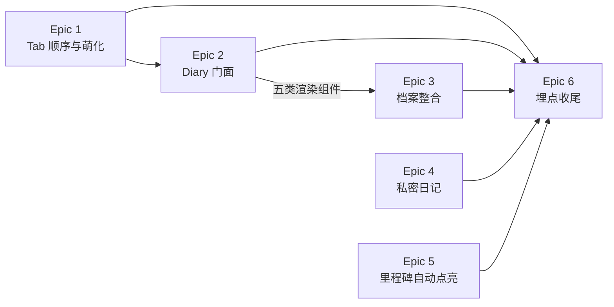

# TailTopia V1.1.2 - Epic Breakdown（Delta）

## Overview

本文件是 V1.1.2 **增量** epic/story 分解，承接 PRD、架构 delta（16 条 AD，权威）、UI 视觉稿（18 屏 / 3 泳道）与跨 story 决策台账。

**V1.0 与 V1.1 已上线冻结；未提及处一律继承。** 冲突序：**架构 delta > 本文件 > PRD > CROSS-STORY-DECISIONS > V1.0/V1.1 基线**。

核心主题 = **信息架构翻转**（Diary 从第 2 位提到第 1 位并成为默认落地页）+ 由此派生的游客体验、时间线整合、内容分发模型三块配套。**零运营后台依赖**，App 端 + 服务端独立交付。

## Requirements Inventory

### Functional Requirements

沿用全局 FR 编号，不重新分配（编号非连续，FR-85 属 V1.1.4）。

- **FR-78**：底部 Tab 顺序与命名变更（覆盖 V1.0.0 FR-19）。顺序改为 成长档案(Diary) / 问诊(**Health**，2026-07-31 由 Konsultasi 改名，见 OQ-19) / [+] / 探索(Discovery) / 我的(Profile)；[+] 仍居中凸起。含**落地 Tab 按用户状态分流矩阵**（游客/A建档/A未建档→Diary；B/C→Discovery；兽医→工作台）、**Diary 主页解除登录门控**（子页仍受控）、[+] 登录后回跳改 Diary、名片深链游客落 Diary 游客态、切回 Diary 自动刷新。
- **FR-78A**：Tab 图标激活态萌化（扩展 icon-system.md）。glyph 主体形状两态一致；激活时转品牌紫 + 柔和圆角高亮底 + 叠加一处宠物特征（猫耳/爪印/尾巴/项圈）+ 一次 ≤150ms 轻弹跳。未选中态维持 ink@55% 描边不变。
- **FR-79**：软性登录触发点拆分。Discovery 保留 V1.0.0 FR-0B「浏览至第 3 页触发软登录推荐」不变；Diary 游客态改为**页面内常驻 CTA**，非滚动触发、非弹层打断。两套机制独立互不依赖。
- **FR-80**：未登录用户的 Diary 引导态（新增）。Hero 时间线预览（示例宠物 Milo，9 条，混排普通内容与特殊内容）+ 情感化标题 + **唯一主 CTA**（进建档流程，文案避免「登录」字样）。**示例样式即真实时间线的样式契约。**
- **FR-81**：已登录未建档用户的 Diary 引导态（新增）。状态 A 未建档 → 复用既有建档引导 FR-0G，不展示 FR-80 种草内容；状态 B/C → 既有「有宠专属 + 修改状态入口」页零改动。**V1.0.0 FR-0H 首页提示条整条废止。**
- **FR-82**：时间线视图整合里程碑与身份证事件（扩展 FR-37 视图一，与 FR-42/FR-45/FR-45B/FR-49 并存不替代）。条目类型从两类扩展为五类；三处已有数据以**只读镜像**形式在主时间线展示；含分类判定顺序、排序规则、交互规则、多源合并分页口径。
- **FR-83**：Diary/Moment 发布与分发模型（覆盖 FR-12 发布、FR-17 Feed 内容模型）。发布页新增「同步到 Moment」开关（**默认开启**）；同步状态发布时一次性确定、**事后不可更改**；Diary↔Moment 为同一条内容（非副本）；Moment/Tips 不可回灌 Diary；**Feed 取消按用户宠物状态过滤**；发布页默认类型有档案 Diary / 无档案 Moment；类型选择器顺序改 Diary/Moment/Tips；存量内容维持公开。
- **FR-84**：日历格子结构化健康记录联动 + 单一优先级显示（覆盖 FR-37 视图二格子规则）。格子改为「三大类取其一、只显一个」；结构化健康记录首次进日历；**修复纯文字日记错显 🏥 的现网缺陷**；当天详情页改为按大类排序（diary > 问诊 > 健康记录）；含图标总表与月经图标改红色实心水滴。
- **FR-86**：健康类里程碑自动达成路径补全（扩展 FR-42）。新增 M9 绝育（健康记录触发）与 M5 第一次看兽医（真人兽医咨询会话结束触发，不含 AI 问诊）；⚠️ **健康类四条（M3/M4/M5/M9）取消打卡路径、改为唯一自动达成**（2026-07-31 拍板，反转 PRD 2026-07-30「两条并存」）；非健康类打卡机制不变；多里程碑同时解锁时庆祝合并只弹一次。**里程碑列表页需隐藏这四条的打卡入口 + 后端显式拒绝健康类打卡请求。**

**2026-08-04 追加（Splash 启动屏改版，PRD §2.6）：**

- **⚠️ FR-78 落地矩阵变更（非新增 FR，是既有 FR 的内容变更）**：**状态 A · 未建档由 Diary 改为 Discovery**。收敛口径：**只有真正建了宠物档案的人才落 Diary，游客是唯一例外**（仍落 Diary 看 FR-80 种草页）。**本条推翻 Story 2-4 已交付实现**（`user_state.dart:45` 须 `'/profile'`→`'/home'`；`test/shared/diary_gating_and_landing_test.dart:247` 断言须同改）。连带：FR-81 建档引导态页面不删不改但**不再是落地页**；架构 **AD-8 第 2 条的矩阵描述已过期**，须回写。
- **FR-87**：原生启动屏与 Flutter 首帧无缝交接（消除白闪）。让原生启动屏成为动画第 0 帧——原生紫底 `#7D45F6` + 白 mark（可视宽 = 屏宽 42%，系统渲染 50% 正中），Flutter 首帧接住**同位同尺寸**再开始变化。**Android 12+ 系统 splash 图标不可定位**，故 Flutter 首帧也必须落 50%、由动效抬到 43%。含原生侧 **7 处**改动（pubspec 底色 / `values-v31` / `values-night-v31` / `background.png` / `android12splash.png` 200→288 / 图形换白 mark / iOS LaunchScreen），改完须重跑 `flutter_native_splash:create` 并**真机分别验浅色与深色**。
- **FR-88**：入场动效重做为「写名字」（方案 B，覆盖 V1.0.0 splash 动效）。三拍：B1 mark 交接（`≈480ms`，50%→43% 同时 `scale 1→.70` / `opacity 1→0`）→ B2 字标逐拍写出（`≈900ms`，母文件 11 条可见路径拆 **9 拍**、每拍 `+85ms`、`blur 4→0` / `y 10→0`，**无需拆资产**）→ B3 终态（`1540ms`，字标可视宽 60% 屏宽 + 标语，**终态不出现 mark**）。总时长定稿 **1.54s**（上限 1.8s）。视觉中心口径改为「**logo 中心**居中，标语不参与居中计算」。reduce-motion 下**直接落终态**、装饰性呼吸光晕**停止**、进度线保留。
- **FR-89**：启动期数据获取与分流时序。三处变更：`/me` 由**串行改并行**（Flutter 首帧 `t≈320ms` 即发起）；超时 **3s → 5s**；**取消「一天一次」动效门控**（`splashLastShownDate`），每次冷启动都播。等待反馈改为「出现即信息」：快网（`/me ≈0.9s`）**看不到任何等待指示**；`1860ms+` 动效播完仍未就绪 → 进度线**此时才出现**；`2290ms+` 再等 430ms → 慢网文字提示淡入（到 5s 兜底跳转，**有 2.7s 可读时间**）。分流出口沿用 FR-78 矩阵（**六出口已由 Story 2-4 实现，本 FR 不重复定义**），优先级 pending 深链 > 落地矩阵。
- **FR-90**：品牌资产、尺寸与字体规范收口。资产换回品牌母文件（mark ← `ICON SVG.svg` Layer_7 紧贴 bbox 导出；字标 ← `FULL LOGO -0624.svg` Layer_9）；**全部尺寸改相对屏宽**（mark 42% / 字标 60% / 光晕 66.7% / 标语 70% / 底部元素 92 起）；**版本号整体移除**；标语字体改 **Fraunces 500**（`opsz` 16 · `SOFT` 100 · `WONK` 1）16px / 1.5 / ls 0 / 白 68%，连带 9 项排版参数全部重调；慢网提示同族 Fraunces（`opsz` 12 / 12.5px / 白 55%）。**结果：splash 只依赖 Fraunces 一款字体。**
- **FR-91**：超时兜底的迟到纠正（**2026-08-04 新增行为，非既有代码修补**）。落地页由「`/me` 超时兜底」产生时，**会话恢复真正完成后必须按真实状态重判落地目标**，不一致则跳到正确目标。7 条硬约束：①仅兜底路径启用 ②以**恢复 future 完成**为时机（非固定延时）③**仅当用户仍停在兜底落地页**才纠正（已自行导航 → 一律不纠正）④只纠正一次 ⑤深链唤起 → 不纠正 ⑥真游客重判结果不变 → 不产生跳转 ⑦**兽医角色隔离守卫保留不动**（安全边界，不可弱化）。埋点要求：兜底落地与纠正落地**各上报一次 T-1**，用 `restore_timeout` / `corrected_from` 区分。

### NonFunctional Requirements

> PRD 无独立 NFR 章节。以下为从 PRD 正文、架构 delta 与既有护栏中**提炼**的非功能要求，均可验收。

- **NFR-1（正确性）**：时间线跨页拉取**无条目丢失、无重复**，含「补记旧日期日记」场景。（AD-1；修的是现网缺陷）
- **NFR-2（正确性）**：时间线条目分类在**查询时实时计算**，不得落库固化；「问诊跳过存档 → 日后补存」不得产生重复条目。（AD-2）
- **NFR-3（安全）**：登录门控安全默认为「拦」。新增任何 `/profile/*` 子页默认受控，放行需显式加入精确例外集（仅接受完整路径字面量，不接受前缀或通配）。继承「安全规则只升不降不可绕过」。（AD-7）
- **NFR-4（隐私正确性）**：`visibility` 过滤**只作用于他人可见视图**；作者自视视图（成长档案时间线 / 日历 / 当天详情 / 我的发布）**必须完整展示含私密内容**。（AD-4）
- **NFR-5（可用性）**：FR-80 游客引导态**零网络依赖**，不得出现白屏或加载态。（AD-13）
- **NFR-6（数据完整性）**：`visibility` 迁移必须在功能开关生效前完成，不接受「先上线再补回填」；存量统一回填 PUBLIC。（AD-4）
- **NFR-7（一致性）**：游客示例时间线与真实时间线**共用同一套条目渲染组件**，禁止两套实现。（AD-13）
- **NFR-8（契约一致性）**：新增/变更的每个对外字段必须**三处同步**（后端 record + App data DTO + 后端契约 test），不同步即视为契约破坏、PR 不绿。（CROSS-STORY C4/C5）
  > ⚠️ **C5 原文写「四处」含 App mock，已过时**——提交 `8e85b40d`「删除全部 mock 子系统，L2 分支恒连真后端」已移除 App mock 层。本版本按**三处**执行；建议一并回写 CROSS-STORY-DECISIONS C5。
- **NFR-9（可访问性 / 动效）**：FR-78A 入场动效 ≤150ms，遵循 icon-system.md 既有 reduced-motion 兜底。
- **NFR-10（架构护栏）**：不引入 MQ / 调度中间件 / 通用缓存层 / 任何新中间件；异步只用 `@Async` + DB 状态机与 `@Scheduled`；`ddl-auto=validate`，schema 归 Flyway。（继承）
- **NFR-11（幂等与护栏）**：里程碑自动完成幂等，重复触发不产生重复完成记录；**健康类四条的打卡请求须在后端被显式拒绝**——仅前端隐藏按钮不合格，接口仍可被直接调用。（AD-11）

**2026-08-04 追加（Splash，编号在本 delta 文档内延续；勿与 V1.0.0 全局 NFR 混淆）：**

- **NFR-12（无缝性）**：原生启动屏 → Flutter 首帧的交接**不得出现底色闪变，也不得出现 mark 的尺寸或位置跳变**，**深色模式同样成立**。这是 FR-87 的验收核心，也是既有缺陷 B-1/B-2 的判定标准。（L2 真机，浅色/深色各验一次）
- **NFR-13（动效上限）**：入场动效总时长 **≤1.8s**（定稿 1.54s）。splash 初始化**不得阻塞首帧**——`Posthog().setup` 一类的三方初始化须带超时上限，卡住不得拖慢 `runApp`。
- **NFR-14（可访问性 / 动效）**：系统「减弱动态效果」开启时**直接落终态、不播入场**；**装饰性**呼吸光晕必须停止（无限动画只允许用于 loading 指示）；**承载真实语义的进度线保留**。
- **NFR-15（正确性）**：**超时兜底不得成为终态。** 会话恢复完成后必须重判落地目标（FR-91）；同时**不得打扰已自行导航离开的用户**——「把正在浏览的人拽走」比落错页更严重，此约束优先级高于「纠正到正确页」。
- **NFR-16（品牌一致性）**：splash **只依赖 Fraunces 一款字体**（版本号移除后不再用 Poppins，标语换字体后不再用 Quicksand）；mark 与字标**必须取自品牌母文件对应图层**，不得沿用现有落后版本资产，也不得自行拼装母文件中不存在的组合（如竖排 lockup）。
- **NFR-17（响应式）**：splash 全部尺寸**相对屏宽**表达，**不得写死绝对像素**——现状 6 个动效路点与光晕直径按 390×844 写死，小屏大屏构图漂移（既有缺陷 B-8）。

### Additional Requirements

**来自架构 delta（16 条 AD 为权威约束，story 须逐条引用）：**

- AD-1 时间线统一游标锚点（事件日期 + 同日排序键；归并后再截断；同日不跨页拆分）
- AD-2 五类分类后端判定、下发 `itemType`、实时计算不落库
- AD-3 Tab 底层索引随视觉顺序重排 —— **附 5 处索引寻址调用点硬性核对清单**
- AD-4 通用 `visibility` 列（PUBLIC/PRIVATE，DEFAULT PUBLIC）+ 作者自视不过滤
- AD-5 埋点集中为一条收尾 story
- AD-6 不取改版前基线 —— 连带三项对比指标不可执行
- AD-7 门控「默认受控 + 精确例外」，两处门控同改
- AD-8 落地 Tab 实时计算不持久化，判定点在 Splash 完成回调
- AD-9 日历后端仅补「当天健康记录条数」一维
- AD-10 当天详情须先补结构化健康记录第三源，再改排序
- AD-11 FR-86 达成路径：`NEUTER→M9` 映射 + 订阅既有 `ConsultClosedEvent` + **健康类四条取消打卡（前端隐藏入口 + 后端拒绝护栏）**
- AD-12 庆祝合并纯前端复用现有单条组件
- AD-13 FR-80 示例数据全部内置 + 共用渲染组件
- AD-14 Diary↔Moment 不建关联表，由 `visibility` 单字段表达
- AD-15 Diary 页根节点状态分支收敛为单一判定入口
- AD-16 时间线与日历分类优先级刻意不对称，不得「对齐」

**来自代码现状核实（架构 delta §1，估工必读）：**

- 时间线翻页缺陷**已在现网**，AD-1 修的是既有 bug → 须配回归测试
- 日历后端五维已存在，实际只缺「是否多条」；纯文字日记错显 🏥 为**纯前端缺陷**
- 登录门控**有两处**（深链前缀匹配 + Tab 点击索引判定），PRD 只覆盖了一处
- FR-86 的**自动路径**落点极小（映射加一行 + 订阅一个已存在事件）；但 2026-07-31 追加的**取消打卡**使其增加了列表页改动与后端拒绝护栏，规模由「极小」上调为「小到中」
- OQ-10 语境感知发布**已部分存在**（bug 20260703-244），需与 FR-83 全局默认合并口径

**来自 CROSS-STORY-DECISIONS（既有契约，不得违反）：**

- **C1**：当前用户资源统一 `/api/v1/me`，不用 `/users/me`
- **C4/C5**：接口契约后端主导；改任一对外 DTO 必须同步**三处**（后端 record + App data DTO + 后端契约 test）（→ NFR-8）。**C5 原文的第四处「App mock」已随 `8e85b40d` 删除 mock 子系统而失效**
- **F9**：`event_date` 与 `created_at` 分离。**Feed / 「我的发布」按 `created_at` 倒序；成长档案时间线 / 日历 / H5 名片按 `event_date`** —— 与 AD-1 的游标选择一致，story 不得混用
- **F13**：加载失败统一口径（重试入口 + 已加载内容保留），覆盖时间线 / 日历 / 当天详情失败态（→ UI 稿 A5 屏）
- **F10**：发布走三方自动审核（文字关键词 + 图像识别 stub），FR-83 发布页改动不得绕过该流程
- **E2**：Flyway 序号按执行顺序单调分配，用 `V<n>__` 占位

**基建 / 迁移：**

- Flyway 现有最高 **V97**，本版本从 **V98** 起顺延
- **唯一 schema 变更**：`content_posts` 新增 `visibility varchar DEFAULT 'PUBLIC'` + 存量回填
- 其余 FR 无 schema 变更：FR-82/84 复用既有表与事件；FR-86 只改监听器映射；FR-78/79/80/81 为前端与路由层
- 无新中间件、无新外部依赖、部署形态不变
- **Splash（FR-87~91）同样零 schema 变更、零后端改动、零新依赖**——全部落在 Flutter 前端 + Android/iOS 原生启动屏配置 + 资产文件

**2026-08-04 追加 · ⚠️ 架构 delta 对 Splash 的覆盖缺口（拆 story 前必须知道）：**

> `architecture-v1.1.2-delta.md` 的 16 条 AD 产出于 2026-07-31，**早于 splash 设计**。核实结果：

- **AD-8 的矩阵描述已过期**：第 2 条写「游客 / 状态 A 已建档 / 状态 A 未建档 → **Diary**」，与 2026-08-04 拍板的新矩阵（A·未建档 → Discovery）冲突。**须回写 AD-8**，否则 story 会照旧 AD 实现。
- **FR-87 / FR-88 / FR-90 / FR-91 无对应 AD**：原生启动屏交接口径、动效分拍与资产导出规格、字体可变轴接入方式、**FR-91 迟到纠正的状态承载位置**（兜底标记存哪、如何判断"用户仍停在兜底落地页"）——这四类技术决策**在架构层没有落点**。
- **判断：FR-87/88/90 的技术细节已由 UI 稿逐项给足（尺寸、时长、轴值、改动清单均为可执行规格），可直接写进 story AC，不阻塞。** 但 **FR-91 是唯一需要架构裁定的一条**——它引入新的启动期状态（"本次落地是兜底产物"）与一次条件跳转，涉及 `app_router.dart` 的 `onComplete` 与 redirect 协作边界，属 AD-8 的延伸。
- **推荐处置**：拆 story 时把 FR-91 的架构口径**在 story 内显式写死**（而非留给 dev 临场决定），并在 Epic 7 完成后回写 AD-8 + 补一条 AD-17 记录 FR-91 口径。**不建议为此单独回跑 `bmad-architecture`**——只有一条决策，回跑一整轮架构流程的开销远大于收益。

**Splash 相关的代码现状核实（估工必读）：**

- **既有缺陷 9 条**（B-1~B-9）已在 PRD §2.6 汇总表逐条列明并映射到 FR。其中 **2 条不需单独修**：B-7（首帧 300ms 空窗）随 C-3 取消门控自然消失；B-6（版本号硬编码 `v 1.0.0`）随 C-6 移除版本号消失。
- **B-4 是「mark 显小」的真正根因**：`mark_dog.svg` 的 `viewBox 0 0 500 500` 但图形只占 `x67–456 / y85–407`，声明 108px 实际可见仅 ~84×70 且右偏 12 / 上偏 4。**单纯调大尺寸会同时放大偏心**，必须换紧贴 bbox 的 `viewBox`。
- **`ensureRestored()` 的 `.timeout()` 只停止等待、不取消底层请求**——恢复完成后会写回 `AuthState` 触发重渲染。**这是 FR-91 存在的技术根因**：兜底态是会变化的中间态，不是终态。
- **已登录用户不受门控 redirect 约束**：`/profile` 的判定条件是 `!auth.isLoggedIn && controlled`，故 A·未建档与 B/C 落错后**无任何机制纠正**；兽医能自愈仅因额外享有角色隔离守卫（`if (auth.isVet)`）。
- **`fontVariations` 机制本仓库已验证**：`splash_page.dart` 里 Quicksand 即用 `fontVariations: [FontVariation('wght', 600)]` 设置，Fraunces 需设 4 个轴，无新机制风险。
- **字体可重度子集化**：标语仅 ID / EN 两条静态字符串，设计稿内联子集 **37KB**（含大小写全集），无需打包完整可变字体（约 120KB）。

### UX Design Requirements

来源：`v1.1.2/ui-v1.1.2.html`，**18 屏 / 3 条泳道**。每屏图注标注对应 FR 与真实代码文件。

**泳道 1 · 底部 Tab（T1–T3，对应 FR-78/79/78A）**

- **UX-DR1**（T1）：底部 Tab 5 位重排渲染 —— Diary / **Health** / [+] / Discovery / Me；[+] 保持居中凸起 FAB，视觉形态与协议尺寸不变。稿中含变更前/后对照。
- **UX-DR2**（T2）：Discovery 浏览至第 3 页触发软登录推荐浮层 —— **维持 V1.0.0 FR-0B 现状不变**，本屏为回归基准，不是新设计。
- **UX-DR3**（T3）：Tab 激活态萌化「方案A」—— 每 Tab 未选/激活两态对照。glyph 尺寸与形状两态一致；激活时 ①glyph 转品牌紫 + 柔和圆角高亮底 ②叠加一处宠物特征（Diary=书+猫耳；其余按稿）③一次 ≤150ms 轻弹跳。**即替换 pop-art 错位投影**，需回改 V1.0.0 `icon-system.md` 激活态规范。

**泳道 2 · 成长档案 Diary（A1–A9·A2b，对应 FR-80/81/82/84）**

- **UX-DR4**（A1）：游客态 Diary（未登录默认落地）—— Hero 示例时间线 + 情感化标题 + 唯一主 CTA。**含真实 Diary 页头**：编辑入口 + 健康记录卡 + 身份证图标按钮 + 个性签名行（**结构以现网为准**：身份证是 38×38 纯图标按钮、无编号；UI 稿画的「Kartu Identitas #00842」卡片作废）。示例宠物为**猫 Mochi**；9 条中**仅 3 条带图**（#3 玩水 / #7 深夜 / #8 晒太阳），其余 6 条为默认卡片无需配图。3 条带图内容**游客可无登录查看详情**。
- **UX-DR5**（A2）：状态 A 已登录未建档引导态。
- **UX-DR6**（A2b）：状态 B/C 的 Diary 非落地态 —— 既有页面，**零改动**，本屏为回归基准。
- **UX-DR7**（A3）：真实时间线正常态（已建档），含与 A1 一致的页头结构。
- **UX-DR8**（A4）：真实时间线近空态（刚建档，条目极少）。
- **UX-DR9**（A5）：时间线加载失败 / 重试态 —— 按 F13 统一口径（重试入口 + 已加载内容保留）。
- **UX-DR10**（A6）：**时间线 5 类条目视觉样式基准（组件规格屏）** —— ①普通照片卡（无徽章）②照片卡 + 右上角金色徽章角标 ③横向通栏庆祝 banner（图标 + 大字，无需照片）④胶囊/标签式条目（图标 + 一行字，明显小于照片卡）⑤独立证件卡样式（圆角 + 证件质感 + 照片/名字/编号排版）。**这是 NFR-7 共用渲染组件的样式契约来源。**
- **UX-DR11**（A7）：日历月视图 —— Material 轮廓图标体系；格子按大类优先级只显一个标记；**纯文字日记格子**（通用 diary 标记 `edit_note_outlined`）；月经改红色实心水滴 `water_drop`；当天多条结构化记录用通用医疗箱 `medical_services_outlined`。
- **UX-DR12**（A8）：当天详情页 —— 按大类排序 diary > 问诊 > 健康记录，类内按时间。
- **UX-DR13**（A9）：问诊未存档时的里程碑呈现 —— M5 落为类③通栏 banner；补存后由类④胶囊承载、banner 不再单出（AD-2 实时计算的可视化验收屏）。

**泳道 3 · 内容发布模型（P1–P4·P1b，对应 FR-83）**

- **UX-DR14**（P1）：发布页默认 Diary、同步开关**默认开启**。含「Untuk: {宠物名}」归属行；开关副文案说明「保存在 Diary 且展示在探索」；主按钮为 **Bagikan（分享）**。
- **UX-DR15**（P1b）：无宠物档案时发布页默认 Moment；Diary 选项维持灰置与「需先创建宠物档案」提示。
- **UX-DR16**（P2）：Diary + **手动关闭同步** —— 开关关闭后主按钮文案由 **Bagikan（分享）变为 Simpan（保存）**。⚠️ 该文案联动**PRD 未提及**，为 UI 稿独有要求，须落 AC。
- **UX-DR17**（P3）：选中 Moment 时**不出现同步开关**；显示「🌐 公开发布，展示在探索」提示。
- **UX-DR18**（P4）：「我的」页私密 Diary 与公开内容的视觉区分 —— 按真实 `me_page` 重画，含 ProfileHeadCard、AKTIVITAS 入口组、POSTINGANKU 列表。**作者可见自己全部 Diary（含未同步），需与公开内容有明确区分标识。**
- **UX-DR19**（横切）：类型选择器排列顺序调整为 **Diary / Moment / Tips**（现状为 Moment / Tips / Diary）。

**泳道 4 · Splash 启动屏（2026-08-04 追加，对应 FR-87~FR-91）**

来源：`ui-splash-redesign-integrated-v1.html`（整合稿 v2，**14 屏 / 4 条泳道**）+ 逐屏 PNG `.shots-splash/` + `.decision-log.md`。
⚠️ **该稿目前只在源目录，尚未归档进仓库**——与 `ui-v1.1.2.html` 的处置方式不一致，见下方缺口提示。

- **UX-DR20**（S1）：原生启动屏新规格 —— 紫底 `#7D45F6` + **白 mark**，可视宽 = 屏宽 42%，系统渲染在 50% 正中。mark 取 `V1.0.0/ICON SVG.svg` 的 `Layer_7`，导出用紧贴 bbox 的 `viewBox 67.23 84.79 389.32 321.81`。
- **UX-DR21**（S2）：Flutter 首帧「接住」 —— 与 S1 **同位同尺寸**，仅多一层呼吸光晕；此帧同时发起 `/me`。**交接不可感知**是本屏唯一验收标准。
- **UX-DR22**（T3）：尺寸规格总表 —— 视觉中心 43% 改为「**logo 中心**居中、标语不参与计算」；mark 42% / 字标 60% / 光晕 66.7% / 标语 70% 屏宽；底部元素自 92 起、进度线与慢网提示同一容器；**猫跑屏 6 个绝对像素路点整段删除**；版本号移除。
- **UX-DR23**（T4）：原生启动屏改动清单 —— 7 处（含深色模式 `values-night-v31` 与 `android12splash.png` 288×288）。改完须重跑 `flutter_native_splash:create` 并**真机分别验浅色 / 深色**。
- **UX-DR24**（B1）：mark 交接拍 —— `≈480ms`，从 50% 抬到 43% 同时 `scale 1→.70` / `opacity 1→0`。**一段位移同时完成「就位」与「让位」两件事。**
- **UX-DR25**（B2）：字标逐拍写出 —— 母文件 11 条可见路径（T 与猫尾合并为一条、2 条动感短划、`a i l t o p i a` 各一条）拆 **9 拍**，每拍 `+85ms`，`blur 4→0` / `y 10→0`。**无需拆分资产。**
- **UX-DR26**（B3）：终态 —— `1540ms`，字标可视宽 60% + 标语，**终态不出现 mark**（品牌母文件无竖排 lockup，现状那个组合属实现期自行拼装）。
- **UX-DR27**（C1）：等待就绪进度线 —— `1860ms+` 动效播完仍未就绪才出现。**容器高度预留，出现/消失不引起布局位移。** 替换现状那个从头转到尾的假 spinner。
- **UX-DR28**（C2）：慢网提示 —— `2290ms+`（进度线后再 430ms）淡入，到 5s 兜底跳转，**2.7s 可读时间**。文案 `Koneksi kamu lambat, tunggu sebentar…` 为占位（OQ-22）。**快网用户永远看不到这行字。**
- **UX-DR29**（C3）：reduce-motion 静态终态 —— 直接落终态不播入场；**呼吸光晕停在中间值不呼吸**；**进度线保留**（承载真实语义）。
- **UX-DR30**（F1）：标语字体定稿 —— Fraunces 500 · `opsz` 16 / `SOFT` 100 / `WONK` 1，16px / 1.5 / ls 0 / 白 68% / 屏宽 70% 自动换行**两语言一致**（删除 `app_id.arb:714` 硬编码 `\n`）；`.tagpad` 61→72px 保证 logo 中心仍落 43%。慢网提示同族 `opsz` 12 / 12.5px / 白 55%。
- **UX-DR31**（无对应屏 · 行为规格）：**FR-91 迟到纠正的可见表现** —— 纠正发生时用户会看到一次页面跳转（Diary 种草页 → Discovery / 工作台）。**稿件未画此过场**；产品已接受「一次可见跳变优于停在无效页」，但**是否需要过渡动画由 UX 补充决定**，story 内先按「无特殊过场，等同普通路由跳转」实现。

> **⚠️ 归档缺口（拆 story 前建议处理）**：`ui-splash-redesign-integrated-v1.html`（156KB）与 `.shots-splash/`（29 项）目前**只在源目录 `/Users/hexsfile/work/MY-PROJECT/Pet Project/TailTopia/V1.1.2/`**，未随仓库 commit。按 README §1 既定处置（整合稿归档、逐屏 PNG 不归档以免仓库膨胀），**应把 `ui-splash-redesign-integrated-v1.html` 归档为 `v1.1.2/ui-splash-v1.1.2.html`**，否则云端 session 与后续 dev agent 读不到 splash 视觉稿，UX-DR20~30 的规格无从核对。

> **不含 UI 的需求**：FR-86 为 App 内部逻辑变更，里程碑列表页与庆祝弹层均复用现状，UI 稿明确不含对应屏。

### FR Coverage Map

按 FR 逐条核对归属，**14 条 FR + 埋点章节全部有主，无遗漏、无重复**（2026-08-04 由 9 条增至 14 条）。

| FR | Epic | 说明 |
|---|---|---|
| FR-78（Tab 顺序与命名） | **Epic 1** | 视觉顺序 + 底层索引重排（AD-3） |
| FR-78（门控解除 / 落地页矩阵 / 连带调整） | **Epic 2** | 与游客态同批交付，否则中间态是坏的 |
| FR-78A（激活态萌化） | Epic 1 | 与 Tab 顺序同改一批文件，合并避免文件反复改动 |
| FR-79（软性登录触发点拆分） | Epic 2 | Diary 侧常驻 CTA 落在 2-3；Discovery 侧维持现状（回归基准） |
| FR-80（游客引导态） | Epic 2 | 五类条目渲染组件在此建立，Epic 3 复用 |
| FR-81（未建档引导态 + 废止 FR-0H） | Epic 2 | |
| FR-82（时间线五类整合） | **Epic 3** | |
| FR-83（Diary/Moment 同步开关） | **Epic 4** | 本版本唯一 schema 变更 |
| FR-84（日历联动 + 当天详情） | Epic 3 | 与 FR-82 共用 `TimelineService`，同 Epic 避免文件churn |
| FR-86（健康里程碑仅自动达成） | **Epic 5** | |
| PRD §3 埋点 T-1~T-4 / T-6~T-12 | **Epic 6** | T-5 已删 |
| **FR-78（落地矩阵变更：A·未建档 → Discovery）** | **Epic 7** | 2026-08-04 变更。代码点是 Story 2-4 的两行返工，但成因与验收归 Epic 7 —— **由 Story 7-4 负责改**，2-4 不再动 |
| **FR-87（原生启动屏无缝交接 / 消白闪）** | **Epic 7** | 含深色模式白闪与 Android 12 图标规范两个既有缺陷 |
| **FR-88（入场动效「写名字」）** | **Epic 7** | 终态不出现 mark；删除写死绝对像素路点 |
| **FR-89（启动期时序与等待反馈）** | **Epic 7** | `/me` 并行 + 5s + 取消门控 + 进度线 + 慢网提示 |
| **FR-90（品牌资产 / 尺寸 / 字体收口）** | **Epic 7** | 资产部分由 7-1 前置交付（原生交接依赖它） |
| **FR-91（超时兜底迟到纠正）** | **Epic 7** | 本版本唯一需架构裁定的新行为；口径在 Story 7-4 内写死 |

**FR-78 是唯一被拆到两个 Epic 的需求**，因为它同时包含耦合度不同的两件事：视觉顺序可独立上线；门控解除必须与游客态绑定交付。

**NFR 归属**：NFR-1/2 → Epic 3；NFR-3 → Epic 2；NFR-4/6 → Epic 4；NFR-5/7 → Epic 2（建组件）+ Epic 3（复用）；NFR-8 → 凡新增对外字段的 story（3-2 / 3-4 / 4-1）；NFR-9 → Epic 1；NFR-10 → 全局；NFR-11 → Epic 5。

**UX-DR 归属**：UX-DR1~3 → Epic 1；UX-DR4~6 → Epic 2；UX-DR7~13 → Epic 3（其中 UX-DR10 组件规格由 Epic 2 的 2-3 落地）；UX-DR14~19 → Epic 4；**UX-DR20~31 → Epic 7**（2026-08-04 追加）。

**2026-08-04 追加的归属**：FR-87~FR-91 → **Epic 7**；NFR-12~17 → Epic 7；**FR-78 落地矩阵变更**跨 Epic 2 与 Epic 7 —— 代码改动点（`user_state.dart:45` + 对应断言）属 **Story 2-4 的返工**，但**变更成因与新增的 FR-91 纠正机制属 Epic 7**，拆 story 时须显式指明由哪一条 story 负责改那两行，避免两边都以为对方会改。

## Epic List

共 **6 个 Epic / 15 条 story**。每个 Epic 均可独立上线，Epic 间只有向后依赖。

### Epic 1: 底部 Tab 换新顺序与萌化激活态

用户打开 App，底栏顺序变为 Diary / Health / [+] / 探索 / 我的；点中的标签变品牌紫并冒出一处宠物特征。落地页与登录门控此时不动，单独发布也是自洽的。
**FRs covered:** FR-78（顺序与命名部分）、FR-78A

### Epic 2: Diary 成为所有人的门面

冷启动按用户状态落到对应 Tab；**游客无需登录即可看到一本示例成长本并被种草**；已登录未建档的用户看到建档引导。门控解除与游客态同批交付，无中间坏态。
**FRs covered:** FR-78（门控解除 / 落地页矩阵 / 连带调整）、FR-79、FR-80、FR-81

### Epic 3: 成长档案整合成一本完整的册子

用户翻自己的时间线能看到里程碑、健康记录、身份证，不必在四个页面间跳转；日历格子显示结构化健康记录，纯文字日记不再错显医院图标。同时修复时间线翻页的现网缺陷。
**FRs covered:** FR-82、FR-84

### Epic 4: 日记可以只留给自己

用户发日记时可一键关闭「同步到 Moment」，变成纯私人记录；「我的」页能分清哪些是私密的。默认行为与现状一致，老用户无感知。
**FRs covered:** FR-83

### Epic 5: 健康里程碑改为只能自动点亮

录完疫苗 / 驱虫 / 绝育记录，或看完一次真人兽医，对应里程碑自动点亮。**这四条不再能靠发日记打卡解锁**——打没打疫苗是客观事实。其它里程碑的打卡方式不受影响。
**FRs covered:** FR-86

### Epic 6: 改版效果可度量

补齐 11 项埋点（含 PRD 点名的 P0 缺口：底部 Tab 切换目前完全无埋点）。**面向产品团队的价值，非终端用户价值**；排在最后，依赖全部功能落地。
**FRs covered:** PRD §3 数据埋点需求（T-1~T-4、T-6~T-12）

### 共享件归属总表（2026-08-03 全量扫描结论）

本版本有 7 处「多条 story 共用同一件东西」。**共享件必须有唯一定义方，其余 story 只采纳、不重造**——这是本轮 story 校验中反复出现的问题来源。

| # | 共享件 | 定义方 | 采纳方 | 写歪了会怎样 |
|---|---|---|---|---|
| 1 | **五类条目 tile 组件** | 2-2 | 3-3 | 各写一套 → 游客看到的与注册后拿到的不是一个东西，FR-80 承诺落空（NFR-7） |
| 2 | **tile 的点击回调接口** | 2-2（留口） | 3-3（注入真实跳转） | 跳转写死在组件里 → 游客态只能另写一套 tile，NFR-7 破功 |
| 3 | **Diary 页头组件** | 2-2 | 3-3 | 同 #1：真实态页头要求与游客态一致，内联布局会迫使 3-3 再写一遍 |
| 4 | **`itemType` 五值词表** | 2-2（前端定义） | 3-2（后端采纳）/ 3-3 / 6-1 | 前后端各定一套 → 契约对不上 |
| 5 | **健康类里程碑 code 集合 {M3,M4,M5,M9}** | 5-1 | 5-2（护栏 + 候选过滤）/ 6-1（T-12 校验） | 三处各写一份 → 日后增减健康类里程碑漏改，护栏出洞 |
| 6 | **健康类型图标常量表** | 先落地者建（2-2 类④ 或 3-4） | 3-4（权威落地：日历 + 健康记录列表页） | 两份表 → 改一处漏一处，日历与列表页图标不一致 |
| 7 | **用户状态六态判定** | 2-4（落地矩阵） | 6-1（埋点 `user_state`） | 各写一份 → 埋点口径与实际分流不一致，数据不可信 |
| 8 | **失败态组件（F13 口径）** | 3-3 | 3-4（日历 + 当天详情） | 各写一套失败态 → 体验不一致 |
| 9 | **免门控 Tab 白名单** | 1-1（去索引化建立） | 2-4（扩容加 Diary） | 两条 story 重复认领 → 后做的那条以为已完成，无人负责 |
| 10 | **Diary 页状态分发入口** | 2-1 | 2-2 / 2-3（各填一支） | 各自加判断 → 互相覆盖或漏状态组合（AD-15） |
| 11 | **建档引导入口函数** | 2-2 | 2-2 AC8 的三个触发点 / 2-3 | 多套跳转逻辑 → 埋点来源统计碎裂 |
| 12 | **`visibility` 的 App data DTO 镜像** | 4-1 | 4-2（直接使用） | 归属含糊 → 两条都不做，4-1 的契约同步 AC 落空 |

### Epic 依赖关系

- **Epic 1 → Epic 2**：Tab 先重排，落地页矩阵才有落点
- **Epic 2 → Epic 3**：五类条目渲染组件在 2-3 建立（NFR-7 要求共用，禁止两套实现）
- **Epic 4 / Epic 5 完全独立**，可与前三个并行推进
- **Epic 6 最后**（AD-5 用户决定）

**2026-08-04 追加 · Epic 7（Splash 启动屏）**

### Epic 7: 冷启动第一眼就是品牌，而不是一次白闪

用户每次冷启动看到的第一屏：不再闪白，紫底上品牌名一笔一笔写出来，等待有真实反馈，最后落在**正确**的 Tab 上。

**FRs covered:** FR-87, FR-88, FR-89, FR-90, FR-91, 以及 **FR-78 落地矩阵变更**
**NFRs covered:** NFR-12~17　**UX-DRs covered:** UX-DR20~31

**为什么是一个 Epic 而不是拆成几个**（设计原则 6）：全部改动集中在同一组文件——`splash_page.dart`、`app_router.dart`、`android/` 与 `ios/` 的启动屏配置、`assets/brand/`、`app_id.arb`。拆成多个 Epic 会让同一批文件被反复改动，属典型的 file churn 反模式。故收敛为一个 Epic、内部按依赖排序。

**Epic 内部顺序（刻意为之，勿调换）：**

| Story | 内容 | 为什么必须在此位置 |
|---|---|---|
| **7-1** | 品牌资产重导 + 原生启动屏交接（消白闪） | **资产是一切的前提**——原生启动屏与 Flutter 首帧都要用紧贴 bbox 的白 mark。资产不先换，后面两个 story 都在错资产上做 |
| **7-2** | Splash 视觉与动效整体重做 | 依赖 7-1 的资产。**终态与通往终态的动效必须同批**——只改终态不改动效，会出现「旧动效以 mark 收尾、新终态没有 mark」的破损中间态 |
| **7-3** | 启动期时序与等待反馈 | 依赖 7-2 的动效时长（1.54s）才能定进度线出现时机（1860ms）与慢网阈值（2290ms） |
| **7-4** | 落地分流收口（矩阵变更 + 迟到纠正） | 依赖 7-3 建立的 5s 兜底路径。**排最后**，避免与外部窗口正在跑的 Story 2-4 code-review 撞车 |

**Epic 7 可独立上线自洽**：不依赖 Epic 1~6 中任何未完成项。反向也成立——Epic 1~6 不依赖 Epic 7。唯一交叉点是 FR-78 落地矩阵，已明确划归 Story 7-4，**Story 2-4 不再动那两行**。

**⚠️ Epic 7 完成后的收尾动作**（不属任何单个 story，Epic 级）：回写架构 delta 的 **AD-8**（矩阵描述已过期）并**补 AD-17** 记录 FR-91 的口径（兜底标记的承载位置、"用户是否仍停在兜底落地页"的判定方式）。

---

## Epic 1: 底部 Tab 换新顺序与萌化激活态

用户打开 App，底栏顺序变为 Diary / Health / [+] / Discovery / Me；点中的标签变品牌紫并冒出一处宠物特征。落地页与登录门控此时不动，单独发布也是自洽的。

**FRs：** FR-78（顺序与命名部分）、FR-78A ｜ **NFR：** NFR-9 ｜ **UX-DR：** 1、2、3 ｜ **AD：** AD-3

### Story 1.1: 底部 Tab 顺序与底层索引重排

As a TailTopia 用户,
I want 打开 App 时底栏第一个就是我的宠物成长档案,
So that 这个 App 给我的第一印象是「记录工具」而不是「信息流」.

**Acceptance Criteria:**

**AC1（L2 视觉 · UX-DR1）**
**Given** 用户打开 App
**When** 查看底部 Tab Bar
**Then** 5 个位置依次为 Diary / Health / [+] / Discovery / Me
**And** [+] 仍为居中凸起 FAB、视觉形态与协议尺寸与改版前一致
**And** Discovery 的内容与浏览逻辑不变、仅位置与名称变化

**AC2（L0）**
**Given** 底层索引须与视觉顺序一致（AD-3 Rule 1）
**When** 检查 Tab 枚举顺序、`StatefulShellRoute` 分支声明顺序、`_tabLocations` 路径映射数组
**Then** 三处顺序严格一致且与视觉顺序相同
**And** 不存在「索引顺序 ≠ 视觉顺序」的残留

**AC3（L0，硬性核对清单）**
**Given** AD-3 Rule 2 列出的 5 处按索引寻址调用点
**When** 逐条核对
**Then** 每一处都已确认并在 Completion Notes 中逐条打勾：① 免门控 Tab 判定**去索引化**——改为按 Tab 语义判定，但**免门控集合此时仍为 `{Discovery}` 不变**（扩为 `{Discovery, Diary}` 归 Story 2.4，本 story 不得提前放行）② [+] 预选 Diary 判定指向重排后分支 ③ `_tabLocations` 数组与新分支顺序对应 ④ `BottomTabBar` 渲染对应 ⑤ `StatefulShellRoute` 分支声明顺序
**And** 遗漏任意一处即本 AC 不通过

**AC4（L0）**
**Given** 登录后回跳与推送深链现状按路径寻址
**When** 完成索引重排
**Then** 二者仍按路径寻址
**And** 未因重排引入任何按索引寻址的新代码（AD-3 Rule 3）

**AC5（L1 回归）**
**Given** 本 story 不改门控与落地页（归 Epic 2）
**When** 游客点击各 Tab、以及冷启动
**Then** 门控行为与落地页目标与改版前完全一致
**And** 无中间态破损

### Story 1.2: Tab 激活态萌化「方案A」

As a TailTopia 用户,
I want 点中的标签有一点宠物感的小变化,
So that 这个 App 摸起来像是给宠物用的，而不是一个通用工具.

**Acceptance Criteria:**

**AC1（L2 视觉 · UX-DR3）**
**Given** UI 稿 T3 屏「方案A」
**When** 用户点击任一 Tab
**Then** 该 Tab 的 glyph 尺寸与形状两态一致（用户靠形状辨识 Tab，不改变辨识锚点）
**And** glyph 转品牌紫 + 出现柔和圆角高亮底
**And** 叠加一处宠物特征装饰（Diary = 书 + 猫耳，其余按 T3 稿）
**And** 未选中态维持 ink@55% 描边不变

**AC2（L2 视觉 · NFR-9）**
**Given** 激活入场动效
**When** 切换 Tab
**Then** 播放一次轻弹跳，时长 ≤150ms
**And** 系统开启「减少动态效果」时按 `icon-system.md` 既有 reduced-motion 兜底降级

**AC3（L0）**
**Given** 方案A 为「替换」V1.0.0 pop-art 激活态（紫实心 + 红 (3,3) 错位投影）
**When** 实现完成
**Then** 错位投影不再出现在 Tab 激活态
**And** `icon-system.md` 的激活态规范已同步回改
**And** PRD OQ-13 标记为已闭合

**AC4（L0）**
**Given** 本 story 为纯视觉层
**When** 实现完成
**Then** Tab 顺序、路由、登录门控、落地页逻辑均无改动

---

## Epic 2: Diary 成为所有人的门面

冷启动按用户状态落到对应 Tab；游客无需登录即可看到一本示例成长本并被种草；已登录未建档的用户看到建档引导。

**⚠️ Story 顺序刻意如此**：先建页面、最后解门控。反过来（先解门控）会出现「游客能进 Diary 但游客页还没做」的破损中间态。

**FRs：** FR-78（门控 / 落地页 / 连带调整）、FR-79、FR-80、FR-81 ｜ **NFR：** NFR-3、5、7 ｜ **UX-DR：** 4、5、6 ｜ **AD：** AD-7、AD-8、AD-13、AD-15

### Story 2.1: Diary 页状态分支单一入口

As a 开发者,
I want Diary 页的四种用户状态由一处统一分发,
So that 后续两条 story 各自往里加分支时不会互相覆盖或漏掉状态组合.

**Acceptance Criteria:**

**AC1（L0）**
**Given** AD-15 要求状态分支收敛为单一判定入口
**When** 进入 Diary 页
**Then** 存在唯一一处按序判定并分发的入口，四个分支互斥且穷尽：游客（未登录）/ 状态 A 未建档 / 状态 A 已建档 / 状态 B·C
**And** 页面其它位置不得再出现独立的用户状态判断

**AC2（L0）**
**Given** 本 story 只立骨架
**When** 实现完成
**Then** 「状态 A 已建档」分支渲染现有真实档案页（零改动）
**And** 「状态 B·C」分支渲染 V1.0.0 既有「有宠专属 + 修改宠物状态入口」页（零改动，UX-DR6 为回归基准）
**And** 游客与「状态 A 未建档」两个分支为占位，由 2.2 / 2.3 填充

**AC3（L1 回归）**
**Given** 门控此时尚未解除
**When** 游客尝试进入 Diary
**Then** 仍按现状被拦截
**And** 已登录用户的 Diary 体验与改版前完全一致

### Story 2.2: 游客引导态与五类条目渲染组件

As a 还没注册的访客,
I want 一打开 App 就看到一本别人家宠物的成长本长什么样,
So that 我会想「我也想给我家宠物记一篇」，而不是先被要求登录.

**Acceptance Criteria:**

**AC1（L2 视觉 · UX-DR4）**
**Given** UI 稿 A1 屏
**When** 游客进入 Diary
**Then** 页面自上而下为：真实 Diary 页头（编辑入口 + 健康记录卡 + 身份证图标按钮 + 个性签名行；**结构以现网为准**——身份证是 38×38 纯图标按钮、无标题无编号，UI 稿画的「Kartu Identitas #00842」卡片作废）、Hero 示例时间线、情感化标题与一句话说明、唯一主 CTA
**And** 主 CTA 文案不出现「登录」字样，点击进入 V1.0.0 既有建档引导流程（FR-0G）
**And** 页面不含「已有账号？登录」次要入口（2026-07-30 已删）

**AC2（L2 视觉）**
**Given** 示例时间线为 9 条（PRD FR-80 示例表）
**When** 游客浏览
**Then** 9 条按表定义的顺序与类别渲染，混排普通内容与特殊内容
**And** 内容明确标示为示例（非真实数据）

**AC3（L0 · NFR-7 · UX-DR10 · AD-13 Rule 4，本 story 的核心交付物）**
**Given** 游客示例与真实时间线必须共用同一套条目渲染组件
**When** 实现完成
**Then** 存在一套统一的五类条目渲染组件，按 UI 稿 A6 屏的样式基准实现：① 普通照片卡（无徽章）② 照片卡 + 右上角金色徽章角标 ③ 横向通栏庆祝 banner ④ 胶囊/标签式条目 ⑤ 独立证件卡样式
**And** 该组件的输入为携带 `itemType` 标识的条目数据，不关心数据来源
**And** ⚠️ **组件只渲染、不持有跳转**，点击回调由调用方注入——游客态点 banner 弹建档引导、真实态跳里程碑列表，语义不同；写死跳转会迫使游客态另写一套 tile，NFR-7 破功
**And** ⚠️ **本 story 同时定义 `itemType` 的五个取值词表**（UPPER_SNAKE，与 PRD 五类一一对应），作为前后端共同契约；Story 3.2 的后端实现**必须采纳该词表，不得另立一套取值**
**And** 游客态通过内置常量数据喂给该组件，**未另写一套渲染**
**And** Epic 3 的真实时间线将复用同一组件

**AC4（L0 · NFR-5 · AD-13）**
**Given** 游客态为 App 门面
**When** 设备处于飞行模式 / 无网络
**Then** 页面完整渲染，不出现白屏、loading 态或错误态
**And** 9 条文案走现有双语文案体系、9 张图为 App 内置资源
**And** 游客态**不调用**任何需要宠物档案的后端接口

**AC5（L0 · FR-79）**
**Given** FR-0B 软登录浮层不适用于 Diary 游客态
**When** 游客在 Diary 页滚动
**Then** 不触发任何滚动式或弹层式登录推荐
**And** 登录引导仅由页面内常驻主 CTA 承担
**And** Discovery 侧 FR-0B「浏览至第 3 页触发」逻辑完全不变（UX-DR2 为回归基准）

**AC7（L0 可验证性说明）**
**Given** 门控在 Story 2.4 才解除，本 story 完成时游客尚无法从 Tab 走到该页
**When** 验收本 story
**Then** 通过 Story 2.1 的状态分发入口直接构造游客分支进行验收（widget test + debug 路由），不依赖门控解除
**And** 真实游客可达性由 Story 2.4 交付，本 story 不得为了自测而提前放行门控

**AC8（L2，2026-08-03 新增）**
**Given** 游客在示例时间线上点击条目
**When** 点击 3 条带图内容
**Then** 直接进入示例内容详情，**无需登录**，内容全部来自内置常量、零网络请求
**When** 点击其余 6 条（banner / 胶囊 / 证件卡）
**Then** 触发主 CTA 的建档引导；**不得**跳转里程碑列表 / 健康记录列表 / 身份证页（均为受控页，会在种草页中间弹登录框）
**When** 在示例详情页点击点赞 / 评论 / 举报
**Then** 三者正常展示，点击任意一个均触发建档引导
**And** ⚠️ 示例详情**不得**挂在 `/profile/...` 前缀下（AD-7 会拦截），**不得**复用 `/content/:id`（示例无后端 ID → 404）

**AC6（占位允许）**
**Given** OQ-1 印尼语文案与 Milo 配图素材尚未到位
**When** 本 story 实现
**Then** 允许使用占位文案与占位图完成全部结构与样式
**And** 素材到位后仅需替换资源，不需改结构

### Story 2.3: 已登录未建档用户的建档引导态

As a 已登录但还没填宠物档案的用户,
I want 打开 Diary 直接看到建档引导,
So that 我不用再被当成新访客重新种一次草.

**Acceptance Criteria:**

**AC1（L2 视觉 · UX-DR5）**
**Given** 用户为状态 A（已回答「我有宠物」）且未建档
**When** 进入 Diary
**Then** 走 2.1 分发入口的对应分支，复用 V1.0.0 既有宠物档案创建引导（FR-0G，可跳过）
**And** 不展示 FR-80 的预览种草内容

**AC2（L1）**
**Given** 用户为状态 B / C
**When** 主动点进 Diary
**Then** 展示 V1.0.0 既有「有宠专属 + 修改宠物状态入口」页
**And** 不引导建档、页面零改动

**AC3（L0 · FR-81）**
**Given** V1.0.0 FR-0H「首页宠物档案提示条（前 3 次重启显示）」整条废止
**When** 实现完成
**Then** 该提示条不再实现、Discovery 顶部不再预留其区域
**And** 其曝光 / 点击 / 关闭埋点事件已移除
**And** 状态 A 未建档用户的建档引导渠道收敛为唯一一条（本 story 的 Diary 分支）

### Story 2.4: 登录门控解除与落地 Tab 矩阵

As a 还没注册的访客,
I want 打开 App 直接就能看到成长档案，点标签也不被弹登录框,
So that 我能先看看这个 App 是干什么的，再决定要不要注册.

**Acceptance Criteria:**

**AC1（L1 · AD-7 Rule 1）**
**Given** 深链门控按路径前缀匹配（`_controlledLocations`）
**When** 解除 Diary 主页门控
**Then** 采用「默认受控 + 精确例外」：前缀匹配保持默认拦截，另设精确例外集仅放行 `/profile` 本身
**And** 建档 / 编辑档案 / 当天详情 / 里程碑列表等全部子页面自动继续受控，无需逐个登记
**And** 例外集只接受完整路径字面量，不接受前缀或通配

**AC2（L1 · AD-7 Rule 2，PRD 未覆盖的第二处门控）**
**Given** Tab 点击门控现按「索引 == 免门控 Tab 索引」判定
**When** 实现完成
**Then** 改为按 Tab 语义的免门控白名单 `{Discovery, Diary}`
**And** 游客点击 Diary 标签直接进入，不弹登录框
**And** Health / [+] / Me 三者对游客维持受控不变

**AC3（L0 安全回归 · NFR-3，双向）**
**Given** 安全默认不可反转，且门控须双向正确
**When** 新增任意 `/profile/*` 子页
**Then** 其默认状态为受控
**And** **拦截方向**存在测试锁定：游客访问 `/profile/create`、`/profile/edit`、当天详情、里程碑列表均被拦截
**And** **放行方向**存在测试锁定（2026-08-03 新增）：`/profile` 主页放行；**Story 2.2 AC8 的示例内容详情对游客可达、不被任何门控拦截**
**And** **不得**为放行示例详情而扩大 `/profile/` 例外集——那会连带放行真实子页

**AC7（L1/L2，2026-08-03 新增 · Epic 2 收口验收）**
**Given** 本 Story 是门控真正打开的那一刻
**When** 用未登录设备走完整链路
**Then** 冷启动 → 落地 Diary 游客态 → 浏览 9 条示例 → 点 3 条带图内容之一 → 看到示例详情 → 返回
**And** 全程不出现任何登录框、不出现任何拦截重定向
**And** 点其余 6 条 / 详情页互动按钮 → 正常触发建档引导（期望行为，不算拦截）
**And** 示例详情零网络请求

**AC4（L1 · AD-8）** ⚠️ **矩阵部分已于 2026-08-04 被 Story 7.4 取代**
**Given** 落地 Tab 按当前用户状态实时计算
**When** 冷启动完成
**Then** ~~分流为：游客 → Diary 游客态；状态 A 已建档 → Diary；**状态 A 未建档 → Diary 建档引导**；状态 B/C → Discovery；兽医 → 工作台~~
**Then** `[订正 2026-08-04]` **状态 A · 未建档改为 → Discovery**（产品拍板，收敛为「只有真正建了档案的人才落 Diary，游客是唯一例外」）。**该两行代码改动（`user_state.dart:45` + `test/shared/diary_gating_and_landing_test.dart:247`）划归 Story 7.4，本 Story 不再动。**
**And** 不持久化「上次落在哪」，每次冷启动按当时状态重新判定
**And** 用户状态改变（B/C ↔ A）后落地 Tab 实时跟随。`[订正 2026-08-04]` **切换时点澄清：改状态那一刻不变，须建档完成（转为 A·已建档）后落地 Tab 才变 Diary**

> 🔎 **code-review 本 Story 时的处置**：按**上方 `~~删除线~~` 的旧矩阵**核对实现即可放行——现网代码就是旧矩阵，与本 Story 交付一致。新矩阵是 Story 7.4 的工作量，**不要因为矩阵不符而打回本 Story**。

**AC5（L1）**
**Given** 热启动行为不变
**When** App 仍在后台、用户切回
**Then** 停留在离开时的页面，不重新分流

**AC6（L1 · FR-78 连带调整）**
**Given** 落地页变更的三处连带调整
**When** 实现完成
**Then** ① [+] 发布按钮触发登录后的回跳由「回首页」改为「回 Diary」 ② 游客点开他人分享的宠物名片深链落在 Diary 游客引导态（不再重定向 Discovery）③ 从其它 Tab 切回 Diary 时自动刷新时间线与日历数据

---

## Epic 3: 成长档案整合成一本完整的册子

用户翻自己的时间线能看到里程碑、健康记录、身份证，不必在四个页面间跳转；日历格子显示结构化健康记录，纯文字日记不再错显医院图标。同时修复时间线翻页的现网缺陷。

**FRs：** FR-82、FR-84 ｜ **NFR：** NFR-1、2、8 ｜ **UX-DR：** 7~13 ｜ **AD：** AD-1、AD-2、AD-9、AD-10、AD-16

### Story 3.1: 时间线统一游标锚点重构（修复现网翻页缺陷）

As a 会补记旧日期日记的用户,
I want 往下翻时间线时条目不会莫名消失或重复出现,
So that 我能相信这本册子记全了我家宠物的事.

**Acceptance Criteria:**

**AC1（L1 · AD-1 Rule 1）**
**Given** 现状排序键为 `effectiveDate`、游标键为 `createdAt`，两者不一致（现网缺陷）
**When** 重构完成
**Then** 游标锚点唯一，取「事件日期 + 同日排序键」复合值
**And** 各数据源用同一锚点取数，不使用各源自己的主键或 `createdAt` 游标

**AC2（L1 · AD-1 Rule 2）**
**Given** 多源归并
**When** 取一页数据
**Then** 先按锚点从各源各取一批 → 归并排序 → 统一截断到页大小 → 以截断处锚点作为下一页游标
**And** 不存在「各源先截断再归并」的实现

**AC3（L1 · AD-1 Rule 3）**
**Given** 同日条目不可跨页拆分
**When** 某日条目数超过单页容量
**Then** 该日整体作为一页返回（允许超出默认页大小）
**And** 页边界始终落在日期分界上

**AC4（L1 回归断言 · NFR-1，本 story 的核心验收）**
**Given** 用户补记一篇旧日期的日记（`eventDate` 为上月、`createdAt` 为今天）
**When** 逐页拉完整条时间线
**Then** 该条恰好出现一次，位置在其事件日期对应的时序位置
**And** 全量条目集合与不分页查询的结果集合完全相等（无丢失、无重复）
**And** 该断言作为回归测试常驻，不得删除

**AC5（L0 · CROSS-STORY F9）**
**Given** F9 规定的排序口径
**When** 实现完成
**Then** 成长档案时间线 / 日历 / 当天详情按 `event_date`；Feed 与「我的发布」仍按 `created_at` 倒序
**And** 两套口径未被混用

### Story 3.2: 时间线四源接入与五类分类下发

As a 已建档的用户,
I want 时间线里能看到里程碑、健康记录和身份证,
So that 我不用在四个页面之间跳来跳去才能回顾我家宠物的成长.

**Acceptance Criteria:**

**AC1（L1 · FR-82）**
**Given** 时间线现有两个数据源（Diary 内容 + 问诊健康事件）
**When** 实现完成
**Then** 扩展为四源：新增「结构化健康记录」「里程碑完成」「身份证生成」
**And** 三者均为只读镜像，FR-42 里程碑列表页 / FR-45B 健康记录列表页 / FR-49 身份证页的既有功能、编辑权限、数据生命周期规则均不变

**AC2（L1 · AD-2 Rule 1）**
**Given** 五步分类优先级（命中即停）
**When** 服务端计算每条条目
**Then** 依序判定：① 对应结构化健康记录或问诊存档 → 类④ ② 身份证首次生成 → 类⑤ ③ 里程碑完成且绑定了 Diary 内容 → 类② ④ 里程碑完成（系统自动、无绑定内容）→ 类③ ⑤ 其余 → 类①
**And** 每条条目下发 `itemType` 标识，前端不自行推断

**AC3（L1 · AD-2 Rule 2 · NFR-2，安全攸关）**
**Given** 分类必须实时计算
**When** 用户问诊后跳过存档、日后再补存
**Then** 补存前 M5 显示为类③通栏 banner；补存后由类④胶囊条承载、banner 不再出现
**And** 时间线上同一件事**不出现两条**
**And** 分类结果未落库固化（可通过「补存后立即重查即变化」验证）

**AC4（L1 · AD-2 Rule 3）**
**Given** 健康类里程碑存在多条完成路径
**When** 同一里程碑分别经自动路径与历史打卡路径完成
**Then** 时间线展示样式完全一致
**And** 判定依据为「这一天有无对应健康记录条目」，非里程碑的触发方式字段

**AC5（L1）**
**Given** 排序与交互规则
**When** 用户浏览与点击
**Then** 整体按事件日期倒序；同日按发布/完成时间正序（系统自动里程碑与身份证取其系统记录时间戳参与同日排序）
**And** 点击类② → 内容详情页（角标可再点跳里程碑列表）；类③ → 里程碑列表页；类④ → 健康记录列表页对应条目（时间线内不提供编辑入口）；类⑤ → 身份证页

**AC6（L0 · NFR-8 · CROSS-STORY C4/C5）**
**Given** 新增对外字段 `itemType`
**When** 实现完成
**Then** 后端 record、App data DTO、后端契约 test **三处**已同步（App mock 层已随 `8e85b40d` 删除，不适用）
**And** 契约 test 钉住 `itemType` 的字段集与枚举取值（UPPER_SNAKE），照 `MilestoneListResponseContractTest` 范式

**AC7（L1）**
**Given** 类④ 健康胶囊条
**When** 渲染
**Then** 不加任何里程碑标记（OQ-14 已定，本版本不做）

### Story 3.3: 时间线前端五类渲染

As a 已建档的用户,
I want 时间线里不同类型的事看起来就不一样,
So that 我一眼能分清哪条是随手拍的、哪条是里程碑、哪条是系统替我记的.

**Acceptance Criteria:**

**AC1（L2 视觉 · NFR-7）**
**Given** Story 2.2 已建立五类条目渲染组件
**When** 渲染真实时间线
**Then** 复用同一套组件，仅数据来源由内置常量改为后端下发
**And** 未新写第二套渲染实现
**And** 游客示例与真实时间线的同类条目视觉完全一致

**AC6（L0，2026-08-03 新增）**
**Given** 游客态与真实态共用同一套 tile 但点击语义不同（游客态：照片卡→示例详情、其余→建档引导；真实态：五类各跳各的）
**When** 实现完成
**Then** tile 组件**不得内置跳转**，点击回调由调用方按 `itemType` 注入
**And** 类② 金色徽章角标为独立可点区域，回调同样注入
**And** 存在测试锁定：同一组件在两套回调下产出相同视觉、触发不同行为

**AC2（L2 视觉 · UX-DR7 · UX-DR8）**
**Given** UI 稿 A3（正常态）与 A4（刚建档近空态）
**When** 用户查看
**Then** 两态均按稿渲染，含与游客态一致的 Diary 页头结构

**AC3（L2 视觉 · UX-DR9 · CROSS-STORY F13）**
**Given** UI 稿 A5 加载失败态
**When** 网络或服务器错误
**Then** 按 F13 统一口径：已加载内容保留、仅增量失败时底部提供重试入口
**And** 不出现整页白屏

**AC4（L2 视觉 · UX-DR13）**
**Given** UI 稿 A9 问诊未存档时的里程碑呈现
**When** 用户问诊后跳过存档
**Then** M5 渲染为类③通栏 banner；补存后改由类④胶囊承载
**And** 为 AC 3.2-AC3 的可视化验收屏

### Story 3.4: 日历联动结构化健康记录与当天详情排序

As a 已建档的用户,
I want 日历上能看出哪天带宠物打了疫苗、哪天只写了文字日记,
So that 我翻月历时不用点进去才知道那天发生了什么.

**Acceptance Criteria:**

**AC1（L1 · AD-9 Rule 1）**
**Given** `DayCell` 现有五维（`day` / `firstImageUrl` / `hasHappyMoment` / `hasHealthEvent` / `healthRecordType`）已包含结构化健康记录
**When** 实现完成
**Then** 后端**仅新增一维**：当天结构化健康记录的条数（或「是否多于一条」）
**And** 未重建任何已存在的维度

**AC2（L2 视觉 · UX-DR11 · FR-84）**
**Given** 格子按「三大类取其一、只显一个」渲染
**When** 用户查看月历
**Then** 优先级为：① diary 带图 → 首图缩略图铺满、**不再叠加任何角标** ② 有 diary 但全部无图 → 通用 diary 标记 `edit_note_outlined` ③ 无 diary 但有问诊/AI 健康事件 → `local_hospital_outlined` ④ 仅有结构化健康记录 → 单条用该类型图标、多条用通用医疗箱 `medical_services_outlined` ⑤ 无记录/未来日期 → 沿用现状

**AC3（L2 视觉 · 现网缺陷修复）**
**Given** 纯文字日记当天格子现状错显 🏥 医院图标
**When** 修复完成
**Then** 该日显示通用 diary 标记
**And** 图片加载失败时显示图片占位符或降级为通用 diary 标记
**And** **任何情况下都不得回退到问诊图标**
**And** 本项为纯前端修复，判定依据改用后端已下发的 `hasHappyMoment`

**AC4（L0）**
**Given** 图标总表（PRD FR-84）
**When** 实现完成
**Then** 疫苗 `vaccines_outlined`(coral) / 驱虫 `medication_outlined`(triageGreen) / 绝育 `healing_outlined`(mint) / 月经 `water_drop` 实心 + 红色 / 自定义 `description_outlined`(muted) / 问诊 `local_hospital_outlined`(coral) / 通用健康 `medical_services_outlined` / 通用 diary `edit_note_outlined`
**And** 日历格子与健康记录列表页共用同一套图标，未新设第二套
**And** 月经图标改红同时作用于健康记录列表页（覆盖 V1.1.0 FR-45B）
**And** 未使用任何字面 emoji（无法着色、老安卓渲染为豆腐块）

**AC5（L1 · AD-10 · UX-DR12）**
**Given** 当天详情页现仅含快乐时刻 + 问诊健康事件
**When** 实现完成
**Then** **先补入结构化健康记录第三个数据源**
**And** 再按大类排序 diary > 问诊 > 健康记录，类内按时间（覆盖 FR-37 原「按发布时间正序」）

**AC6（L0 · AD-16）**
**Given** 时间线与日历的分类优先级方向相反（时间线健康记录优先、日历 diary 优先）
**When** 同一天既有带图日记又有疫苗记录
**Then** 日历显示日记首图、时间线显示两条（照片卡 + 健康胶囊）
**And** 该不对称为刻意设计，代码注释须标明「不得对齐」

**AC7（L0 · NFR-8）**
**Given** `DayCell` 新增一维
**When** 实现完成
**Then** 后端 record、App data DTO、后端契约 test **三处**已同步（App mock 层已删除，不适用）

**AC8（L2 · CROSS-STORY F13，2026-08-03 新增）**
**Given** F13 明确覆盖「日历 / 当天详情页」失败态，而 UI 稿 A5 只画了时间线
**When** 日历月视图或当天详情加载失败
**Then** 按 F13 同一口径：已加载内容保留、提供重试入口、不整页白屏
**And** 与 Story 3.3 的时间线失败态复用同一套失败态组件

---

## Epic 4: 日记可以只留给自己

用户发日记时可一键关闭「同步到 Moment」，变成纯私人记录；「我的」页能分清哪些是私密的。默认行为与现状一致，老用户无感知。

**FRs：** FR-83 ｜ **NFR：** NFR-4、6、8 ｜ **UX-DR：** 14~19 ｜ **AD：** AD-4、AD-14

### Story 4.1: 内容可见范围字段、数据迁移与 Feed 取数改造

As a 平台,
I want 每条内容都带一个明确的「谁能看」标记,
So that 所有要取公开内容的地方只需问一句话，而不是各写各的判断.

**Acceptance Criteria:**

**AC1（L1 · AD-4 Rule 1）**
**Given** `content_posts` 现无任何公开/私密字段
**When** 迁移完成
**Then** 新增 `visibility varchar`，取值 `PUBLIC` / `PRIVATE`（UPPER_SNAKE），`DEFAULT 'PUBLIC'`
**And** 三类内容（Diary / Moment / Tips）统一携带，未做 Diary 专属布尔
**And** Flyway 占位号 `V<n>__`，实际号按执行顺序顺延（现有最高 V97）

**AC2（L1 · NFR-6）**
**Given** 存量内容须维持公开
**When** 迁移执行
**Then** 全部存量已发布内容统一回填 `PUBLIC`
**And** 迁移在功能开关生效前完成，不存在「先上线再补回填」
**And** 无任何老用户内容因本次迁移从 Feed 消失

**AC3（L1 · AD-4 Rule 2）**
**Given** 一切消费公开内容的查询
**When** 取数
**Then** 统一按 `visibility = PUBLIC` 过滤，不按内容类型分支

**AC4（L1 · NFR-4 · AD-4 Rule 3，安全攸关）**
**Given** 过滤范围严格限定「他人可见」视图
**When** 作者查看自己的成长档案时间线 / 日历 / 当天详情 / 「我的发布」
**Then** 完整展示含私密在内的全部内容，**不过滤**
**And** 存在测试锁定：作者设为私密的 Diary 仍出现在其成长档案时间线中
**And** 该测试为回归防线，防止后续 story 为「统一口径」误加过滤

**AC5（L1 · FR-83）**
**Given** V1.0.0「状态 B 用户 Feed 不显示成长日历快乐时刻」规则整条废止
**When** 实现完成
**Then** 公开内容对所有用户一视同仁，不按宠物状态过滤
**And** Feed 分类筛选保留，公开 Diary 归入「成长时刻」分类

**AC6（L1 · AD-14）**
**Given** Diary 与 Moment 为同一条内容的两处展示（非副本）
**When** 用户删除任一处
**Then** 两处同步消失（沿用 FR-12 包含关系语义与 FR-36 删除联动）
**And** 未新建任何关联表

**AC7（L0 · NFR-8）**
**Given** 新增对外字段 `visibility`
**When** 实现完成
**Then** 后端 record、App data DTO、后端契约 test **三处**已同步（App mock 层已删除，不适用）

### Story 4.2: 发布页同步开关与「我的」页私密标识

As a 想给自己留点私人记录的用户,
I want 发日记时能一键关掉「同步到 Moment」,
So that 有些只想自己看的事，不用发到大家都能刷到的地方.

**Acceptance Criteria:**

**AC1（L2 视觉 · UX-DR14）**
**Given** UI 稿 P1 屏
**When** 有宠物档案的用户进入发布页
**Then** 默认选中 Diary
**And** 出现「同步到 Moment」开关且**默认开启**
**And** 含「Untuk: {宠物名}」归属行与开关副文案说明
**And** 主按钮为「Bagikan」（分享）

**AC2（L2 视觉 · UX-DR16，PRD 未提及、UI 稿独有）**
**Given** UI 稿 P2 屏
**When** 用户手动关闭同步开关
**Then** 主按钮文案由「Bagikan」（分享）变为「Simpan」（保存）
**And** 该条内容发布后仅进成长档案时间线，不进 Discovery、不进话题聚合页、不进任何平台公开位

**AC3（L2 视觉 · UX-DR15）**
**Given** UI 稿 P1b 屏
**When** 无宠物档案的用户进入发布页
**Then** 默认选中 Moment
**And** Diary 选项维持 V1.0.0 的灰置状态与「需要先创建宠物档案」提示，点击跳转建档引导的既有逻辑不变

**AC4（L2 视觉 · UX-DR17）**
**Given** UI 稿 P3 屏
**When** 用户选中 Moment 或 Tips
**Then** 不出现同步开关
**And** 显示「🌐 公开发布，展示在探索」提示

**AC5（L0 · UX-DR19）**
**Given** 类型选择器现状顺序为 Moment / Tips / Diary
**When** 实现完成
**Then** 调整为 Diary / Moment / Tips

**AC6（L0 · 架构 delta §1.5，口径合并）**
**Given** 既有逻辑「在成长档案 Tab 点 [+] 且有档案 → 预选成长日历」（bug 20260703-244）与 FR-83「全局默认 Diary」重叠
**When** 实现完成
**Then** 两者合并为单一口径并在代码中注明
**And** 不存在两处互相覆盖的默认类型判定

**AC7（L1 · FR-83）**
**Given** 同步状态发布时一次性确定
**When** 内容已发布
**Then** 内容详情页、「我的发布」列表、内容编辑流程中均**不出现**任何同步开关或「转为私密 / 取消同步」入口
**And** 用户让内容不再被他人看到的唯一途径是删除该条内容

**AC8（L2 视觉 · UX-DR18）**
**Given** UI 稿 P4 屏
**When** 作者查看「我的」页
**Then** 完整展示自己全部 Diary（含未同步的私密内容）
**And** 私密内容与公开内容有明确的视觉区分标识
**And** 页面按真实 `me_page` 结构，含 ProfileHeadCard、AKTIVITAS 入口组、POSTINGANKU 列表

**AC9（L1 · CROSS-STORY F10）**
**Given** 发布须走三方自动审核（文字关键词 + 图像识别 stub）
**When** 本 story 改动发布页
**Then** 审核流程未被绕过
**And** 私密 Diary 同样经过审核

**AC10（L0）**
**Given** 本版本发布页图片区维持 V1.0.0 现状
**When** 实现完成
**Then** 未提前适配 FR-71 的图片比例规范化与裁剪流程（已移至 V1.1.4）

---

## Epic 5: 健康里程碑改为只能自动点亮

录完疫苗 / 驱虫 / 绝育记录，或看完一次真人兽医，对应里程碑自动点亮。这四条不再能靠发日记打卡解锁。其它里程碑的打卡方式不受影响。

**FRs：** FR-86 ｜ **NFR：** NFR-11 ｜ **AD：** AD-11、AD-12 ｜ **UI：** 无（列表页复用现状结构，仅隐藏入口）

### Story 5.1: 健康里程碑自动达成路径补全

As a 会认真录健康记录的用户,
I want 录完绝育、看完兽医后对应里程碑自己就亮,
So that 我不用再手动去打一次卡.

**Acceptance Criteria:**

**AC1（L1 · AD-11 Rule 1）**
**Given** 现有类型映射为 `VACCINE→M3` / `DEWORM→M4` / `MENSTRUATION, NEUTER, CUSTOM→null`
**When** 实现完成
**Then** 新增 `NEUTER → M9`
**And** `MENSTRUATION` / `CUSTOM` 维持不映射

**AC2（L1 · AD-11 Rule 2）**
**Given** M5「第一次看兽医」需在真人兽医咨询会话结束时触发
**When** 实现完成
**Then** 订阅既有 `ConsultClosedEvent`，首次触发、幂等
**And** 因该事件只在 consult 模块发布、AI 分诊不经过该链路，**未另写任何 AI 排除逻辑**
**And** 存在测试锁定：AI 问诊无论进行多少次都不解锁 M5

**AC3（L1 · AD-11 Rule 3）**
**Given** M5 与 S4 是两个独立触发事件
**When** 用户问诊后跳过存档
**Then** M5 已解锁、S4 未解锁
**And** 用户日后补存时 S4 补触发
**And** 两者未被合并实现

**AC4（L1）**
**Given** 本 story 只补自动路径、**不动打卡路径**（取消打卡归 Story 5.2，前后端同批交付）
**When** 本 story 完成
**Then** 两条路径暂时并存、幂等、先到先得，系统处于自洽状态
**And** 未提前隐藏或拒绝任何打卡入口——否则会出现「按钮还在但点了报错」的破损中间态

**AC5（L1）**
**Given** 非健康类里程碑（如「第一次玩水」）
**When** 用户打卡
**Then** 打卡机制完全不变，正常解锁
**And** 打卡机制本体未被删除

**AC6（L1 · AD-11 Rule 5）**
**Given** 存量数据不回溯
**When** 迁移与实现完成
**Then** 已通过打卡完成的历史里程碑保持已完成状态
**And** 不重新判定、不撤销、不因本次取消而回退

**AC7（L0）**
**Given** 无 schema 变更
**When** 实现完成
**Then** 未新增任何 Flyway 迁移
**And** 未引入任何新中间件（继承 NFR-10）

**AC8（L0，2026-08-03 新增）**
**Given** 「健康类四条」被 5.2 打卡护栏、6.1 埋点校验共同引用
**When** 实现完成
**Then** 存在**唯一一处**定义：健康类里程碑 code 集合 = {M3, M4, M5, M9}（含 C/D/G 系列前缀解析）
**And** 下游 story 引用该定义，不得各写一份

### Story 5.2: 取消健康类打卡路径（前后端同批）与庆祝合并

As a 用户,
I want 里程碑页面不再给我一个点了也没用的打卡按钮,
So that 我不会以为疫苗里程碑可以靠发日记解锁.

**Acceptance Criteria:**

**AC0（L1 · AD-11 Rule 4 · NFR-11，护栏不可省，须与 AC1 同批交付）**
**Given** 健康类四条（M3/M4/M5/M9）取消打卡路径
**When** 客户端或任何调用方直接请求对这四条打卡
**Then** 后端 `MilestoneCheckInService` **显式拒绝**并返回业务错误
**And** 打卡候选列表接口的返回集合中不包含这四条
**And** **仅前端隐藏按钮不满足本 AC**——接口仍可被直接调用
**And** 本 AC 与 AC1 必须同批交付：只做后端拒绝会让可见按钮点了报错；只做前端隐藏则护栏形同虚设

**AC1（L2 视觉 · AD-11 Rule 4）**
**Given** 健康类四条已取消打卡路径
**When** 用户查看里程碑列表页
**Then** M3 / M4 / M5 / M9 四条**隐藏「去打卡 / 去发布」按钮**
**And** 其徽章弹层改为说明达成方式（如「录入健康记录后自动点亮」），不提供打卡入口
**And** 其余里程碑的列表页表现完全不变

**AC2（L0）**
**Given** 打卡引导文案
**When** 实现完成
**Then** `milestone-checkin-prompt-copy.md` 中健康类四条的文案作废
**And** 其余条目文案保留

**AC3（L2 视觉 · AD-12）**
**Given** 同一操作同时解锁多个里程碑（通用规则，不专属 S4/M5）
**When** 用户完成该操作
**Then** 庆祝弹层只弹一次
**And** 复用现有 `showMilestoneCelebration()` 单条组件原样展示最高级别那一条，零新增视觉设计
**And** 同批其余里程碑由弹层底部既有「已解锁收藏」圆点带（含 +N 溢出）自然承载
**And** 文案取最高级别里程碑的既有文案，未新写「一次解锁多个」的特殊文案

**AC4（L2）**
**Given** S4/M5 是合并规则最常命中的场景但并非必然合并
**When** 用户问诊结束当场存档 / 跳过存档 / 日后补存
**Then** 分别表现为：合并庆祝一次（按 M 级）/ 只解锁 M5 单条庆祝 / 补存时 S4 再单条庆祝

---

## Epic 6: 改版效果可度量

补齐 11 项埋点（含 PRD 点名的 P0 缺口：底部 Tab 切换目前完全无埋点）。面向产品团队的价值，非终端用户价值；排在最后，依赖全部功能落地。

**依据：** PRD §3 ｜ **AD：** AD-5、AD-6

### Story 6.1: V1.1.2 埋点收尾

As a 产品团队,
I want 知道用户在新的 Tab 结构里怎么走、有多少人主动把日记设成私密,
So that 下一个版本的决策有数据依据.

**Acceptance Criteria:**

**AC1（L1，动手前置）**
**Given** 架构 delta 中唯一的 `[ASSUMPTION]`：Tab 切换当前不产生页面浏览事件
**When** 开始实现
**Then** **先实测确认**该假设成立（`goBranch` 在 `StatefulShellRoute.indexedStack` 内切换、不经 `PosthogObserver`）
**And** 若实测不成立，先更新架构 delta 再调整实现方案

**AC2（L1 · PRD §3.1，P0 缺口）**
**Given** 底部 Tab 切换目前完全无埋点
**When** 实现完成
**Then** 5 个 Tab 各上报页面浏览事件

**AC3（L1 · PRD §3.2）**
**Given** 本版本埋点清单（T-5 已删，编号不重分配）
**When** 实现完成
**Then** 以下 11 项全部上报且属性齐全：T-1 `app_landing_tab`（`tab`/`user_state`）、T-2 `tab_switched`（`from_tab`/`to_tab`/`user_state`）、T-3 `diary_guest_view`（`session_first`）、T-4 `diary_guest_cta_tapped`（`source`：main_cta / timeline_item / detail_interaction —— 建档引导为三入口，见 Story 2.2 AC8）、T-6 `soft_login_prompt_shown`/`_tapped`、T-7 `signup_completed`（`entry_source`）、T-8 `publish_type_selected`（`type`/`is_default`/`has_pet_profile`）、T-9 `diary_sync_toggled`（`enabled`）、T-10 `timeline_item_tapped`（`item_type`）、T-11 `archive_view_switched`（`to_view`）、T-12 `milestone_completed`（`code`/`level`/`path`）

**AC4（L0）**
**Given** T-10 的 `item_type` 属性
**When** 实现完成
**Then** 直接取自后端下发的 `itemType`（AD-2），不在前端另行推断

**AC5（L1 · Epic 5 连带校验）**
**Given** 健康类四条已取消打卡路径
**When** 观察 T-12 上报
**Then** 健康类四条不应再出现 `path = checkin`
**And** 若出现即说明后端拒绝护栏失效，可作为线上校验信号

**AC6（L0 · FR-81 连带）**
**Given** V1.0.0 FR-0H 提示条已废止
**When** 实现完成
**Then** 其曝光 / 点击 / 关闭事件不再上报，相关看板指标下线

**AC7（L0 · AD-6 · PRD §3.5）**
**Given** 不取改版前基线，三项对比指标不可执行
**When** 回写全局埋点文档 `3.数据埋点/数据v100-v110.md`
**Then** T-1~T-12 已并入全局清单
**And** 「游客→注册总转化率（改版前后对比）」「FR-0B 曝光量变化」「B/C 用户留存（改版前后对比）」三项已标注为**不可得**
**And** PRD §3.3「唯一裁决指标」与 §3.4 处置原则的失效已同步标注

**AC8（L0）**
**Given** 埋点统一经 PostHog（已接入）
**When** 实现完成
**Then** 事件名与属性名均为 snake_case
**And** 未引入任何新的埋点 SDK 或中间件

---

## Epic 7: 冷启动第一眼就是品牌，而不是一次白闪

用户每次冷启动看到的第一屏：不再闪白，紫底上品牌名一笔一笔写出来，等待有真实反馈，最后落在**正确**的 Tab 上。

**范围**：FR-87~FR-91 + FR-78 落地矩阵变更 · NFR-12~17 · UX-DR20~31。**零 schema 变更、零后端改动、零新依赖**——全部落在 Flutter 前端 + 原生启动屏配置 + 资产文件。

**视觉稿**：`v1.1.2/ui-splash-v1.1.2.html`（14 屏 / 4 泳道，2026-08-04 归档）。逐屏 PNG 未归档，需要时回源目录 `.shots-splash/` 取。

### Story 7.1: 品牌资产重导与原生启动屏无缝交接

As a 每天打开 App 的用户,
I want 冷启动第一眼不要闪一下白光,
So that App 给我的第一印象是完整的，而不是像卡了一下.

**Acceptance Criteria:**

**AC1（L0 · FR-90 资产部分 / NFR-16 资产半 / UX-DR20 / 既有缺陷 B-4、B-5）**
**Given** 现有两份品牌资产都不是母文件那一版，且 mark 的 `viewBox` 自带空白与偏心
**When** 重导出资产
**Then** mark 取 `V1.0.0/ICON SVG.svg` 的 `Layer_7`，导出使用紧贴 bbox 的 `viewBox 67.23 84.79 389.32 321.81`
**And** 字标取 `V1.1.0/FULL LOGO -0624.svg` 的 `Layer_9`（猫尾为粗壮实心月牙、位置更高、动感短划更长）
**And** ⚠️ **不得靠调大声明尺寸来解决「mark 显小」**——根因是 `viewBox 0 0 500 500` 而图形只占 `x67–456 / y85–407`（声明 108px 实际可见仅约 84×70，且右偏 12 / 上偏 4），调大尺寸会同时放大偏心

**AC2（L0 · FR-87 / UX-DR23 / 既有缺陷 B-1、B-2、B-3）**
**Given** 消白闪需要改 7 处，不是改一行配置
**When** 实现完成
**Then** 以下 7 处全部改到：① `pubspec.yaml` 的 `flutter_native_splash.color` → `#7D45F6` ② `values-v31/styles.xml` 的 `windowSplashScreenBackground` → `#7D45F6` ③ **`values-night-v31/styles.xml` 同一属性 → `#7D45F6`** ④ `drawable/background.png` 白填充 → 紫填充 ⑤ `android12splash.png` **200×200 → 288×288**（可视内容限 192×192）⑥ 图形由紫色 `app_icon.png` → **白色 mark**（AC1 的紧贴 bbox 版）⑦ iOS `LaunchScreen` 同步改底色 + 白 mark、视觉尺寸与 Android 对齐
**And** 改完重跑 `dart run flutter_native_splash:create`

**AC3（L0 · 本 Story 的边界）** 🔴 **2026-08-04 修订：原「Flutter 首帧落 50%」已移入 Story 7.2**
**Given** 现状 `_markStage()` 是「带**猫形缺口**的狗底标 + 沿**绝对像素路径**跑的猫」两个 SVG 叠加，猫归位时翻紫正好填进缺口做出镂空效果；猫的落点按「底标 43% / 声明 108×108」算出
**When** 本 Story 实现
**Then** **`splash_page.dart` 一行不改**——不动 mark 尺寸、`centerY`、`_markStage()` 与任何动效切片
**And** ⚠️ **原因（story 起草期核实代码后发现）：改首帧落位会同时改变猫的落点参照，使其对不上缺口，旧动效核心视觉效果损坏。** 在 7.2 重做动效前，动了底标的资产/尺寸/位置就会坏——故首帧对齐必须与动效重做同批，归 7.2
**And** 连带修订：资产以**新增文件**落地，**不覆盖** `mark_dog.svg` / `mark_cat.svg` / `wordmark.svg`（三者仍被现状动效使用），旧资产下线由 7.2 执行
**And** 遗留：交接处 mark 有一次尺寸/位置跳变（原生 42%@50% vs Flutter 108px@43%），**由 7.2 消除**；**白闪已消除**，跳位比白闪轻且不破坏既有效果，可接受地独立上线

**AC4（L2 · NFR-12 · 必须本地真机）**
**Given** 深色模式白闪（B-2）长期存在的原因正是只验了浅色
**When** 真机冷启动
**Then** **浅色模式**与**深色模式**各验一次，两种模式下**全程无底色闪白**（底色恒为 `#7D45F6`）
**And** 📌 **允许**交接处一次 mark 尺寸/位置跳变（由 7.2 消除）——验收口径务必分清：「底色闪白」必须消除，「mark 跳位」允许遗留
**And** 云端 headless 无法执行本条，须在 Completion Notes 标注「L2 待本地验收」

**AC5（L2 · OQ-20 · 必须本地真机）**
**Given** 系统 splash 图标的实际渲染尺寸由系统决定、无法在设计稿中验证
**When** 真机测量
**Then** 量出 Android 12+ 系统实际渲染的图标尺寸，**记录进 Completion Notes 并回写 PRD OQ-20**
**And** 📌 本 Story 只负责测量与记录；「把 Flutter 首帧 mark 对齐实测值」归 **Story 7.2**（首帧落位归它）
**And** 若实测值与「屏宽 42%」不一致，以**实测值**为准，并据此同步修正**原生源资产**的可视内容占比（原生侧属本 Story）
**And** 这是「无缝交接」唯一无法在稿件里验证的环节，不得跳过

**AC6（L0 · 本 Story 的边界）**
**Given** 入场动效重做属 Story 7.2
**When** 本 Story 实现
**Then** **不改动现有入场动效逻辑**，仅改资产、原生配置与首帧落位
**And** 已知遗留：旧动效**原样继续播**（现状总时长 **4320ms**，非设计稿的 1.54s），终态仍是旧竖排 lockup
**And** 🔴 **越界判据：`git diff` 不应出现 `petgo_app/lib/` 下任何文件**——本 Story 只改 `pubspec.yaml`、新增 `assets/brand/` 资产、以及生成的 `android/`+`ios/` 产物
**And** 📌 **本 Story 可独立上线**（白闪已消除、不破坏任何既有效果）；与 7.2 同批发布则更完整

---

### Story 7.2: Splash 视觉与入场动效整体重做

As a 第一次打开 App 的用户,
I want 开屏看到品牌名一笔一笔写出来,
So that 我在第一秒就记住了这个 App 叫什么.

**Acceptance Criteria:**

**AC0（L0 · FR-87 / UX-DR21 · 2026-08-04 由 Story 7.1 移入）**
**Given** Android 12+ 系统 splash 图标**不可定位**，只能落 50% 正中；而现状 Flutter 首帧是 108px 居中于 43%
**When** 本 Story 重做动效
**Then** Flutter 首帧改为落 **50% 正中**、可视宽 = **屏宽 42%**，与原生那一帧**同位同尺寸**（首帧仅比原生多一层呼吸光晕）
**And** 尺寸须对齐 Story 7.1 AC5 的**真机实测值**（该值以 7.1 的 Completion Notes 为准）
**And** ⚠️ **不得为省一个动作让首帧直接落 43%**——那会在交接处产生可见跳位；抬到 43% 是下方 AC1 的 B1 拍
**And** 本 AC 与 AC1 必须同批：改首帧落位会改变猫的落点参照，而 AC1 正是删掉猫跑屏那套逻辑的地方
**And** 同批**下线旧资产** `mark_dog.svg` / `mark_cat.svg` / `wordmark.svg`（7.1 已新增替代资产但刻意未覆盖，以免弄坏当时仍在用的旧动效）

**AC1（L0 · FR-88 / UX-DR24）**
**Given** mark 需要从原生的 50% 就位到设计位 43%，同时把舞台让给字标
**When** 播 B1 拍
**Then** `≈480ms` 内完成：位置 50% → 43%，同时 `scale 1→.70`、`opacity 1→0`
**And** 这一段位移**同时**完成「就位」与「让位」两件事，不拆成两段

**AC2（L0 · FR-88 / UX-DR25）**
**Given** 字标母文件共 11 条可见路径（T 与猫尾合并为一条、2 条动感短划、`a i l t o p i a` 各一条）
**When** 播 B2 拍
**Then** 拆成 **9 拍**逐条写出，每拍 `+85ms`，每条 `blur 4→0` / `y 10→0`
**And** **无需拆分资产文件**——按路径分组即可

**AC3（L0 · FR-88 / UX-DR26 / 设计侧挑战 X-1）**
**Given** 品牌母文件中**不存在**「mark 在上 / 字标在下」的竖排 lockup（现状那个组合属实现期自行拼装）
**When** 到达终态
**Then** `1540ms` 时字标可视宽 = 屏宽 60% + 标语，**终态不出现 mark**
**And** 视觉重量全部给品牌名

**AC4（L0 · NFR-13）**
**Given** 入场时长上限 1.8s
**When** 测量总时长
**Then** 定稿 **1.54s**，不超过 1.8s
**And** 爪印 pop 动效**已砍掉**（决策 D-4），不得自行加回

**AC5（L0 · FR-90 尺寸部分 / UX-DR22 / NFR-17 / 既有缺陷 B-6、B-8）**
**Given** 现状写死绝对像素导致小屏大屏构图漂移
**When** 实现完成
**Then** 全部尺寸改相对屏宽：mark **42%** / 字标 **60%** / 光晕直径 **66.7%** / 标语 **70%**；底部元素自 **92** 起，进度线与慢网提示同一容器
**And** 视觉中心 Y 仍为 43%，但口径改为「**logo 中心**居中，标语不参与居中计算」（现状「整块含标语居中」把字标推到光晕亮心之上 43px）
**And** **猫跑屏的 6 个绝对像素路点整段删除**（不是改成相对单位）
**And** **版本号整体移除**（现状硬编码 `v 1.0.0`，`pubspec` 已是 `1.1.0+7`，该数字自上线起即为错值）

**AC6（L0 · FR-90 字体部分 / UX-DR30 / NFR-16 / 既有缺陷 B-9）**
**Given** 换字体与改字号连带原有全部数值需重调，不是两个独立参数
**When** 实现完成
**Then** 标语改 **Fraunces 500**，四个可变轴 `opsz` 16 · `SOFT` 100 · `WONK` 1（用 `fontVariations` 设置，本仓库 `splash_page.dart` 的 Quicksand `wght` 已验证该机制）
**And** 连带 8 项同改：`font-size` 12.5→**16px**、`line-height` 1.65→**1.5**、`letter-spacing` .15→**0**、颜色 白62%→**白68%**、宽度 62%→**70%** 屏宽、与字标间距 20→**24px**、`.tagpad` 61→**72px**（= 24 + 2 行 × 16 × 1.5，保证 logo 中心仍落 43%）
**And** 慢网提示同族 Fraunces 500 / `opsz` 12 / 12.5px / 白 55%
**And** **删除 `app_id.arb:714` 硬编码的 `\n`**，改为按屏宽 70% 自动换行，**两语言排版一致**
**And** 字体可重度子集化（标语仅 ID/EN 两条静态字符串，子集约 37KB 含大小写全集，无需打包完整可变字体约 120KB）
**And** ✅ **验收口径：splash 最终只依赖 Fraunces 一款字体**（版本号移除后不再用 Poppins，标语换字体后不再用 Quicksand）

**AC7（L0 · NFR-14 / UX-DR29 / 设计侧挑战 X-3）**
**Given** 装饰性元素常驻无限动画属反模式（无限动画应只用于 loading 指示）
**When** 系统「减弱动态效果」开启
**Then** **直接落终态，不播入场**
**And** **呼吸光晕停在中间值不呼吸**（现状光晕在 reduce-motion 下仍是常驻无限动画）
**And** **进度线保留**——它承载真实语义，不是装饰

**AC8（L2 · OQ-21 · 必须本地真机）**
**Given** Fraunces 的 `WONK` 轴在不同渲染引擎下差异较明显
**When** 真机确认
**Then** iOS + Android 各一台确认字形手感
**And** 若「歪」得过头，可退到 `WONK` 0（保留 `SOFT` 的圆润，去掉倾斜感）并回写 PRD OQ-21

> 📌 **本 Story 是 Epic 7 中最大的一条。若实施时判断超出单次 dev 上下文，天然拆分点是 AC6（字体）** ——它有独立的子集 woff2 资产、独立的 ARB 改动与独立的真机验证项（AC8），可单独拆为 Story 7.2b。**AC1~AC5、AC7 必须同批**（终态与通往终态的动效不可分离）。

---

### Story 7.3: 启动期数据获取与等待反馈

As a 网速不好的用户,
I want 等待的时候能看出来 App 是真的在加载，而不是卡死了,
So that 我不会以为 App 坏了就把它划掉.

**Acceptance Criteria:**

**AC1（L0 · FR-89 · 决策 C-4）**
**Given** 现状 `/me` 与动效**串行**——`await ensureRestored()` 写在 `onComplete` 内，动效播完才发请求
**When** 实现完成
**Then** 改为**并行**：Flutter 首帧（`t≈320ms`）即发起 `/me`
**And** 动效播放与数据获取互不等待

**AC2（L0 · FR-89 · 决策 D-2）**
**Given** 现状超时为 `timeout(const Duration(seconds: 3))`
**When** 实现完成
**Then** 改为 **5s**
**And** 慢网提示因此有 2.7s 可读时间（见 AC5）

**AC3（L0 · FR-89 · 决策 C-3 / 既有缺陷 B-7）**
**Given** 现状动效受「一天一次」门控（`splashLastShownDate`）
**When** 实现完成
**Then** **取消门控**，每次冷启动都播；`splashLastShownDate` 的 prefs 键、读写逻辑与相关测试一并删除
**And** ✅ **连带效果：`prefs` 不再是启动依赖，既有缺陷 B-7（首帧等 `prefs` 超时 300ms 才渲染 mark 的空窗）自然消失，无需单独修**
**And** 须有测试锁定「连续两次冷启动都播动效」

**AC4（L0 · FR-89 / UX-DR27 / 设计侧挑战 X-4）**
**Given** 现状 spinner 从头转到尾、不反映任何真实进度（真实等待由 `Timer` 控制），属假反馈
**When** 动效播完（1.54s）但 `/me` 未返回
**Then** 进度线在 `1860ms+` **才出现**，使其出现本身成为信息
**And** 容器高度**预留**，进度线出现/消失**不引起布局位移**
**And** 删除现状常驻 spinner

**AC5（L0 · FR-89 / UX-DR28 · 决策 C-5、D-3）**
**Given** 慢网需要可见提示，但不能打扰快网用户
**When** 进度线出现后**再等 430ms**（`2290ms+`）仍未就绪
**Then** 慢网文字提示淡入，到 5s 兜底跳转，**有 2.7s 可读时间**
**And** 文案为占位 `Koneksi kamu lambat, tunggu sebentar…`（OQ-22 待母语同事审核），两语言 ARB 均需登记
**And** 字体同族 Fraunces（规格见 Story 7.2 AC6）

**AC6（L0 · FR-89 验收关键）**
**Given** 阈值设计的意义在于「快网用户永远看不到那行字」
**When** `/me` 在 `≈0.9s` 返回（快网）
**Then** **不出现进度线，也不出现慢网提示**，动效播完直接分流
**And** 须有测试锁定该路径无任何等待指示

**AC7（L0 · NFR-13）**
**Given** splash 初始化不得阻塞首帧
**When** 三方初始化（如 `Posthog().setup`）卡住
**Then** 带超时上限、失败吞错，不得拖慢 `runApp`

---

### Story 7.4: 落地分流收口——矩阵变更与超时兜底的迟到纠正

As a 用网络很慢的、还没建档的用户或计划养宠的用户,
I want 就算开屏等超时了，最后也别把我丢在一个我用不了的页面上,
So that 我不用自己去猜该点哪个标签.

**Acceptance Criteria:**

**AC1（L0 · FR-78 落地矩阵变更 · 明确划归本 Story）**
**Given** 2026-08-04 产品拍板收敛口径为「只有真正建了宠物档案的人才落 Diary，游客是唯一例外」
**When** 实现完成
**Then** `petgo_app/lib/features/auth/domain/user_state.dart` 的 `landingLocation` 中 `AppUserState.ownerWithoutProfile` 由 `'/profile'` 改为 **`'/home'`**
**And** `petgo_app/test/shared/diary_gating_and_landing_test.dart:247` 的断言由 `'/profile'` 同改为 `'/home'`
**And** 同文件第 43 行的注释「状态 A 一律落 Diary」须同步改写，否则注释与代码矛盾
**And** ⚠️ **这两处是 Story 2.4 已交付实现的返工，由本 Story 负责，Story 2.4 不再动**

**AC2（L0 · FR-78 六态矩阵完整锁定）**
**Given** 矩阵是落地分流的唯一判定源（埋点 `user_state` 同源取值）
**When** 测试锁定
**Then** 六态断言为：游客 → `/profile`（Diary 游客态）｜A·已建档 → `/profile`｜**A·未建档 → `/home`**｜B → `/home`｜C → `/home`｜兽医 → `/vet/workbench`
**And** 不持久化「上次落在哪」（FR-78 明确禁止，亦为 D-2「最坏 5s」的根本成因）
**And** 状态切换时点：改宠物状态那一刻**不变**，须**建档完成**（转为 A·已建档）后落地 Tab 才变 Diary

**AC3（L0/L1 · FR-91 核心 · 七条硬约束逐条验收）**
**Given** `ensureRestored()` 的 `.timeout()` **只停止等待、不取消底层请求**——恢复完成后会写回 `AuthState` 触发重渲染，故兜底态是会变化的**中间态**而非终态
**When** 落地页由超时兜底产生、且会话恢复随后完成
**Then** 按真实状态**重判一次**落地目标，与当前位置不一致则跳转
**And** ① 仅当本次冷启动落地**由超时兜底产生**时启用；正常路径（`/me` 在动效结束前返回）不涉及本机制
**And** ② 触发时机为**恢复 future 完成**（成功或失败均算完成），**不是固定延时**
**And** ③ **仅当用户仍停在兜底送去的那个落地页上**才纠正
**And** ④ **只纠正一次**，此后本次冷启动内不再干预
**And** ⑤ 本次冷启动若由**深链唤起**，深链优先级最高，**不纠正**（与 FR-89 分流优先级 pending 深链 > 落地矩阵一致）
**And** ⑥ 恢复失败（确实是游客）→ 重判结果仍为 Diary → **不产生跳转**
**And** ⑦ **兽医角色隔离守卫（`if (auth.isVet)`）保留不动**，作为双保险——那是用户/兽医路由互斥的安全边界，不可因新增机制而弱化

**AC4（L0 · NFR-15 · 优先级冲突的裁定）**
**Given** 「把正在浏览的用户拽走」比「落错页」严重得多
**When** 用户在纠正触发前已自行导航离开兜底落地页
**Then** **一律不纠正**
**And** ⚠️ 本约束**优先级高于**「纠正到正确页」——两者冲突时以本条为准
**And** `[工程注意]` 判定「用户是否仍停在兜底落地页」须**记录兜底跳转时的目标路径并与当前路由比对**，**不得**使用「路由栈深度」之类的间接信号——用户在同一页内打开弹层/详情再返回，栈深会变但人没走

**AC5（L0 · 纠正后终态逐类锁定 · UX-DR31）**
**Given** 超时时用户被当作游客处理，一律落 Diary 且渲染 FR-80 游客种草页（`resolveDiaryUserState` 的输入是 `isLoggedIn`）
**When** 纠正完成
**Then** 游客 → 不跳｜A·已建档 → 不跳（位置已对，页面内容由种草页变为真实档案）｜**A·未建档 → 跳 `/home`**｜**B/C → 跳 `/home`**｜兽医 → 跳 `/vet/workbench`
**And** 须有测试覆盖「B/C 慢网超时 → 最终落 Discovery」这一条主诉求路径
**And** **过场表现（UX-DR31）：视觉稿未画此过渡**。产品已接受「一次可见跳变优于停在无效页」，本 Story 按**无特殊过场、等同普通路由跳转**实现；若后续 UX 认为需要过渡动画，另行提出，不在本 Story 范围

**AC6（L0 · 埋点区分标记 · 关联 §3 T-1）**
**Given** 超时兜底态与真实游客态在 T-1 里都上报 `user_state=guest`，混在一起则「兜底发生率」无法统计
**When** 上报 T-1 `app_launch_landed_on_tab`
**Then** 兜底落地与纠正后落地**各上报一次**
**And** 兜底那次带 `restore_timeout: true`；纠正那次带 `corrected_from: <原目标>`
**And** ✅ 该口径使「超时兜底实际发生率」成为可观测指标（原 OQ-23 因此闭合，不再作为开放问题）
**And** 属性名 snake_case，不引入新 SDK

**AC7（L2 · 必须本地真机 / 弱网）**
**Given** 本 Story 的主诉求场景只在慢网出现
**When** 用真机 + 弱网限速（`/me` 超过 5s）冷启动
**Then** B/C 账号验证：先见 Diary 种草页 → 恢复完成 → **自动落到 Discovery**，不停留在「有宠专属」拒绝页
**And** 兽医账号验证：最终落工作台
**And** 快网回归：无任何多余跳转
**And** 云端 headless 无法执行本条，须在 Completion Notes 标注「L2 待本地验收」

**AC8（L0 · Epic 7 收尾 · 架构回写）**
**Given** 架构 delta 产出于 2026-07-31，早于 splash 设计
**When** 本 Story 完成
**Then** 回写 `architecture-v1.1.2-delta.md` 的 **AD-8**——其第 2 条矩阵描述「状态 A 未建档 → Diary」已过期
**And** **补一条 AD-17** 记录 FR-91 的架构口径：兜底标记的承载位置、「用户是否仍停在兜底落地页」的判定方式、以及 `onComplete` 与 redirect 的协作边界
**And** ⚠️ 不回写会导致下个版本有人照旧 AD-8 实现而再次出错
