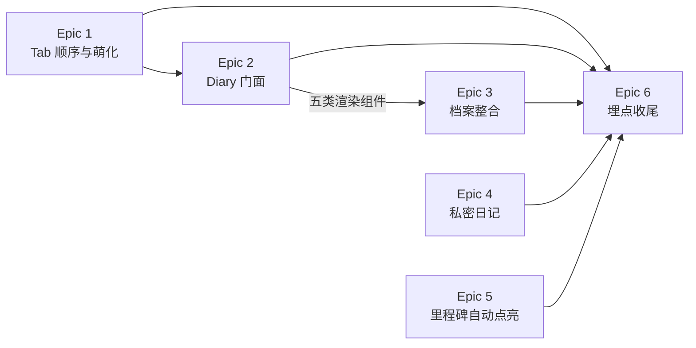

# TailTopia V1.1.2 - Epic Breakdown（Delta）

## Overview

本文件是 V1.1.2 **增量** epic/story 分解，承接 PRD、架构 delta（16 条 AD，权威）、UI 视觉稿（18 屏 / 3 泳道）与跨 story 决策台账。

**V1.0 与 V1.1 已上线冻结；未提及处一律继承。** 冲突序：**架构 delta > 本文件 > PRD > CROSS-STORY-DECISIONS > V1.0/V1.1 基线**。

核心主题 = **信息架构翻转**（Diary 从第 2 位提到第 1 位并成为默认落地页）+ 由此派生的游客体验、时间线整合、内容分发模型三块配套。**零运营后台依赖**，App 端 + 服务端独立交付。

## Requirements Inventory

### Functional Requirements

沿用全局 FR 编号，不重新分配（编号非连续，FR-85 属 V1.1.4）。

- **FR-78**：底部 Tab 顺序与命名变更（覆盖 V1.0.0 FR-19）。顺序改为 成长档案(Diary) / 问诊(**Health**，2026-07-31 由 Konsultasi 改名，见 OQ-19) / [+] / 探索(Discovery) / 我的(Profile)；[+] 仍居中凸起。含**落地 Tab 按用户状态分流矩阵**（游客/A建档/A未建档→Diary；B/C→Discovery；兽医→工作台）、**Diary 主页解除登录门控**（子页仍受控）、[+] 登录后回跳改 Diary、名片深链游客落 Diary 游客态、切回 Diary 自动刷新。
- **FR-78A**：Tab 图标激活态萌化（扩展 icon-system.md）。glyph 主体形状两态一致；激活时转品牌紫 + 柔和圆角高亮底 + 叠加一处宠物特征（猫耳/爪印/尾巴/项圈）+ 一次 ≤150ms 轻弹跳。未选中态维持 ink@55% 描边不变。
- **FR-79**：软性登录触发点拆分。Discovery 保留 V1.0.0 FR-0B「浏览至第 3 页触发软登录推荐」不变；Diary 游客态改为**页面内常驻 CTA**，非滚动触发、非弹层打断。两套机制独立互不依赖。
- **FR-80**：未登录用户的 Diary 引导态（新增）。Hero 时间线预览（示例宠物 Milo，9 条，混排普通内容与特殊内容）+ 情感化标题 + **唯一主 CTA**（进建档流程，文案避免「登录」字样）。**示例样式即真实时间线的样式契约。**
- **FR-81**：已登录未建档用户的 Diary 引导态（新增）。状态 A 未建档 → 复用既有建档引导 FR-0G，不展示 FR-80 种草内容；状态 B/C → 既有「有宠专属 + 修改状态入口」页零改动。**V1.0.0 FR-0H 首页提示条整条废止。**
- **FR-82**：时间线视图整合里程碑与身份证事件（扩展 FR-37 视图一，与 FR-42/FR-45/FR-45B/FR-49 并存不替代）。条目类型从两类扩展为五类；三处已有数据以**只读镜像**形式在主时间线展示；含分类判定顺序、排序规则、交互规则、多源合并分页口径。
- **FR-83**：Diary/Moment 发布与分发模型（覆盖 FR-12 发布、FR-17 Feed 内容模型）。发布页新增「同步到 Moment」开关（**默认开启**）；同步状态发布时一次性确定、**事后不可更改**；Diary↔Moment 为同一条内容（非副本）；Moment/Tips 不可回灌 Diary；**Feed 取消按用户宠物状态过滤**；发布页默认类型有档案 Diary / 无档案 Moment；类型选择器顺序改 Diary/Moment/Tips；存量内容维持公开。
- **FR-84**：日历格子结构化健康记录联动 + 单一优先级显示（覆盖 FR-37 视图二格子规则）。格子改为「三大类取其一、只显一个」；结构化健康记录首次进日历；**修复纯文字日记错显 🏥 的现网缺陷**；当天详情页改为按大类排序（diary > 问诊 > 健康记录）；含图标总表与月经图标改红色实心水滴。
- **FR-86**：健康类里程碑自动达成路径补全（扩展 FR-42）。新增 M9 绝育（健康记录触发）与 M5 第一次看兽医（真人兽医咨询会话结束触发，不含 AI 问诊）；⚠️ **健康类四条（M3/M4/M5/M9）取消打卡路径、改为唯一自动达成**（2026-07-31 拍板，反转 PRD 2026-07-30「两条并存」）；非健康类打卡机制不变；多里程碑同时解锁时庆祝合并只弹一次。**里程碑列表页需隐藏这四条的打卡入口 + 后端显式拒绝健康类打卡请求。**

### NonFunctional Requirements

> PRD 无独立 NFR 章节。以下为从 PRD 正文、架构 delta 与既有护栏中**提炼**的非功能要求，均可验收。

- **NFR-1（正确性）**：时间线跨页拉取**无条目丢失、无重复**，含「补记旧日期日记」场景。（AD-1；修的是现网缺陷）
- **NFR-2（正确性）**：时间线条目分类在**查询时实时计算**，不得落库固化；「问诊跳过存档 → 日后补存」不得产生重复条目。（AD-2）
- **NFR-3（安全）**：登录门控安全默认为「拦」。新增任何 `/profile/*` 子页默认受控，放行需显式加入精确例外集（仅接受完整路径字面量，不接受前缀或通配）。继承「安全规则只升不降不可绕过」。（AD-7）
- **NFR-4（隐私正确性）**：`visibility` 过滤**只作用于他人可见视图**；作者自视视图（成长档案时间线 / 日历 / 当天详情 / 我的发布）**必须完整展示含私密内容**。（AD-4）
- **NFR-5（可用性）**：FR-80 游客引导态**零网络依赖**，不得出现白屏或加载态。（AD-13）
- **NFR-6（数据完整性）**：`visibility` 迁移必须在功能开关生效前完成，不接受「先上线再补回填」；存量统一回填 PUBLIC。（AD-4）
- **NFR-7（一致性）**：游客示例时间线与真实时间线**共用同一套条目渲染组件**，禁止两套实现。（AD-13）
- **NFR-8（契约一致性）**：新增/变更的每个对外字段必须**三处同步**（后端 record + App data DTO + 后端契约 test），不同步即视为契约破坏、PR 不绿。（CROSS-STORY C4/C5）
  > ⚠️ **C5 原文写「四处」含 App mock，已过时**——提交 `8e85b40d`「删除全部 mock 子系统，L2 分支恒连真后端」已移除 App mock 层。本版本按**三处**执行；建议一并回写 CROSS-STORY-DECISIONS C5。
- **NFR-9（可访问性 / 动效）**：FR-78A 入场动效 ≤150ms，遵循 icon-system.md 既有 reduced-motion 兜底。
- **NFR-10（架构护栏）**：不引入 MQ / 调度中间件 / 通用缓存层 / 任何新中间件；异步只用 `@Async` + DB 状态机与 `@Scheduled`；`ddl-auto=validate`，schema 归 Flyway。（继承）
- **NFR-11（幂等与护栏）**：里程碑自动完成幂等，重复触发不产生重复完成记录；**健康类四条的打卡请求须在后端被显式拒绝**——仅前端隐藏按钮不合格，接口仍可被直接调用。（AD-11）

### Additional Requirements

**来自架构 delta（16 条 AD 为权威约束，story 须逐条引用）：**

- AD-1 时间线统一游标锚点（事件日期 + 同日排序键；归并后再截断；同日不跨页拆分）
- AD-2 五类分类后端判定、下发 `itemType`、实时计算不落库
- AD-3 Tab 底层索引随视觉顺序重排 —— **附 5 处索引寻址调用点硬性核对清单**
- AD-4 通用 `visibility` 列（PUBLIC/PRIVATE，DEFAULT PUBLIC）+ 作者自视不过滤
- AD-5 埋点集中为一条收尾 story
- AD-6 不取改版前基线 —— 连带三项对比指标不可执行
- AD-7 门控「默认受控 + 精确例外」，两处门控同改
- AD-8 落地 Tab 实时计算不持久化，判定点在 Splash 完成回调
- AD-9 日历后端仅补「当天健康记录条数」一维
- AD-10 当天详情须先补结构化健康记录第三源，再改排序
- AD-11 FR-86 达成路径：`NEUTER→M9` 映射 + 订阅既有 `ConsultClosedEvent` + **健康类四条取消打卡（前端隐藏入口 + 后端拒绝护栏）**
- AD-12 庆祝合并纯前端复用现有单条组件
- AD-13 FR-80 示例数据全部内置 + 共用渲染组件
- AD-14 Diary↔Moment 不建关联表，由 `visibility` 单字段表达
- AD-15 Diary 页根节点状态分支收敛为单一判定入口
- AD-16 时间线与日历分类优先级刻意不对称，不得「对齐」

**来自代码现状核实（架构 delta §1，估工必读）：**

- 时间线翻页缺陷**已在现网**，AD-1 修的是既有 bug → 须配回归测试
- 日历后端五维已存在，实际只缺「是否多条」；纯文字日记错显 🏥 为**纯前端缺陷**
- 登录门控**有两处**（深链前缀匹配 + Tab 点击索引判定），PRD 只覆盖了一处
- FR-86 的**自动路径**落点极小（映射加一行 + 订阅一个已存在事件）；但 2026-07-31 追加的**取消打卡**使其增加了列表页改动与后端拒绝护栏，规模由「极小」上调为「小到中」
- OQ-10 语境感知发布**已部分存在**（bug 20260703-244），需与 FR-83 全局默认合并口径

**来自 CROSS-STORY-DECISIONS（既有契约，不得违反）：**

- **C1**：当前用户资源统一 `/api/v1/me`，不用 `/users/me`
- **C4/C5**：接口契约后端主导；改任一对外 DTO 必须同步**三处**（后端 record + App data DTO + 后端契约 test）（→ NFR-8）。**C5 原文的第四处「App mock」已随 `8e85b40d` 删除 mock 子系统而失效**
- **F9**：`event_date` 与 `created_at` 分离。**Feed / 「我的发布」按 `created_at` 倒序；成长档案时间线 / 日历 / H5 名片按 `event_date`** —— 与 AD-1 的游标选择一致，story 不得混用
- **F13**：加载失败统一口径（重试入口 + 已加载内容保留），覆盖时间线 / 日历 / 当天详情失败态（→ UI 稿 A5 屏）
- **F10**：发布走三方自动审核（文字关键词 + 图像识别 stub），FR-83 发布页改动不得绕过该流程
- **E2**：Flyway 序号按执行顺序单调分配，用 `V<n>__` 占位

**基建 / 迁移：**

- Flyway 现有最高 **V97**，本版本从 **V98** 起顺延
- **唯一 schema 变更**：`content_posts` 新增 `visibility varchar DEFAULT 'PUBLIC'` + 存量回填
- 其余 FR 无 schema 变更：FR-82/84 复用既有表与事件；FR-86 只改监听器映射；FR-78/79/80/81 为前端与路由层
- 无新中间件、无新外部依赖、部署形态不变

### UX Design Requirements

来源：`v1.1.2/ui-v1.1.2.html`，**18 屏 / 3 条泳道**。每屏图注标注对应 FR 与真实代码文件。

**泳道 1 · 底部 Tab（T1–T3，对应 FR-78/79/78A）**

- **UX-DR1**（T1）：底部 Tab 5 位重排渲染 —— Diary / **Health** / [+] / Discovery / Me；[+] 保持居中凸起 FAB，视觉形态与协议尺寸不变。稿中含变更前/后对照。
- **UX-DR2**（T2）：Discovery 浏览至第 3 页触发软登录推荐浮层 —— **维持 V1.0.0 FR-0B 现状不变**，本屏为回归基准，不是新设计。
- **UX-DR3**（T3）：Tab 激活态萌化「方案A」—— 每 Tab 未选/激活两态对照。glyph 尺寸与形状两态一致；激活时 ①glyph 转品牌紫 + 柔和圆角高亮底 ②叠加一处宠物特征（Diary=书+猫耳；其余按稿）③一次 ≤150ms 轻弹跳。**即替换 pop-art 错位投影**，需回改 V1.0.0 `icon-system.md` 激活态规范。

**泳道 2 · 成长档案 Diary（A1–A9·A2b，对应 FR-80/81/82/84）**

- **UX-DR4**（A1）：游客态 Diary（未登录默认落地）—— Hero 示例时间线 + 情感化标题 + 唯一主 CTA。**含真实 Diary 页头**：编辑入口 + 健康记录卡 + 身份证图标按钮 + 个性签名行（**结构以现网为准**：身份证是 38×38 纯图标按钮、无编号；UI 稿画的「Kartu Identitas #00842」卡片作废）。示例宠物为**猫 Mochi**；9 条中**仅 3 条带图**（#3 玩水 / #7 深夜 / #8 晒太阳），其余 6 条为默认卡片无需配图。3 条带图内容**游客可无登录查看详情**。
- **UX-DR5**（A2）：状态 A 已登录未建档引导态。
- **UX-DR6**（A2b）：状态 B/C 的 Diary 非落地态 —— 既有页面，**零改动**，本屏为回归基准。
- **UX-DR7**（A3）：真实时间线正常态（已建档），含与 A1 一致的页头结构。
- **UX-DR8**（A4）：真实时间线近空态（刚建档，条目极少）。
- **UX-DR9**（A5）：时间线加载失败 / 重试态 —— 按 F13 统一口径（重试入口 + 已加载内容保留）。
- **UX-DR10**（A6）：**时间线 5 类条目视觉样式基准（组件规格屏）** —— ①普通照片卡（无徽章）②照片卡 + 右上角金色徽章角标 ③横向通栏庆祝 banner（图标 + 大字，无需照片）④胶囊/标签式条目（图标 + 一行字，明显小于照片卡）⑤独立证件卡样式（圆角 + 证件质感 + 照片/名字/编号排版）。**这是 NFR-7 共用渲染组件的样式契约来源。**
- **UX-DR11**（A7）：日历月视图 —— Material 轮廓图标体系；格子按大类优先级只显一个标记；**纯文字日记格子**（通用 diary 标记 `edit_note_outlined`）；月经改红色实心水滴 `water_drop`；当天多条结构化记录用通用医疗箱 `medical_services_outlined`。
- **UX-DR12**（A8）：当天详情页 —— 按大类排序 diary > 问诊 > 健康记录，类内按时间。
- **UX-DR13**（A9）：问诊未存档时的里程碑呈现 —— M5 落为类③通栏 banner；补存后由类④胶囊承载、banner 不再单出（AD-2 实时计算的可视化验收屏）。

**泳道 3 · 内容发布模型（P1–P4·P1b，对应 FR-83）**

- **UX-DR14**（P1）：发布页默认 Diary、同步开关**默认开启**。含「Untuk: {宠物名}」归属行；开关副文案说明「保存在 Diary 且展示在探索」；主按钮为 **Bagikan（分享）**。
- **UX-DR15**（P1b）：无宠物档案时发布页默认 Moment；Diary 选项维持灰置与「需先创建宠物档案」提示。
- **UX-DR16**（P2）：Diary + **手动关闭同步** —— 开关关闭后主按钮文案由 **Bagikan（分享）变为 Simpan（保存）**。⚠️ 该文案联动**PRD 未提及**，为 UI 稿独有要求，须落 AC。
- **UX-DR17**（P3）：选中 Moment 时**不出现同步开关**；显示「🌐 公开发布，展示在探索」提示。
- **UX-DR18**（P4）：「我的」页私密 Diary 与公开内容的视觉区分 —— 按真实 `me_page` 重画，含 ProfileHeadCard、AKTIVITAS 入口组、POSTINGANKU 列表。**作者可见自己全部 Diary（含未同步），需与公开内容有明确区分标识。**
- **UX-DR19**（横切）：类型选择器排列顺序调整为 **Diary / Moment / Tips**（现状为 Moment / Tips / Diary）。

> **不含 UI 的需求**：FR-86 为 App 内部逻辑变更，里程碑列表页与庆祝弹层均复用现状，UI 稿明确不含对应屏。

### FR Coverage Map

按 FR 逐条核对归属，**9 条 FR + 埋点章节全部有主，无遗漏、无重复**。

| FR | Epic | 说明 |
|---|---|---|
| FR-78（Tab 顺序与命名） | **Epic 1** | 视觉顺序 + 底层索引重排（AD-3） |
| FR-78（门控解除 / 落地页矩阵 / 连带调整） | **Epic 2** | 与游客态同批交付，否则中间态是坏的 |
| FR-78A（激活态萌化） | Epic 1 | 与 Tab 顺序同改一批文件，合并避免文件反复改动 |
| FR-79（软性登录触发点拆分） | Epic 2 | Diary 侧常驻 CTA 落在 2-3；Discovery 侧维持现状（回归基准） |
| FR-80（游客引导态） | Epic 2 | 五类条目渲染组件在此建立，Epic 3 复用 |
| FR-81（未建档引导态 + 废止 FR-0H） | Epic 2 | |
| FR-82（时间线五类整合） | **Epic 3** | |
| FR-83（Diary/Moment 同步开关） | **Epic 4** | 本版本唯一 schema 变更 |
| FR-84（日历联动 + 当天详情） | Epic 3 | 与 FR-82 共用 `TimelineService`，同 Epic 避免文件churn |
| FR-86（健康里程碑仅自动达成） | **Epic 5** | |
| PRD §3 埋点 T-1~T-4 / T-6~T-12 | **Epic 6** | T-5 已删 |

**FR-78 是唯一被拆到两个 Epic 的需求**，因为它同时包含耦合度不同的两件事：视觉顺序可独立上线；门控解除必须与游客态绑定交付。

**NFR 归属**：NFR-1/2 → Epic 3；NFR-3 → Epic 2；NFR-4/6 → Epic 4；NFR-5/7 → Epic 2（建组件）+ Epic 3（复用）；NFR-8 → 凡新增对外字段的 story（3-2 / 3-4 / 4-1）；NFR-9 → Epic 1；NFR-10 → 全局；NFR-11 → Epic 5。

**UX-DR 归属**：UX-DR1~3 → Epic 1；UX-DR4~6 → Epic 2；UX-DR7~13 → Epic 3（其中 UX-DR10 组件规格由 Epic 2 的 2-3 落地）；UX-DR14~19 → Epic 4。

## Epic List

共 **6 个 Epic / 15 条 story**。每个 Epic 均可独立上线，Epic 间只有向后依赖。

### Epic 1: 底部 Tab 换新顺序与萌化激活态

用户打开 App，底栏顺序变为 Diary / Health / [+] / 探索 / 我的；点中的标签变品牌紫并冒出一处宠物特征。落地页与登录门控此时不动，单独发布也是自洽的。
**FRs covered:** FR-78（顺序与命名部分）、FR-78A

### Epic 2: Diary 成为所有人的门面

冷启动按用户状态落到对应 Tab；**游客无需登录即可看到一本示例成长本并被种草**；已登录未建档的用户看到建档引导。门控解除与游客态同批交付，无中间坏态。
**FRs covered:** FR-78（门控解除 / 落地页矩阵 / 连带调整）、FR-79、FR-80、FR-81

### Epic 3: 成长档案整合成一本完整的册子

用户翻自己的时间线能看到里程碑、健康记录、身份证，不必在四个页面间跳转；日历格子显示结构化健康记录，纯文字日记不再错显医院图标。同时修复时间线翻页的现网缺陷。
**FRs covered:** FR-82、FR-84

### Epic 4: 日记可以只留给自己

用户发日记时可一键关闭「同步到 Moment」，变成纯私人记录；「我的」页能分清哪些是私密的。默认行为与现状一致，老用户无感知。
**FRs covered:** FR-83

### Epic 5: 健康里程碑改为只能自动点亮

录完疫苗 / 驱虫 / 绝育记录，或看完一次真人兽医，对应里程碑自动点亮。**这四条不再能靠发日记打卡解锁**——打没打疫苗是客观事实。其它里程碑的打卡方式不受影响。
**FRs covered:** FR-86

### Epic 6: 改版效果可度量

补齐 11 项埋点（含 PRD 点名的 P0 缺口：底部 Tab 切换目前完全无埋点）。**面向产品团队的价值，非终端用户价值**；排在最后，依赖全部功能落地。
**FRs covered:** PRD §3 数据埋点需求（T-1~T-4、T-6~T-12）

### 共享件归属总表（2026-08-03 全量扫描结论）

本版本有 7 处「多条 story 共用同一件东西」。**共享件必须有唯一定义方，其余 story 只采纳、不重造**——这是本轮 story 校验中反复出现的问题来源。

| # | 共享件 | 定义方 | 采纳方 | 写歪了会怎样 |
|---|---|---|---|---|
| 1 | **五类条目 tile 组件** | 2-2 | 3-3 | 各写一套 → 游客看到的与注册后拿到的不是一个东西，FR-80 承诺落空（NFR-7） |
| 2 | **tile 的点击回调接口** | 2-2（留口） | 3-3（注入真实跳转） | 跳转写死在组件里 → 游客态只能另写一套 tile，NFR-7 破功 |
| 3 | **Diary 页头组件** | 2-2 | 3-3 | 同 #1：真实态页头要求与游客态一致，内联布局会迫使 3-3 再写一遍 |
| 4 | **`itemType` 五值词表** | 2-2（前端定义） | 3-2（后端采纳）/ 3-3 / 6-1 | 前后端各定一套 → 契约对不上 |
| 5 | **健康类里程碑 code 集合 {M3,M4,M5,M9}** | 5-1 | 5-2（护栏 + 候选过滤）/ 6-1（T-12 校验） | 三处各写一份 → 日后增减健康类里程碑漏改，护栏出洞 |
| 6 | **健康类型图标常量表** | 先落地者建（2-2 类④ 或 3-4） | 3-4（权威落地：日历 + 健康记录列表页） | 两份表 → 改一处漏一处，日历与列表页图标不一致 |
| 7 | **用户状态六态判定** | 2-4（落地矩阵） | 6-1（埋点 `user_state`） | 各写一份 → 埋点口径与实际分流不一致，数据不可信 |
| 8 | **失败态组件（F13 口径）** | 3-3 | 3-4（日历 + 当天详情） | 各写一套失败态 → 体验不一致 |
| 9 | **免门控 Tab 白名单** | 1-1（去索引化建立） | 2-4（扩容加 Diary） | 两条 story 重复认领 → 后做的那条以为已完成，无人负责 |
| 10 | **Diary 页状态分发入口** | 2-1 | 2-2 / 2-3（各填一支） | 各自加判断 → 互相覆盖或漏状态组合（AD-15） |
| 11 | **建档引导入口函数** | 2-2 | 2-2 AC8 的三个触发点 / 2-3 | 多套跳转逻辑 → 埋点来源统计碎裂 |
| 12 | **`visibility` 的 App data DTO 镜像** | 4-1 | 4-2（直接使用） | 归属含糊 → 两条都不做，4-1 的契约同步 AC 落空 |

### Epic 依赖关系

- **Epic 1 → Epic 2**：Tab 先重排，落地页矩阵才有落点
- **Epic 2 → Epic 3**：五类条目渲染组件在 2-3 建立（NFR-7 要求共用，禁止两套实现）
- **Epic 4 / Epic 5 完全独立**，可与前三个并行推进
- **Epic 6 最后**（AD-5 用户决定）

---

## Epic 1: 底部 Tab 换新顺序与萌化激活态

用户打开 App，底栏顺序变为 Diary / Health / [+] / Discovery / Me；点中的标签变品牌紫并冒出一处宠物特征。落地页与登录门控此时不动，单独发布也是自洽的。

**FRs：** FR-78（顺序与命名部分）、FR-78A ｜ **NFR：** NFR-9 ｜ **UX-DR：** 1、2、3 ｜ **AD：** AD-3

### Story 1.1: 底部 Tab 顺序与底层索引重排

As a TailTopia 用户,
I want 打开 App 时底栏第一个就是我的宠物成长档案,
So that 这个 App 给我的第一印象是「记录工具」而不是「信息流」.

**Acceptance Criteria:**

**AC1（L2 视觉 · UX-DR1）**
**Given** 用户打开 App
**When** 查看底部 Tab Bar
**Then** 5 个位置依次为 Diary / Health / [+] / Discovery / Me
**And** [+] 仍为居中凸起 FAB、视觉形态与协议尺寸与改版前一致
**And** Discovery 的内容与浏览逻辑不变、仅位置与名称变化

**AC2（L0）**
**Given** 底层索引须与视觉顺序一致（AD-3 Rule 1）
**When** 检查 Tab 枚举顺序、`StatefulShellRoute` 分支声明顺序、`_tabLocations` 路径映射数组
**Then** 三处顺序严格一致且与视觉顺序相同
**And** 不存在「索引顺序 ≠ 视觉顺序」的残留

**AC3（L0，硬性核对清单）**
**Given** AD-3 Rule 2 列出的 5 处按索引寻址调用点
**When** 逐条核对
**Then** 每一处都已确认并在 Completion Notes 中逐条打勾：① 免门控 Tab 判定**去索引化**——改为按 Tab 语义判定，但**免门控集合此时仍为 `{Discovery}` 不变**（扩为 `{Discovery, Diary}` 归 Story 2.4，本 story 不得提前放行）② [+] 预选 Diary 判定指向重排后分支 ③ `_tabLocations` 数组与新分支顺序对应 ④ `BottomTabBar` 渲染对应 ⑤ `StatefulShellRoute` 分支声明顺序
**And** 遗漏任意一处即本 AC 不通过

**AC4（L0）**
**Given** 登录后回跳与推送深链现状按路径寻址
**When** 完成索引重排
**Then** 二者仍按路径寻址
**And** 未因重排引入任何按索引寻址的新代码（AD-3 Rule 3）

**AC5（L1 回归）**
**Given** 本 story 不改门控与落地页（归 Epic 2）
**When** 游客点击各 Tab、以及冷启动
**Then** 门控行为与落地页目标与改版前完全一致
**And** 无中间态破损

### Story 1.2: Tab 激活态萌化「方案A」

As a TailTopia 用户,
I want 点中的标签有一点宠物感的小变化,
So that 这个 App 摸起来像是给宠物用的，而不是一个通用工具.

**Acceptance Criteria:**

**AC1（L2 视觉 · UX-DR3）**
**Given** UI 稿 T3 屏「方案A」
**When** 用户点击任一 Tab
**Then** 该 Tab 的 glyph 尺寸与形状两态一致（用户靠形状辨识 Tab，不改变辨识锚点）
**And** glyph 转品牌紫 + 出现柔和圆角高亮底
**And** 叠加一处宠物特征装饰（Diary = 书 + 猫耳，其余按 T3 稿）
**And** 未选中态维持 ink@55% 描边不变

**AC2（L2 视觉 · NFR-9）**
**Given** 激活入场动效
**When** 切换 Tab
**Then** 播放一次轻弹跳，时长 ≤150ms
**And** 系统开启「减少动态效果」时按 `icon-system.md` 既有 reduced-motion 兜底降级

**AC3（L0）**
**Given** 方案A 为「替换」V1.0.0 pop-art 激活态（紫实心 + 红 (3,3) 错位投影）
**When** 实现完成
**Then** 错位投影不再出现在 Tab 激活态
**And** `icon-system.md` 的激活态规范已同步回改
**And** PRD OQ-13 标记为已闭合

**AC4（L0）**
**Given** 本 story 为纯视觉层
**When** 实现完成
**Then** Tab 顺序、路由、登录门控、落地页逻辑均无改动

---

## Epic 2: Diary 成为所有人的门面

冷启动按用户状态落到对应 Tab；游客无需登录即可看到一本示例成长本并被种草；已登录未建档的用户看到建档引导。

**⚠️ Story 顺序刻意如此**：先建页面、最后解门控。反过来（先解门控）会出现「游客能进 Diary 但游客页还没做」的破损中间态。

**FRs：** FR-78（门控 / 落地页 / 连带调整）、FR-79、FR-80、FR-81 ｜ **NFR：** NFR-3、5、7 ｜ **UX-DR：** 4、5、6 ｜ **AD：** AD-7、AD-8、AD-13、AD-15

### Story 2.1: Diary 页状态分支单一入口

As a 开发者,
I want Diary 页的四种用户状态由一处统一分发,
So that 后续两条 story 各自往里加分支时不会互相覆盖或漏掉状态组合.

**Acceptance Criteria:**

**AC1（L0）**
**Given** AD-15 要求状态分支收敛为单一判定入口
**When** 进入 Diary 页
**Then** 存在唯一一处按序判定并分发的入口，四个分支互斥且穷尽：游客（未登录）/ 状态 A 未建档 / 状态 A 已建档 / 状态 B·C
**And** 页面其它位置不得再出现独立的用户状态判断

**AC2（L0）**
**Given** 本 story 只立骨架
**When** 实现完成
**Then** 「状态 A 已建档」分支渲染现有真实档案页（零改动）
**And** 「状态 B·C」分支渲染 V1.0.0 既有「有宠专属 + 修改宠物状态入口」页（零改动，UX-DR6 为回归基准）
**And** 游客与「状态 A 未建档」两个分支为占位，由 2.2 / 2.3 填充

**AC3（L1 回归）**
**Given** 门控此时尚未解除
**When** 游客尝试进入 Diary
**Then** 仍按现状被拦截
**And** 已登录用户的 Diary 体验与改版前完全一致

### Story 2.2: 游客引导态与五类条目渲染组件

As a 还没注册的访客,
I want 一打开 App 就看到一本别人家宠物的成长本长什么样,
So that 我会想「我也想给我家宠物记一篇」，而不是先被要求登录.

**Acceptance Criteria:**

**AC1（L2 视觉 · UX-DR4）**
**Given** UI 稿 A1 屏
**When** 游客进入 Diary
**Then** 页面自上而下为：真实 Diary 页头（编辑入口 + 健康记录卡 + 身份证图标按钮 + 个性签名行；**结构以现网为准**——身份证是 38×38 纯图标按钮、无标题无编号，UI 稿画的「Kartu Identitas #00842」卡片作废）、Hero 示例时间线、情感化标题与一句话说明、唯一主 CTA
**And** 主 CTA 文案不出现「登录」字样，点击进入 V1.0.0 既有建档引导流程（FR-0G）
**And** 页面不含「已有账号？登录」次要入口（2026-07-30 已删）

**AC2（L2 视觉）**
**Given** 示例时间线为 9 条（PRD FR-80 示例表）
**When** 游客浏览
**Then** 9 条按表定义的顺序与类别渲染，混排普通内容与特殊内容
**And** 内容明确标示为示例（非真实数据）

**AC3（L0 · NFR-7 · UX-DR10 · AD-13 Rule 4，本 story 的核心交付物）**
**Given** 游客示例与真实时间线必须共用同一套条目渲染组件
**When** 实现完成
**Then** 存在一套统一的五类条目渲染组件，按 UI 稿 A6 屏的样式基准实现：① 普通照片卡（无徽章）② 照片卡 + 右上角金色徽章角标 ③ 横向通栏庆祝 banner ④ 胶囊/标签式条目 ⑤ 独立证件卡样式
**And** 该组件的输入为携带 `itemType` 标识的条目数据，不关心数据来源
**And** ⚠️ **组件只渲染、不持有跳转**，点击回调由调用方注入——游客态点 banner 弹建档引导、真实态跳里程碑列表，语义不同；写死跳转会迫使游客态另写一套 tile，NFR-7 破功
**And** ⚠️ **本 story 同时定义 `itemType` 的五个取值词表**（UPPER_SNAKE，与 PRD 五类一一对应），作为前后端共同契约；Story 3.2 的后端实现**必须采纳该词表，不得另立一套取值**
**And** 游客态通过内置常量数据喂给该组件，**未另写一套渲染**
**And** Epic 3 的真实时间线将复用同一组件

**AC4（L0 · NFR-5 · AD-13）**
**Given** 游客态为 App 门面
**When** 设备处于飞行模式 / 无网络
**Then** 页面完整渲染，不出现白屏、loading 态或错误态
**And** 9 条文案走现有双语文案体系、9 张图为 App 内置资源
**And** 游客态**不调用**任何需要宠物档案的后端接口

**AC5（L0 · FR-79）**
**Given** FR-0B 软登录浮层不适用于 Diary 游客态
**When** 游客在 Diary 页滚动
**Then** 不触发任何滚动式或弹层式登录推荐
**And** 登录引导仅由页面内常驻主 CTA 承担
**And** Discovery 侧 FR-0B「浏览至第 3 页触发」逻辑完全不变（UX-DR2 为回归基准）

**AC7（L0 可验证性说明）**
**Given** 门控在 Story 2.4 才解除，本 story 完成时游客尚无法从 Tab 走到该页
**When** 验收本 story
**Then** 通过 Story 2.1 的状态分发入口直接构造游客分支进行验收（widget test + debug 路由），不依赖门控解除
**And** 真实游客可达性由 Story 2.4 交付，本 story 不得为了自测而提前放行门控

**AC8（L2，2026-08-03 新增）**
**Given** 游客在示例时间线上点击条目
**When** 点击 3 条带图内容
**Then** 直接进入示例内容详情，**无需登录**，内容全部来自内置常量、零网络请求
**When** 点击其余 6 条（banner / 胶囊 / 证件卡）
**Then** 触发主 CTA 的建档引导；**不得**跳转里程碑列表 / 健康记录列表 / 身份证页（均为受控页，会在种草页中间弹登录框）
**When** 在示例详情页点击点赞 / 评论 / 举报
**Then** 三者正常展示，点击任意一个均触发建档引导
**And** ⚠️ 示例详情**不得**挂在 `/profile/...` 前缀下（AD-7 会拦截），**不得**复用 `/content/:id`（示例无后端 ID → 404）

**AC6（占位允许）**
**Given** OQ-1 印尼语文案与 Milo 配图素材尚未到位
**When** 本 story 实现
**Then** 允许使用占位文案与占位图完成全部结构与样式
**And** 素材到位后仅需替换资源，不需改结构

### Story 2.3: 已登录未建档用户的建档引导态

As a 已登录但还没填宠物档案的用户,
I want 打开 Diary 直接看到建档引导,
So that 我不用再被当成新访客重新种一次草.

**Acceptance Criteria:**

**AC1（L2 视觉 · UX-DR5）**
**Given** 用户为状态 A（已回答「我有宠物」）且未建档
**When** 进入 Diary
**Then** 走 2.1 分发入口的对应分支，复用 V1.0.0 既有宠物档案创建引导（FR-0G，可跳过）
**And** 不展示 FR-80 的预览种草内容

**AC2（L1）**
**Given** 用户为状态 B / C
**When** 主动点进 Diary
**Then** 展示 V1.0.0 既有「有宠专属 + 修改宠物状态入口」页
**And** 不引导建档、页面零改动

**AC3（L0 · FR-81）**
**Given** V1.0.0 FR-0H「首页宠物档案提示条（前 3 次重启显示）」整条废止
**When** 实现完成
**Then** 该提示条不再实现、Discovery 顶部不再预留其区域
**And** 其曝光 / 点击 / 关闭埋点事件已移除
**And** 状态 A 未建档用户的建档引导渠道收敛为唯一一条（本 story 的 Diary 分支）

### Story 2.4: 登录门控解除与落地 Tab 矩阵

As a 还没注册的访客,
I want 打开 App 直接就能看到成长档案，点标签也不被弹登录框,
So that 我能先看看这个 App 是干什么的，再决定要不要注册.

**Acceptance Criteria:**

**AC1（L1 · AD-7 Rule 1）**
**Given** 深链门控按路径前缀匹配（`_controlledLocations`）
**When** 解除 Diary 主页门控
**Then** 采用「默认受控 + 精确例外」：前缀匹配保持默认拦截，另设精确例外集仅放行 `/profile` 本身
**And** 建档 / 编辑档案 / 当天详情 / 里程碑列表等全部子页面自动继续受控，无需逐个登记
**And** 例外集只接受完整路径字面量，不接受前缀或通配

**AC2（L1 · AD-7 Rule 2，PRD 未覆盖的第二处门控）**
**Given** Tab 点击门控现按「索引 == 免门控 Tab 索引」判定
**When** 实现完成
**Then** 改为按 Tab 语义的免门控白名单 `{Discovery, Diary}`
**And** 游客点击 Diary 标签直接进入，不弹登录框
**And** Health / [+] / Me 三者对游客维持受控不变

**AC3（L0 安全回归 · NFR-3，双向）**
**Given** 安全默认不可反转，且门控须双向正确
**When** 新增任意 `/profile/*` 子页
**Then** 其默认状态为受控
**And** **拦截方向**存在测试锁定：游客访问 `/profile/create`、`/profile/edit`、当天详情、里程碑列表均被拦截
**And** **放行方向**存在测试锁定（2026-08-03 新增）：`/profile` 主页放行；**Story 2.2 AC8 的示例内容详情对游客可达、不被任何门控拦截**
**And** **不得**为放行示例详情而扩大 `/profile/` 例外集——那会连带放行真实子页

**AC7（L1/L2，2026-08-03 新增 · Epic 2 收口验收）**
**Given** 本 Story 是门控真正打开的那一刻
**When** 用未登录设备走完整链路
**Then** 冷启动 → 落地 Diary 游客态 → 浏览 9 条示例 → 点 3 条带图内容之一 → 看到示例详情 → 返回
**And** 全程不出现任何登录框、不出现任何拦截重定向
**And** 点其余 6 条 / 详情页互动按钮 → 正常触发建档引导（期望行为，不算拦截）
**And** 示例详情零网络请求

**AC4（L1 · AD-8）**
**Given** 落地 Tab 按当前用户状态实时计算
**When** 冷启动完成
**Then** 分流为：游客 → Diary 游客态；状态 A 已建档 → Diary；状态 A 未建档 → Diary 建档引导；状态 B/C → Discovery；兽医 → 工作台（不变）
**And** 不持久化「上次落在哪」，每次冷启动按当时状态重新判定
**And** 用户状态改变（B/C ↔ A）后落地 Tab 实时跟随

**AC5（L1）**
**Given** 热启动行为不变
**When** App 仍在后台、用户切回
**Then** 停留在离开时的页面，不重新分流

**AC6（L1 · FR-78 连带调整）**
**Given** 落地页变更的三处连带调整
**When** 实现完成
**Then** ① [+] 发布按钮触发登录后的回跳由「回首页」改为「回 Diary」 ② 游客点开他人分享的宠物名片深链落在 Diary 游客引导态（不再重定向 Discovery）③ 从其它 Tab 切回 Diary 时自动刷新时间线与日历数据

---

## Epic 3: 成长档案整合成一本完整的册子

用户翻自己的时间线能看到里程碑、健康记录、身份证，不必在四个页面间跳转；日历格子显示结构化健康记录，纯文字日记不再错显医院图标。同时修复时间线翻页的现网缺陷。

**FRs：** FR-82、FR-84 ｜ **NFR：** NFR-1、2、8 ｜ **UX-DR：** 7~13 ｜ **AD：** AD-1、AD-2、AD-9、AD-10、AD-16

### Story 3.1: 时间线统一游标锚点重构（修复现网翻页缺陷）

As a 会补记旧日期日记的用户,
I want 往下翻时间线时条目不会莫名消失或重复出现,
So that 我能相信这本册子记全了我家宠物的事.

**Acceptance Criteria:**

**AC1（L1 · AD-1 Rule 1）**
**Given** 现状排序键为 `effectiveDate`、游标键为 `createdAt`，两者不一致（现网缺陷）
**When** 重构完成
**Then** 游标锚点唯一，取「事件日期 + 同日排序键」复合值
**And** 各数据源用同一锚点取数，不使用各源自己的主键或 `createdAt` 游标

**AC2（L1 · AD-1 Rule 2）**
**Given** 多源归并
**When** 取一页数据
**Then** 先按锚点从各源各取一批 → 归并排序 → 统一截断到页大小 → 以截断处锚点作为下一页游标
**And** 不存在「各源先截断再归并」的实现

**AC3（L1 · AD-1 Rule 3）**
**Given** 同日条目不可跨页拆分
**When** 某日条目数超过单页容量
**Then** 该日整体作为一页返回（允许超出默认页大小）
**And** 页边界始终落在日期分界上

**AC4（L1 回归断言 · NFR-1，本 story 的核心验收）**
**Given** 用户补记一篇旧日期的日记（`eventDate` 为上月、`createdAt` 为今天）
**When** 逐页拉完整条时间线
**Then** 该条恰好出现一次，位置在其事件日期对应的时序位置
**And** 全量条目集合与不分页查询的结果集合完全相等（无丢失、无重复）
**And** 该断言作为回归测试常驻，不得删除

**AC5（L0 · CROSS-STORY F9）**
**Given** F9 规定的排序口径
**When** 实现完成
**Then** 成长档案时间线 / 日历 / 当天详情按 `event_date`；Feed 与「我的发布」仍按 `created_at` 倒序
**And** 两套口径未被混用

### Story 3.2: 时间线四源接入与五类分类下发

As a 已建档的用户,
I want 时间线里能看到里程碑、健康记录和身份证,
So that 我不用在四个页面之间跳来跳去才能回顾我家宠物的成长.

**Acceptance Criteria:**

**AC1（L1 · FR-82）**
**Given** 时间线现有两个数据源（Diary 内容 + 问诊健康事件）
**When** 实现完成
**Then** 扩展为四源：新增「结构化健康记录」「里程碑完成」「身份证生成」
**And** 三者均为只读镜像，FR-42 里程碑列表页 / FR-45B 健康记录列表页 / FR-49 身份证页的既有功能、编辑权限、数据生命周期规则均不变

**AC2（L1 · AD-2 Rule 1）**
**Given** 五步分类优先级（命中即停）
**When** 服务端计算每条条目
**Then** 依序判定：① 对应结构化健康记录或问诊存档 → 类④ ② 身份证首次生成 → 类⑤ ③ 里程碑完成且绑定了 Diary 内容 → 类② ④ 里程碑完成（系统自动、无绑定内容）→ 类③ ⑤ 其余 → 类①
**And** 每条条目下发 `itemType` 标识，前端不自行推断

**AC3（L1 · AD-2 Rule 2 · NFR-2，安全攸关）**
**Given** 分类必须实时计算
**When** 用户问诊后跳过存档、日后再补存
**Then** 补存前 M5 显示为类③通栏 banner；补存后由类④胶囊条承载、banner 不再出现
**And** 时间线上同一件事**不出现两条**
**And** 分类结果未落库固化（可通过「补存后立即重查即变化」验证）

**AC4（L1 · AD-2 Rule 3）**
**Given** 健康类里程碑存在多条完成路径
**When** 同一里程碑分别经自动路径与历史打卡路径完成
**Then** 时间线展示样式完全一致
**And** 判定依据为「这一天有无对应健康记录条目」，非里程碑的触发方式字段

**AC5（L1）**
**Given** 排序与交互规则
**When** 用户浏览与点击
**Then** 整体按事件日期倒序；同日按发布/完成时间正序（系统自动里程碑与身份证取其系统记录时间戳参与同日排序）
**And** 点击类② → 内容详情页（角标可再点跳里程碑列表）；类③ → 里程碑列表页；类④ → 健康记录列表页对应条目（时间线内不提供编辑入口）；类⑤ → 身份证页

**AC6（L0 · NFR-8 · CROSS-STORY C4/C5）**
**Given** 新增对外字段 `itemType`
**When** 实现完成
**Then** 后端 record、App data DTO、后端契约 test **三处**已同步（App mock 层已随 `8e85b40d` 删除，不适用）
**And** 契约 test 钉住 `itemType` 的字段集与枚举取值（UPPER_SNAKE），照 `MilestoneListResponseContractTest` 范式

**AC7（L1）**
**Given** 类④ 健康胶囊条
**When** 渲染
**Then** 不加任何里程碑标记（OQ-14 已定，本版本不做）

### Story 3.3: 时间线前端五类渲染

As a 已建档的用户,
I want 时间线里不同类型的事看起来就不一样,
So that 我一眼能分清哪条是随手拍的、哪条是里程碑、哪条是系统替我记的.

**Acceptance Criteria:**

**AC1（L2 视觉 · NFR-7）**
**Given** Story 2.2 已建立五类条目渲染组件
**When** 渲染真实时间线
**Then** 复用同一套组件，仅数据来源由内置常量改为后端下发
**And** 未新写第二套渲染实现
**And** 游客示例与真实时间线的同类条目视觉完全一致

**AC6（L0，2026-08-03 新增）**
**Given** 游客态与真实态共用同一套 tile 但点击语义不同（游客态：照片卡→示例详情、其余→建档引导；真实态：五类各跳各的）
**When** 实现完成
**Then** tile 组件**不得内置跳转**，点击回调由调用方按 `itemType` 注入
**And** 类② 金色徽章角标为独立可点区域，回调同样注入
**And** 存在测试锁定：同一组件在两套回调下产出相同视觉、触发不同行为

**AC2（L2 视觉 · UX-DR7 · UX-DR8）**
**Given** UI 稿 A3（正常态）与 A4（刚建档近空态）
**When** 用户查看
**Then** 两态均按稿渲染，含与游客态一致的 Diary 页头结构

**AC3（L2 视觉 · UX-DR9 · CROSS-STORY F13）**
**Given** UI 稿 A5 加载失败态
**When** 网络或服务器错误
**Then** 按 F13 统一口径：已加载内容保留、仅增量失败时底部提供重试入口
**And** 不出现整页白屏

**AC4（L2 视觉 · UX-DR13）**
**Given** UI 稿 A9 问诊未存档时的里程碑呈现
**When** 用户问诊后跳过存档
**Then** M5 渲染为类③通栏 banner；补存后改由类④胶囊承载
**And** 为 AC 3.2-AC3 的可视化验收屏

### Story 3.4: 日历联动结构化健康记录与当天详情排序

As a 已建档的用户,
I want 日历上能看出哪天带宠物打了疫苗、哪天只写了文字日记,
So that 我翻月历时不用点进去才知道那天发生了什么.

**Acceptance Criteria:**

**AC1（L1 · AD-9 Rule 1）**
**Given** `DayCell` 现有五维（`day` / `firstImageUrl` / `hasHappyMoment` / `hasHealthEvent` / `healthRecordType`）已包含结构化健康记录
**When** 实现完成
**Then** 后端**仅新增一维**：当天结构化健康记录的条数（或「是否多于一条」）
**And** 未重建任何已存在的维度

**AC2（L2 视觉 · UX-DR11 · FR-84）**
**Given** 格子按「三大类取其一、只显一个」渲染
**When** 用户查看月历
**Then** 优先级为：① diary 带图 → 首图缩略图铺满、**不再叠加任何角标** ② 有 diary 但全部无图 → 通用 diary 标记 `edit_note_outlined` ③ 无 diary 但有问诊/AI 健康事件 → `local_hospital_outlined` ④ 仅有结构化健康记录 → 单条用该类型图标、多条用通用医疗箱 `medical_services_outlined` ⑤ 无记录/未来日期 → 沿用现状

**AC3（L2 视觉 · 现网缺陷修复）**
**Given** 纯文字日记当天格子现状错显 🏥 医院图标
**When** 修复完成
**Then** 该日显示通用 diary 标记
**And** 图片加载失败时显示图片占位符或降级为通用 diary 标记
**And** **任何情况下都不得回退到问诊图标**
**And** 本项为纯前端修复，判定依据改用后端已下发的 `hasHappyMoment`

**AC4（L0）**
**Given** 图标总表（PRD FR-84）
**When** 实现完成
**Then** 疫苗 `vaccines_outlined`(coral) / 驱虫 `medication_outlined`(triageGreen) / 绝育 `healing_outlined`(mint) / 月经 `water_drop` 实心 + 红色 / 自定义 `description_outlined`(muted) / 问诊 `local_hospital_outlined`(coral) / 通用健康 `medical_services_outlined` / 通用 diary `edit_note_outlined`
**And** 日历格子与健康记录列表页共用同一套图标，未新设第二套
**And** 月经图标改红同时作用于健康记录列表页（覆盖 V1.1.0 FR-45B）
**And** 未使用任何字面 emoji（无法着色、老安卓渲染为豆腐块）

**AC5（L1 · AD-10 · UX-DR12）**
**Given** 当天详情页现仅含快乐时刻 + 问诊健康事件
**When** 实现完成
**Then** **先补入结构化健康记录第三个数据源**
**And** 再按大类排序 diary > 问诊 > 健康记录，类内按时间（覆盖 FR-37 原「按发布时间正序」）

**AC6（L0 · AD-16）**
**Given** 时间线与日历的分类优先级方向相反（时间线健康记录优先、日历 diary 优先）
**When** 同一天既有带图日记又有疫苗记录
**Then** 日历显示日记首图、时间线显示两条（照片卡 + 健康胶囊）
**And** 该不对称为刻意设计，代码注释须标明「不得对齐」

**AC7（L0 · NFR-8）**
**Given** `DayCell` 新增一维
**When** 实现完成
**Then** 后端 record、App data DTO、后端契约 test **三处**已同步（App mock 层已删除，不适用）

**AC8（L2 · CROSS-STORY F13，2026-08-03 新增）**
**Given** F13 明确覆盖「日历 / 当天详情页」失败态，而 UI 稿 A5 只画了时间线
**When** 日历月视图或当天详情加载失败
**Then** 按 F13 同一口径：已加载内容保留、提供重试入口、不整页白屏
**And** 与 Story 3.3 的时间线失败态复用同一套失败态组件

---

## Epic 4: 日记可以只留给自己

用户发日记时可一键关闭「同步到 Moment」，变成纯私人记录；「我的」页能分清哪些是私密的。默认行为与现状一致，老用户无感知。

**FRs：** FR-83 ｜ **NFR：** NFR-4、6、8 ｜ **UX-DR：** 14~19 ｜ **AD：** AD-4、AD-14

### Story 4.1: 内容可见范围字段、数据迁移与 Feed 取数改造

As a 平台,
I want 每条内容都带一个明确的「谁能看」标记,
So that 所有要取公开内容的地方只需问一句话，而不是各写各的判断.

**Acceptance Criteria:**

**AC1（L1 · AD-4 Rule 1）**
**Given** `content_posts` 现无任何公开/私密字段
**When** 迁移完成
**Then** 新增 `visibility varchar`，取值 `PUBLIC` / `PRIVATE`（UPPER_SNAKE），`DEFAULT 'PUBLIC'`
**And** 三类内容（Diary / Moment / Tips）统一携带，未做 Diary 专属布尔
**And** Flyway 占位号 `V<n>__`，实际号按执行顺序顺延（现有最高 V97）

**AC2（L1 · NFR-6）**
**Given** 存量内容须维持公开
**When** 迁移执行
**Then** 全部存量已发布内容统一回填 `PUBLIC`
**And** 迁移在功能开关生效前完成，不存在「先上线再补回填」
**And** 无任何老用户内容因本次迁移从 Feed 消失

**AC3（L1 · AD-4 Rule 2）**
**Given** 一切消费公开内容的查询
**When** 取数
**Then** 统一按 `visibility = PUBLIC` 过滤，不按内容类型分支

**AC4（L1 · NFR-4 · AD-4 Rule 3，安全攸关）**
**Given** 过滤范围严格限定「他人可见」视图
**When** 作者查看自己的成长档案时间线 / 日历 / 当天详情 / 「我的发布」
**Then** 完整展示含私密在内的全部内容，**不过滤**
**And** 存在测试锁定：作者设为私密的 Diary 仍出现在其成长档案时间线中
**And** 该测试为回归防线，防止后续 story 为「统一口径」误加过滤

**AC5（L1 · FR-83）**
**Given** V1.0.0「状态 B 用户 Feed 不显示成长日历快乐时刻」规则整条废止
**When** 实现完成
**Then** 公开内容对所有用户一视同仁，不按宠物状态过滤
**And** Feed 分类筛选保留，公开 Diary 归入「成长时刻」分类

**AC6（L1 · AD-14）**
**Given** Diary 与 Moment 为同一条内容的两处展示（非副本）
**When** 用户删除任一处
**Then** 两处同步消失（沿用 FR-12 包含关系语义与 FR-36 删除联动）
**And** 未新建任何关联表

**AC7（L0 · NFR-8）**
**Given** 新增对外字段 `visibility`
**When** 实现完成
**Then** 后端 record、App data DTO、后端契约 test **三处**已同步（App mock 层已删除，不适用）

### Story 4.2: 发布页同步开关与「我的」页私密标识

As a 想给自己留点私人记录的用户,
I want 发日记时能一键关掉「同步到 Moment」,
So that 有些只想自己看的事，不用发到大家都能刷到的地方.

**Acceptance Criteria:**

**AC1（L2 视觉 · UX-DR14）**
**Given** UI 稿 P1 屏
**When** 有宠物档案的用户进入发布页
**Then** 默认选中 Diary
**And** 出现「同步到 Moment」开关且**默认开启**
**And** 含「Untuk: {宠物名}」归属行与开关副文案说明
**And** 主按钮为「Bagikan」（分享）

**AC2（L2 视觉 · UX-DR16，PRD 未提及、UI 稿独有）**
**Given** UI 稿 P2 屏
**When** 用户手动关闭同步开关
**Then** 主按钮文案由「Bagikan」（分享）变为「Simpan」（保存）
**And** 该条内容发布后仅进成长档案时间线，不进 Discovery、不进话题聚合页、不进任何平台公开位

**AC3（L2 视觉 · UX-DR15）**
**Given** UI 稿 P1b 屏
**When** 无宠物档案的用户进入发布页
**Then** 默认选中 Moment
**And** Diary 选项维持 V1.0.0 的灰置状态与「需要先创建宠物档案」提示，点击跳转建档引导的既有逻辑不变

**AC4（L2 视觉 · UX-DR17）**
**Given** UI 稿 P3 屏
**When** 用户选中 Moment 或 Tips
**Then** 不出现同步开关
**And** 显示「🌐 公开发布，展示在探索」提示

**AC5（L0 · UX-DR19）**
**Given** 类型选择器现状顺序为 Moment / Tips / Diary
**When** 实现完成
**Then** 调整为 Diary / Moment / Tips

**AC6（L0 · 架构 delta §1.5，口径合并）**
**Given** 既有逻辑「在成长档案 Tab 点 [+] 且有档案 → 预选成长日历」（bug 20260703-244）与 FR-83「全局默认 Diary」重叠
**When** 实现完成
**Then** 两者合并为单一口径并在代码中注明
**And** 不存在两处互相覆盖的默认类型判定

**AC7（L1 · FR-83）**
**Given** 同步状态发布时一次性确定
**When** 内容已发布
**Then** 内容详情页、「我的发布」列表、内容编辑流程中均**不出现**任何同步开关或「转为私密 / 取消同步」入口
**And** 用户让内容不再被他人看到的唯一途径是删除该条内容

**AC8（L2 视觉 · UX-DR18）**
**Given** UI 稿 P4 屏
**When** 作者查看「我的」页
**Then** 完整展示自己全部 Diary（含未同步的私密内容）
**And** 私密内容与公开内容有明确的视觉区分标识
**And** 页面按真实 `me_page` 结构，含 ProfileHeadCard、AKTIVITAS 入口组、POSTINGANKU 列表

**AC9（L1 · CROSS-STORY F10）**
**Given** 发布须走三方自动审核（文字关键词 + 图像识别 stub）
**When** 本 story 改动发布页
**Then** 审核流程未被绕过
**And** 私密 Diary 同样经过审核

**AC10（L0）**
**Given** 本版本发布页图片区维持 V1.0.0 现状
**When** 实现完成
**Then** 未提前适配 FR-71 的图片比例规范化与裁剪流程（已移至 V1.1.4）

---

## Epic 5: 健康里程碑改为只能自动点亮

录完疫苗 / 驱虫 / 绝育记录，或看完一次真人兽医，对应里程碑自动点亮。这四条不再能靠发日记打卡解锁。其它里程碑的打卡方式不受影响。

**FRs：** FR-86 ｜ **NFR：** NFR-11 ｜ **AD：** AD-11、AD-12 ｜ **UI：** 无（列表页复用现状结构，仅隐藏入口）

### Story 5.1: 健康里程碑自动达成路径补全

As a 会认真录健康记录的用户,
I want 录完绝育、看完兽医后对应里程碑自己就亮,
So that 我不用再手动去打一次卡.

**Acceptance Criteria:**

**AC1（L1 · AD-11 Rule 1）**
**Given** 现有类型映射为 `VACCINE→M3` / `DEWORM→M4` / `MENSTRUATION, NEUTER, CUSTOM→null`
**When** 实现完成
**Then** 新增 `NEUTER → M9`
**And** `MENSTRUATION` / `CUSTOM` 维持不映射

**AC2（L1 · AD-11 Rule 2）**
**Given** M5「第一次看兽医」需在真人兽医咨询会话结束时触发
**When** 实现完成
**Then** 订阅既有 `ConsultClosedEvent`，首次触发、幂等
**And** 因该事件只在 consult 模块发布、AI 分诊不经过该链路，**未另写任何 AI 排除逻辑**
**And** 存在测试锁定：AI 问诊无论进行多少次都不解锁 M5

**AC3（L1 · AD-11 Rule 3）**
**Given** M5 与 S4 是两个独立触发事件
**When** 用户问诊后跳过存档
**Then** M5 已解锁、S4 未解锁
**And** 用户日后补存时 S4 补触发
**And** 两者未被合并实现

**AC4（L1）**
**Given** 本 story 只补自动路径、**不动打卡路径**（取消打卡归 Story 5.2，前后端同批交付）
**When** 本 story 完成
**Then** 两条路径暂时并存、幂等、先到先得，系统处于自洽状态
**And** 未提前隐藏或拒绝任何打卡入口——否则会出现「按钮还在但点了报错」的破损中间态

**AC5（L1）**
**Given** 非健康类里程碑（如「第一次玩水」）
**When** 用户打卡
**Then** 打卡机制完全不变，正常解锁
**And** 打卡机制本体未被删除

**AC6（L1 · AD-11 Rule 5）**
**Given** 存量数据不回溯
**When** 迁移与实现完成
**Then** 已通过打卡完成的历史里程碑保持已完成状态
**And** 不重新判定、不撤销、不因本次取消而回退

**AC7（L0）**
**Given** 无 schema 变更
**When** 实现完成
**Then** 未新增任何 Flyway 迁移
**And** 未引入任何新中间件（继承 NFR-10）

**AC8（L0，2026-08-03 新增）**
**Given** 「健康类四条」被 5.2 打卡护栏、6.1 埋点校验共同引用
**When** 实现完成
**Then** 存在**唯一一处**定义：健康类里程碑 code 集合 = {M3, M4, M5, M9}（含 C/D/G 系列前缀解析）
**And** 下游 story 引用该定义，不得各写一份

### Story 5.2: 取消健康类打卡路径（前后端同批）与庆祝合并

As a 用户,
I want 里程碑页面不再给我一个点了也没用的打卡按钮,
So that 我不会以为疫苗里程碑可以靠发日记解锁.

**Acceptance Criteria:**

**AC0（L1 · AD-11 Rule 4 · NFR-11，护栏不可省，须与 AC1 同批交付）**
**Given** 健康类四条（M3/M4/M5/M9）取消打卡路径
**When** 客户端或任何调用方直接请求对这四条打卡
**Then** 后端 `MilestoneCheckInService` **显式拒绝**并返回业务错误
**And** 打卡候选列表接口的返回集合中不包含这四条
**And** **仅前端隐藏按钮不满足本 AC**——接口仍可被直接调用
**And** 本 AC 与 AC1 必须同批交付：只做后端拒绝会让可见按钮点了报错；只做前端隐藏则护栏形同虚设

**AC1（L2 视觉 · AD-11 Rule 4）**
**Given** 健康类四条已取消打卡路径
**When** 用户查看里程碑列表页
**Then** M3 / M4 / M5 / M9 四条**隐藏「去打卡 / 去发布」按钮**
**And** 其徽章弹层改为说明达成方式（如「录入健康记录后自动点亮」），不提供打卡入口
**And** 其余里程碑的列表页表现完全不变

**AC2（L0）**
**Given** 打卡引导文案
**When** 实现完成
**Then** `milestone-checkin-prompt-copy.md` 中健康类四条的文案作废
**And** 其余条目文案保留

**AC3（L2 视觉 · AD-12）**
**Given** 同一操作同时解锁多个里程碑（通用规则，不专属 S4/M5）
**When** 用户完成该操作
**Then** 庆祝弹层只弹一次
**And** 复用现有 `showMilestoneCelebration()` 单条组件原样展示最高级别那一条，零新增视觉设计
**And** 同批其余里程碑由弹层底部既有「已解锁收藏」圆点带（含 +N 溢出）自然承载
**And** 文案取最高级别里程碑的既有文案，未新写「一次解锁多个」的特殊文案

**AC4（L2）**
**Given** S4/M5 是合并规则最常命中的场景但并非必然合并
**When** 用户问诊结束当场存档 / 跳过存档 / 日后补存
**Then** 分别表现为：合并庆祝一次（按 M 级）/ 只解锁 M5 单条庆祝 / 补存时 S4 再单条庆祝

---

## Epic 6: 改版效果可度量

补齐 11 项埋点（含 PRD 点名的 P0 缺口：底部 Tab 切换目前完全无埋点）。面向产品团队的价值，非终端用户价值；排在最后，依赖全部功能落地。

**依据：** PRD §3 ｜ **AD：** AD-5、AD-6

### Story 6.1: V1.1.2 埋点收尾

As a 产品团队,
I want 知道用户在新的 Tab 结构里怎么走、有多少人主动把日记设成私密,
So that 下一个版本的决策有数据依据.

**Acceptance Criteria:**

**AC1（L1，动手前置）**
**Given** 架构 delta 中唯一的 `[ASSUMPTION]`：Tab 切换当前不产生页面浏览事件
**When** 开始实现
**Then** **先实测确认**该假设成立（`goBranch` 在 `StatefulShellRoute.indexedStack` 内切换、不经 `PosthogObserver`）
**And** 若实测不成立，先更新架构 delta 再调整实现方案

**AC2（L1 · PRD §3.1，P0 缺口）**
**Given** 底部 Tab 切换目前完全无埋点
**When** 实现完成
**Then** 5 个 Tab 各上报页面浏览事件

**AC3（L1 · PRD §3.2）**
**Given** 本版本埋点清单（T-5 已删，编号不重分配）
**When** 实现完成
**Then** 以下 11 项全部上报且属性齐全：T-1 `app_landing_tab`（`tab`/`user_state`）、T-2 `tab_switched`（`from_tab`/`to_tab`/`user_state`）、T-3 `diary_guest_view`（`session_first`）、T-4 `diary_guest_cta_tapped`（`source`：main_cta / timeline_item / detail_interaction —— 建档引导为三入口，见 Story 2.2 AC8）、T-6 `soft_login_prompt_shown`/`_tapped`、T-7 `signup_completed`（`entry_source`）、T-8 `publish_type_selected`（`type`/`is_default`/`has_pet_profile`）、T-9 `diary_sync_toggled`（`enabled`）、T-10 `timeline_item_tapped`（`item_type`）、T-11 `archive_view_switched`（`to_view`）、T-12 `milestone_completed`（`code`/`level`/`path`）

**AC4（L0）**
**Given** T-10 的 `item_type` 属性
**When** 实现完成
**Then** 直接取自后端下发的 `itemType`（AD-2），不在前端另行推断

**AC5（L1 · Epic 5 连带校验）**
**Given** 健康类四条已取消打卡路径
**When** 观察 T-12 上报
**Then** 健康类四条不应再出现 `path = checkin`
**And** 若出现即说明后端拒绝护栏失效，可作为线上校验信号

**AC6（L0 · FR-81 连带）**
**Given** V1.0.0 FR-0H 提示条已废止
**When** 实现完成
**Then** 其曝光 / 点击 / 关闭事件不再上报，相关看板指标下线

**AC7（L0 · AD-6 · PRD §3.5）**
**Given** 不取改版前基线，三项对比指标不可执行
**When** 回写全局埋点文档 `3.数据埋点/数据v100-v110.md`
**Then** T-1~T-12 已并入全局清单
**And** 「游客→注册总转化率（改版前后对比）」「FR-0B 曝光量变化」「B/C 用户留存（改版前后对比）」三项已标注为**不可得**
**And** PRD §3.3「唯一裁决指标」与 §3.4 处置原则的失效已同步标注

**AC8（L0）**
**Given** 埋点统一经 PostHog（已接入）
**When** 实现完成
**Then** 事件名与属性名均为 snake_case
**And** 未引入任何新的埋点 SDK 或中间件
