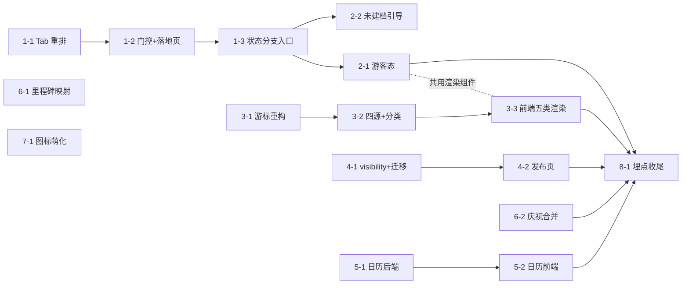

# V1.1.2 工作拆分预览

> **这不是正式的 epics 文档**，是架构定稿后的一张工量预判，供你判断规模和排期。
> 正式拆分由下一步 `bmad-create-epics-and-stories` 产出 `epics-v1.1.2.md`，届时编号和边界可能微调。
> 2026-07-31 · 依据 `../architecture-v1.1.2-delta.md`

---

## 规模一览

**8 个 Epic / 15 条 story**（不含正式拆分时可能追加的联调条目）。

规模用相对档位表示，不给人天——本仓库既有 story 的粒度差异很大，折人天需要你按团队实际速度换算。

| Epic | 内容 | Story 数 | 规模 | 后端 | 前端 |
|---|---|---|---|---|---|
| E1 | Tab 信息架构与门控 | 3 | 中 | 无 | 中 |
| E2 | Diary 游客态与建档引导 | 2 | 中 | 无 | 大 |
| E3 | **时间线整合** | 3 | **大（本版本最重）** | 大 | 中 |
| E4 | 内容发布模型 | 2 | 中 | 中 | 中 |
| E5 | 日历联动 | 2 | 小 | 小 | 中 |
| E6 | 里程碑自动路径 | 2 | **小** | 极小 | 小 |
| E7 | Tab 图标萌化 | 1 | 小 | 无 | 小 |
| E8 | 埋点收尾 | 1 | 中 | 小 | 中 |

**重心提示**：E3 一个 Epic 的后端工作量，大约等于其余七个加起来。E6 看着是个独立需求，实际改动可能是全版本最小的一条。

---

## 逐条明细

### E1 · Tab 信息架构与门控（FR-78 / FR-79）

| # | Story | 规模 | 说明 |
|---|---|---|---|
| 1-1 | Tab 顺序与底层索引重排 | 中 | 含 AD-3 的 **5 处索引寻址调用点核对清单**，逐条打勾作为硬性验收项。这条的风险不在代码量，在漏改 |
| 1-2 | 登录门控解除 + 落地页矩阵 | 中 | **两处门控**（深链前缀匹配 + Tab 点击判定），改法不同。含 [+] 登录后回跳改 Diary、名片深链游客落点改 Diary 游客态、切回 Diary 自动刷新 |
| 1-3 | Diary 页状态分支单一入口 | 小 | **AD-15 的基座**，E2 两条 story 的共同前置。本身很薄，但必须先立 |

### E2 · Diary 游客态与建档引导（FR-80 / FR-81）

| # | Story | 规模 | 说明 |
|---|---|---|---|
| 2-1 | 游客引导态（FR-80） | **大** | 9 条示例内置数据 + 五类样式渲染。**共用渲染组件的建立者**（AD-13 Rule 4）——谁先落地谁建，与 3-3 强耦合 |
| 2-2 | 状态 A 未建档引导 + 废止 FR-0H | 小 | 复用既有建档引导；FR-0H 首页提示条整条移除，含埋点下线 |

### E3 · 时间线整合（FR-82）—— 本版本最重

| # | Story | 规模 | 说明 |
|---|---|---|---|
| 3-1 | **统一游标锚点重构 + 回归测试** | **大** | 修的是现网缺陷（§1.1），不是新功能。**必须配"补记旧日期日记跨页拉取"的回归断言**。3-2 的前置 |
| 3-2 | 四源接入 + 五类分类后端下发 | **大** | 里程碑完成 / 身份证生成两个新源接入；按五步优先级实时计算 `itemType`。**严禁落库固化** |
| 3-3 | 时间线前端五类渲染 | 中 | 与 2-1 共用同一套条目渲染组件 |

### E4 · 内容发布模型（FR-83）

| # | Story | 规模 | 说明 |
|---|---|---|---|
| 4-1 | `visibility` 字段 + 迁移 + Feed 取数改造 | 中 | **本版本唯一的数据库迁移**（V98 起）。含废止「状态 B 用户 Feed 不显示成长日历」规则。⚠️ 作者自视视图不得过滤（AD-4 Rule 3） |
| 4-2 | 发布页同步开关 + 默认类型 | 中 | 含类型选择器顺序调整、无档案默认 Moment、**以及与既有 Tab 语境预选逻辑的口径合并**（§1.5） |

### E5 · 日历联动（FR-84）

| # | Story | 规模 | 说明 |
|---|---|---|---|
| 5-1 | 日历后端补条数维度 + 当天详情补第三源 | 小 | 后端只补一维（AD-9）；**当天详情要先补结构化健康记录这个源再改排序**（AD-10），别只估成"改排序" |
| 5-2 | 日历格子优先级与图标（前端） | 中 | 含**纯文字日记错显 🏥 的现网缺陷修复**（纯前端）。图标标识符已核实全部有效 |

### E6 · 里程碑自动路径（FR-86）

| # | Story | 规模 | 说明 |
|---|---|---|---|
| 6-1 | 绝育→M9 映射 + M5 订阅咨询结束 + **健康类取消打卡** | 小 | 映射加一行 + 订阅既有事件（OQ-17 自动满足）；**新增**：后端对健康类打卡请求显式拒绝 + 前端列表页隐藏四条打卡入口（2026-07-31 拍板，原估「极小」已上调） |
| 6-2 | 多里程碑同时解锁的庆祝合并 | 小 | 纯前端，复用现有组件，零新增视觉设计 |

### E7 · Tab 图标激活态萌化（FR-78A）

| # | Story | 规模 | 说明 |
|---|---|---|---|
| 7-1 | 激活态萌化装饰 + 入场动效 | 小 | 视觉稿 **T3 屏「方案A」已定**（替换 pop-art 投影）。含回改 V1.0.0 `icon-system.md` 激活态规范。不阻塞 |

### E8 · 埋点收尾（AD-5）

| # | Story | 规模 | 说明 |
|---|---|---|---|
| 8-1 | T-1~T-4 / T-6~T-12 共 11 项 | 中 | T-5 已删。**动手前先实测确认** Tab 切换确实不产生浏览事件（架构文档中的唯一 `[ASSUMPTION]`）。须同步回写全局埋点文档 |

---

## 依赖关系

**能并行的**：E3（时间线）、E4（发布模型）、E5（日历）、E6（里程碑）四条线彼此**没有依赖**，可以同时推。

**必须串的**：
- E1 内部三条严格顺序（重排 → 门控 → 状态分支入口）
- E1-3 是 E2 两条的共同前置
- E3-1 → E3-2 → E3-3 严格顺序（游标不修好，接新源等于在坏地基上盖楼）
- E8 排最后（你的决定），依赖全部功能落地

**跨 Epic 的软耦合**：2-1 与 3-3 共用同一套条目渲染组件。谁先排到谁负责建组件，另一条复用。**排期时最好让这两条挨着，或者指派同一个人**，否则容易各写一套。

---

## 建议的推进顺序

考虑依赖、并行度和风险前置：

1. **E1**（1-1 → 1-2 → 1-3）—— 地基，且 1-3 卡着 E2
2. **E3-1 单独提前**（游标重构）—— 它是本版本最大的技术风险，且改的是现网缺陷，越早暴露问题越好
3. **E2 / E3-2 / E4 / E5 / E6 并行铺开** —— 此时依赖都已解开
4. **E3-3 与 E2-1 协调**（共用组件）
5. **E7** —— 视觉稿已定，可随时插入
6. **E8 埋点收尾**

---

## 风险提示

| 风险 | 说明 |
|---|---|
| **1-1 漏改** | Tab 编号重排的风险不在代码量，在按编号寻址的地方漏改一处 → "点推送进错页面"这类难查问题。5 处核对清单是硬性验收项，不能签字了事 |
| **3-1 是在动老代码** | 不是加功能，是重构一个已上线的查询路径。回归测试不到位会伤到现有用户的时间线 |
| **4-1 迁移方向** | PRD 原稿那张表把默认值写反过（已订正为公开）。实施时以架构文档 AD-4 为准，**别回头翻 PRD 早期版本** |
| **2-1 与 3-3 走样** | 两条 story 各写一套渲染 → 游客看到的和真实拿到的不是一个东西。已在 AD-13 Rule 4 写死必须共用组件，但需要排期上配合 |
| ~~E7 无视觉稿~~ | **已排除**：复核 UI 稿时确认 T3 屏含完整的方案A 规格，E7 可正常排期 |
| **E8 的价值已缩水** | 不取基线（AD-6）后，5 个核心指标里 3 个拿不到。埋点本身仍要做（为以后攒数据），但**别指望它能回答"这次改版是对是错"** |
