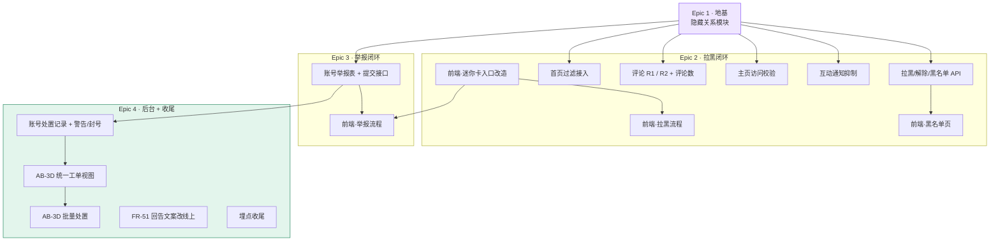

# V1.1.4 工作拆分预览

> **这不是最终的 epics / stories**，是架构阶段给出的**切分建议 + 依赖关系**，供下一步 `bmad-create-epics-and-stories`（CE）参考。
> 依据：`architecture-v1.1.4-delta.md` 的 AD-1 ~ AD-20。2026-08-15。

---

## 总览

| | 数量 | 说明 |
|---|---|---|
| 建议 Epic | **4 个** | 地基 / 拉黑闭环 / 举报闭环 / 后台 + 收尾 |
| 建议 Story | **约 15 条** | 后端 9 · 前端 5 · 收尾 1 |
| 新增数据库迁移 | **3 个** | V101 / V102 / V103 |
| 新增模块 | **1 个** | 社区关系模块 |
| 改动既有代码的高风险点 | **5 处** | 见文末清单 |

**关键排期事实**：**AB-3D 后台必须与 FR-58 同版本上线**，否则用户能提交举报、运营无处处理，功能上线即空转。

---

## 依赖图

**唯一的硬串行是 Epic 1** —— 隐藏关系那张表和那个只读口子不落地，后面六条后端 story 一条都动不了。**Epic 1 做完之后，拉黑侧和举报侧可以完全并行。**

---

## Epic 1 · 地基（必须最先，不可并行）

| Story | 内容 | 迁移 | 验证层级 |
|---|---|---|---|
| **1.1** | 社区关系模块骨架：隐藏关系表 + 来源枚举 + 写服务（建立/解除）+ **唯一对外只读端口** | **V101** | L0 编译 + L1 集成 |

**这条 story 的验收重点不在功能，在契约**：

- 唯一键必须是 `(holder, target, source)` 三元 —— **幂等只在同源之间成立**。写一个测试：已有举报隐藏时再拉黑，**必须新增一行**。
- 只读端口必须提供两种查询：「**存在任意隐藏**」（五处过滤用）与「**存在主动拉黑**」（主页访问校验用）。**少提供后者，研发就会拿前者去拦主页，直接打死举报闭环。**
- 其余模块**只准依赖端口接口**，不准碰仓储。

> ⚠️ 这条 story 体量不大但**是整版本的单点**，建议排在最前且不与其他 story 抢人。

---

## Epic 2 · 拉黑闭环（Epic 1 完成后，内部大面积可并行）

### 后端

| Story | 内容 | 依赖 | 备注 |
|---|---|---|---|
| **2.1** | 拉黑 / 解除 / 黑名单列表三个端点 | 1.1 | 幂等；列表只收录含主动拉黑的条目；带「已举报」标记；注销条目匿名态保留 |
| **2.2** | 首页过滤接入 | 1.1 | **加一条件，不动既有那条**（AD-9）；过滤必须在数据库里做（AD-5） |
| **2.3** | 评论 R1 / R2 + 评论数口径 | 1.1 | **本 Epic 技术难度最高的一条**，见下方提示 |
| **2.4** | 主页访问校验（迷你主页端点加可选 viewer + 专用错误） | 1.1 | 端点保持游客可读；**只认主动拉黑** |
| **2.5** | 互动通知抑制 | 1.1 | **两条判据**，不是一条，见下方提示 |

**2.3 的三个坑**（PRD 与 UI 稿都写了，但极易漏）：

1. **R2 判的是「内容作者」不是「当前查看者」** —— 做成按查看者过滤的话，第三方仍然看得到，等于没解决问题。
2. **回复串要随父一起隐藏**，不论回复者是谁 —— 否则内容作者会看到「回复了某条看不见的评论」的孤儿回复。
3. **评论数要同步改**：R2 隐藏的不计入、**R1 隐藏的照常计入**。不改就会出现「显示 5 条评论却只数得出 4 条」。

**2.5 的坑**（**PRD 没覆盖，架构评审补的**）：

抑制判据有**两条**：「收通知的人隐藏了他」**或**「内容作者隐藏了他」。只做第一条，会漏掉**第三方**那一支 —— A 拉黑 B，B 在 A 的帖子下回复 C 的评论，C 没拉黑任何人却收到通知、点进去看不到。详见 delta 的 AD-6。

### 前端

| Story | 内容 | 依赖 | 备注 |
|---|---|---|---|
| **2.6** | 迷你卡入口改造（A 泳道 6 屏） | 2.4 | **改既有组件，是前端的地基**，见下方三处既有行为变更 |
| **2.7** | 拉黑流程（C 泳道 4 屏） | 2.6 · 2.1 | 主按钮用危险色；成功收起 + Toast，失败保持打开 |
| **2.8** | 黑名单页（D 泳道 10 屏，含 D7b） | 2.1 | **解除提示分两句**，视对方是否也被举报过 |

**2.6 里三处是改既有行为，不是新增**（研发很容易只加新分支）：

1. 拉取失败**由静默不弹改为弹提示** —— 必须**改原来那个吞掉异常的分支**。
2. 「已拉黑」不弹卡**要走独立分支**，不能复用上面那条静默路径。
3. **评论区头像接入弹卡** —— 这是本版本最大的闭环缺口：影子评论 / R1 / R2 / 通知抑制**全是为评论区骚扰设计的**，而入口原先在评论区根本不存在。实现时**一并复核评论区的已注销分支**（这个判断此前只在首页侧考虑过）。

---

## Epic 3 · 举报闭环（与 Epic 2 并行）

| Story | 内容 | 迁移 | 依赖 |
|---|---|---|---|
| **3.1** | 账号举报：工单表 + 明细表 + 提交接口 + **举报即隐藏**（同事务写隐藏行） | **V102** | 1.1 |
| **3.2** | 前端举报流程（B 泳道 7 屏）+ **成功后乐观移除该作者全部卡片** | — | 2.6 · 3.1 |

**3.1 的三个硬要求**：

- 工单粒度 = **被举报账号**；每次举报作为明细行追加，**类型与补充说明都要留，不覆盖前次**。
- **不能照抄内容举报的幂等做法**（那边重复举报直接吞掉、什么都不发生）—— 那样次数、类型变化、补充说明会全部丢失。
- **必须新建账号维度的五类理由枚举**，不许复用内容维度那套（现成的 `report_sheet` 很好套，一套就会弹出「虚假信息 / 不当内容」这种对不上的选项）。

**3.2 的隐性要求**：举报成功点关闭时，**当前列表要立刻移除该作者的全部卡片**（不是只移除某一条），**且必须静默**——弹任何提示都会泄露「举报会隐藏内容」，与产品刻意的取舍冲突。从详情页进来的还要**先退回上一级列表**再移除。

---

## Epic 4 · 运营后台 + 收尾（串行度最高）

| Story | 内容 | 迁移 | 依赖 |
|---|---|---|---|
| **4.1** | 账号处置记录表 + 警告 / 封号两个动作 | **V103** | 3.1 |
| **4.2** | AB-3D 统一工单视图：三表联合查询 + 优先级排序 + **筛选与检索** | — | 4.1 |
| **4.3** | AB-3D 批量处置（上限 50、同类型、逐条独立事务、部分失败逐条回报） | — | 4.2 |
| **4.4** | **FR-51 回告文案改线上** | — | 无 |
| **4.5** | 埋点收尾（区分产生来源与操作入口 + 黑名单页举报点击） | — | 2.x · 3.x |

**4.2 的两个提醒**：

- **筛选不是锦上添花，是统一视图成立的前提** —— 三类混进一个队列，没有筛选就等于没法专注处理某一类。必须与列表同 story 交付。
- **第三类工单（账号标识字段审核）没有举报人，公式对它恒为 0 分会永远沉底**。按 delta 给的默认映射实现（P0→10 / P1→2 / P2→0），这条是**架构评审补的，PRD 里没有**。

**4.4 单独成条的理由**：工程量就是改一行字，但它**会连带改变已经上线的内容举报回告**。混在别的改动里悄悄改掉，上线后没人知道这是有意为之。**必须在 story 里显式列出。**

**4.5 参照 V1.1.2 的做法**（埋点集中为一条收尾 story），在功能逻辑都理清后统一实现。

---

## 改动既有代码的五个高风险点（给评审用的核对清单）

| # | 位置 | 风险 | 怎么验 |
|---|---|---|---|
| **R1** | 主页访问校验 | 写成「有隐藏关系就拦」→ 把举报隐藏也拦掉，**举报闭环当场作废** | 造一个「只被举报过、没被拉黑」的用户，**必须照常弹卡**，且卡上显示「已举报」 |
| **R2** | 评论 R2 | 做成按查看者过滤 → 第三方仍看得到，**等于没做** | 三个视角各看一遍：作者看不到 / 第三方看不到 / 评论者自己看得到 |
| **R3** | 通知抑制 | 只做一条判据 → **第三方收到点进去空白的通知** | 造 A 拉黑 B、B 在 A 帖下回复 C 的场景，**C 不能收到通知** |
| **R4** | 迷你卡失败分支 | 只加新分支、没改原来那个静默吞异常的 → 网络失败仍然什么都不发生 | 断网点头像，**必须出提示** |
| **R5** | 封号 / 注销 | 两个概念在代码里近乎同名而要求相反 → **做反** | 黑名单里放一个被封号的、一个已注销的：封号的**照常展示可点可拉黑**，注销的**匿名态、不可点、条目保留** |

---

## 排期建议

**并行度**：Epic 1 单条串行（1～2 天）→ 之后 Epic 2 与 Epic 3 完全并行 → Epic 4 跟在 Epic 3 后面。

**前后端配比**：后端 9 条 / 前端 5 条 / 收尾 1 条。前端的 2.6（迷你卡改造）是前端侧的地基，**建议与后端 Epic 1 同步启动**（它只依赖 2.4 的错误契约，契约先定即可动工）。

**上线门槛**：
- **AB-3D（Epic 4 的 4.2）必须与 FR-58 同批上线**，不可拆版。
- **封号功能（4.1 的一半）等法务确认印尼语文案**，可先做完代码、文案位留出，不阻塞其余全部功能上线。
- **上线前先量基线**（产品侧动作，见 delta §7 PRD-2）。
