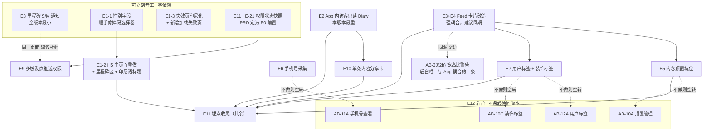

# V1.1.4 工作拆分预览

> **这不是正式的 epics 文档**，是一张工量预判，供判断规模、排期与范围取舍。
> 正式拆分由 `bmad-create-epics-and-stories` 产出 `epics-v1.1.4.md`，届时编号与边界会微调。
> 2026-08-11 · 依据源目录三份文件 + 当前 `hex/v1.1.4` 分支代码实读
>
> ⚠️ **与 V1.1.2 的流程差异**：V1.1.2 是"架构 delta 先出、拆分预览后写"。本次是**架构 delta 之前**写的，
> 因此下表的规模是按代码实读推的、不是按 AD 条目推的，架构 delta 出来后可能上下浮动。

## 输入文件（尚未归档进仓库，仅在源目录）

`/Users/hexsfile/work/MY-PROJECT/Pet Project/TailTopia/V1.1.4/`

| 文件 | 状态 |
|---|---|
| `改版1-1-4prd.md` | 已定稿 2026-08-10 · 9 条 FR |
| `ui-h5-namecard-redesign.html` | 已定稿 2026-08-10 · 4 屏（H5） |
| `ui-standalone-features-integrated-v1.html` | 已定稿 2026-08-10 · 28 屏 / 8 泳道（App） |
| `v1-1-4后台prd.md` | 已定稿 · **本预览未细读，仅按标题估量** |

**建议先归档**（沿用 V1.1.2 惯例：拷进本目录），否则 epics 的 `inputDocuments` 又要标 `SOURCE-ONLY`。

---

## 〇、已拍板决策（2026-08-11，产品确认）

| # | 议题 | 决策 | 落点 |
|---|---|---|---|
| D-1 | 宠物性别字段 | **把档案编辑页那个假选择器补成真字段**（现状：选了不提交不入库）。H5 一并展示性别与生日；存量宠物为空需容错 | E1-1 |
| D-2 | H5 里程碑区块 | **按 UI 定稿现状全做**：完成数/总数 + 具名徽章 + 灰色锁定位 + 「+N」。总数按物种取现成值（猫 31 / 狗 31 / 通用 16），稿子的 30 与 +23 是示意数字 | E1-2b |
| D-3 | H5「最新动态」一行 | **由已完成里程碑清单的最近一条推出**（取完成时间最新者），不新增取数 | E1-2b |
| D-4 | 里程碑名称的印尼语来源 | **后端补一份印尼语标题，专供 H5 用**。App 侧继续用自己那份 en/id 翻译表，不搬、不改已上线页面。⚠️ 代价：同一批名字两处维护，同步责任写入架构 delta | E1-2b |
| D-5 | 宠物名片深链落点 | 已装 App 点深链 → **进入被分享的那只宠物的只读视图**（现状错误地落在给游客做的「示例成长本」种草页）。作者本人仍落自己的页、保留管理入口 | E2-4 |
| D-7 | Feed 图片高度护栏（2026-08-11 新增） | **加一条渲染上限，保证下一条内容的顶部总能露出来。** 表述锚定目的、不写死百分比：**图片区高度上限 = 可视区高度 − 条目其余部分高度 − 露出余量（建议 56pt）**，超出即 cover 居中裁切。缘由与代价见 §六 | E3-3 |
| D-6 | 图片宽高是否入库 | **现在就存。** 发布时客户端本来就要判容差区间、尺寸在手，顺带上报即可；存了之后比例收敛在服务端算好，客户端不用猜、新内容不再有加载期高度跳动。⚠️ **这推翻了 FR-71「零数据模型变更」这条选型理由**（PRD 已预留该退路，需在架构 delta 记录）。⚠️ **存量内容仍无尺寸**，占位策略不能取消、只是缩小到存量范围 | E3-4 |

---

## 一、开工前必须先处理的 3 处

前两条已定；第 3 条是新识别的缺口，不处理会在 story 里被工程按字面实现。

| # | 位置 | 情况 | 处置 |
|---|---|---|---|
| 1 | FR-92 §② 表 · H5 稿 E1 屏 | 「性别」可见。**档案里没有真字段**——编辑页的 KELAMIN 是纯前端占位（选了不提交不入库），真性别只在宠物身份证上（默认「未知」，且非每宠都有） | 已决定：**把占位补成真字段**（见 E1-1）。PRD 无需改，但需在架构 delta 里明确该字段新增 |
| 2 | FR-92 §② 表 · H5 稿 E1 屏 | 里程碑区块「7 / 30」+ 具名徽章 + 灰色锁定位 + 「+23」+ 最新动态一行 | 已决定（2026-08-11）：**按稿子现状做，全保留**。与 FR-92 §② 表「含未完成的灰色锁定态可见」一致，**文档无分叉、无需回写**。⚠️ 实际总数是**猫 31 / 狗 31 / 通用 16**（稿子的 30 与 +23 是示意数字），按物种取现成的总数即可 |
| 3 | **里程碑名称的印尼语来源（新识别 2026-08-11）** | 里程碑清单接口现成，但**后端的 `title` 是中文**（"第一张照片上传到成长日历"）。印尼语名称目前只在 **App 前端**的一份翻译表里，而那份文件明写了一条既定规则：「显示文案一律在客户端按 locale 出，**杜绝任何后端语言（中文）泄漏**」。H5 是服务端渲染、**没有客户端**，照现状做会在 H5 上显示中文徽章名 | ✅ 已定（D-4）：**后端补一份印尼语标题给 H5 专用**。不搬 App 那份、不改已上线页面。**同步责任写入架构 delta**——两处名字未来若改动需一并改 |
> `[已撤回 2026-08-11]` 本节原有第 4 条，称「App PRD §0 的后台配套表只列 6 条、已过期，需补 AB-3I/3J/3K/3L」。**该判断错误，已删除。**
> 那张表的作用很窄——只列「App 的某条 FR 依赖后台配置、后台不上线 App 就是空壳」的条目；AB-3I~3L 是运营铺种子内容的工具链（用哪个身份发 / 图片怎么上传 / 批量怎么校验 / 能否预约时间），**无任何 App 侧 FR，App 端也不会因它们缺席而空转**，不属于 App PRD。表无需改动。
>
> 核查中捞到一条**真实耦合**，记录在此：**AB-3J（2b）图片宽高比检测与警告**明确关联 App 端 FR-71 —— App 端用户上传超比例图会弹裁剪框自选构图，**后台发种子内容没有这一步**，超比例图静默进库后会被 FR-71 的新渲染规则裁切，运营不知道自己的图被切了多少。后台 PRD 已自行写明该要求，**不需要动 App PRD**；但意味着 FR-71 上线即影响后台种子内容的构图，两边宜同期交付。

---

## 二、规模一览

**12 个 Epic / 约 27~31 条 story。** 规模用相对档位，不给人天。

| Epic | 内容 | FR | Story | 规模 | 后端 | 前端 | 后台依赖 |
|---|---|---|---|---|---|---|---|
| E1 | H5 分享页改版（3 模板 + 性别/生日字段 + 里程碑区） | FR-92 §①③④ | 4 | 中 | 中 | 无（H5 属后端模板） | 无 |
| E2 | **App 内访客只读 Diary** | FR-92 §② | 4 | **大** | **大** | 中 | 无 |
| E3 | **图片规范化（裁剪 + 多图轮播 + 渲染口径）** | FR-71 | 4 | **大** | 中 | **大** | 无 |
| E4 | Feed 通栏化 + 首页点赞评论 | FR-93 | 2 | 中 | 中 | 中 | 无 |
| E5 | 内容顶置坑位 | FR-68 | 2~3 | 中 | 中 | 中 | AB-10A |
| E6 | 手机号采集 | FR-70 | 2 | 中小 | 小 | 中 | AB-11A |
| E7 | 用户标签 + 内容装饰标签 | FR-74 / FR-75 | 3 | 中 | 中 | 中 | AB-12A / AB-10C |
| E8 | 里程碑 S/M 通知补齐 | FR-76 | 1 | **小** | 小 | 极小 | 无 |
| E9 | 多触发点推送权限唤醒 | FR-85 | 2 | 中小 | 极小 | 中 | 无 |
| E10 | **单条内容分享卡片（含卡片生成基建）** | FR-73 | 3~4 | **大** | 中 | **大** | 无 |
| E11 | 埋点收尾 E-1~E-27（含 H5 从零接入） | §3 | 2 | 中 | 中 | 中 | 无 |
| E12 | **运营后台 10 个模块** | 后台 PRD | ? | **大（未细读）** | **大** | — | 本体 |

**重心提示**

- App 侧三块最重：**E2 访客只读 Diary、E3 图片规范化、E10 分享卡基建**。三者加起来约占 App 侧一半工量。
- **E8 是全版本最小的一条**，看着是个独立需求，实际只是加一种通知类型。
- **E12 后台是本版本最大的不确定性**：后台在同一个 Spring Boot 仓库里（Thymeleaf 管理页，现有约 30 个页面），10 个模块且不出 UI 设计。PRD 已声明"后台不晚于 App 端上线"，但这条承诺目前没有排期依据。**建议尽早单独核这一块。**
- 数据库迁移**从 V100 起**（当前最后一个是 V99），按执行顺序单调分配。

---

## 三、逐条明细

### E1 · H5 分享页改版（FR-92 §①③④）

现状：模板目录下只有 `card.html` / `card_gone.html` / `milestone_share.html`。

| # | Story | 规模 | 说明 |
|---|---|---|---|
| 1-1 | 档案性别字段落地 + H5 补生日/性别下发 | 小 | 一个库字段（V100）+ 编辑页真提交 + H5 传值。顺手修掉"能选但存不下"的既有缺陷。**存量宠物一律为空，H5 需容错缺省** |
| 1-2 | `card.html` 按 E1/E2 屏重做 | 中 | 主色 `#2BB58A` 绿系 → 品牌紫；引 4 个 Google Fonts（产品已拍板接受依赖）；须补 `preconnect`、保 `display=swap` |
| 1-2b | 里程碑区块 + 最新动态取数 | **小（好消息）** | 里程碑清单能力**已经现成**：完成数、总数、每条的名称/级别/完成态/完成时间都有，H5 只需换成按宠物取而非按登录用户取。灰锁位与「+N」由现成数据推出，**最新动态**取完成时间最近的一条即可，零额外取数。唯一真缺口是 §一-3 的**印尼语名称** |
| 1-3 | 失效页印尼化 + **新增加载失败页** | 小 | 失效页现为全篇英文（正常页全篇印尼语），且**被宠物名片与里程碑分享两条链路共用，一次改覆盖两处**。加载失败页**当前不存在**，服务异常时访客看到浏览器白屏——属新增页面，不是"重做视觉"。CTA 双合一（§④）在 1-2 一并做 |

### E2 · App 内访客只读 Diary（FR-92 §②）—— 本版本最重的隐性工作量

⚠️ **UI 稿说"访客态 = 作者态减去打 ❌ 的部分，不是重新设计页面"——这句只在界面层成立。**
数据层：现有全部档案取数（时间线 / 日历 / 某天详情 / 统计）**清一色只服务当前登录用户自己**，没有任何"按分享链接看别人宠物"的能力。

| # | Story | 规模 | 说明 |
|---|---|---|---|
| 2-1 | 按 token 的访客只读取数接口 | **大** | 时间线 / 统计两条先立。**健康记录与问诊记录必须在后端就不下发**——不能靠前端不画（PRD 自己把泄露定性为"严重隐私事故"）。同时要处理"作者注销/档案删除/token 失效"与现有防枚举口径对齐 |
| 2-2 | 日历视图 + 某天详情的访客版 | 中 | FR-92 表里日历视图对访客可见。同样要在后端过滤掉健康与问诊两源 |
| 2-3 | 访客态页面渲染（复用作者态结构做减法） | 中 | 去掉入口网格两张卡（健康记录 / 身份证）、去掉标题行的分享与编辑按钮、去掉分享 FAB、无互动能力。**统计条保留三列**（问诊「次数」可见、记录不可见）。注意页面无「陪伴天数」字段（那是 H5 独有） |
| 2-4 | 深链落点改造 | 中 | **现状：点宠物名片深链进 App，落的是「示例成长本」种草页**（V1.1.2 给游客做的），不是被分享的那只宠物。需按访问者身份分流：作者本人 → 自己的页（保留管理入口）；已登录非作者 → 访客只读态；未登录 → 现有游客态或商店 |

### E3 · 图片规范化（FR-71）

| # | Story | 规模 | 说明 |
|---|---|---|---|
| 3-1 | 裁剪交互（容差区间判定 + 2 档预设 + 批次锁定） | **大** | **项目里目前只有选图能力、没有任何裁剪库**。要么引第三方裁剪库（新依赖），要么自研选区交互。PRD 把它写成发布页的一处小改动，实际够一条独立 story。含闭区间 0.75~1.34 端点口径、左上角 ✕、批次锁定只作用于"需裁剪的图之间" |
| 3-2 | Feed 图片组下发 + 多图轮播 | 中 | **Feed 现在每条只下发一张首图**，要在首页滑图必须把整组图片下发（PRD 未提这条后端改动）。前端做轮播 + 圆点叠图内底边 + 手势分工（横滑翻图 / 纵滑滚列表 / 点击进详情）+ 只预加载当前与下一张 |
| 3-3 | Feed 渲染口径改造（4:3 → 按比例 + clamp + **高度护栏**） | 中 | 现状是固定 4:3 裁切、卡片等高；改为按实际比例、clamp 到 0.75~1.34。**存量与新内容走同一条渲染路径**，不回填不迁移。**含 D-7 高度护栏**：先按比例算高 → 再按屏幕可视高度设上限 → 超出 cover 居中裁切；多图帖按首图锁定后的高度套护栏。**须实机复核（L2）**，且至少覆盖一台小屏机 |
| 3-4 | **图片宽高入库 + 存量占位兜底**（D-6 已定） | 中 | **新增一个与图片列并行的尺寸列**（按下标对应），不改既有图片列的结构——既有读取点（首页首图 / 详情 / 时间线 / 名片 / 后台）**一处都不用动**，存量为空、零迁移。写入端由客户端上报（它判容差区间时尺寸已在手）。⚠️ **存量内容永远没有尺寸**，所以占位兜底仍要做，只是范围从"全部内容"缩到"存量内容"。⚠️ 后台发的种子内容也要能带上尺寸，否则运营发的图仍会跳动（与 AB-3J(2b) 同源） |

### E4 · Feed 通栏化 + 首页点赞评论（FR-93）

| # | Story | 规模 | 说明 |
|---|---|---|---|
| 4-1 | Feed 取数补「我是否已赞」与「评论数」 | 中 | 点赞数后端**已在下发**（前端现在收到就丢掉）；缺的是 `liked` 与评论数。列表每条都要这两个值，**取数方式要一并定死**，否则会退化成逐条查、翻页越多越慢 |
| 4-2 | 通栏容器 + 操作行 | 中 | 去描边圆角与屏边距、图片全宽出血、1px 分隔线；元素顺序 作者行 → 图片 → 操作行 → 正文 → 时间；保留内容类型徽章。**点赞组件已实现未登录门控/乐观更新/失败回滚，直接复用即可**。点击分区变了：操作行不再整块跳详情（点赞就地切换、评论跳详情并定位评论区） |

### E5 · 内容顶置坑位（FR-68）

| # | Story | 规模 | 说明 |
|---|---|---|---|
| 5-1 | 顶置配置数据模型 + 定时上下线 | 中 | 新表（V10x）。**坑位维度必须做成配置项、不可把 Feed 写死**（本版本只有 Feed 一个坑位，但要求可扩展）。时间一律按 WIB 解释、入库转 UTC、按绝对时刻上下线。排期窗口不可重叠、提交时拦截 |
| 5-2 | Feed 注入顶置条目 + 顶置角标 | 中 | 顶置条目与普通条目同构，仅多一个右上角角标（与装饰标签左下角共存）。可顶置范围仅公开内容。**顶置内容期间被下架 → 自动结束该配置**、坑位回退为普通内容填充 |
| 5-3 | 推广卡片（无真实帖）渲染与跳转 | 小 | 图片 + 标题 + 跳转（外链 / 站内深链，复用既有深链设施）。本版本按"平台自有活动引导"定位，不加广告标识 |

### E6 · 手机号采集（FR-70）

| # | Story | 规模 | 说明 |
|---|---|---|---|
| 6-1 | 手机号字段 + 保存/清空接口 | 小 | **后端目前任何地方都没有手机号**。新字段（V10x）+ 印尼格式校验 + **允许留空保存写 null**（PDP 法删除权）。凭证类无关，但属个人信息，日志严禁记录 |
| 6-2 | 一次性软引导 + 「我的」页常驻入口 | 中 | 软引导借用"首次问诊后 / 建档后取最早、全局仅一次"；**与 FR-85 是两套独立计数、不可共用标记位**；同时命中时"先推送权限、后手机号"串行。「我的」页已填写态**按脱敏展示**、进编辑抽屉显完整号。成功/失败 Toast 各一条 |

### E7 · 用户标签 + 内容装饰标签（FR-74 / FR-75）

两条 FR 的展示机制几乎同构（图标 + tooltip + 定时生效），建议同一 Epic、共用 tooltip 组件。

| # | Story | 规模 | 说明 |
|---|---|---|---|
| 7-1 | 标签数据模型 + 定时生效/失效 | 中 | 两张配置表 + 两张分配表（V10x）。定时口径复用 E5 的 WIB → UTC 绝对时刻 |
| 7-2 | 用户标签 4 处展示位 | 中 | Feed 卡 / 详情页作者区 / 评论区 / 迷你主页预览卡——**四处各是一个独立的数据出口，四个都要带上标签字段**。同时展示上限 3 个、按分配时间倒序；空间不足时**昵称完整优先、标签倒序丢弃、不做「+N」** |
| 7-3 | 装饰标签 3 处展示位 + 共用 tooltip | 中 | Feed 卡左下角 / 详情页（有图叠首图角落、无图置正文下方一行）/ Diary 时间线。**可打标范围仅公开内容**。⚠️ 装饰标签生效会给推荐排序 ×1.3 加权，属流量动作——需在后台界面提示运营 |

### E8 · 里程碑 S/M 通知补齐（FR-76）

| # | Story | 规模 | 说明 |
|---|---|---|---|
| 8-1 | S/M 级里程碑写通知中心 | **小** | 现在只有一种里程碑通知类型（L 级在用，含推送）。新增一种"进通知中心但不推送"的类型 + 点击落里程碑列表页 + **计入未读角标** + 同一操作解锁多个时**写 N 条且每条写明具体里程碑名称**。**存量不回填** |

### E9 · 多触发点推送权限唤醒（FR-85）

| # | Story | 规模 | 说明 |
|---|---|---|---|
| 9-1 | 用户侧三触发点（各一次，按设备存储） | 中 | 问诊后 / 建档后 / 打开通知中心。**触发点 4 永不唤起原生弹窗**（一律 App 内引导条 + 跳系统设置）——这是护栏，埋点侧可直接告警校验。前置闸门：已开启则跳过 |
| 9-2 | 兽医侧触发点（唯一例外分支） | 小 | 兽医切"在线"时，**每次都提示、不限首次、无标记位**，不做硬拦截。**必须与用户侧那三个拆开实现**，否则一定会被写成同一套 |

### E10 · 单条内容分享卡片（FR-73）

| # | Story | 规模 | 说明 |
|---|---|---|---|
| 10-1 | 卡片生成基建 | **大** | 文字排版 + 水印 + 双尺寸（9:16 / 1:1）输出，**此前从未实现过**。要求按"供后续分享卡功能复用"的标准设计，不做一次性实现 |
| 10-2 | 有图 / 纯文字两套模板 + 下载二维码 | 中 | 二维码四条硬要求：内容为**该条内容的分享链接**（不是通用下载页）、留白不小于 4 个码元、**导出分辨率下边长 ≥140px**（不可按预览像素直接输出）、纯文字模板必须有白色底板 |
| 10-3 | 分享链接落地与按身份分流 | 中 | **严格只看这一条**：访客不得由此进入宠物 Diary 时间线。**与宠物主页分享必须是不同的链接类型与不同落地页**，不可复用同一深链目标。作者本人保留管理入口；已登录非作者进只读详情 |

### E11 · 埋点收尾（§3 · E-1~E-27）

| # | Story | 规模 | 说明 |
|---|---|---|---|
| 11-1 | App 侧新增/扩展埋点 | 中 | 含 **E-21 权限状态快照（P0，FR-85 的裁决指标，不可后置）**、`post_like_tapped` 补 `source`、FR-85 必须分触发点上报 |
| 11-2 | H5 侧埋点从零接入 | 中 | **`card.html` 目前没有任何埋点脚本**。E-24 走服务端（复用既有服务端埋点通道，不引前端 SDK）；E-25 点击瞬间即报、E-26 靠隐藏时序推断且**必须拆成两个事件**；需一个匿名标识把三步串成漏斗 |

### E12 · 运营后台（后台 PRD，共 10 个模块）

后台在**同一个 Spring Boot 仓库**（Thymeleaf 管理页，现有约 30 个页面），不是独立工程；**不出 UI 设计**，由技术按 PRD 界面要求直接实现。

按「会不会拖住 App 端」分两组，排期上应区别对待：

**(A) 必须与 App 同版本 —— 不做则对应 App 功能空转（4 条）**

| 模块 | 能力 | 卡住哪个 Epic |
|---|---|---|
| AB-10A | 顶置管理（Feed 坑位） | E5 |
| AB-10C | 内容装饰标签管理 | E7 |
| AB-11A | 用户手机号查看 + 批量催填推送 | E6 |
| AB-12A | 用户标签配置与分配 | E7 |

PRD 已把"四项功能空转"风险判为可接受、并承诺后台不晚于 App 上线——**这条承诺目前没有排期依据，建议单独核这 4 条。**

**(B) 与 App 无关、可独立排期（6 条）**

AB-3G 内容互动积分与双口径统计（FR-75 的选品参考工具，非必要条件）· AB-3H 种子内容物种归属标记 · AB-3I 运营发布身份池 · AB-3J 单条发布整改 · AB-3K 批量发布工作台 · AB-3L 种子内容定时发布。

这 6 条都是运营侧工具链，**晚上线不会让任何 App 功能变成空壳**，不占本版本 App 的关键路径。

⚠️ 唯一例外是 **AB-3J（2b）图片宽高比检测与警告**：它关联 App 端 FR-71，FR-71 一上线，后台发的种子内容就会被新渲染规则裁切而运营不自知 —— **这一条宜跟 E3 同期**，其余可后移。

---

## 四、Epic 依赖关系与推进顺序

### 4.1 依赖图

### 4.2 图里几条边的理由

| 边 | 为什么 |
|---|---|
| **E3 ↔ E4 强耦合** | 两者改同一个卡片组件且互相依赖：多图圆点之所以改到"叠在图片内底边"，正是因为 FR-93 把点赞操作行放到了图片正下方；而 FR-71 的整组图片下发与 FR-93 的"是否已赞 / 评论数"是**同一次 Feed 取数改造**。**分两个 Epic 做会改两遍同一处代码**，建议合并成一个"Feed 卡片改造"块，内部顺序：取数扩张 + 容器改版 → 图片渲染口径 → 多图轮播 → 点赞操作行 |
| **E3+E4 → E5 / E7** | 顶置条目与普通条目同构、装饰标签固定卡片左下角——卡片改版没定稿就做，这两处要改两次 |
| **E1-1 → E1-2** | H5 要显示性别，字段得先真实存在 |
| **E2 → E10** | 分享卡的边界规则是"单条分享与主页分享必须是两种不同的链接、两个不同落地页"。主页分享那条链路（E2）先定型，E10 才知道自己不能撞什么 |
| **E-21 → E9** | 没有权限状态快照，FR-85 上线后无法回答"授权率到底涨没涨"，只能看到弹了多少次。PRD 明确定为 P0 前置、不可后置 |
| **E8 ⋯ E9 相邻** | 两者都改通知中心页面（E8 加 S/M 记录、E9 加顶部引导条），相邻做省一次上下文 |
| **E3+E4 ⋯ AB-3J(2b)** | 同源改动：FR-71 一上线，后台发的种子内容就会被新渲染规则裁切而运营不自知。**这是后台 10 条里唯一与 App 耦合的一条**，宜同期 |
| **全部 → E11** | 埋点收尾要等功能都在（沿用 V1.1.2「埋点集中一条 story」的做法）。**唯一例外是 E-21**，它必须提前 |

### 4.3 推进顺序

1. ~~回写文档分叉~~ ✅ 已处理（§一 三条：性别按 D-1 落地、里程碑区按稿子现状、印尼语标题缺口新识别）
2. ~~归档输入文件~~ ✅ 已完成（本目录 6 份文件 + README）
3. ~~架构 delta~~ ✅ 已产出 `../architecture-v1.1.4-delta.md`（17 条 AD）+ `架构决策-人话版.md`
4. **下一步：切 epics 与 story**（`bmad-create-epics-and-stories`）。注意按 4.2 把 E3 与 E4 合并考虑
5. 后台（E12）**并行单独核排期**——尤其那 4 条必须同版本的，别等 App 快完了才发现后台没开工

## 六、D-7 图片高度护栏：缘由与代价

**起因的提问：** 用户上传一张超长图、又恰好落在容差区间内，会不会滚很久看不到下一条？

**规格上不会。** 容差区间说的是宽÷高，下界 0.75（3:4 竖图）**本身就是高度硬上限**：9:16 ≈ 0.56、长截图 ≈ 0.1，全在下界之外，必须走裁剪框；存量内容一律 clamp 到 0.75；多图帖按首图锁高。**图片高度天花板恒等于 1.33 × 屏幕宽度**，突不破。

**但真实问题是"一屏一条"。** 通栏全宽出血下，390pt 宽机型的竖图（0.75）图高 520pt，整条约 670pt，而可视区约 640~700pt —— **一条竖图约占满一屏**（现状固定 4:3 时一屏 1.5 条）。而竖图不是极端情况、是主流（FR-71 的痛点原文就是"手机竖拍为主"）。UI 稿 09c 图注亦承认"连续两张竖图会占掉大半个滚动行程"。

**护栏的表述刻意锚定目的、不写死百分比：**

> 图片区高度上限 = 可视区高度 − 条目其余部分高度（作者行 + 操作行 + 正文两行 + 时间 + 间距，约 152pt）− 露出余量（建议 **56pt**）。超出即 cover 居中裁切。

这样写的好处是**它只在装不下的屏幕上生效**：

| 机型档位 | 3:4 竖图自然高 | 护栏上限 | 实际裁切 |
|---|---|---|---|
| 大屏（430 宽 / 780 可视） | 573 | 572 | 几乎不裁 |
| 常见（390 宽 / 700 可视） | 520 | 492 | 约 5% |
| 小屏（375 宽 / 590 可视） | 500 | 382 | 约 24% |

**已知代价（须如实记录）：** 在小屏机上，3:4 竖图会被裁掉约两成 —— 这**削弱了 FR-71「容差区间内原样展示、不裁剪」这条承诺**，严格说是把它降级为"在装得下的屏幕上不裁"。但对照基线仍是明确改善：现状固定 4:3 对 3:4 竖图**恒裁 44%**。

**上述数字全部是按算术推的，须实机复核**（至少覆盖一台小屏机），复核后把露出余量定死写进架构 delta。

---

## 五、可以先干、不等任何决策的

- E8（S/M 里程碑通知）—— 全版本最小，零依赖。
- E1-1（性别字段落地）—— 顺手修掉既有的假选择器。
- E1-3（失效页印尼化 + 加载失败页）—— 纯模板，且一次修覆盖两条链路。
- E11-1 的 E-21 权限快照 —— PRD 定为 P0 前置，越早埋越早有基线。
