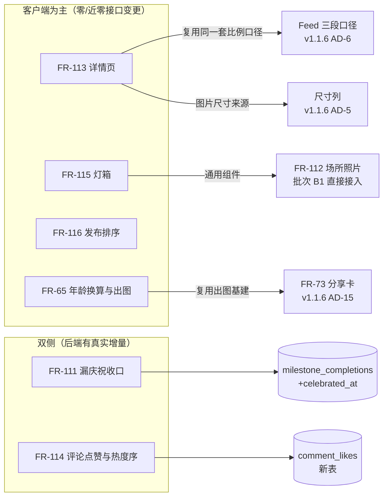

# TailTopia V1.3.0 架构决策文档 —— Delta

> **形态说明**：V1.0 基线与 V1.1.x 各 delta 均已上线冻结。本文件是 brownfield **增量 delta**，只写 V1.3.0 的**新增 / 取代 / 补齐**；未提及处一律**继承基线**。冲突序：**本 delta > V1.1.6 > V1.1.4 > V1.1.2 > V1.1 > V1.0 基线**。正确性以 `PRD-v1.3.0-batch-a-content-fixes.md` 为准，**拍板结论以 `决策日志.md` 为准（更晚）**，视觉以 `ui-v1.3.0-batch-a-content-fixes.html`（27 屏 / 6 泳道）为准。
>
> **底线继承（不重述、全部延续）**：Spring Boot 4 / Java 21 / PostgreSQL + Redis + Flyway；模块化单体；异步只用 `@Async` + DB 状态机；**禁 MQ / 禁调度中间件 / 禁通用缓存层 / 禁新第三方中间件**；DB `snake_case` ↔ Java/Dart `camelCase` ↔ JSON `camelCase`；RFC 9457 ProblemDetail；对外标识不可枚举 token；env 注入凭证不入库；日志禁 PII / 健康 / 令牌 / 签名 URL；`ddl-auto=validate`，schema 归 Flyway。
>
> **运维 envelope 零增量**：不引入任何新中间件、不新增外部依赖、不新增第三方包、不改变部署形态（德国单机）。无新缓存、无新定时任务、无新异步链路。见 AD-A22。
>
> **AD 编号约定**：本文件全版本共用，各批次用带前缀的独立号段——批次 A = `AD-A*`，批次 B = `AD-B*`，批次 C = `AD-C*`。跨批次不复用、不重排。

---

## §0 决策日志（批次 A）

| # | 日期 | 决策 | 出处 |
|---|---|---|---|
| A-1 | 2026-09-10 | G-M2 只由 `VACCINE` 触发，不新增「体检」健康记录类型 | Dai 拍板，`决策日志.md` |
| A-2 | 2026-09-10 | 本批次顺手修健康类里程碑的现网缺陷 | Dai 拍板，`决策日志.md`。⚠️ **拍板时的问题描述有误，已按代码订正**：不是「点了后端拒绝」，实为两件事 —— ① M5/M9 点开只有只读说明、**没有任何去处**；② 通用宠物录健康记录**错点亮**别的里程碑（AD-A4）。修复决定不变，范围按订正后为准 |
| A-3 | 2026-09-10 | 年龄卡二维码指向固定 App 下载页 URL，不带 token，走配置项 | Dai 拍板，`决策日志.md` |
| A-4 | 2026-09-10 | 批次按分支拆分，A/B/C 各自独立 epics 文件 | Dai 拍板，`决策日志.md` |

**PRD 须回写的三处**（PRD-A 是母版 `1-3-0prd.md` 的节选，母版未同步）：A-1、A-2、A-3。见 §7。

---

## §1 Design Paradigm（本批次相关切片）

本批次**不改变系统形态**，是一次典型的**存量页面改造 + 两处窄数据模型增量**。三条形态判断决定了全部 AD 的走向：

1. **前端占主体，但「零接口变更」是错觉。** FR-115 / FR-116 确为纯客户端。**FR-113 不是**——详情响应目前只下发图片地址、没有尺寸（v1.1.6 AD-5 当初明说「既有五处读取点一处不动」，详情页正是其中之一），改原比例必须扩张响应（AD-A12）。**FR-65 也不是**——分享奖励要走服务端记账（AD-A20）、引导标记要读写（AD-A21）。后端真实增量共 **6 支迁移 + 3 个新端点 + 1 处响应扩张**，见 §5 与 AD-A22。
2. **复用优先于新建。** 本批次几乎每一项都有既有基建可接：图片比例走 Feed 同一套三段口径、分享卡走 FR-73 基建、角标走通知红点组件、健康类跳转走既有预选参数。**新写一套等价物即为违规**（AD-A11 / A-19 / A-13）。
3. **两个新交互没有现成轮子，且不许引包。** 灯箱手势（下滑关闭 + 双击缩放 + 放大态防误翻页）与发布页拖拽重排，项目内无同款、`pubspec.yaml` 无 reorder 类依赖。**自实现，不引第三方包**（AD-A15 / A-16）。

---

## §2 依赖方向（本批次相关）

- **新增模块：零。** 全部改动落在既有模块内：`content`（详情页 / 评论 / 灯箱 / 发布）、`profile`（里程碑 / 档案头部 / KTP / 年龄卡）、`config`（PawCoin 渠道配置）、`auth`（用户一次性引导标记）。
- **分享卡基建已在共享层，不产生跨模块依赖。** ⚠️ 订正：出图基建（画布 / 导出 / 二维码 / 水印 / 渲染管线）已经在 `shared/card_render/`，且 KTP 详情页**已经在直接用**。年龄卡复用它**不构成** `profile → content` 依赖 —— 该依赖根本不存在。与 AD-A14 把灯箱上提到共享层是同一个模式，本批次是**沿用**而非新建。
- **灯箱组件上提**：从 `content_detail_page.dart` 的私有 `_Lightbox` 上提为**共享组件**（`shared/` 或 `shared/media/`），使 `content` 与批次 B1 的 `places` 两侧都能接入而互不依赖。见 AD-A14。

---

## §3 Invariants & Rules（批次 A）

### AD-A1 — 庆祝状态落在 `milestone_completions`，不落 `pet_milestones`

- **Binds:** FR-111 漏庆祝收口
- **Prevents:** 按 PRD 字面落到 `pet_milestones` 后，未完成的里程碑行也带一个恒空的 `celebrated_at`；以及「完成」与「已庆祝」两个同生命周期的事实被拆到两张表、每次判定都要 join。
- **Rule:**
  1. ⚠️ **订正 PRD**：PRD §3.2 写「后端 `pet_milestones` 新增 `celebrated_at`」。但完成态不在 `pet_milestones`（那是**每宠物的目录实例**，建档即全量铺行），而在 **`milestone_completions`**（与 `pet_milestones` 1:1，`uq_milestone_completions_milestone` 唯一约束，已含 `completed_at`）。**`celebrated_at` 加在 `milestone_completions`。**
  2. 语义：**可空 `TIMESTAMPTZ`（UTC）**。`NULL` = 已完成但未庆祝过；非空 = 已展示过庆祝页的时刻。
  3. 「已完成且未庆祝」= `milestone_completions` 存在行 **且** `celebrated_at IS NULL`。**这是全链路唯一判据**，前端不得另立标记。
  4. **存量回填一次性做完**，随本批次迁移执行：`UPDATE milestone_completions SET celebrated_at = completed_at WHERE celebrated_at IS NULL`。**不可省**——不回填则上线首日全体老用户进列表页被补弹旧里程碑。

### AD-A2 — 补庆祝只挂里程碑列表页；档案 Tab 只挂角标

- **Binds:** FR-111
- **Prevents:** 两处都弹全屏庆祝（用户从档案 Tab 点进列表页会被连弹两次）；以及角标与补弹各自判定、口径分叉。
- **Rule:**
  1. **全屏庆祝的触发点只有里程碑列表页**。成长档案 Tab **永不弹**全屏庆祝，只显示角标。
  2. 角标数据 = 同一个「已完成且未庆祝」计数，**由成长档案页头部所依赖的那个接口下发**（角标显示在档案 Tab 的里程碑进度条上，那里本来就要取「已完成 / 总数」）。**不新开接口、不在客户端另算、不为角标多发一次请求。** 里程碑列表接口自身已能判定未庆祝条目，无需重复下发。
  3. 进入列表页 → 若存在未庆祝条目 → **自动弹一次**，取级别最高的一条，其余由 KOLEKSI 圆点带过。
  3b. 🔴 **置位范围定死为「客户端本次实际展示所覆盖的那批 code」**，由客户端**显式回传 code 列表**，服务端**按列表置位**。**禁止服务端做 `WHERE celebrated_at IS NULL` 的 mark-all** —— 从客户端读取到回报之间若有系统自动解锁（被点赞、被评论都可能在这几百毫秒内发生），mark-all 会把它静默盖章为已庆祝、**永不补弹**，等于用 FR-111 造出 FR-111 要修的 bug。
  3c. 🔴 **「去发布」路径必须抑制紧随其后的补弹。** 既定时序是「发布成功 → 回填打卡 → 弹庆祝 → 关发布 sheet → **跳里程碑列表页**」，而 AD-A3.1 的回报是异步的 —— 列表页很可能在回报落库前就读到 `celebrated_at IS NULL`，**两秒内连弹两次同一条**。收口：客户端在同一次导航内持有「刚庆祝过的 code 集合」，列表页补弹前先扣除；**不依赖回报是否已落库**。这条与 AD-A3.1 的「失败静默」并存，不得用「把回报改同步」来绕（那会让发布流程卡在一个可失败的写上）。
  4. **不按级别过滤**，S 级也补。入口是用户主动点击，无打扰问题。
  5. 「多条同解锁只弹最高一条」（1.1.2 既有规则）**扩展为全路径统一规则**，含补庆祝路径。
  6. 既有即时庆祝路径与 500/800/1200ms 三次短轮询**全部保留**，补庆祝是兜底不是替代。

### AD-A3 — 庆祝回报 best-effort 且幂等，永不阻塞 UI

- **Binds:** FR-111
- **Prevents:** 回报失败把庆祝页卡住或让用户反复被补弹；以及重复回报覆盖首次庆祝时刻。
- **Rule:**
  1. 庆祝页**展示成功后**回报一次，**异步、失败静默、不重试到用户可感知**。回报失败的代价是下次进列表页再补弹一次，可接受。
  2. **幂等**：`celebrated_at` 只在 `IS NULL` 时写入（`UPDATE … WHERE celebrated_at IS NULL`），已有值不覆盖。
  3. 「重温庆祝」（点已完成徽章）**不改写** `celebrated_at`，也不产生回报。
  4. 埋点 `milestone_celebration_shown` 的 `path` 三值：`instant` / `catchup` / `revisit`，**与回报是两件事**，重温也上报埋点但不回报。

### AD-A4 — 自动完成的寻址改「按物种显式列举」（修一整类线上错误）

- **Binds:** FR-111、决策 A-2
- **Prevents:** 只修「疫苗点亮错里程碑」这一个症状，而放过同一个根因造成的其余四处 —— 它们全都还在线上。
- **Rule:**
  1. 🔴 **根因是「按语义后缀 + 物种前缀」寻址**（`complete(petProfileId, petType, suffix)`）。这套寻址**默认三张清单的同号位含义相同**，但通用清单（OTHER，16 项）比猫狗（各 31 项）短得多、排列不同，同号位大面积错位。**这不是一个 bug，是一类。**
  2. **通用宠物（OTHER）现存的五处错误，全部属本 AD 修复范围**：

     | # | 自动路径用的后缀 | 猫狗含义（对） | 通用清单实际含义 | 后果 |
     |---|---|---|---|---|
     | ① | `M3`（录疫苗） | C/D-M3 疫苗 | **G-M3 陪伴满 30 天** | 🔴 **错点亮** |
     | ② | `M4`（录驱虫） | C/D-M4 驱虫 | **G-M4 记录满 10 条** | 🔴 **错点亮** |
     | ③ | `S14`（首次被评论） | C/D-S14 被评论 | 通用清单**无 S14** | 🔴 **永不点亮**（G-S7 静默失效） |
     | ④ | `S15`（首次被点赞） | C/D-S15 被点赞 | 通用清单**无 S15** | 🔴 **永不点亮**（G-S8 静默失效） |
     | ⑤ | `M10`（记录满 10 条） | C/D-M10 | 通用清单**无 M10** | 🔴 **永不点亮**（G-M4 的合法路径是死的，它只会被 ② 错点亮） |

     ⚠️ ③④⑤ 是**静默失效**：用户不知道本该亮，不会报障。「其他」类宠物的用户从上线至今，**「第一次被评论」「第一次收到点赞」一次都没亮过**。
  3. **已经正确、不得改坏（回归保护）**：`S1` 档案创建 · `S2` 首图 · `S3` 分享名片 · `S4` 保存问诊结论 · `S5` 发布日常 · `L1/L2/L3` 生日与 100/365 天 —— 这些位置三张清单恰好对齐。**陪伴满 30 天的定时扫描已有 OTHER 特判（用 `M3`），是对的，保留。**
  4. **修法：全部自动完成路径改为「按物种显式列举完整 code」**，不再拼后缀。通用宠物：`VACCINE → G-M2`（决策 A-1）；`DEWORM` / `NEUTER` 无对应节点 → 不完成任何里程碑；首次被评论 `→ G-S7`；首次被点赞 `→ G-S8`；记录满 10 条 `→ G-M4`。
  5. **另有两处后缀集合须一并覆盖**（判定用，不是寻址用）：健康类集合（拒绝打卡）与时间线分类集合。后者含 `S4`，对通用宠物 `G-S4`「第一次保存兽医问诊结论」确为健康类、无需改；但 `M3`/`M4` 对通用宠物已不再是健康类，须随之修正。
  6. **五份集合各自定责，不可能也不应两两等长**：

     | # | 集合 | 用途 | 约束 |
     |---|---|---|---|
     | ① | 后端「哪些是健康类」 | 拒绝打卡 | **唯一事实源** |
     | ② | 后端「事件 → 点亮哪条」 | 自动完成寻址 | **按物种显式列举**（本 AD 主体） |
     | ③ | 后端「时间线分类」 | 分类与埋点 | 与 ① 对齐，含 `S4` |
     | ④ | 前端「哪些不出打卡按钮」 | 徽章门控 | 与 ① **逐字等长**，测试钉住 |
     | ⑤ | 前端「点了跳哪」 | 灰徽章去向 | 覆盖 ① 全部成员，去向可不同（AD-A6） |

### AD-A5 — G-M1 / G-M2 的触发源与存量处理

- **Binds:** FR-111、决策 A-1
- **Prevents:** 两条通用宠物里程碑的触发源被各自臆断；以及存量已打卡用户的完成态被回滚。
- **Rule:**
  1. **G-M2「完成第一次健康检查 / 疫苗」→ 只由 `VACCINE` 类型健康记录触发。** 不新增「体检」类型（健康记录类型集合维持 `VACCINE / DEWORM / MENSTRUATION / NEUTER / CUSTOM` 五值不变）。灰徽章点击预选类型 = `VACCINE`。
     - **已知代价**（决策 A-1 已接受）：只做体检、未打疫苗的用户点不亮 G-M2。
  2. **G-M1「第一次看兽医」→ 由真人兽医咨询结束自动完成**，**不含 AI 问诊**（同 FR-86 OQ-17 口径）。
  3. **存量不回滚**：已通过打卡完成的 G-M1 / G-M2 保持完成态；未完成的按新规则走。
  3b. 🔴 **必须补一支存量迁移改 `trigger_type`。** `pet_milestones` 的 `trigger_type` 在**建档那一刻就物化成行**，而铺清单的入口有 `existsByPetProfileId` 短路、**对已有宠物永不回改**。只改编译期目录只对新建档的宠物生效，**存量宠物的 G-M1 / G-M2 仍是 `USER_CHECKIN`，客户端照旧渲染打卡按钮**。先例：V77 正是为同类问题补的迁移。
  3c. ✅ **存量脏完成行不清理**（Dai 2026-09-10 拍板，OQ-6 闭合）。生产库实查**全库仅 3 条**，规模可忽略；清理等于从用户成就墙收回已看到的徽章，代价大于收益。与第 3 条「存量不回滚」同一原则。
     - **随之取消**：§5 曾登记的「清理须排在庆祝回填之前」的迁移顺序约束**不再存在**，Epic 1 内部无条件项。
     - 修复（AD-A4.4）上线后不再产生新的脏行；这 3 条留在库里，其中的 `G-M3` 会在宠物真满 30 天时**不受影响**（该行已完成、幂等短路），`G-M4` 保持完成态。
  4. 两条的打卡引导文案作废，改用与猫狗 M5 / M3 同类的说明文案，**三处同步**（Java 中文目录 / 印尼语标题 / 客户端 en·id 双表），跨库测试会钉住。

### AD-A6 — 灰徽章一律有去处：无记录类型可指的两条跳兽医咨询

- **Binds:** FR-111、决策 A-2、**OQ-1（待 Dai 确认）**
- **Prevents:** 健康类徽章点开只弹一段只读说明、用户不知道该去哪 —— 这正是 M5 / M9 的现状。
- **Rule:**
  1. ⚠️ **现状订正**：打卡按钮的门控**早已做对**（前端 `showCheckinActions` 对四条健康类一律不渲染动作按钮），**不存在「点了后端拒绝」的白点**。真实缺口是：M3 / M4 点徽章会跳健康记录页并预选类型，而 **M5 / M9 只弹一段只读说明、没有任何去处**。
  2. **`*-M9` 绝育** → 跳健康记录页，预选 `NEUTER`。与 M3 / M4 同构，**跳转映射本次要补上这一条**。
  3. ✅ **`*-M5` 第一次看兽医 与 `G-M1`** → **跳兽医问诊页面**（Dai 2026-09-10 拍板，OQ-1 已闭合）。两者语义与触发源相同（真人兽医咨询结束），去向必须一致。
  4. **G-M1 / G-M2 本批次改为自动达成后**，其打卡按钮由 AD-A5.3b 的存量迁移 + 目录改动共同消除；**不得靠客户端硬编码隐藏**，否则后端与前端对「这条能不能打卡」的答案会分叉。
  5. **收口判据：任何一枚未完成的健康类灰徽章，点下去都必须有明确去处。** 这是本 AD 的验收断言。
  6. 跳过去的是**真人兽医问诊入口**，不是 AI 分诊 —— AI 问诊不解锁这条（同 FR-86 OQ-17 口径），领到 AI 分诊等于把用户带到点不亮它的地方。

### AD-A7 — `comment_likes` 与 `content_likes` 同构，计数一律实时聚合

- **Binds:** FR-114
- **Prevents:** 评论点赞另起一套表形态；以及为热度排序开「冗余计数列」的先例 —— 全库至今**没有任何冗余计数列**，开了就要处理并发增减、回填与对账。
- **Rule:**
  1. 新表 `comment_likes`，**逐字对齐 `content_likes` 的形态**：`id BIGSERIAL` / `comment_id` / `user_id` / `created_at TIMESTAMPTZ DEFAULT now()`（UTC）+ `UNIQUE (comment_id, user_id)` + 两条外键。
  2. **一级、二级评论共用同一张表**，不按层级分表。层级由 `comments.parent_id` 决定，与点赞无关。
  3. **计数实时聚合，不加冗余计数列。** 与全库现状一致（`content_likes` 亦为实时 COUNT）。
  4. 取数**一律批量聚合**，禁止逐条查点赞数或 viewer 是否已赞（继承 v1.1.6 AD-7 / AD-11 的批量口径）。
  5. 评论软删（`deleted_at`）后其点赞行**不物理删除**，但计数与列表不再计入 —— 与既有软删口径一致。

### AD-A8 — 一级评论热度序：三元组 keyset 游标，排序键实时取

- **Binds:** FR-114
- **Prevents:** 排序键从二元组改三元组时游标结构不同步，翻页出现重复/漏条；以及为「排序快照」引入服务端会话状态或缓存层（违反禁缓存护栏）。
- **Rule:**
  1. 一级评论默认序改为 **`点赞数 DESC, created_at ASC, id ASC`**。二级评论**维持时间正序不变**。
  2. 游标随之由 `(createdAt, id)` 改为 **`(likeCount, createdAt, id)` 三元组 keyset**。`id` 是最终 tie-breaker，保证全序。
  3. **不做服务端排序快照。** 排序键在每次查询时实时取。PRD「进入详情页取快照」的意图由客户端承担：**已渲染的列表不重排**，赞数变化下次进入才生效。
  4. ✅ **该弱化已获接受**（Dai 2026-09-10 拍板，OQ-2 已闭合）。代价：某条评论的赞数恰在翻页瞬间跨越游标位置时，可能重复或漏一条。**后果是多看/少看一条评论，不是数据错误。** 真快照方案保留在 §6 D-5，本版本不做。
  5. ⚠️ **订正前一稿的「覆盖排序的索引」——那是不可能的**：排序键第一元是 `comment_likes` 的**跨表聚合值**，不是列，建不了索引。**本 AD 明确接受「每页对该帖一级评论做一次聚合」**，索引只支撑聚合与过滤两侧（`comment_likes(comment_id)`、`comments(post_id, parent_id, deleted_at, created_at)`）。
     - **规模前提**：单帖一级评论量级为**几十到几百**，全量聚合代价可忽略。**这是本决策成立的唯一前提** —— 若某帖评论数进入万级，本方案退化，届时再评估物化计数列（届时是**推翻 AD-A7.3**，须走正式变更，不得就地加列）。
  6. 🔴 **不得修改共享的 `FeedCursor`。** 评论分页当前**复用**它（二元组 `createdAt + id`），Feed 也在用。改它会溢出到 Feed —— 项目自家 `FeedRankCursor` 的注释里已经写过「静默误解码」的教训。**新建独立的评论热度游标类型**，与 `FeedCursor` 并存。
  7. **二级评论维持时间正序，继续用现有游标**，不跟着改三元组。
  8. 🔴 **自己刚发的一级评论必须在本次会话内置顶可见。** 现状是发评成功即重拉第一页；改热度序后，新评论 0 赞会排到所有热门评论之后、**落在第一页之外——用户看不到自己刚发的东西**。收口：**客户端**在重拉后把本会话新发的评论 id 插到列表首位，**服务端排序不改**；且该条**不参与游标计算**（否则又制造重复/漏条）。离开详情页即失效。

### AD-A9 — 「作者」标签客户端判定，零接口变更

- **Binds:** FR-114
- **Prevents:** 为一个纯展示标签新增接口字段或多一次查询。
- **Rule:** 「作者 / Penulis」标签 = `评论作者 id == 帖子作者 id`，**两个 id 详情页响应里都已有**，客户端直接比。服务端不下发额外字段、不加标记位。

### AD-A10 — 评论其余四项一律复用既有能力

- **Binds:** FR-114
- **Prevents:** 长按菜单、删除、举报、时间显示各自新写一套，与站内既有交互不一致。
- **Rule:**
  1. **长按菜单**为全新交互（项目内无同款），但**样式必须参照既有底部动作面板的列表行**，不另起视觉。
  2. **删除**沿用既有权限判定与二次确认，**不放宽**。**举报**沿用既有举报流程。
  3. **时间显示**与 FR-113 第 4 条**同一套规则同一个格式化函数**：≤7 天相对时间，>7 天绝对日期。禁止两处各写一份。
  4. **回复态显式化不是新功能**：既有输入框已有 `replyTarget` 与「@昵称 + ✕」，本次是四项增量 —— 改胶囊样式、占位文案随回复态切换、清空文字也退出回复态、回复成功后展开父评论并滚动定位。

### AD-A11 — 详情页图片比例复用 Feed 同一套三段口径，不另写

- **Binds:** FR-113
- **Prevents:** 详情页写第二套比例规则，导致同一张图在 Feed 与详情页高度不同 —— 而「从 Feed 点进详情图片跳变」正是本 FR 要消灭的问题。
- **Rule:**
  1. 详情页图片改**原始比例 + 通栏出血**，不再 `AspectRatio(1)` + `cover` 裁方图。
  2. **口径继承 v1.1.6 AD-6 三段固定顺序**：① 取实际比例 → ② clamp 到 `0.75~1.34` **闭区间** → ③ 高度护栏。**顺序不可调换，且必须走同一个出口函数**，不得只调 clamp 那一步。
  3. **高度护栏的可视区口径按详情页实测重取**（详情页没有底部导航栏、有固定底栏，被减项与 Feed 不同）。**护栏必须有**，不可因「详情页可滚动」而取消 —— 极端长图仍需上限。
  4. **多图容器高度按首图锁定，横滑时高度不变**（继承 AD-6 第 3 条）。
  5. 页码角标（右上）与装饰标签（左下）位置规则维持现状，两角互不遮挡。
  6. **无图分支必须保留**：无图时不渲染轮播，装饰标签改为正文下方单独一行胶囊。

### AD-A12 — 详情页图片尺寸来源沿用尺寸列，占位兜底不可取消

- **Binds:** FR-113、母版假设 A-3
- **Prevents:** 为详情页新开一条「实时测量图片尺寸」的取尺寸路径，与 v1.1.6 已建立的尺寸列并存。
- **Rule:**
  1. 🔴 **详情响应必须新增尺寸字段 —— FR-113 是双侧 story，不是纯前端。** v1.1.6 AD-5 当初明说「既有五处图片读取点一处不动」，详情页正是其中之一：**响应至今只有图片地址、没有尺寸**。AD-A12 既禁止客户端现场测量、又不下发尺寸，等于让实现者在「偷偷改后端 / 偷偷测量 / 全走占位」之间自选。**本条定死：服务端在详情响应里并排下发尺寸**，形状与 v1.1.6 AD-5 的尺寸列**同构、同序等长、缺失位 `null` 占位**，不另造形状。
  1b. 服务端**只下发原始宽高**，clamp 与高度护栏一律客户端施加（继承 v1.1.6 AD-6.6，防双重裁切）。
  2. ⚠️ **母版假设 A-3「单帖实时加载可现场取尺寸」不采纳。** 现场取尺寸意味着布局要等图片头部下载完，会产生比现状更明显的跳动，且与 Feed 的数据来源分叉。
  3. **存量内容永远无尺寸**（v1.1.6 AD-5 第 5 条已定）。故**占位兜底是必做项**，加载完成前必须有占位策略把高度变化压到最小 —— 与 Feed 同一套占位比例。

### AD-A13 — 互动栏与评论输入框合并为单一固定底栏

- **Binds:** FR-113 第 5 条、UI 稿 D1
- **Prevents:** 点赞/分享与评论框两条固定底栏在小屏上叠加占位；以及底栏在「未输入 / 输入中」两态之间的按钮归属没人定死，两个实现各写一套。
- **Rule:**
  1. 原内嵌在正文下方的互动栏**整块上移**，与评论输入框合并为**同一条固定底栏**。点赞/分享始终悬浮可点，不需滚到图片下方。
  2. **两态定死**：未聚焦输入框 → 右侧是**点赞 + 分享**；聚焦或开始输入 → 右侧切为**发送**。同一时刻只有一组。
  3. **评论数不再在底栏单独展示**，由评论区标题「KOMENTAR (N)」承担，避免同一数字两处渲染不同步。
  3b. **N 的口径定死**：该帖**全部未删除评论数，含二级回复**，与 Feed 卡片上的评论数**同源同口径**。禁止「标题算一级、卡片算全部」这种分叉 —— 用户会看到首页显示 24、点进去标题写 9。
  4. **分享入口留在底栏，不上顶栏。** 顶栏「···」是举报合规入口（2026-08-14 既有决策），不得混入分享。
  5. 图标可见尺寸 18→19px、间距 16→22px；**点击热区按最小 44×44 隐性扩展**，不改变可见视觉大小。
  6. 🔴 **双击图片点赞已取消**（2026-08-31）。点赞只走底栏。灯箱内双击的语义是**缩放**，两者不得共存。

### AD-A14 — 灯箱上提为通用共享组件

- **Binds:** FR-115、FR-112（批次 B1）
- **Prevents:** 批次 B1 的场所照片查看器另写一个灯箱；以及 `places` 模块为了复用而反向依赖 `content`。
- **Rule:**
  1. 灯箱从详情页私有实现**上提为共享组件**，放在共享层，`content` 与 `places` 两侧都接入它。
  2. 组件接口**只认「图片 URL 列表 + 初始下标 + 两个通用参数」**，**不得**耦合内容帖、场所或任何业务实体。本批次**不为场所场景做任何特化**（PRD 明确：B1 工程师在其基础上接入）。
  2b. 🔴 **两个通用参数是必需的，不是耦合**（前一稿的「只认 URL + 下标」装不下已定的需求）：
     - **`heroTagPrefix`（调用方提供）** —— AD-A15.5 的飞入动画要 Hero tag。**从 URL 推导 tag 会炸**：B1 场所页典型版式是「头图 + 照片网格」，同一张图出现两次 → 同 tag Hero 同屏 → Flutter **直接抛异常**。tag 必须由调用方给出前缀保证唯一。
     - **`source`（调用方提供，进埋点）** —— 否则 `lightbox_opened` 无法区分帖子与场所，**FR-115 的指标从 B1 上线起就断裂**。此项是对 AD-A23「不得增删属性」的**显式例外**，已在本条登记。
  2c. 这两个参数**是通用形状（字符串），不是业务实体**，不违反第 2 条。
  3. 问诊病例图查看器与分享卡预览**不在范围**，本次不动它们。

### AD-A15 — 灯箱手势自实现，不引第三方包

- **Binds:** FR-115
- **Prevents:** 为四个手势引入图片查看类第三方包，破坏「无新依赖」护栏，并把一个可控的交互交给外部维护节奏。
- **Rule:**
  1. **全屏沉浸态**：隐藏 AppBar、内容延伸进状态栏，只保留悬浮关闭 ✕ 与页码胶囊；**退出时恢复系统栏**（异常退出路径也必须恢复，不得留下无状态栏的界面）。
  2. **手势优先级定死，从高到低**：`已放大 → 图内平移` > `到达图片边缘继续拖 → 翻页` > `未放大且下拖 → 关闭`。**这个顺序是防冲突的全部**，实现不得调换。
  3. **下滑关闭**：跟手 + 背景渐透明，过阈值松手关闭、未过回弹。**已放大状态下滑一律是图内平移，不触发关闭。**
  4. **双击缩放**：适应屏幕 ↔ 2.5 倍，以双击点为中心。缩放上下限沿用既有交互式视图组件的能力，不换实现。
  5. **过渡动画**：从缩略图原位置放大飞入、关闭时缩回原位，**开关双向**。
  6. **加载态**：先显示已有缩略图（模糊→清晰），失败给**重试按钮**（现状只有灰色块）。
  7. **明确不做**：长按保存到相册。要保存只能走带水印的分享卡。
  8. 🔴 **两条既有 bug 修复必须保留，改写时顺手删掉就是回归**：
     - **单击图片或黑边即关闭**（bug 20260701-192 的修复，代码注释在案）—— **保留**，与四个手势并存，不冲突。
     - **单图进灯箱后也可左右翻页**（bug 20260727-372 的修复）—— **保留**，手势优先级表里的翻页分支覆盖它。

### AD-A16 — 发布页拖拽重排自实现，顺序即上传顺序

- **Binds:** FR-116
- **Prevents:** 引入 reorder 类第三方包（`pubspec.yaml` 现无任何一个）；以及「界面顺序」与「实际上传顺序」两套顺序并存。
- **Rule:**
  1. 长按抬起 → 拖到目标位置 → 其余图自动让位。**自实现，不引包。**
  2. **界面顺序即上传顺序**，只有一份顺序数据。发布时按调整后顺序上传。
  3. **首图左上角常驻「封面」角标**，随重排实时跟随第一格。首图同时决定 Feed 封面、详情页首图、分享卡主图 —— 三处都由这一个顺序决定，不另设「封面」字段。
  4. **仅发布前可调**。已发布内容的图片重排属内容编辑范畴，**本版本不做**。
  5. 网格其余部分（3 列、虚线添加格、右上角 ✕ 删除）沿用现状不变。

### AD-A17 — 综合入口聚合页新路由，旧 KTP 深链保留为重定向

- **Binds:** FR-65
- **Prevents:** KTP 路径改动后既有深链、通知跳转断链；以及聚合页为将来的护照 / Tailsonality 预留占位卡（PRD 明令不占位）。
- **Rule:**
  1. 新增「Know more about your pet」聚合页路由。KTP 页**整体平移**到新路径下。
  2. **旧路径 `/profile/id-card` 必须保留并重定向到新路径**，不得删除。理由：站内至少两处跳转 + 潜在的历史通知深链。**断链是硬失败。**
  3. **本批次聚合页只有两张卡**：KTP、年龄换算。护照（FR-120）与 Tailsonality（FR-117）**不占位、不置灰、不出现** —— 批次 B2 上线时是**新增卡**，不是解锁已有占位。实现不得预埋隐藏卡位。
  4. **非猫狗宠物**：年龄换算卡**原地置灰 + 静态提示**，点击不跳转。**不新开「不支持」页面、不弹层** —— 与站内既有「功能对当前项不适用」的统一做法一致。KTP 全物种可用。
  5. 🔴 **新路由必须落在 `/profile/` 前缀下，自动继承游客门控。** 路由表对 `/profile` 前缀是「默认拦截、子页自动受控」，并附三条硬约束（例外只接受完整路径字面量、**不得为放行某子页把 `/profile/xxx` 塞进例外集合**）。聚合页与年龄卡页**一律不得进例外集合** —— 那等于把安全默认反转，踩「安全规则层只升不降不可绕过」这条红线。
  6. 旧路径的重定向**必须发生在门控之后**，不得成为绕过门控的旁路。
  7. ⚠️ **迁移时禁止做前缀字符串替换**：`/profile/id-card`（本次迁移）与 `/profile/id-cards/create`、`/profile/id-cards/:id`（多卡子路由，**不受迁移影响**）只差一个字母，前缀替换会误伤后两者。

### AD-A18 — 年龄换算纯客户端，不落库不建接口

- **Binds:** FR-65
- **Prevents:** 为一个娱乐工具新增接口、字段或持久化。
- **Rule:**
  1. 换算规则（猫：15 / +9 / 之后每年 +4；狗：15 / +9 / 第 3 年起按体型 +4·+5·+6·+7）**实现在客户端**，不建接口。
  2. **体型档四选一不落档案字段、不持久化、不校验**，只在本次生成中有效。
  3. 年龄按档案生日与生成当日算。生日是建档必填完整日期，**无缺失兜底分支**。
  4. 不足整年按月线性插值，四舍五入取整，卡面展示「≈ N 人岁」。
  5. 趣味文案池进**客户端双语表（EN / ID）**，按年龄段多条随机；与既有 l10n 机制一致，不走服务端下发。文案定稿见 `文案需求清单.md` §5。
  5b. 🔴 **年龄段判定用「卡面展示的那个当量整数 N」，不是实际月龄**（Dai 2026-09-10 定）。四段：`N ≤ 19` 幼年 / `20–39` 青年 / `40–59` 中年 / `N ≥ 60` 老年。
     - **理由**：用同一个数字驱动「显示什么数」和「取哪段文案」，两者永远对得上；若一个按当量、一个按月龄，会出现卡上写 ≈40 人岁却配了幼年文案。
     - **一套分段同时适用猫狗，不按物种分叉** —— 换算规则已把物种与体型差异吸收进 N。
  5c. 文案是**印在分享图片上的**，不是 App 界面文字。**单条建议 ≤ 60 字符**（含空格），超长在 9:16 卡上会折三行挤掉留白。

### AD-A19 — 年龄卡复用分享卡基建；二维码指向下载页（对 v1.1.6 AD-15.4 的范围澄清）

- **Binds:** FR-65、决策 A-3、母版假设 A-1
- **Prevents:** 新起一条出图链路；以及与继承 AD 的字面冲突被悄悄忽略。
- **Rule:**
  1. **复用 FR-73 分享卡基建**：画布规格（9:16 `1080×1920` / 1:1 `1080×1080`，默认 9:16）、按目标画布宽度反算截图倍率、白底合成防黑角、系统分享面板。**只替换内容模板。** v1.1.6 AD-15 第 1c 条已把「FR-65 直接复用」写为该基建的设计前提，另起一套即为违规。
  2. **本卡不启用水印。** 水印只属 KTP / 护照的「付费无水印」保护场景，免费传播卡不加（FR-73 已有同款产品决定）。
  3. ⚠️ **与继承 AD 的冲突已澄清**：v1.1.6 **AD-15 第 4 条**规定「二维码内容 = 该条内容的分享链接，**不是通用下载页**」。年龄卡**没有可指向的单条内容**（纯客户端生成、不落服务端、无 H5 回流页），不在该条的适用对象内。该条的意图是「有内容链接却偷懒指下载页」，**不是禁止下载页本身**。故本 AD 取下载页，**不构成对 AD-15 的推翻，是适用范围的澄清**。
  4. **二维码的三条硬要求继续适用**：四周留白 ≥4 个码元、导出分辨率下边长 ≥140px、深色背景上必须有白色底板。**这三条是可扫底线，不可为视觉让步。**
  5. **下载页 URL 走配置项，不硬编码。**
  6. 卡面视觉**以设计师设计稿为准**，本 delta 与 UI 稿只锁字段清单与画布规格。
  7. **背景插画走预制模板库随机挑选**，不接入按宠物实时生成 —— 生成耗时、失败兜底、成本、内容审核范围过大，本版本不做。

### AD-A20 — 年龄卡分享奖励：三层结构 + 自己的账本，日界按 WIB

- **Binds:** FR-65、FR-96
- **Prevents:** 只加两列配置就以为接通了（KTP 渠道除配置外还有一整张账本表）；以及新渠道的日界按 UTC 切，与全站钱链路的 WIB 口径分叉。
- **Rule:**
  1. ⚠️ **订正前一稿「沿用两层配置」—— 实为三层。** 既有结构是：① 全局层（总开关 + 月度上限）；② 渠道层**配置**（单次奖励 + 单日上限，两列）；③ 渠道层**账本**（专用表，记去重与日限）。前一稿只写了 ①②，**漏了 ③**。
  2. **KTP 的账本表塞不进年龄卡**：其去重键是**宠物档案**（一个档案拿过就不再发）。年龄卡没有卡实体、也不该按档案唯一（同一只宠物不同时间生成的年龄卡是不同的分享物）。**年龄卡需要自己的账本表**，§5 已补这一支迁移。
  3. 🔴 **日界一律按 WIB（`Asia/Jakarta`）当地日切，不用 UTC。** 既有实现里对此有明确注释与「唯一实现」约定。**按 UTC 切会让「今天」在印尼早上 7 点才换** —— 运营配「3 次/日」，用户在 06:00–07:00 能拿双份。**这是资金口径错误，不是体验问题。**
  4. **判断顺序不可调换**（沿用既有渠道的既定顺序）：先最便宜的去重命中 → 再渠道日上限 → 最后月度全局额度（要动写事务）。顺序换了会把额度占掉又退回去。
  5. **去重键待定**：见 §8 OQ-8。在它定下来之前，账本表的唯一约束**不得先行拍脑袋**。
  6. 全局月度上限**跨渠道共用**，新渠道不得有独立月度上限。渠道两列**默认 0 = 不发币**，上线后由运营在后台开；变更进既有配置变更日志。
  7. ⚠️ **与「年龄卡不落服务端」的关系已澄清**：不落服务端指的是**卡片图像本身**（纯客户端生成、无 H5 回流页）。**领奖是一次独立的服务端调用**，只带渠道与幂等键，**不带卡面内容、不带图片**。§4 的表述已随之收紧。

### AD-A21 — 一次性引导标记新建键值表，按账号存

- **Binds:** FR-65 迁移引导蒙层、批次 B2 第二次触发
- **Prevents:** 每来一个一次性引导就往用户表加一个 boolean 列；以及本批次与批次 B2 的两次触发共用同一个标记（PRD 明确是两次独立触发）。
- **Rule:**
  1. 新建**键值形态的用户引导标记表**（用户 + 标记键 + 首次触发时刻），**一个引导一个键**。
  2. ✅ **按账号存，不按设备**（Dai 2026-09-10 拍板，OQ-7 已闭合）。⚠️ 这与 v1.1.6 **AD-14 第 1 条**（一次性引导标记走本地 prefs、按设备不跟账号）**不同**。
     - **区分理由**：AD-14.1 管的是**推送权限引导**，其判断依据「系统通知开关」本身就是设备级状态，标记跟着设备走是自洽的；本条管的是**「KTP 挪位置了」这一认知性告知**，同一个人换设备后并不需要被再告知一次。
     - ⚠️ **必须正面回应的反例**：v1.1.6 **AD-14.8** 的手机号软引导**同样是账号级关切**（「已填手机号者永不提示」明确按服务端账号字段判定），当时**仍然裁了「标记按设备存」**。所以「账号级关切 ⇒ 标记按账号存」这个推论**在本项目已有反例**，不能只凭语义自明。
     - **本 delta 仍取按账号的实际理由**：AD-14.8 的场景有服务端字段（`users.phone` 非空）天然兜底，标记存哪都不会造成重复打扰；本条**没有任何服务端事实可兜底** —— 除了这个标记本身，没有别的东西能说明「他已经知道 KTP 挪走了」。
     - **代价已称重**：从本地 prefs 变成「服务端表 + 读写接口」是一次**范式变化**，多两个端点、多一次冷启动读、且**离线首启时读不到标记**（届时按「未看过」处理，可能多弹一次 —— 可接受）。
     - **两条并存，各管各的场景，不得互相套用。**
  3. **本批次只落第一个键**（KTP 位置迁移）。批次 B2 的 Tailsonality 入口引导**另起一个键**，**禁止共用**。
  4. 触发时机：**首次进入成长档案页**（含从建档庆祝页「查看档案」进入）。看过即置位，不重复弹。
  5. 蒙层为全新交互（项目内无现成 coachmark 组件），需新实现；**聚光挖孔不得用超大 box-shadow 叠加在另一层半透明遮罩上**（UI 稿第四步已实测该做法双重叠加、聚光区并不变亮），用分块遮罩或等价方案。

### AD-A24 — 档案页头是三态共用组件，本批次两处新增都只在「本人态」渲染

- **Binds:** FR-65（新入口条）、FR-111（未庆祝角标）
- **Prevents:** 两条 AD 各自往同一个三态共用的页头上挂东西，谁都没说游客态和访客态怎么办 —— 结果游客在种草页上看到「你的宠物有 2 个未庆祝成就」，或访客看到别人宠物的 KTP 入口。
- **Rule:**
  1. 成长档案页头是 **本人 / 游客 / 访客（看别人的宠物）三态共用**的同一个组件。本批次往它身上加的两样东西 —— 「Know more about your pet」入口条（AD-A17.1）与未庆祝角标（AD-A2.2）—— **一律只在「本人态」渲染**。
  2. **游客态**：两样都不渲染。游客没有档案、没有里程碑，且该组件的既有注释已明令「不得注入 `/profile/health`、`/profile/id-card` 等受控页 —— 游客点了会在种草页中间撞上登录框」。**新入口条同属受控页，同样禁止注入游客态。**
  3. **访客态**（看别人的宠物）：两样都不渲染。别人的 KTP 与别人的未庆祝状态都不该外露。
  4. **判定入口只有一处**：沿用组件既有的三态判定，**不得为这两样东西各写一次态判断**。

### AD-A25 — 注销级联覆盖评论点赞

- **Binds:** FR-114、CLAUDE.md 安全攸关三处之一（注销级联删除 / 匿名化，D1/D2）
- **Prevents:** 新增一张带用户外键的表却漏进注销链路，用户注销后点赞行还挂着他的 id。
- **Rule:**
  1. `comment_likes` **必须进注销级联链路**，按既有 D1/D2 口径处理（与 `content_likes` 同一种处置，不另立口径）。
  2. **计数口径**：注销用户的点赞是否继续计入他人评论的赞数，**沿用 `content_likes` 现行做法，不在本批次改变**。
  3. 新增的用户引导标记表（AD-A21）同样进注销链路。**本批次新增的每一张带用户外键的表都要过这一关**，这是清单，不是提醒。

### AD-A26 — 埋点值域一并钉死，不只钉事件名

- **Binds:** FR-115、FR-65、AD-A23
- **Prevents:** 事件名与属性名钉住了、值域没钉，两个实现各写各的字符串，看板上出现 `swipe_down` / `swipeDown` / `drag` 三种写法指同一件事。
- **Rule:**
  1. `dismiss_gesture` 值域定死四值：`close_button`（悬浮 ✕）/ `tap`（单击图片或黑边）/ `swipe_down`（下滑关闭）/ `system_back`（系统返回键或侧滑返回）。
     - ⚠️ **`system_back` 这条路径此前没人管**：Android 返回键与 iOS 侧滑都能退出灯箱，必须上报，否则关闭方式的分布是错的。
  2. `path`（庆祝）值域三值：`instant` / `catchup` / `revisit`（AD-A3.4 已定）。
  3. `source`（灯箱）值域本批次只有 `content_detail`，批次 B1 接入时增补（AD-A14.2b 已登记为 AD-A23 的显式例外）。
  4. `canvas`（年龄卡）值域两值：`story`（9:16）/ `square`（1:1）。`size_class`（狗）四值：`small` / `medium` / `large` / `xlarge`。
  5. 🔴 **并发双计**：两台设备同时进列表页会各自上报一次 `milestone_celebration_shown`。**接受，不做去重** —— 埋点看的是「用户被告知了几次」，两次告知就是两次。但**回报仍是幂等的**（AD-A3.2），数据不会双写。

### AD-A27 — 发布图片顺序的唯一住所，与上传期锁定

- **Binds:** FR-116
- **Prevents:** 「只有一份顺序数据」没说这份数据住在哪；而上传状态机遍历的是自己的快照，用户在上传中途拖一下，两份顺序就分叉了。
- **Rule:**
  1. **顺序的唯一住所是发布页的表单状态**，上传状态机**从它取一次快照**后开始上传。
  2. 🔴 **快照取走的那一刻起，重排入口一律禁用**（拖拽不响应、封面角标不再跟随），直到上传结束或失败回到可编辑态。**不允许「上传中还能拖」** —— 那必然产生两份顺序。
  3. **部分成功后重试**：沿用快照顺序，**不重新取表单状态**。用户若要改顺序，须先整体取消回到可编辑态。
  4. 首图角标「封面」只是这份顺序的**投影**，不落任何字段（AD-A16.3）。

### AD-A28 — 年龄换算的「按天」用设备本地时区，明确不用 WIB

- **Binds:** FR-65
- **Prevents:** 看到本批次另一处用了 WIB（AD-A20.3）就顺手把年龄换算也改成 WIB，或反过来把奖励日界改成本地时区。
- **Rule:**
  1. 宠物年龄按**档案生日与生成当日**计算，「当日」取**设备本地时区**。这是娱乐工具、不涉资金，用户看到的应当是他自己日历上的今天。
  2. ⚠️ **与 AD-A20.3 的 WIB 不是一回事，不得互相套用**：奖励日界按 WIB 是资金口径，年龄换算按本地是展示口径。本批次这两处是**仅有的两处时区判定**，各自只此一处实现。
  3. 生日是建档必填完整日期，**无缺失兜底分支**。

### AD-A22 — 运维 envelope 零增量

- **Binds:** 全批次
- **Prevents:** 借一次「修复包」引入新依赖或新运行时组件。
- **Rule:**
  1. 不新增中间件、不新增第三方包（**含 Flutter 侧**）、不新增定时任务、不新增外部服务调用、不改变部署形态。**这条守得住** —— 四个手势与拖拽重排用 Flutter SDK 自带能力即可实现。
  2. ⚠️ **订正前一稿「全部开销 = 四支迁移与两处查询」——低估了。** 实际增量：**6 支 Flyway 迁移**（§5）+ **3 个新端点**（庆祝回报 / 引导标记读写 / 年龄卡领奖）+ **1 处响应字段扩张**（详情页尺寸，AD-A12.1）+ 1 条既有异步链路的映射改造（AD-A4）。
  3. **任何 AD 若在实现时需要引入依赖，先回来改 AD，不得就地引入。**

### AD-A23 — 埋点

- **Binds:** 全批次
- **Prevents:** 事件名与属性在两侧各写一份、口径分叉。
- **Rule:** 本批次六个事件按 PRD §4 落地：`age_card_generated` / `age_card_shared`（`species`、`size_class`、`canvas`）、`milestone_celebration_shown`（`code`、`level`、`path`∈`instant|catchup|revisit`）、`comment_like_tapped`（`liked`、`comment_level`）、`lightbox_opened`·`lightbox_dismissed`（`dismiss_gesture`、`max_zoom_used`）、`detail_page_dwell`（`duration_ms`、`post_id`）。**事件名与属性名以 PRD §4 为唯一事实源**，实现不得自行改名或增删属性。

---

## §4 一致性约定（增量）

**安全攸关 —— 写代码时勿埋违反点**
- 评论删除权限**只沿用不放宽**（AD-A10.2）。评论点赞不改变任何可见性判定。
- 举报入口维持既有流程与既有互斥关系（举报 / 删除互斥）。
- 年龄卡的**图像与卡面内容**不落服务端、不产生可外露标识；下载页 URL 是公开常量，不含用户信息。**领奖调用是例外且仅此一处**：只带渠道标识与幂等键，不带卡面内容（AD-A20.7）。
- 新增的用户引导标记表**不含任何 PII**，只有用户外键、标记键与时刻。

**命名与契约**
- 新表 `comment_likes`、`user_guide_flags`（暂名）遵循表复数 snake_case、主键 `id`、外键 `<单数>_id`、时间戳 `created_at` / `updated_at`（`timestamptz`，UTC）。
- 新增列 `milestone_completions.celebrated_at`（`timestamptz`，可空，UTC）。
- ⚠️ **时区双口径**：**存储一律 UTC**；但**分享奖励的「日」一律按 WIB 当地日判定**（AD-A20.3）。本批次只有这一处把时区用于判定，须复用既有的唯一实现，不另写换算。
- 新接口沿用 `/api/v1`、资源小写复数连字符；当前用户一律 `/api/v1/me`（不用 `/users/me`，决策 C1）。
- 错误一律 RFC 9457 ProblemDetail。

**幂等口径（一句话记住）**
- 庆祝回报：`celebrated_at` 只在为空时写（AD-A3.2）。
- 评论点赞：唯一约束兜底，重复点赞不产生第二行。
- 里程碑自动完成：`uq_milestone_completions_milestone` 兜底，重复事件不产生第二次完成。

---

## §5 数据模型增量（Flyway 时间戳制）

**六支迁移**，一律 `V<yyyyMMdd_HHmm>__<snake_case>.sql`，取创建时刻（决策 E7，禁序号）。

| # | 迁移内容 | 说明 |
|---|---|---|
| 1 | `milestone_completions` 新增 `celebrated_at TIMESTAMPTZ NULL` | **同一支迁移内完成存量回填** `SET celebrated_at = completed_at`（AD-A1.4），不可拆两次上线 |
| 2 | **存量 `pet_milestones.trigger_type` 改判** | G-M1 / G-M2 由 `USER_CHECKIN` 改 `SYSTEM_AUTO`。**不可省**——铺清单入口有短路、对已有宠物永不回改，漏了则存量宠物照旧渲染打卡按钮（AD-A5.3b）。先例 V77 |
| 3 | 新建 `comment_likes` | 形态对齐 `content_likes`（AD-A7.1）+ 聚合与过滤两侧的索引（AD-A8.5） |
| 4 | PawCoin 配置表新增年龄卡渠道两列 | 单次奖励 + 单日上限，默认 0，含 `>= 0` CHECK（AD-A20.6） |
| 5 | **新建年龄卡分享奖励账本表** | 去重 + WIB 日限记账（AD-A20.2/3）。⚠️ **唯一约束待 OQ-8 定去重键后才能写** |
| 6 | 新建用户一次性引导标记表 | 键值形态，用户 + 键唯一（AD-A21） |

✅ **迁移顺序无条件项**（OQ-6 已闭合，决策 A-9 不清理）。迁移 1 会把那 3 条脏完成行一并盖章为「已庆祝」—— 这正是期望结果：它们不该再被补弹。

**Flyway 纪律（本批次强制自查）**
- 本批次**不修改任何已应用过的迁移文件**。
- **不涉及 CHECK 约束重建**（决策 A-1 不新增健康记录类型，故 `health_records.type` 的约束不动）。⚠️ 若后续改判要加「体检」类型，**必须 `DROP + ADD` 全量重列**，值取自当前树里最后一条重建它的迁移 —— 此处已出过三次事故。
- 打包一律 `mvn -B clean package`。
- 提 PR 前跑 `bash scripts/ci/check-flyway-versions.sh origin/main`。

---

## §6 Deferred（本 delta 明确不决定）

| # | 事项 | 为何不定 | 重访条件 |
|---|---|---|---|
| D-1 | 庆祝页与徽章**视觉重绘**、38 枚插画产制 | 属批次 B2（`v1-3-0prd-C.md`）。本批次交付后视觉维持现状 | 批次 B2 开工 |
| D-2 | 聚合页第 3、4 张卡（护照 FR-120 / Tailsonality FR-117） | PRD 明令本批次不占位、不展示 | 批次 B2 开工 |
| D-3 | 迁移引导蒙层**第二次触发**（Tailsonality 入口） | 属批次 B2；键已按 AD-A21.3 隔离 | 批次 B2 开工 |
| D-4 | 年龄卡**卡面视觉**与背景插画素材 | 决策已定「以设计稿为准」，本 delta 只锁字段与画布 | 设计稿交付 |
| D-5 | 评论排序**真快照**（服务端有序 id 序列，上限 N 条） | AD-A8.4 已接受弱化方案。此为备选，代价是新增一次全量排序查询与响应体膨胀 | Dai 判定 AD-A8.4 的抖动不可接受时 |
| D-6 | 已发布内容的**图片重排** | 属内容编辑范畴，本版本不做（AD-A16.4） | 内容编辑能力立项 |
| D-7 | 灯箱**长按保存到相册** | 明确不做（盗用顾虑 + 权限 + 与分享卡定位冲突） | — |
| D-8 | 新增「体检」健康记录类型 | 决策 A-1 已否，代价是 CHECK 约束 + EN/ID 文案 + 图标 + 筛选栏连锁 | G-M2 点亮率数据证明代价值得时 |
| D-9 | 索引具体形态、服务端兜底测量机制等实现选择 | 属实现层，不由架构固定 | — |
| D-10 | **Feed 卡片的「>7 天改绝对日期」** | FR-113 只绑详情页与评论。Feed 卡片不在本批次范围，改了会超范围 | 已知代价：同一条内容在首页显示「3 个月前」、点进详情显示「15 Jun 2025」。若产品认为不可接受，另立 |
| D-11 | **第三个及以后的一次性引导该走哪套标记** | 本批次只定了这一个键，且明令与 v1.1.6 AD-14 的按设备模式「不得互相套用」（AD-A21.2）。第三个引导出现时才有足够信息定归属 | 批次 B2 落第二个键时一并评估是否需要一张统一的会合表 |
| D-12 | **游客态的引导标记** | 引导只在本人态触发（AD-A24.1），游客根本进不到档案页本人视图，无处也无需落地 | 若将来游客态出现一次性引导需求 |

---

## §7 对上游文档的反向影响（须回写）

| # | 文档 | 须改什么 |
|---|---|---|
| R-1 | 母版 `1-3-0prd.md` | 回写决策 A-1（G-M2 只由疫苗触发，无「体检」类型）、A-2（M5/M9 现网 bug 顺手修）、A-3（年龄卡二维码指下载页） |
| R-2 | `PRD-v1.3.0-batch-a-content-fixes.md` §3.2 | 「后端 `pet_milestones` 新增 `celebrated_at`」→ 改为 `milestone_completions`（AD-A1.1） |
| R-3 | `PRD-v1.3.0-batch-a-content-fixes.md` §2 现状段 | 「健康类四条点未完成徽章直跳健康记录页」不实 —— 实际只有 M3/M4。改为现状描述 + 本批次修复说明（AD-A4） |
| R-4 | 母版假设 A-3 | 「详情页可现场取尺寸」不采纳，改为沿用尺寸列（AD-A12.2） |
| R-5 | 母版假设 A-1 | 已闭合：FR-73 基建支持复用，二维码按 AD-A19.3 澄清后无需解耦 |
| **R-7** | 母版 `1-3-0prd.md` + `PRD-v1.3.0-batch-a-content-fixes.md` 全文 | 🔴 **「中/EN/ID 三语交付」是产品笔误** —— App 只发 **EN 与 ID 两套**（`app_en.arb` / `app_id.arb`，无中文语言包）。PRD 里所有「三语」字样须改为「EN + ID 两语」。中文仅用于内部评审对照，不进包（Dai 2026-09-10 确认） |
| R-6 | `ui-v1.3.0-batch-a-content-fixes.html` | P3 非猫狗置灰的**提示文案**、P1/P2 入口名**EN/ID 文案**仍为占位，待产品定稿后回填 |

---

## §8 开放问题（开工前须闭合）

| # | 问题 | 阻塞谁 | 状态 |
|---|---|---|---|
| ~~OQ-1~~ | M5 / G-M1 灰徽章点击去向 | — | ✅ **已闭合 2026-09-10**：跳兽医问诊页面（AD-A6.3） |
| ~~OQ-2~~ | 评论热度序的翻页抖动是否可接受 | — | ✅ **已闭合 2026-09-10**：接受，不做真快照（AD-A8.4） |
| ~~OQ-7~~ | 引导标记按账号还是按设备 | — | ✅ **已闭合 2026-09-10**：按账号（AD-A21.2） |
| ~~OQ-8~~ | 年龄卡奖励去重键 | — | ✅ **已闭合 2026-09-10**：**不做单独去重**，只靠渠道日上限（WIB）+ 月度全局上限兜底。账本表只记日限，无档案级唯一约束（AD-A20.5） |
| ~~OQ-6~~ | 脏完成行清理与否 | — | ✅ **已闭合 2026-09-10**：生产实查仅 3 条，**不清理**（决策 A-9）。迁移顺序约束消失 |
| ~~OQ-3~~ | EN/ID 文案定稿 | — | ✅ **已闭合 2026-09-10**：见 `文案需求清单.md` §1–4 |
| ~~OQ-4~~ | 年龄卡趣味文案池 | — | ✅ **已闭合 2026-09-10**：4 段 × 5 条 × 2 语，见 `文案需求清单.md` §5 |
| OQ-3 | 「Know more about your pet」入口名、非猫狗置灰提示、「封面」角标、评论空态引导语的**EN + ID 两语定稿** | 不挡开工，挡前端收尾 | ⏳ 产品侧提供 |
| OQ-4 | 年龄卡**趣味文案池**（每年龄段多条，两语） | 不挡开工，挡 FR-65 终稿 | ⏳ 产品侧提供 |
| OQ-5 | 年龄卡**卡面设计稿** + 背景插画模板库素材 | 不挡开工，挡 FR-65 终稿 | ⏳ 设计侧提供。⚠️ 交稿时须一并核二维码三条硬要求（AD-A19.4），压缩品牌带会触发代码断言 |
