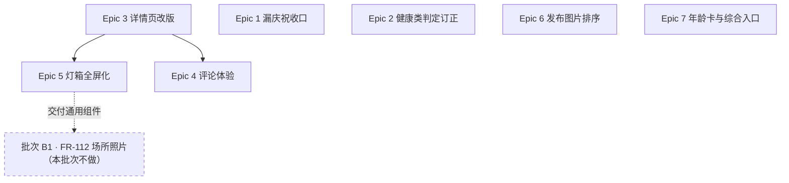

# V1.3.0 批次 A 工作拆分预览

> **这不是正式的 epics 文档**，是一张工量预判，供判断规模、排期与范围取舍。正式拆分见 `../../implementation-artifacts/v1.3.0/epics-v1.3.0-batch-a.md`（尚未产出）。
> 2026-09-10 · 依据 `PRD-v1.3.0-batch-a-content-fixes.md` + `ui-v1.3.0-batch-a-content-fixes.html` + `决策日志.md` + `architecture-v1.3.0-delta.md`（**本次是架构 delta 之后写的**，规模按 AD 条目推，比 V1.1.6 那次按代码实读推更稳）。

## 规模一句话

**7 Epic / 17 Story，前端约六成。** 后端增量为 **6 支 Flyway 迁移 + 3 个新端点 + 1 处响应字段扩张**。**无新依赖、无新中间件、无新定时任务**（AD-A22）。

⚠️ **本文已按三路架构评审订正**（2026-09-10 晚）。初稿把 FR-113 归为纯前端、后端只算 4 支迁移，**均已推翻**：详情页要加接口字段（AD-A12.1）、里程碑要补一支存量迁移（AD-A5.3b）、年龄卡奖励要补一张流水表（AD-A20.2）。Story 3-1 由单侧改双侧、Epic 2 拆出一条新 story。

## 依赖关系

- **Epic 3 必须先于 Epic 4、Epic 5**：底栏合并（AD-A13）会重排详情页的整体结构，评论区与灯箱都挂在其上。倒过来做会返工两次。
- **Epic 1、2、6、7 彼此独立**，可并行，也可按人手插队。
- **Epic 2 依赖 Epic 1 吗？不依赖。** 两者都动里程碑，但一个改「庆祝状态」、一个改「触发与跳转」，落点不重叠。同一人做可省切换成本，不是硬依赖。
- **Epic 5 是批次 B1 的前置**：FR-112 场所照片直接接入本批次交付的通用灯箱组件（AD-A14）。**这条跨批次依赖要排进 B1 的开工条件。**

---

## Epic 清单

### Epic 1 — 里程碑漏庆祝收口（FR-111 前半）

| Story | 侧 | 内容 | 关键 AD |
|---|---|---|---|
| 1-1 | 后端 | `milestone_completions` 加 `celebrated_at` + **同迁移内存量回填**；未庆祝计数随里程碑接口下发；庆祝回报端点（幂等、只在空时写） | A-1、A-2.2、A-3 |
| 1-2 | 前端 | 档案 Tab 里程碑条角标（复用通知红点组件）；进列表页自动补弹、取级别最高、全部置位；回报接入；埋点 `path` 三值 | A-2、A-3.4 |

**工量**：中。后端一支迁移 + 一个端点 + 一处计数；前端两处。
**风险点**：存量回填漏做 = 上线首日全体老用户被补弹旧里程碑。这条要在验收清单里单列。

### Epic 2 — 里程碑健康类判定订正（FR-111 后半 + 现网 bug）

| Story | 侧 | 内容 | 关键 AD |
|---|---|---|---|
| 2-1 | 后端 | 健康类判定由后缀集合改**显式 code 列举**（含 G-M1/G-M2，排除 G-M3/G-M4 误判）；G-M2 接 `VACCINE` 触发；G-M1 接真人兽医咨询结束；打卡护栏与已打卡候选过滤同步；文案三处同步 | A-4、A-5 |
| 2-2 | 前端 | 灰徽章去向补全：`M9→绝育` 补进跳转映射；`M5 / G-M1` 跳兽医咨询入口。**收口判据：任何未完成的健康类灰徽章点下去都必须有去处** | A-6 |
| 2-3 | 后端 | **修真 bug**：健康记录→里程碑的完成映射由「后缀寻址」改「按物种显式列举」；埋点路径归类同步改 | A-4.1~3 |

**工量**：中。改动集中，但**三处文案同步**（Java 中文目录 / 印尼语标题 / 客户端双语表）有跨库测试钉着，漏一处即红。
**风险点**：
- 🔴 **2-1 必须含一支存量迁移**改 `trigger_type`。铺清单的入口对已有宠物永不回改，漏了这支，存量宠物照旧渲染打卡按钮——改了个寂寞。
- 🔴 **2-3 修的是正在发生的线上数据错误**（「其他」类宠物录疫苗点亮「陪伴满 30 天」），不是隐患。
- 🟡 OQ-1（M5/G-M1 去向）影响 2-2 验收；🟡 **OQ-6（脏数据清不清）影响 Epic 1 与 Epic 2 的迁移先后顺序**——要清就必须排在庆祝回填之前。

### Epic 3 — 内容详情页改版（FR-113）

| Story | 侧 | 内容 | 关键 AD |
|---|---|---|---|
| 3-1 | **双侧** | **后端**：详情响应并排新增图片尺寸字段（同序等长、缺失 `null`）。**前端**：元素顺序改 作者行→图片→文字→互动栏→评论区；时间移到作者名下方；图片改原比例通栏（**走 Feed 同一个出口函数**）；>7 天绝对日期；无图分支保留 | A-11、**A-12.1** |
| 3-2 | 前端 | 互动栏上移、与评论输入框合并为单一固定底栏；两态切换定死；热区扩到 44×44；评论数只在标题展示 | A-13 |

**工量**：中。3-2 是「比挪位置更深的交互状态变化」（UI 稿原话），不是纯样式。
**风险点**：高度护栏的可视区口径要**按详情页实测重取**（详情页无底部导航、有固定底栏，被减项与 Feed 不同）。照抄 Feed 的数字会算错。

### Epic 4 — 评论体验（FR-114）

| Story | 侧 | 内容 | 关键 AD |
|---|---|---|---|
| 4-1 | 后端 | `comment_likes` 表（对齐 `content_likes`）+ 点赞/取消端点；一级评论默认序改热度；**新建独立的评论热度游标类型（不得改共享的 `FeedCursor`，会溢出到 Feed）**；批量聚合取数 | A-7、A-8 |
| 4-2 | 前端 | 评论点赞交互与计数；「作者」标签（客户端比 id，零接口变更）；长按菜单（复制/回复/举报/删除）；空态；相对时间 | A-9、A-10 |
| 4-3 | 前端 | 回复态显式化四项增量：胶囊样式、占位文案随态切换、清空即退出、回复成功后展开父评论并滚动定位 | A-10.4 |

**工量**：中到大。4-1 的三元组 keyset 加聚合排序是本批次后端最难的一块。
**风险点**：
- 排序键是跨表聚合值，**建不了索引**，每页要对该帖评论现算一遍。**方案成立的前提是单帖一级评论量级在几十到几百**。
- 🟡 OQ-2（排序抖动是否可接受）。若判定不可接受，4-1 改走真快照方案，工量翻倍。

### Epic 5 — 图片灯箱全屏化（FR-115）

| Story | 侧 | 内容 | 关键 AD |
|---|---|---|---|
| 5-1 | 前端 | 灯箱**上提为共享组件**（URL 列表 + 初始下标 + **Hero tag 前缀** + **来源标识**）；全屏沉浸态；悬浮 ✕ 与页码胶囊；退出恢复系统栏 | A-14、A-15.1 |
| 5-2 | 前端 | 四个手势：下滑关闭、双击缩放、放大态平移、边缘续拖才翻页。**优先级顺序定死** | A-15.2~4 |
| 5-3 | 前端 | 过渡动画（原位放大飞入 / 缩回，双向）；加载态模糊过渡；失败重试按钮 | A-15.5~6 |

**工量**：大。**全批次最重的一块**——四个手势项目内无同款、不许引包（AD-A22），全自实现。
**风险点**：
- 手势冲突。AD-A15.2 的优先级顺序是防冲突的全部依据，实现调换顺序就会出「想关闭却在平移」这类问题。**这块建议留足真机验收时间（L2）。**
- 🔴 **组件接口必须收 Hero tag 前缀**。从图片地址推 tag 会炸：批次 B1 的场所页是「头图 + 照片网格」，同一张图出现两次 → 同 tag 同屏 → **Flutter 直接抛异常**。这条是给 B1 留的，本批次不做也得留口。
- 🔴 **必须收「来源」标识进埋点**，否则 B1 上线后灯箱指标分不清帖子和场所，**FR-115 的指标当场断裂**。

### Epic 6 — 发布图片排序（FR-116）

| Story | 侧 | 内容 | 关键 AD |
|---|---|---|---|
| 6-1 | 前端 | 九宫格长按拖拽重排（自实现）；首图常驻「封面」角标随重排跟随；界面顺序即上传顺序 | A-16 |

**工量**：中。无同款可抄、不许引包，但范围窄。
**风险点**：上传失败/部分成功时顺序如何保持，AD 未定（对抗性评审已识别，见 delta §8）。

### Epic 7 — 年龄换算分享卡与综合入口（FR-65）

| Story | 侧 | 内容 | 关键 AD |
|---|---|---|---|
| 7-1 | 前端 | 「Know more about your pet」聚合页新路由；KTP 整体平移；**旧 `/profile/id-card` 保留重定向**；非猫狗年龄卡原地置灰；档案头部入口条改造 | A-17 |
| 7-2 | 前端 | 换算规则（猫/狗三段式）；狗体型四选一（不落库）；卡片模板复用分享卡基建；二维码指下载页（走配置项）；双尺寸 + 系统分享 | A-18、A-19 |
| 7-3 | 后端 | PawCoin 配置表加年龄卡渠道两列 + **新建年龄卡分享奖励流水表**（去重 + 日限记账，**日界按 WIB 当地日，不是 UTC**）+ 领奖端点 + 后台配置项 | A-20 |
| 7-4 | 双侧 | 用户一次性引导标记表（键值形态、按账号）+ 迁移引导蒙层（首进档案页，全新 coachmark） | A-21 |

**工量**：大。7-2、7-3、7-4 都是新东西。
**风险点**：
- 🔴 **7-3 的日界必须按 WIB**。全站钱链路都是 WIB 当地日切，代码里有「唯一实现、勿订正」的注释。按 UTC 切 → 印尼早上 6–7 点能领双份，**是资金口径错误**。
- 🟡 **OQ-8（去重键）没定之前，流水表的唯一约束不能先写。**
- 🔴 **7-1 的新路由必须落在 `/profile/` 前缀下**，自动继承游客门控；**绝不能为了放行塞进例外集合**——那是把安全默认反转。
- 🟡 OQ-3/4/5 全是**产品与设计侧的交付物**（EN/ID 文案、趣味文案池、背景插画素材）。**这三样不到位，7-2 只能做到结构可跑、出不了终稿卡面。** 建议尽早催。
- 二维码三条硬要求（留白 ≥4 码元、导出边长 ≥140px、深色背景要白底板）是**可扫底线**，设计稿若压缩品牌带会当场触发代码里的断言。设计交稿时要一起核。
- 蒙层的聚光挖孔**不要用超大 box-shadow 叠加**（UI 稿第四步已实测该做法失效）。

---

## 验证层级预判

| 层级 | 覆盖 |
|---|---|
| **L0 静态**（云端可跑） | 全部后端改动（4 支迁移 + 端点 + 判定逻辑）、全部前端编译与单测 |
| **L1 集成**（需本地 Docker） | 存量回填正确性、热度排序游标翻页、点赞幂等、里程碑触发链路 |
| **L2 端到端**（需真机/模拟器） | **Epic 5 四个手势（重中之重）**、Epic 6 拖拽、Epic 3 底栏两态与小屏高度护栏、Epic 7 卡面出图与分享面板、蒙层聚光渲染 |

⚠️ **L2 占比明显高于前几个版本** —— 本批次本质是交互体验改造，「编译过」离「能用」很远。排期要给真机验收留出真实时间，不能按 L0 绿灯就算完。

---

## 开工前建议闭合

| # | 事项 | 挡谁 | 状态 |
|---|---|---|---|
| 1 | ~~OQ-6 脏完成行清不清~~ | — | ✅ 生产实查仅 3 条，**不清理**；迁移顺序约束消失 |
| 2 | ~~OQ-1 M5/G-M1 去向~~ | — | ✅ 跳兽医问诊页 |
| 3 | ~~OQ-2 排序抖动~~ | — | ✅ 接受 |
| 4 | ~~OQ-7 引导标记存哪~~ | — | ✅ 按账号（Story 7-4 走服务端表 + 接口那一档工量） |
| 5 | ~~OQ-8 奖励去重键~~ | — | ✅ 不单独去重（Story 7-3 的流水表只记日限，无档案级唯一约束） |
| 6 | EN/ID 文案（入口名、置灰提示、封面角标、空态引导语） | 挡 7-1 / 6-1 / 4-2 收尾 | ⏳ 产品 |
| 7 | 年龄卡趣味文案池 + 背景插画素材 + 卡面设计稿 | 挡 7-2 终稿 | ⏳ 产品 / 设计 |

**开工前的阻塞项已全部清空。** 6、7 不挡开工，但要在 story 里显式标为待补，别让工程按占位文案交付。

## 二轮评审后追加的横切约束（不新增 story，但每条 story 都要遵守）

架构 delta 由 23 条扩到 **28 条 AD**，新增五条是横切的，拆 story 时要落到对应验收项里：

| AD | 影响哪些 story | 一句话 |
|---|---|---|
| **A-24** 页头三态 | 1-2、7-1 | 档案页头是本人/游客/访客共用，新入口条与未庆祝角标**只在本人态渲染** |
| **A-25** 注销级联 | 4-1、7-4 | 本批次每张带用户外键的新表都要进注销链路（安全攸关） |
| **A-26** 埋点值域 | 5-1~5-3、7-2、1-2 | 值域全部钉死；灯箱关闭方式**补上系统返回键**这条此前没人管的路径 |
| **A-27** 顺序住所 | 6-1 | 上传开始即锁定重排入口，不允许「上传中还能拖」 |
| **A-28** 年龄换算时区 | 7-2 | 按设备本地时区；**与 7-3 奖励日界的 WIB 不是一回事，不得互相套用** |
