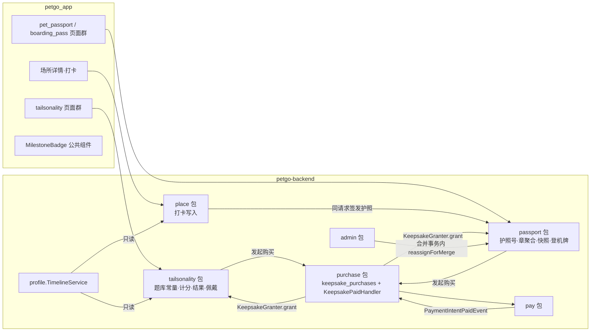

# TailTopia V1.3.2 batch-a 架构决策文档 —— Delta

> **形态**：brownfield 增量 delta，只写本批次的新增 / 取代；未提及处一律**继承基线**。
> 冲突序：**决策日志-batch-a.md > 本 delta > v1.3.0 各 delta > 基线**。代码现状细节见 `代码核对报告-batch-a.md`。
>
> **底线继承（不重述）**：Spring Boot 4 / Java 21 / PostgreSQL + Redis + Flyway；异步只用 `@Async` + DB 状态机，**禁 MQ / 新中间件 / 通用缓存层**；DB snake_case ↔ camelCase；RFC 9457；**对外标识一律不可枚举 token**；凭证 env 注入；日志禁 PII / 健康 / 令牌 / 签名 URL / **坐标**；`ddl-auto=validate`；Flyway 时间戳号；打包 `mvn -B clean package`。
>
> **运维 envelope 零增量**：不新增中间件、外部服务、部署形态；图片沿用既有 OSS（私有桶 + 对象级 public-read ACL，经 CDN）；App 不新增第三方依赖（定位、截图出图、支付均复用既有）。
>
> **术语**：本文「护照」= FR-120 宠物护照（集章）；KTP 体系里既有的「护照卡种」（`card_type=PASSPORT`、`passport_card.dart`、`assets/passport/`）是另一回事。新代码目录用 `pet_passport` / `boarding_pass`，**不得**复用 `PassportCard` 类名。「打卡」= 场所打卡，与既有里程碑打卡（`MilestoneCheckInService`）区分，新代码用 `place_checkin` 前缀。

## 1. 模块与归属

| 数据 | 唯一写入方 | 读方 |
|---|---|---|
| `place_checkins` / `place_checkin_pets` | place 包；admin 合并只改 `place_id` | passport、timeline、admin 统计 |
| `pet_passports`、`passport_snapshots`、`boarding_pass_unlocks` | passport 包（含合并改挂接口） | order、timeline（无） |
| `tailsonality_*` | tailsonality 包 | timeline、宠物档案、公开主页 |
| `keepsake_purchases` | purchase 包 | order 中心、admin 支付查询 |
| `places.stamp_object_key` | admin 包 | place / passport DTO |

## 2. 架构决策（AD）

### AD-1 付费链路：三个新 purpose、一张购买记录表、一个到账监听器
- **Binds**：Tailsonality 结果解锁、护照快照、登机牌单张的发起、支付、发放、对账。
- **Prevents**：三条线各造一套状态机；同事件多监听器顺序不定；幂等键粒度过粗导致第二次购买被当重放而**免费解锁**；业务唯一约束冲突回滚到账状态。
- **Rule**：
  - `PaymentPurpose` **末尾追加** `TAILSONALITY`、`PASSPORT_SNAP`、`BOARDING_PASS`。迁移 **DROP + ADD 全量重建** `ck_payment_intents_purpose`：写迁移前 `git grep` 全部活跃分支（main / dev_* / feat/*）里该约束的最新重建，取**值的并集**再加三项，PR 描述列出全集。所有按 purpose 分支处补齐：`PaymentDisplayNo`（无 default，漏了编译不过）、`GemPayGateway.safeDescription`、后台 i18n `admin.payments.purpose.*`（四个语言文件）、仪表盘付费用户指标、`AdminPaymentQueryService`。
  - **业务行先于购买存在**：结果行（提交答案时已建）、快照行（发起购买时建）、登机牌解锁行（发起购买时建，`unlocked_at IS NULL`）。`keepsake_purchases.ref_id` 固定指向该业务行 id。
  - `keepsake_purchases(sku, ref_id, pet_profile_id NULL, user_id, price_idr, pay_channel, payment_intent_id UNIQUE NULL, status, created_at, paid_at)`；`status` ∈ `PENDING | PAID | CANCELED | EXPIRED | DUPLICATE_PAID | ORPHAN_PAID`。`price_idr` = 实际扣款额（QRIS 取 `intent.amount`，PawCoin 取扣币额），展示与对账只读它。
  - **幂等键**（PawCoin 的 `debit` 与 QRIS 的 `createIntent` 同用）：`{sku}:{业务行 public_token}`。**禁止**以 `petId` / `userId` 为键。
  - **同一业务行同时只允许一笔 PENDING**：再次发起复用该笔；业务行已解锁则拒绝发起（ProblemDetail）。
  - `PaymentIntentPaidEvent` **只由 purchase 包的 `KeepsakePaidHandler` 一个监听器消费**（同步 `@EventListener` + `Propagation.MANDATORY`，照 `IdHdPaidHandler`，**绝不 AFTER_COMMIT**）：按 `payment_intent_id` 找购买行 → 置 PAID → 同步调用 SKU 模块实现的 `KeepsakeGranter.grant(refId, purchaseId)`（接口定义在 purchase 包）。PawCoin 路径在扣币同一事务内走同一个 `grant`。
  - `grant` **不得抛异常**：所有唯一写入用 `ON CONFLICT DO NOTHING`；业务行已解锁 → 购买行记 `DUPLICATE_PAID`；业务行已不存在（删档）→ 记 `ORPHAN_PAID`。两者进后台支付查询可筛出，走既有人工退款流程。
  - 价格读 `pricing_config`（AD-12），客户端**不硬编码**。

### AD-2 Tailsonality 计分在服务端，文案在 App
- **Binds**：题库、答案提交格式、计分、平局规则、文案寻址。
- **Prevents**：前后端各算一遍结果不一致；情绪轴 T/F 反向被某一端写反；选项顺序两端对不上。
- **Rule**：
  - 后端 `TailsonalityCatalog` 为**编译期常量**（照 `MilestoneCatalog`）：题套 CAT / DOG / GENERAL × 题号 `Q1..Q15, P1..P3` × 4 个权重；题号归轴、锚题 Q1 / Q4 / Q8 / Q11 / Q14。计分与平局兜底按内容设计 §6.7；**V-1~V-5 以后端单测钉死**。
  - 题套由服务端按宠物 `PetType` 选（CAT→CAT，DOG→DOG，OTHER→GENERAL），客户端不传。
  - **提交格式**：答完一次性提交 `{ "Q1": 0, …, "P3": 3 }`，键为题号，值为**内容设计里的原始选项序号 0..3**（0 = 第 1 项 = +2）。App 显示顺序若与原始序不同，提交前映射回原始序。服务端校验题号集合恰好 18 个、值在 0..3，否则 422。中途不落任何进度（C-5）。
  - 分页（呈现层，不影响计分）：第 1 页 Q1–Q5 + P1，第 2 页 Q6–Q10 + P2，第 3 页 Q11–Q15 + P3。
  - 题干、选项、角色名、slogan、摘要、解读、配型文案**随 App 打包**（Dart 常量内容表，EN / ID），按 `题套 + 题号` / 4 字母代号寻址；**跨库测试**钉「后端题号集合 = App 内容表题号集合、每题 4 选项」。
  - 结果行记 `content_version`（本版本 = 1）；本版本文案随发版固定、不做服务端文案存储。已接受风险：付费文案在包内可被解包读到。

### AD-3 Tailsonality 数据与状态
- **Binds**：结果、佩戴、主人类型、小标下发、挽留弹窗记录。
- **Prevents**：小标显示未解锁结果、佩戴被新解锁静默替换、并发自动佩戴撞主键、配型两端各算一套。
- **Rule**：
  - `tailsonality_results(public_token, pet_profile_id, user_id, question_set, answers JSONB, type_code CHAR(4), energy CHAR(1), content_version, unlocked_at NULL, created_at)`。结果 DTO 下发 `resultIndex`（同宠物按 `created_at` 的序号，现算不落库）与完整代号 `ENTJ-H`。
  - 佩戴 `tailsonality_badges(pet_profile_id PK, result_id)`，只能指向已解锁结果。**首次解锁自动佩戴**：`grant` 内 `INSERT … ON CONFLICT DO NOTHING`，此后解锁不替换。
  - 主人类型 `tailsonality_owner_types(user_id PK, type_code)`；配型（相同字母数 → 5 档 + 差异句）**纯客户端计算**，不落库。
  - 小标字段 `tailsonalityBadge`（4 字母代号）在**本人宠物档案与公开主页宠物 DTO** 同一规则下发：佩戴行存在且所指结果已解锁，否则 null。字段与实现标识符避开 FR-118.7 反向测试禁词（milestone / passport / checkin / share / follow / visitor / bio）。
  - 挽留弹窗「同一次结果只弹一次」：**客户端本地按结果 `public_token` 记录**（换设备再弹一次，接受）。
  - 重测 = 再提交一次，免费不限次，无配额字段。

### AD-4 场所打卡：服务端到场校验、按宠物每日唯一
- **Binds**：打卡接口、距离判定、每日限一次、多宠结构、存量行回填。
- **Prevents**：只靠客户端判距；合并场所后唯一约束冲突或当天多打一次；删档后遗留行挡住新宠物；给别人的宠物打卡。
- **Rule**：
  - `POST /api/v1/places/{token}/checkins`，body 带**精确坐标**与 `petIds`。服务端校验 `petIds` 全部属于本人（本版本即唯一宠物），按 haversine（复用 `GeoBox`）判 **≤500m**。**坐标只用于本次判定，不落库、不进日志、不进埋点**。
  - 失败统一 ProblemDetail，`type` 区分：距离不足（**不返回距离值**）、今日已打卡、宠物不属于本人、无宠物档案。场所经既有 `resolveForView` 解析：MERGED 记到保留方；DELISTED / 删除 / 不存在沿用既有 404（刻意不可区分）。
  - `place_checkins` 扩列：`public_token`、`origin_place_id`（打卡当时的场所，永不改）、`visit_date`（**WIB 自然日**）；**存量行先回填**（`origin_place_id = place_id`、`visit_date` 取 `checked_at` 的 WIB 日期、随机 token）再加 NOT NULL。
  - `place_checkin_pets(checkin_id, pet_profile_id, origin_place_id, visit_date)`，**UNIQUE(pet_profile_id, origin_place_id, visit_date)**（冗余两列只为约束）。合并场所只改 `place_checkins.place_id`，约束不受影响。
  - 「今日已打卡」服务端判定：该宠物在**当前 `place_id`**（含已合并进来的原场所）同一 WIB 日已有打卡即拒；DB 约束兜底并发。
  - 同一请求内完成：写打卡 → 签发护照（AD-6）→ 返回 `checkinToken`、`isNewStamp`、该章次数、`stampCount`、护照号，供 C2 / C2b 分流。
  - 既有 admin 侧 `AdminPlaceCheckin` 映射保留（合并用 JPQL 改 `place_id`），App 侧新建 `place.domain.PlaceCheckin`，两者列定义须一致。

### AD-5 章是聚合，不是实体
- **Binds**：章的展示、章面来源、合并与下架后的章、登机牌顶部图。
- **Prevents**：另建章表与打卡双写不一致、合并时手工并章、客户端给专属章着色。
- **Rule**：
  - 「章」= 某宠物在某场所（按当前 `place_id`）全部打卡的聚合：首次日期 = min(`visit_date`)，次数 = count。**不建章表**；合并后打卡已改挂保留方，章自动并成一枚、次数相加。
  - 章面：`places.stamp_object_key` 非空 → 下发 `stampImageUrl`；为空 → null，客户端按 `placeType` 用包内 7 款默认章。**专属章与默认章一律按原色展示，客户端不着色、不做圆形裁切**（D-10）。换章对历史章立即生效。
  - 登机牌顶部图：下发可空 `placeImageUrl`（场所首张照片），为空时客户端按 `placeType` 用包内 7 张默认场所图（与默认章是两套素材）。
  - 场所 DELISTED / MERGED：章照常显示，详情入口与地址换成「场所不存在」。章总数无上限、不下发任何总数分母。

### AD-6 护照号签发
- **Binds**：护照号来源与签发时机。
- **Prevents**：并发签出两个号；沿用到别的宠物（旧宠物删档后、另一物种）的 KTP 号；撞 `id_cards.passport_no` 唯一约束。
- **Rule**：
  - `pet_passports(pet_profile_id UNIQUE, passport_no UNIQUE, issued_at, source KTP|ISSUED)`；首次打开护照页或首次打卡时 insert-on-conflict 签发。
  - 号源（D-6）：取 `id_cards WHERE user_id = ? AND profile_deleted_at IS NULL AND created_at >= 当前宠物建档时间 AND passport_no 物种段 = 当前宠物物种码` 的最早一张，其 `passport_no` 存在则沿用（`source=KTP`）；否则经 `CardNumberService.allocatePassportNo` 同一计数器发号（`source=ISSUED`）。
  - **只读、不回写** `id_cards`；此后新建的 KTP 卡照旧各自发号（决策②不变），不与宠物护照号同步。

### AD-7 护照快照与登机牌解锁
- **Binds**：快照版本判定、登机牌单张解锁、合并后的解锁归属。
- **Prevents**：付款期间新盖章导致买到的与看到的不同；合并场所后已买快照被误判过期；两种 hash 算法；合并窗口内重复购买登机牌。
- **Rule**：
  - 快照 `passport_snapshots(public_token, pet_profile_id, stamps JSONB, stamp_count, place_set_hash, paid_at NULL, created_at)`：**发起购买时冻结**章列表（场所 token、名、类型、首次日期、次数）。
  - `place_set_hash` **唯一定义**：把章集合里每个场所沿 `merged_into_id` 解析到最终场所，取排序后的 `place_id` 列表做 sha256；DELISTED 场所照常计入。购买时与读取时调用同一个函数**现算**比较（落库值只作记录）。
  - 当前护照无水印 ⇔ 存在已支付快照且其 hash（按上式重算）= 当前章集合 hash。**次数变化不算新版本**；新盖章 → 整页重新带水印（D-4）。hash 相同时拒绝再次购买。
  - 已购快照永久可回看、可重新导出，入口两处：护照页「已购版本」列表 + 我的订单；两处只列 `PAID`。回看渲染读快照 JSON。
  - 登机牌 `boarding_pass_unlocks(pet_profile_id, place_id, unlocked_at NULL, superseded_at NULL, created_at)`，**UNIQUE(pet_profile_id, place_id)**；再到访只更新次数、不二次收费。
  - **合并改挂在 `PlaceMergeService` 同一事务内**同步调用 passport 包 `reassignForMerge(merged, keep)`：被合并方的解锁行改挂保留方；保留方该宠物已有解锁行 → 被合并方那条置 `superseded_at` 并在后台可筛出供人工退款，**不静默隐藏**。
  - 登机牌 SEAT：服务端由 `(pet_profile_id, place_id)` 确定性生成的装饰号，不存储、无业务含义。

### AD-8 我的订单接入三类新购买
- **Binds**：订单中心对三类新购买的聚合与老客户端兼容。
- **Prevents**：订单中心接三个源；老 App 显示「未知订单」且点不进去。
- **Rule**：`OrderType` **末尾追加** `TAILSONALITY`、`PASSPORT_SNAP`、`BOARDING_PASS`；`OrderCenterService` 以 `keepsake_purchases`（仅 `PAID` 及退款态）为唯一新源，新增 RANK 常量；详情给跳转目标（结果 / 快照 / 场所 token）。照既有 `includeEcommerce` 加 **`includeKeepsake` 能力闸**，老 App 不传则不下发。

### AD-9 Diary 时间线新类型 + 能力协商
- **Binds**：打卡 banner、Tailsonality banner、打卡帖子去重、日期口径、分页。
- **Prevents**：老 App 把新类型渲染成照片卡；打卡在 Diary 里彻底消失；同一件事被拆到两天；游标翻页漏条或重复。
- **Rule**：
  - `TimelineItemType` 前后端同名追加 `PLACE_CHECKIN_BANNER`、`TAILSONALITY_BANNER`，查询时拼装、**不落库**。
  - 时间线、日详情（`/me/day`）、日历月视图三处接口统一加能力参数 `supports`；**未声明的类型三处都不下发**。新 App 必传。
  - **访客态（`VisitorProjectionService`）不下发这两类**。
  - 打卡 banner：按 `place_checkin_pets` 落到对应宠物；有效日期与排序键 = `checked_at` 的 **UTC 日期**（与既有来源一致；`visit_date` 只用于唯一约束）；DTO 带 `{placeToken, name, status}`。**仅当该打卡的某条关联帖子出现在同一次时间线结果里**（GROWTH_MOMENT + 同一宠物 + 满足既有可见性与审核过滤）时不出 banner；帖子删除 / 下架 / 转私后 banner 恢复。
  - Tailsonality banner：仅已解锁结果；有效日期与排序键都 = `unlocked_at`，测试日期只作显示字段；多次解锁多条并存。
  - `timeline_item_tile` 新增两种卡片样式，游客示例时间线与真实时间线复用同一组件。

### AD-10 帖子关联打卡
- **Binds**：帖子与打卡的关联与展示。
- **Prevents**：关联别人的打卡；删打卡被外键挡住。
- **Rule**：`content_posts` 加可空 `place_checkin_id`，外键 **`ON DELETE SET NULL`**；发布请求可带 `placeCheckinToken`，服务端校验为本人打卡后写入，任何帖子类型均可（但只有 GROWTH_MOMENT 会触发 AD-9 的 banner 去重）。帖子详情 DTO 增 `checkinPlace {token, name, status}`；普通发帖无此字段。

### AD-11 发帖页预填
- **Binds**：四处发帖入口的预填方式。
- **Prevents**：各入口自建发帖流程、预填图经相册落地。
- **Rule**：`PublishComposePage.open` 增加可选参数 `initialText`、`initialImages`（`List<Uint8List>`，直接 `controller.addImage`，不经相册、不需权限）、`placeCheckinToken`。三处「发个帖子炫耀」与打卡后「顺手记录这一刻」都走这一个入口。sheet 仍 autoDispose、不存草稿。

### AD-12 定价配置
- **Binds**：三项付费价格的来源、校验与读取接口。
- **Prevents**：客户端硬编码价格；配出 0 元导致支付失败；两个价格接口各说各话。
- **Rule**：
  - `pricing_config` 加列 `tailsonality_unlock_price BIGINT NOT NULL`（迁移初值 5000，`CHECK (≥1)`）。护照两列**迁移不改值**，只更新 COMMENT 为「快照价 / 登机牌每张价」；上线前运营在后台改成 2000 / 1000（上线检查单）。
  - 后台定价卡更名「一次性解锁定价」、四行，登机牌行标签「每张」；最小值 1，不支持 0（D-3）。「快照价 ≥ 登机牌价」**不做强校验**，写进卡片说明与高危确认弹层（后台 PRD AB-18A）。
  - 客户端读价格：扩展既有 `GET /api/v1/pet-profiles/me/id-cards/pricing` 的响应，加 `tailsonality` 字段，三项统一从这里取。

### AD-13 分享奖励两个新渠道
- **Binds**：两个新渠道的去重粒度与配置。
- **Prevents**：按卡实例计奖导致打卡数即奖励数；重测刷币。
- **Rule**：照 **KTP 渠道范式**（`id_card_share_rewards` UNIQUE(pet_profile_id)）各建一套：`tailsonality_share_rewards` **UNIQUE(pet_profile_id, card_type ∈ RESULT|MATCH)**；`passport_share_rewards` **UNIQUE(pet_profile_id, card_type ∈ PAGE|BOARDING)**，登机牌整体算一个卡类型。`pawcoin_config` 每渠道加 `…_share_reward BIGINT NOT NULL DEFAULT 0` + `…_share_daily_cap INT NOT NULL DEFAULT 0`（默认 0 = 不发），后台分享奖励卡加对应参数。全部经 `ShareRewardService.tryReward` 全局闸门。

### AD-14 分享卡与二维码
- **Binds**：四类分享卡的版式、二维码、尺寸、水印、大图查看。
- **Prevents**：各卡另起一套模板；二维码指向不存在的 H5；配型卡误加水印；另写灯箱。
- **Rule**：
  - **允许改造** `share_card_template.dart` 与 `share_card_preview_page.dart`：模板改为「主体区插槽 + 信息区 + 固定 15% 品牌段」的通用骨架（帖子卡作为其一种用法，行为不变）；预览页加参数关闭 9:16 / 1:1 切换、接受通用卡而非只接帖子数据。`CardRenderPipeline` / `CardExport` / `card_watermark.dart` **零改动**复用。
  - 本批次四类卡二维码一律指向下载落地页 `GET /get`（在 `card_link.dart` 重建 `petDownloadUrl`），**不新建 H5**。只出 9:16；页内展示与大图 3:4。
  - 水印由客户端按服务端下发的解锁态决定：结果卡未解锁带、配型卡**永不带**、护照 / 登机牌未解锁带。
  - 大图复用 `ImageLightbox`，扩展支持内存图片（`Uint8List`）来源。

### AD-15 里程碑徽章：一个公共组件 + 单一素材源
- **Binds**：六处徽章显示（庆祝页大徽章 / KOLEKSI 圆点 / 列表墙 / 列表底抽屉 / Diary 里程碑条 / 通知中心）+ H5 `/m`。
- **Prevents**：六处各写各的、素材两端不一致、按 code 后缀寻址出错。
- **Rule**：
  - App 新建 `MilestoneBadge(code, size, locked)` 替换六处内联实现；**映射按完整 code**（code → 语义键 → 素材文件），禁止按后缀 / 前缀寻址。
  - **素材未到时映射返回空，组件回落现有奖杯渲染**——不造占位图，到一枚换一枚。
  - 素材以 App `assets/milestone/` 为源，同批文件拷入后端新建的 `static/milestone/`（公开路径与 `/brand/**` 同样放行）；**跨库测试钉两边文件集一致**，并钉映射表覆盖的 code 均在 `MilestoneCatalog` 内。
  - H5：`milestone_shares` 加可空 `collection_codes`；新分享写入，KOLEKSI 按 code 出图；旧分享（为空）保持原样式（C-10）。
  - 庆祝页结构、关闭方式、振动、彩纸、补庆祝与「只弹最高级」逻辑**一律不动**。

### AD-16 入口与引导
- **Binds**：聚合页五卡排布与第二次引导。
- **Prevents**：改动既有入口卡组件；第二次引导弹给新账号或重复弹。
- **Rule**：聚合页五卡按 C-8 顺序，一行两张共三行，**不改 `InsightEntryCard`**；年龄卡置灰规则不变。`OnboardingMarkKey` 追加 `TAILSONALITY_ENTRY`（wire `tailsonality_entry`），**仅对已有 `ktp_moved` 标记的账号**显示，按账号记一次。

### AD-17 注销与删档（安全攸关 D1/D2）
- **Binds**：本批次全部新表在注销与删档时的处理。
- **Prevents**：注销后遗留指向已删用户的行；删档时支付在途导致收钱不解锁、没有流水；删档遗留打卡行挡住新宠物。
- **Rule**：
  - 宠物级数据在 `ProfileDeletionService`（注销与删档共用，须在删宠物行之前）内**物理删除**：`tailsonality_results / _badges`、`pet_passports`、`passport_snapshots`、`boarding_pass_unlocks`、`place_checkin_pets`，以及删后**已无关联宠物**的 `place_checkins`。
  - 账号级：`tailsonality_owner_types` 在注销时物理删除。
  - `keepsake_purchases` 与两张分享奖励表是**资金 / 发放流水，保留**：删档时 `pet_profile_id` 置空；注销时随既有口径（`users` 行匿名化，流水不删），与 `payment_intents`、PawCoin 流水一致。到账时业务行已不存在 → `ORPHAN_PAID`（AD-1）。
  - 每张新表配一条级联测试。

### AD-18 后台
- **Binds**：专属章上传、新建场所、审计。
- **Prevents**：按旧规范做单色 / 圆形校验挡掉合规素材；无照片场所；合并或下架误删章素材。
- **Rule**：
  - AB-18B 专属章：场所编辑页「专属章」区，复用 `AdminSeedImageService.upload` 上传链路，另加校验**只做**：PNG、正方形 512×512、≤300KB、**带透明通道**；**不校验颜色、不校验形状**（D-10）。写 `places.stamp_object_key`；替换 / 移除即时生效。**合并、下架都不删 OSS 文件、不清空该字段**，只有运营主动「移除」才清空。
  - 后台新建场所**必须至少一张照片**（D-5；App 端已必填）。
  - 改价、换章经统一审计入口。

### AD-19 埋点
- **Binds**：本批次埋点的发送端与属性边界。
- **Prevents**：埋点带出 PII 或坐标；服务端事件或属性被白名单静默丢弃；两端对同一事件重复上报。
- **Rule**：事件名按 PRD §4。**服务端发**：`place_checkin`、`passport_issued`、`passport_stamped`、三类解锁成功；其余由 App 发。服务端事件名与新属性键须同时登记 `AnalyticsEventGuard` 的 `ALLOWED_EVENTS` 与 `ALLOWED_PROPERTY_KEYS`。属性用 **place token** 不用 id；`role_code` 为带后缀完整代号；**不得**带宠物名、品种、自由文本、坐标。

### AD-20 合规红线：不出现「MBTI」
- **Binds**：Tailsonality 全部对外面。
- **Prevents**：商标词混入文案、接口或素材。
- **Rule**：用户可见文案（ARB、Dart 内容表）、API 路径与 DTO 字段、埋点事件与属性、素材文件名中**不得出现 mbti（不区分大小写）**；配型选择器不显示任何 16Personalities 角色别名。以一条静态扫描测试钉住。

## 3. 数据种子（Flyway，全部时间戳号）

| 迁移 | 内容 |
|---|---|
| payment purpose | DROP + ADD `ck_payment_intents_purpose`（全活跃分支值并集 + 3） |
| keepsake_purchases | 新表，`UNIQUE(payment_intent_id)` |
| tailsonality | `tailsonality_results` / `_badges` / `_owner_types` / `_share_rewards` |
| checkins | `place_checkins` 扩列 + 存量回填 + NOT NULL；新表 `place_checkin_pets` |
| passport | `pet_passports` / `passport_snapshots` / `boarding_pass_unlocks` / `passport_share_rewards` |
| places | 加 `stamp_object_key` |
| content_posts | 加 `place_checkin_id`（ON DELETE SET NULL） |
| milestone_shares | 加 `collection_codes` |
| pricing / pawcoin config | `tailsonality_unlock_price`；护照两列 COMMENT；分享奖励 4 列 |

## 4. 会被按设计打破的既有测试

见 `代码核对报告-batch-a.md` §0。修改时**更新断言以表达新规则**，不删除测试；FR-118.7 公开主页反向清单仍须守住。

## 5. Deferred（本批次不定）

- 多宠选择界面（数据已多对多，界面单宠）。
- 服务端存储文案 / 运营可改文案（`content_version` 已留口）。
- 打卡防定位伪造——接受风险。
- 删档重建后分享奖励可再领一次（与 KTP 既有渠道同洞）——接受。
- 新用户首次引导是否一并讲 Tailsonality。
- 配型档位名以设计图还是文档为准、配型卡是否出猫版（只影响素材与文案表）。
- 旧里程碑 H5 分享回填 code。
